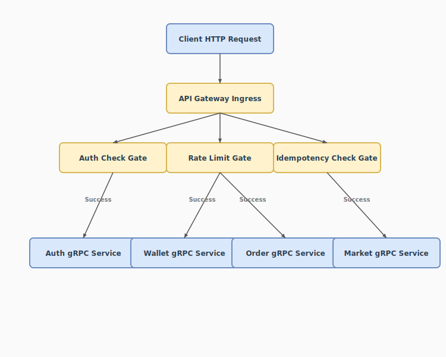
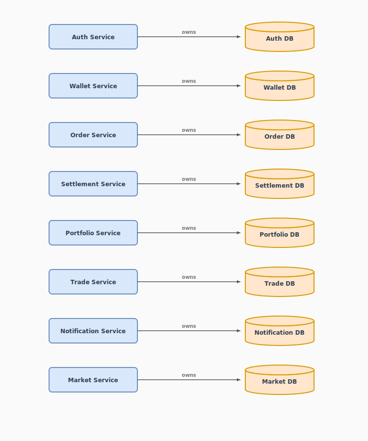
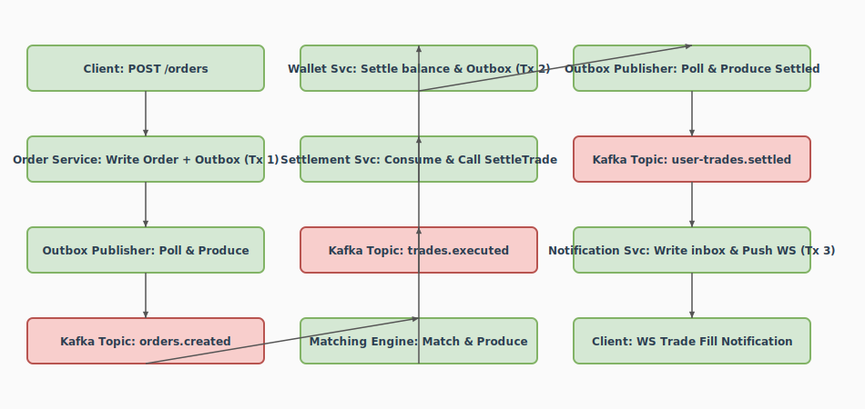
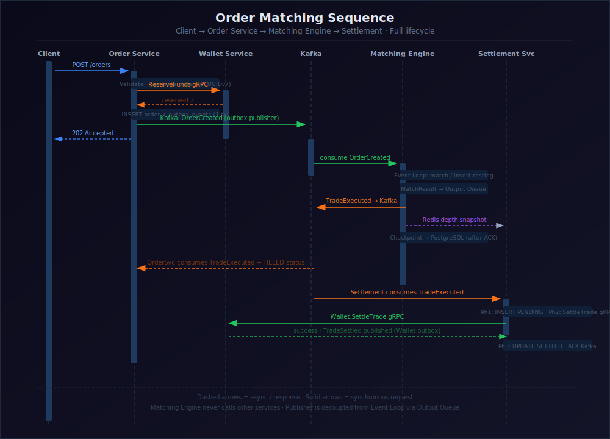
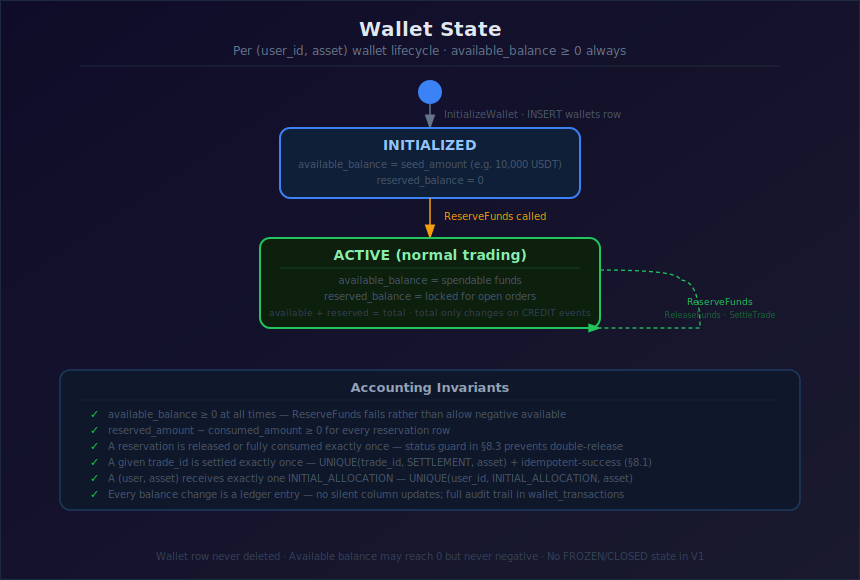

# TradeDrift — Distributed Crypto Exchange Simulator

TradeDrift is a production-style cryptocurrency exchange simulator built to demonstrate how high-throughput, low-latency financial systems are designed using microservices, event-driven architecture, and in-memory execution engines.

> [!NOTE]
> **Repository Status: Architecture & Design Complete (Documentation-First Stage)**  
> TradeDrift follows a strict **documentation-first engineering** approach. Every architectural decision, API contract, event schema, database model, and recovery strategy was fully specified, cross-audited, and frozen before code implementation began to ensure total design consistency and eliminate integration friction.

---

<!-- GitHub Badges Placeholder
[](https://golang.org)
[](https://opensource.org/licenses/MIT)
[](https://github.com/akhilbabu26/tradedrift/actions)
-->

## 📋 Table of Contents
1. [Project Overview](#-project-overview)
2. [Visual Architecture & Diagrams](#-visual-architecture--diagrams)
3. [Project Statistics](#-project-statistics)
4. [Project Philosophy](#-project-philosophy)
5. [Architecture Technology Stack](#-architecture-technology-stack)
6. [Implementation Status](#-implementation-status)
7. [Repository Structure](#-repository-structure)
8. [Documentation Navigation](#-documentation-navigation)
9. [Microservices Overview](#-microservices-overview)
10. [Key Architecture Decisions](#-key-architecture-decisions)
11. [Getting Started](#-getting-started)
12. [Development Workflow](#-development-workflow)

---

## 🔍 Project Overview

### Why TradeDrift Exists
Building a production-ready financial platform requires solving high-concurrency race conditions, handling extreme decimal precision, ensuring ledger reliability, and coordinating service interactions under load. TradeDrift was created as a reference implementation to:
* **Learn Production Backend Engineering:** Deep dive into container topologies, thread-safe memory allocations, and network boundaries.
* **Learn Distributed Systems:** Understand context deadline propagation, consensus-driven database failovers, and transactional messaging outbox patterns.
* **Understand Financial Systems:** Learn how FIFO matching engines process orders in memory while double-entry ledgers ensure balance invariants.
* **Demonstrate System Design Skills:** Prove how microservices decouple responsibilities without sacrificing transactional consistency.

---

## 🖼 Visual Architecture & Diagrams

Below are the key visual flows mapping design details inside the platform:

### 1. Overall System Architecture
The unified routing network illustrating how clients connect through NGINX and the API Gateway down to internal microservices and database engines:



### 2. Database Ownership Boundaries
Illustrates how data spaces are strictly isolated per microservice, showing single-owner database boundaries with zero cross-service foreign keys:



### 3. Transaction Settlement Sequence
The multi-step settlement loop showing how trade matches executed in the Matching Engine are settled asynchronously across buyer and seller wallets:



### 4. Matching Engine Execution Loop
Sequence of incoming order matching within the sequential, memory-isolated engine:



### 5. Wallet Balance State Machine
The state lifecycle of balance reservations from allocation through consumption or cancellation release:



---

## 📊 Project Statistics
These metrics reflect the actual design and specification footprint of the TradeDrift repository:

| Metric Category | Count | Description |
|---|---|---|
| **Architecture & Design Documents** | 101 | Detailed markdown specifications mapping all platform constraints. |
| **Vector & Mermaid Diagrams** | 86 | Complete component, sequence, state, and ER database diagrams. |
| **Microservices Defined** | 10 | Decoupled functional microservice boundary spaces. |
| **Service Specifications** | 10 | Complete, individual service blueprints. |
| **Platform Specifications** | 25 | In-depth platform infrastructure specifications. |
| **Database Tables (DDL)** | 21 | Postgres table schemas containing strict check constraints. |
| **REST Endpoints** | 22 | Client JSON-REST gateway endpoints mapping to services. |
| **Kafka Topics & Events** | 8 | Asynchronous broker event topics with partition ordering rules. |
| **Mapped System Flows** | 18 | Step-by-step end-to-end execution paths across service groups. |

---

## 🧠 Project Philosophy
TradeDrift follows the principle that architecture should precede implementation. 

Every service, API contract, event schema, database model, recovery strategy, and infrastructure decision is designed, reviewed, and audited before production code is written. This mirrors the engineering practices commonly used for complex distributed systems where architectural consistency is critical.

---

## 🛠 Architecture Technology Stack

### Technology Components

| Category | Component | Description |
|---|---|---|
| **Backend Core** | Go (Golang) | High-performance, memory-safe compiled language for all microservices. |
| **Internal RPC** | gRPC (HTTP/2) | Low-latency binary serialization using Protocol Buffers. |
| **Database** | PostgreSQL | Multi-tenant, isolated database instances per microservice. |
| **Cache & K-V** | Redis | Rate limiter token buckets, session status, and active token blacklists. |
| **Message Broker** | Apache Kafka | Ordered commit-log broker partitioned by `market_id`. |
| **Observability** | Prometheus / Grafana | System metrics collectors and centralized dashboards. |
| **Tracing** | Jaeger / OpenTelemetry | Distributed request spans following W3C standards. |

### Architectural Patterns

* **Microservices Architecture:** Strictly bounded contexts using single-owner database patterns.
* **Event-Driven Architecture (EDA):** Asynchronous state propagation using domain events.
* **Double-Entry Bookkeeping:** Immutable ledger logs tracking credits and debits to enforce balance invariants.
* **Transactional Outbox:** Guarantees atomic database updates and event publishing, avoiding distributed transactions.
* **Idempotency Guard:** Mutating REST routes require an `Idempotency-Key` with a 24-hour Redis TTL cache.
* **Resilience Patterns:** Calls wrapped inside circuit breakers, timeouts, and exponential backoff retries.

---

## 📈 Implementation Status

### 1. Completed (Architecture Phase)
* **Specifications Catalog:** Complete 101-document technical design set.
* **Database DDL Schemas:** All 8 isolated Postgres database SQL scripts with balance bounds and enum guards.
* **Gateway API Routing & Standards:** Rate limiting algorithms, JWT token blacklisting, keyset pagination, and REST routes.
* **Operational Readiness Blueprints:** Health probes (`/live`, `/ready`), Patroni failover configs, and disaster recovery replication pipelines.

### 2. Designed
* **Microservices Protocol Contracts:** Go module boundaries, shared gRPC interfaces, and protobuf definition files.
* **Event Broker Topology:** Kafka partition key constraints, dead-letter topic structures, and idempotent producer requirements.
* **In-Memory Memory Layouts:** Matching Engine order book red-black trees and price level structures.

### 3. In Progress
* **Go Codebase Bootstrap:** Writing the `/platform` shared SDK modules for tracing, outbox publishing, and connection pools.
* **Container Orchestration:** Deploying services into local Kubernetes clusters using Helm.

---

## 📂 Repository Structure

```
├── docs/                      # Frozen Architecture and Specifications Catalog
│   ├── 01_Services/           # Microservice specifications (Auth, Wallet, Matching)
│   ├── 02_Platform/           # Infrastructure designs (EDA, Deployment, Observability)
│   ├── 03_Standards/          # Shared interfaces, schema guidelines, proto Makefile
│   ├── 04_Audits/             # Final Design Readiness Audits and Walkthroughs
│   ├── 05_Database/           # Database standards, indices, and SQL schemas
│   └── 06_APIs/               # Versioned REST contracts, sockets, and standard error catalog
├── services/                  # Microservices Source Code (Go Modules)
│   ├── gateway/               # API Gateway Service
│   ├── auth/                  # Authentication Service
│   ├── wallet/                # Wallet & Ledger Service
│   ├── order/                 # Order Lifecycle Service
│   ├── matching/              # In-Memory Matching Engine
│   └── settlement/            # Trade Settlement Orchestrator
├── deployments/               # Infrastructure deployment files (Docker Compose, K8s manifests)
├── diagrams/                  # Compiled visual layouts (.svg flowcharts, ER diagrams)
├── scripts/                   # DB migrations, seed triggers, and build scripts
├── go.work                    # Go Workspace root file configuration
└── README.md                  # Project landing page
```

---

## 🧭 Documentation Navigation

| Segment | Path | Description |
|---|---|---|
| **Platform Blueprint** | [00_Project_Overview.md](./docs/00_Project/00_Project_Overview.md) | High-level system overview, services list, and status tables. |
| **System Flows** | [00_System_Flows.md](./docs/01_Services/00_System_Flows.md) | Mapped system lifecycles, state machines, and sequence logs. |
| **Infrastructure Components**| [25_Production_Infrastructure_Architecture.md](./docs/02_Platform/25_Production_Infrastructure_Architecture.md) | Production networking, load balancing, scaling, TLS, HA, retries, circuit breakers. |
| **Wallet & Ledger** | [07_Wallet_Service.md](./docs/01_Services/07_Wallet_Service/07_Wallet_Service.md) | Double-entry ledger constraints and reservation logic. |
| **Matching Engine** | [README.md](./docs/01_Services/09_Matching_Engine/README.md) | FIFO book design, memory mapping, and recovery loops. |
| **API Standards** | [01_API_Standards.md](./docs/06_APIs/01_API_Standards.md) | Casing maps, error catalogs, and idempotency key caching. |
| **SQL Database DDL** | [README.md](./docs/05_Database/README.md) | SQL tables, composite indices, and migration orders. |
| **Readiness Audit** | [09_Final_Design_Readiness_Audit.md](./docs/04_Audits/09_Final_Design_Readiness_Audit.md) | Core validation audit certifying system implementation readiness. |

---

## ⚙️ Microservices Overview

* **API Gateway:** Gateway routing proxy managing JSON-REST translations, CORS, rate limits, and tracing propagation.
* **Authentication Service:** Owns user credentials, password security (bcrypt), and active JWT session blacklists in Redis.
* **Wallet Service:** Authoritative manager of available/reserved balances, ledger deposits/withdrawals, and double-entry checks.
* **Order Service:** Validates orders at request time, locks user balances via the Wallet, generates UUIDs, and publishes creation events.
* **Matching Engine:** Sequential, in-memory matching loop processing incoming orders via FIFO price-time trees. Writes executions to Kafka logs.
* **Settlement Service:** Consumes match logs and executes transaction writes across buyer and seller wallets.
* **Portfolio Service:** Projector service generating user PnL metrics and holdings allocations from Kafka trade events.
* **Notification Service:** Listens to trade status modifications and pushes real-time WebSocket feeds to clients.
* **Market Service:** Exposes market configuration metadata and historical ticker analytics.

---

## 🏛 Key Architecture Decisions

* **Sync Wallet Registration:** User wallets are initialized synchronously during registration to prevent race conditions where a user deposits funds before their wallet exists.
* **KRaft Mode for Kafka:** Kafka runs in KRaft mode to remove the Zookeeper dependency, simplifying metadata management.
* **Patroni Cluster Failover:** PostgreSQL nodes deploy using Patroni and `etc.d` to automate cluster failover routing, maintaining database availability.

---

## 🚀 Getting Started

> [!WARNING]
> **Implementation Stage Disclaimer**  
> Note: The current repository is in the Architecture Complete phase. Some commands below are placeholders for the upcoming implementation and deployment stages.

### Prerequisites
* Go SDK (Version 1.21 or higher)
* Docker & Docker Compose
* Protobuf Compiler (`protoc`) with Go plugin stubs

### Installation
1. Clone the repository:
   ```bash
   git clone https://github.com/akhilbabu26/tradedrift.git
   cd tradedrift
   ```
2. Initialize the Go Workspace:
   ```bash
   go work init
   go work use ./services/gateway ./services/auth ./services/wallet ./services/order ./services/matching ./services/settlement
   ```
3. Compile the Protobuf contracts:
   ```bash
   cd platform/api && make compile
   ```

### Running the Infrastructure
Start the Kafka, Redis, and PostgreSQL support services using Docker Compose:
```bash
docker-compose -f deployments/docker-compose.infra.yml up -d
```

### Running the Services
Build and start the application container stack:
```bash
docker-compose -f deployments/docker-compose.yml up --build
```

---

## 🔄 Development Workflow

### Git Branching Strategy
* Features are developed in branch namespaces: `feature/<issue-number>-<short-description>`.
* Code updates require a Pull Request targeting the `main` branch.
* Continuous Integration (CI) is configured to run automated linters and unit tests on every PR.

### Coding Standards
* Go formatting must conform to standard `gofmt` and `golangci-lint` guidelines.
* Context parameters (`context.Context`) must be propagated through all functions to enforce deadlines.
* Structured logging is mandatory; always log objects as JSON with standard fields (`traceId`, `userId`, `orderId`).

---

TradeDrift is a long-term educational project focused on demonstrating how modern financial platforms are engineered. It combines distributed systems, microservices, event-driven architecture, and rigorous documentation to provide a comprehensive reference for building scalable trading platforms from first principles.
