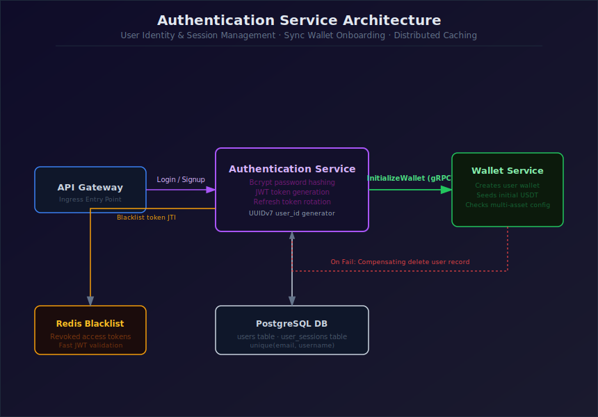
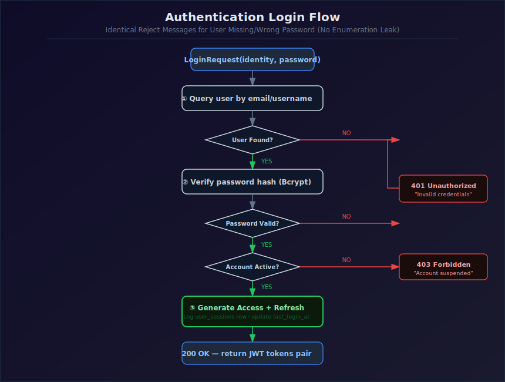
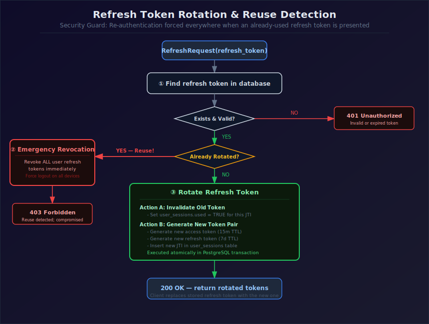

# TradeDrift — Authentication Service

> **Status:** ✅ Designed (V2)
> Revision notes: merges two improvements from a parallel draft into the full V1 spec — wallet-init failure now compensates by deleting the created user (simpler than a `wallet_status = PENDING` approach), and adds explicit JWT lifetimes plus a standalone Security section. All seven flows are retained in full.

## Purpose

The Authentication Service owns user identity, credentials, and session lifecycle. It is the only service that creates user records, issues and validates JWTs, and is the synchronous trigger for wallet creation via Wallet Service's `InitializeWallet`.

## Responsibilities

- Register new users: validate input, hash passwords, create the user record with PENDING_VERIFICATION status, send OTP code.
- Verify email: validate OTP, trigger Wallet Service's InitializeWallet synchronously, activate user to VERIFIED, and write Kafka outbox event.
- Authenticate login attempts: verify credentials and issue access + refresh token pairs with timestamp expirations.
- Validate JWTs: API Gateway locally verifies signature, token_version, and JTI blacklist states using a shared platform validator.
- Rotate refresh tokens on use and detect session hijack attempts via reuse checks.
- Log out sessions (single session JTI blacklisting or global session version increment).
- Change, Reset, and Forgot password flows (global session revocation via token_version increment).

## Out of Scope

- Does not own wallet balances — only triggers InitializeWallet.
- Does not own order, trade, or portfolio data.
- Does not send notification emails/SMS directly.
- Does not serve user profiles (profile management has been relocated to the User Service).

## Architecture Topology


---

## 1. Register Flow

Validate → check duplicate → hash password → create user (PENDING_VERIFICATION) → store OTP (Redis) → send email (OTP) → return user_id.

```
Register Request (email, username, password)
  ↓
Validate Input (email format, password rules, username rules)
  ↓
Check Duplicate (email / username exists?)
  ├── Yes → 409 Conflict: email/username already exists
  └── No  → Hash Password (bcrypt)
              ↓
            Create User (insert into users table, id = UUIDv7, status=PENDING_VERIFICATION)
              ↓
            Store OTP (Redis, 5-minute TTL)
              ↓
            Send Verification Code (email)
              ↓
            Registration Success — return user_id
```

## 1.1 Verify Email Flow

Validate OTP → Initialize Wallet (synchronous gRPC) → DB Transaction (mark VERIFIED, insert Outbox row) → Commit → publish `UserVerified` event to Kafka.

```
VerifyEmail Request (email, code)
  ↓
Validate OTP (lookup and verify code in Redis)
  ├── Invalid/Expired → 400 Bad Request: invalid or expired OTP code
  └── Valid → InitializeWallet(user_id) -- synchronous gRPC call to Wallet Service
                ├── Fails → 500 Internal Server Error (user status remains PENDING_VERIFICATION)
                └── Success → DB Transaction {
                                 Update users.status = 'VERIFIED'
                                 Insert outbox row (UserVerified)
                              }
                              Commit
                                ↓
                              Return 200 OK (success=true)
```

> **Integration point:** `InitializeWallet` is called synchronously in the critical path of `VerifyEmail` before the user is marked `VERIFIED`. This ensures that a user can never be verified or log in without a functioning wallet already existing. If it fails, the user remains `PENDING_VERIFICATION` and can safely retry verification.

## 2. Login Flow

### Login Flow Diagram


```
Login Request (email/username, password)
  ↓
Find User (query by email/username)
  ↓
User Found?
  ├── No  → 401 Unauthorized: invalid credentials
  └── Yes → Verify Password (compare hashes)
              ↓
            Password Valid?
              ├── No  → 401 Unauthorized: invalid credentials
              └── Yes → Check Account Status (active / suspended / banned)
                          ↓
                        Account Active?
                          ├── No  → 403 Forbidden: account not active
                          └── Yes → Generate Tokens (JWT access + refresh)
                                      ↓
                                    Update Last Login
                                    (last_login_at, ip, user_agent)
                                      ↓
                                    Login Success — return user info + tokens
```

Invalid-credentials responses are identical whether the user doesn't exist or the password is wrong — intentional, so the endpoint never reveals which part of a login attempt was incorrect.

## 3. JWT Validation Flow

Called by the API Gateway's JWT middleware for every request that requires auth — shared logic, not duplicated between the gateway and Authentication Service (see [Section 10](#10-shared-jwt-validation-logic)).

```
Token Received (from API Gateway)
  ↓
Extract Token (from Authorization header)
  ↓
Verify Signature (using secret)
  ↓
Signature Valid?
  ├── No  → 401 Unauthorized: invalid signature
  └── Yes → Token Expired?
              ├── Yes → 401 Unauthorized: token expired
              └── No  → Token Version Valid? (claims.token_version == active token_version)
                          ├── No  → 401 Unauthorized: token revoked
                          └── Yes → JTI Blacklisted? (Check Redis cache with DB fallback)
                                      ├── Yes → 401 Unauthorized: token revoked
                                      └── No  → Token Valid — attach user claims to context
                                                 (user_id, email, token_version)
```

## 4. Refresh Token Flow

Mandatory rotation and reuse detection — a refresh token can only be used once; using an already-rotated token revokes every session for that user.

### Token Rotation & Reuse Flow


```
Refresh Request (refresh token)
  ↓
Find Refresh Token (in database)
  ↓
Token Found?
  ├── No  → 401 Unauthorized: invalid/expired refresh token
  └── Yes → Validate Token (check signature + expiry)
              ↓
            Token Valid?
              ├── No → Reuse Detected?
              │         ├── Yes → 403 Forbidden: reuse detected — revoke ALL
              │         │         user refresh tokens (force logout everywhere)
              │         └── No  → 401 Unauthorized: invalid or expired
              └── Yes → Rotate Refresh Token (mandatory)
                          — issue new refresh token, invalidate old one
                          ↓
                        Generate New Access Token
                          ↓
                        Refresh Success — return new tokens
```

> **Why mandatory rotation + reuse detection:** A refresh token is only ever valid for one use. If a token that has already been rotated is presented again, that's a signal the token was compromised — the correct response is to revoke every session for that user, forcing re-authentication everywhere, not just reject the one request.

## 5. [Moved] Profile Flow

> [!NOTE]
> Profile management flows (`GetProfile` and `UpdateProfile`) do **not** live in the Authentication Service. To enforce domain boundaries, they are owned by the **User Service**. The Authentication Service strictly handles identity verification, token lifecycle, and session management.

## 6. Logout Flow

```
Logout Request (with refresh token + JWT access token)
  ↓
Validate JWT (verify signature, expiry, version, JTI blacklist)
  ↓
Invalidate Refresh Token (set status = 'REVOKED' in PostgreSQL)
  ↓
Blacklist Access Token (INSERT JTI and user_id into blacklisted_tokens in Postgres;
                        SET token:blacklist:<jti> = "revoked" in Redis)
  ↓
Logout Success — 204 No Content
```

Blacklisting the access token JTI is backed durably by PostgreSQL `blacklisted_tokens`. Caching both negative (`"valid"`) and positive (`"revoked"`) states in Redis (Negative Caching) prevents database round-trips on subsequent requests while surviving Redis cold restarts.

## 7. Change Password Flow

```
Change Password Request (old_password, new_password)
  ↓
Validate JWT (verify token)
  ↓
Fetch User (get user by user_id from token)
  ↓
Token Valid?
  ├── No → 401 Unauthorized: invalid token
  └── Yes → Verify Current Password (compare with stored hash)
              ↓
            Password Correct?
              ├── No  → 401 Unauthorized: incorrect password
              └── Yes → Validate New Password (check strength rules)
                          ↓
                        Hash New Password (bcrypt)
                          ↓
                        DB Transaction {
                          UPDATE users SET password_hash = new_hash, token_version = token_version + 1
                          UPDATE refresh_tokens SET status = 'REVOKED' WHERE user_id = ?
                        }
                        Commit
                          ↓
                        Evict Redis Key: auth:token_version:<user_id>
                          ↓
                        Password Changed — success
```

Revoking all sessions on password change is deliberate: incrementing the `token_version` invalidates all previously issued JWT access tokens instantly, while revoking the refresh tokens kills all long-lived sessions.

## 8. Failure Handling

- **Register:** duplicate email/username → `409 Conflict`, no user row created.
- **VerifyEmail:** invalid OTP → `400 Bad Request`, user remains `PENDING_VERIFICATION`.
- **Login/Refresh:** transient DB failure → `503`, client retries.
- **Refresh reuse detected** → revoke all sessions for that user, log the event for security review.

### VerifyEmail: InitializeWallet Failure

> **Decision:** If the `InitializeWallet` gRPC call fails during email verification, the user's status remains `PENDING_VERIFICATION` in the database. Since the user cannot log in or make authenticated requests until their status is `VERIFIED`, there is no risk of a "user without wallet" race condition in other services.
> 
> No compensating delete is required. The client receives a `500 Internal Server Error` and is free to retry verification again.

```
Validate OTP (success)
  ↓
InitializeWallet(user_id)
  ↓
Fails?
  ├── Yes → Return 500: wallet initialization failed, please retry (status remains PENDING_VERIFICATION)
  └── No  → DB Transaction { Status = VERIFIED, Insert Outbox } -> Commit
```

*If `InitializeWallet` fails, the gRPC client will retry with exponential backoff before returning the final error to the client.*

## 9. JWT Strategy

| Token | Lifetime | Storage |
|---|---|---|
| Access token | 15 minutes | Client memory / short-lived storage; never persisted server-side except revocation blacklist |
| Refresh token | 7 days | Hashed at rest in `refresh_tokens` table; rotated on every use |

Short access-token lifetime limits the damage window if one leaks; the refresh token is the long-lived credential, protected by rotation and reuse detection ([Section 4](#4-refresh-token-flow)).

## 10. Shared JWT Validation Logic

The JWT Validation Flow ([Section 3](#3-jwt-validation-flow)) and the API Gateway's JWT middleware step must be the same shared library/package, not two independent implementations.

> **Decision (V1):** JWT verification (signature check, expiry check, token version match, JTI blacklist check) lives in `platform/jwt`, imported by the API Gateway and downstream services. The API Gateway validates tokens **locally** via `RedisValidator.Validate()`. 
>
> To remain decoupled from the SQL storage details, the validator defines the `AuthProvider` interface:
> - `GetTokenVersion(ctx, user_id)` (fetches active token version)
> - `IsTokenBlacklisted(ctx, jti)` (verifies JTI blacklist status)
>
> On a Redis cache miss or a cold restart, the validator falls back to query PostgreSQL through the microservice's `AuthProvider` implementation. Negative caching caches both `"valid"` and `"revoked"` states in Redis to prevent subsequent DB hits for non-revoked active tokens.

## 11. Security

- All traffic to and from Authentication Service is over TLS — no plaintext credentials or tokens in transit, including internal gRPC calls.
- Passwords are hashed with **bcrypt** (not argon2). The cost factor work parameter is locked at a value of **10** (to be validated and adjusted during performance testing to ensure resource requirements and verification latencies remain stable), never stored or logged in plaintext.
- Refresh tokens are stored hashed (not plaintext) in `refresh_tokens`, so a database read alone cannot be used to impersonate a session.
- Every authentication-relevant event (login, logout, password change, refresh reuse detection) is written to an audit log with `user_id`, `ip`, `user_agent`, and timestamp, for security review.
- Rate limiting on login and refresh endpoints is enforced at the API Gateway (Redis token bucket), not duplicated here.
- **V1 failed login protection:** To defend against brute force credential stuffing, the `users` table tracks failed attempts in `failed_login_attempts` and temporarily locks accounts via `locked_until` after 5 failed attempts.
- **V1 deferral — Email verification:** No email verification on registration in V1. TradeDrift is a simulator with no real assets, so the risk of unverified emails is acceptable. Email verification deferred to V2.

## 12. Identifiers

`user_id` is a PostgreSQL `UUID`, generated as **UUIDv7** by Authentication Service before the user row is inserted — per `TradeDrift_ID_Correlation_Standard.md`. This is the same `user_id` passed to `InitializeWallet`, and later reused unchanged by Order Service, Wallet Service, and every other service that references this user.

## 13. Database Schema

```sql
users(
  id UUID PRIMARY KEY,
  email VARCHAR(255) UNIQUE NOT NULL,
  username VARCHAR(50) UNIQUE NOT NULL,
  password_hash VARCHAR(255) NOT NULL,
  token_version INTEGER NOT NULL DEFAULT 1,
  status VARCHAR(20) NOT NULL DEFAULT 'PENDING_VERIFICATION',
  failed_login_attempts INT NOT NULL DEFAULT 0,
  locked_until TIMESTAMPTZ,
  last_login_at TIMESTAMPTZ,
  email_verified_at TIMESTAMPTZ,
  created_at TIMESTAMPTZ NOT NULL,
  updated_at TIMESTAMPTZ NOT NULL
)

refresh_tokens(
  id UUID PRIMARY KEY,
  user_id UUID REFERENCES users(id) ON DELETE CASCADE,
  token_hash VARCHAR(255) UNIQUE NOT NULL,
  status VARCHAR(20) NOT NULL DEFAULT 'ACTIVE',
  ip_address INET,
  user_agent TEXT,
  device_name VARCHAR(100),
  last_used_at TIMESTAMPTZ,
  rotated_at TIMESTAMPTZ,
  expires_at TIMESTAMPTZ NOT NULL,
  created_at TIMESTAMPTZ NOT NULL
)

blacklisted_tokens(
  jti UUID PRIMARY KEY,
  user_id UUID REFERENCES users(id) ON DELETE CASCADE,
  expires_at TIMESTAMPTZ NOT NULL,
  created_at TIMESTAMPTZ NOT NULL
)

outbox(
  id UUID PRIMARY KEY,
  aggregate_type VARCHAR(255) NOT NULL,
  aggregate_id UUID NOT NULL,
  event_type VARCHAR(255) NOT NULL,
  payload JSONB NOT NULL,
  status VARCHAR(50) NOT NULL DEFAULT 'PENDING',
  failed_reason TEXT,
  created_at TIMESTAMPTZ NOT NULL,
  published_at TIMESTAMPTZ,
  UNIQUE (aggregate_type, aggregate_id, event_type)
)
```

*`wallet_status` is not part of this schema — a `PENDING`-flag approach was considered and rejected in favor of compensating delete ([Section 8](#8-failure-handling)).*

## 14. gRPC / REST APIs

### REST (via grpc-gateway, browser-facing)

- `POST /auth/register`
- `POST /auth/login`
- `POST /auth/refresh`
- `POST /auth/logout`
- `GET /auth/profile`
- `PATCH /auth/profile`
- `POST /auth/change-password`

### gRPC (internal)

> **Removed:** `ValidateToken(token)` was originally listed here. Per [Section 10](#10-shared-jwt-validation-logic), the API Gateway imports the shared JWT verification package directly and validates tokens locally — no per-request gRPC call. A network round-trip on every authenticated request adds unnecessary latency.

## 15. Service Interactions

| Service | Interaction |
|---|---|
| Wallet Service | `InitializeWallet(user_id)` — synchronous gRPC, called once during registration; compensating delete on failure ([Section 8](#8-failure-handling)). |
| API Gateway | Imports the shared JWT verification package directly ([Section 10](#10-shared-jwt-validation-logic)); validates tokens locally without a gRPC call. |
| Redis | Access-token blacklist (logout). Rate-limit state is owned by the Gateway, not Authentication Service. |

## 16. Scalability

- Stateless service — horizontal scaling behind the API Gateway.
- Refresh token rotation state lives in PostgreSQL, not in-memory, so any instance can validate/rotate any user's token.
- Redis blacklist is shared across instances, so logout takes effect immediately regardless of which instance handles the next request.

## 17. Future-Proofing

- OAuth / social login as an additional registration path, without changing the core user schema.
- Multi-factor authentication as an additional step between password verification and token generation in the Login Flow.
- Role-based permissions beyond the current single-tier user model, carried in JWT claims already (roles, permissions attached at validation).