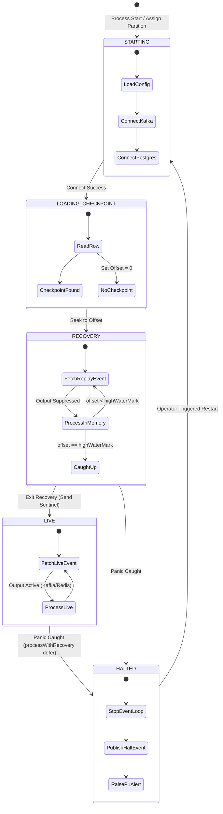
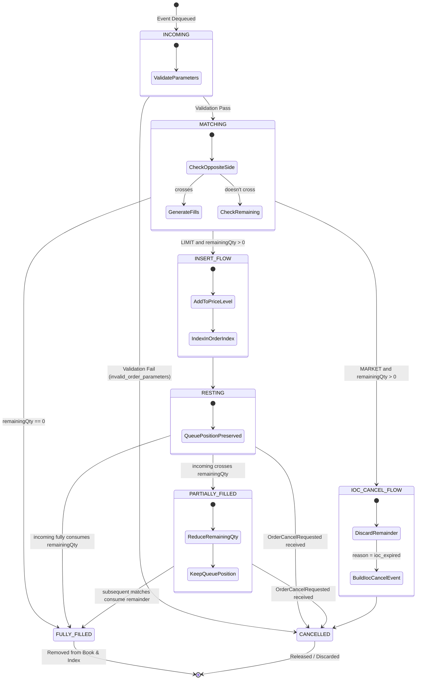
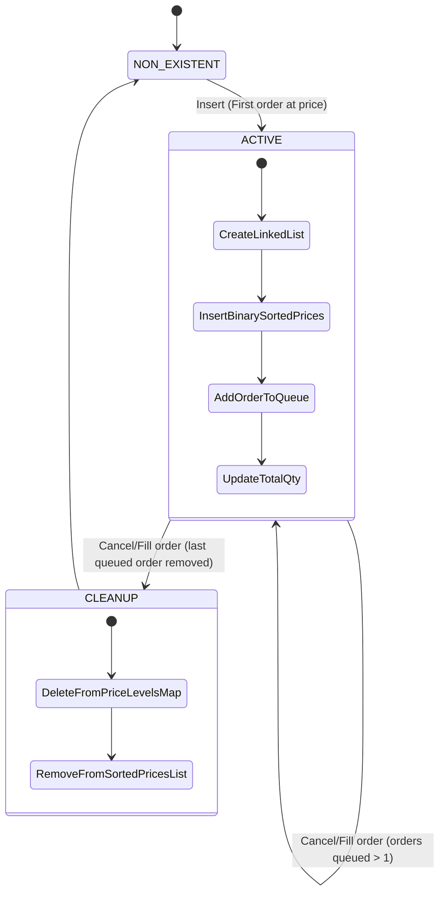

# TradeDrift Matching Engine — State Diagrams

**Document:** 14_State_Diagrams.md
**Service:** Matching Engine
**Version:** V1.0
**Last Updated:** July 2026

---

## 1. Market Engine State Transitions

Each market (e.g. BTC-USDT) runs its own state machine. This governs recovery, readiness, and panic-halt transitions.

---

## 2. Order Lifecycle States (Matching Engine View)

The Matching Engine has a simplified view of an order compared to the Order Service, tracking only in-memory presence and quantity.

---

## 3. Price Level States

A price level represents aggregated liquidity at a specific price. It is dynamically created and cleaned up.

---

## 4. References

- `03_Order_Book.md` — Order Book entities
- `04_Data_Structures/03_Order_Node.md` — OrderNode lifecycle
- `04_Data_Structures/04_Price_Level.md` — PriceLevel list properties
- `10_Failure_Handling.md §6` — Panic and halt states
- `13_Flow_Diagrams.md` — Concrete workflow paths
