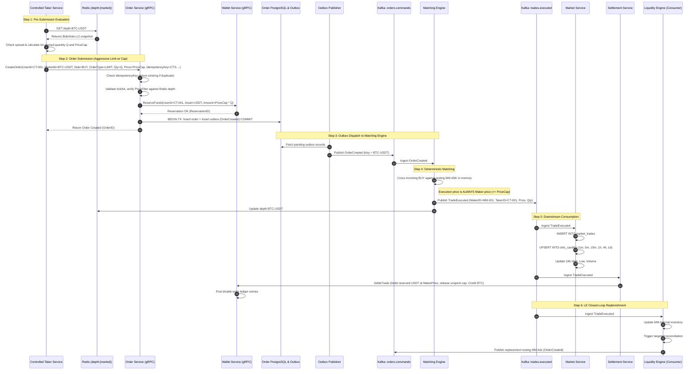

# Controlled Taker Service — Order Flow & Matching Pipeline

> **Status:** 📐 Designed (V1.1 — Updated with Architectural Feedback)  
> **Service:** Controlled Taker Service (`services/controlled-taker`)  
> **Document:** `05_Order_Flow_And_Engine.md`  
> **Last Updated:** September 2026  

---

## 1. End-to-End Sequence Diagram

The complete lifecycle of a controlled taker order follows the authoritative TradeDrift order pipeline:



---

## 2. Order Contract Specification

CTS reuses the existing Protobuf contract defined in `platform/api/proto/order/v1/order.proto`:

```protobuf
message CreateOrderRequest {
  string user_id = 1;          // "00000000-0000-0000-0000-000000000002" (CT-001)
  string market_id = 2;        // "BTC-USDT", "ETH-USDT", or "SOL-USDT"
  OrderSide side = 3;          // ORDER_SIDE_BUY or ORDER_SIDE_SELL
  OrderType order_type = 4;    // ORDER_TYPE_LIMIT (Aggressive Crossing Limit)
  string price = 5;            // Calculated slippage cap/floor price
  string quantity = 6;         // Lot-rounded quantity string
  string idempotency_key = 7;  // "CTS-{MarketID}-{UUIDv7}"
}
```

---

## 3. Slippage Cap Sizing & Matching Mechanics

### BUY Orders:
- CTS specifies an aggressive limit price:
  $$P_{\text{cap}} = P_{\text{target\_level}} \times (1 + \text{SlippageBuffer})$$
- Order Service `PriceFilter` verifies that $P_{\text{cap}}$ is within the pre-trade percentage band from current mid-price.
- Wallet Service reserves quote funds: $\text{ReservedUSDT} = P_{\text{cap}} \times Q$.
- In the Matching Engine:
  - The incoming BUY order crosses all resting asks with price $P_{\text{ask}} \le P_{\text{cap}}$.
  - Trade execution executes at **$P_{\text{maker}}$** (maker's resting price), strictly guaranteeing price improvement for the taker.
  - Upon settlement, Settlement Service debits $P_{\text{maker}} \times Q$ and immediately **releases the unspent reservation** $(P_{\text{cap}} - P_{\text{maker}}) \times Q$ back to `CT-001`'s available balance.

### SELL Orders:
- CTS specifies a floor limit price:
  $$P_{\text{floor}} = P_{\text{target\_level}} \times (1 - \text{SlippageBuffer})$$
- Wallet Service reserves base asset: $\text{ReservedBase} = Q$.
- Matching Engine crosses resting bids with price $P_{\text{bid}} \ge P_{\text{floor}}$ at maker price.
