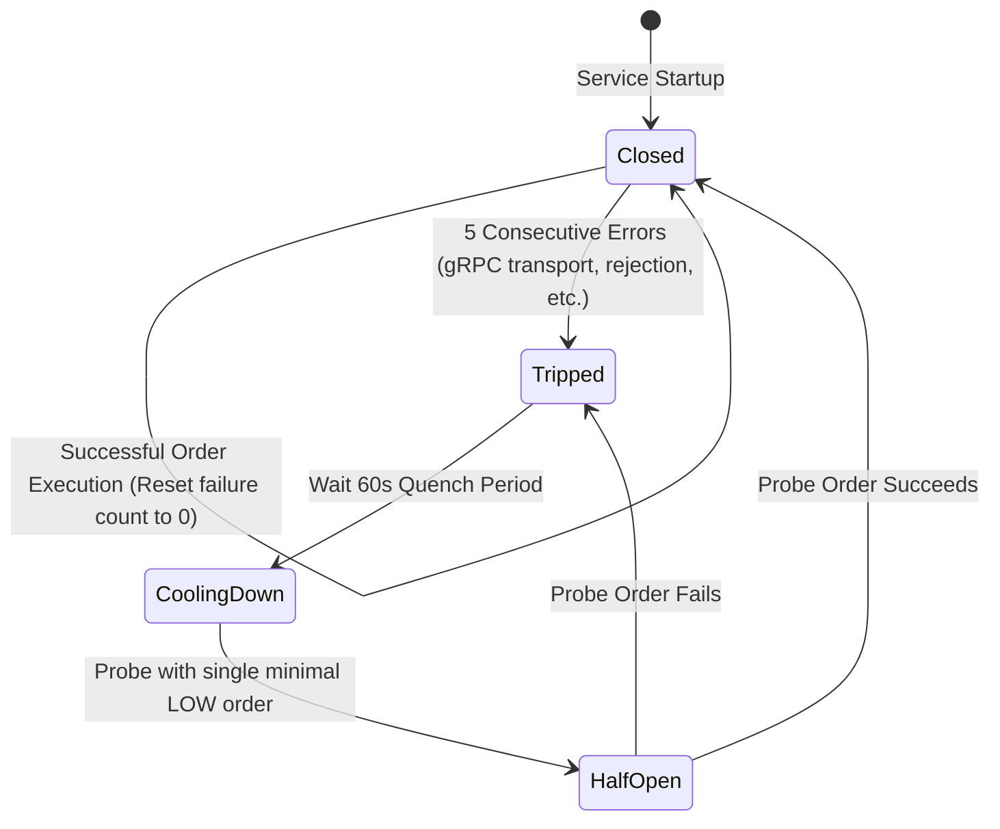

# Controlled Taker Service — Safety Model & Circuit Breaker

> **Status:** 📐 Designed (V1.1 — Updated with Architectural Feedback)  
> **Service:** Controlled Taker Service (`services/controlled-taker`)  
> **Document:** `07_Safety_And_Circuit_Breaker.md`  
> **Last Updated:** September 2026  

---

## 1. Multi-Tiered Safety Boundaries

To prevent synthetic runaway order generation or rapid balance depletion, CTS implements four defensive layers:

```
┌─────────────────────────────────────────────────────────────────────────────┐
│                             SAFETY LAYERS                                   │
│                                                                             │
│ Layer 1: Market State Guard                                                │
│ └── Assert market is ACTIVE; verify Redis depth is fresh (< 5s staleness)   │
│                                                                             │
│ Layer 2: Spread & Cumulative Depth Guard                                    │
│ └── Spread <= 1.5%; cumulative depth in slippage band >= 1.5x order quantity│
│                                                                             │
│ Layer 3: Sizing & Slippage Caps                                             │
│ └── Max notional $10,000 USDT; max slippage 15 bps; lot-size alignment       │
│                                                                             │
│ Layer 4: Volume Accumulators & Circuit Breaker                              │
│ └── Hourly cap $100K USDT; daily cap $1.5M USDT; 5-failure trip latch       │
└─────────────────────────────────────────────────────────────────────────────┘
```

---

## 2. Cumulative Depth Guard (Refined Definition)

In earlier revisions, the depth guard was loosely stated as $\text{Depth} \ge 1.5 \times Q$. If applied only to Level 1, this would erroneously reject legitimate multi-level HIGH profile orders.

### Definitive Formulation:
The depth guard evaluates **cumulative depth within the allowed slippage band**:

$$D_{\text{cum\_allowed}} = \sum_{i=1}^{m} Q_i \quad \text{where } P_i \le P_{\text{max\_allowed}}$$

The safety check strictly requires:
$$\mathbf{D_{\text{cum\_allowed}} \ge 1.5 \times Q_{\text{target}}}$$

This guarantees that:
1. For LOW/MID profiles (single level), Level 1 depth is at least $1.5\times$ order size.
2. For HIGH profile (multi-level sweep), the total available liquidity across all reachable levels comfortably exceeds the sweep quantity by at least $50\%$, preventing book exhaustion.

---

## 3. V1 Proposed Safety Boundaries

> **Important Operational Context:**  
> The numerical values below represent **V1 proposed defaults — subject to implementation and integration validation** against actual Liquidity Engine resting sizes. If MM resting depth is small (e.g. 0.10 BTC total), available liquidity naturally constrains order sizes well below the theoretical caps.

| Guard | V1 Proposed Default | Purpose | Action on Violation |
| :--- | :--- | :--- | :--- |
| **Max Order Notional** | `$10,000.00` USDT | Hard ceiling per order | Truncate order size to notional ceiling |
| **Max Hourly Volume** | `$100,000.00` USDT / pair | Prevents runaway hourly volume | Pause market worker until hour window rolls |
| **Max Daily Volume** | `$1,500,000.00` USDT / pair | Prevents excessive 24h inflation | Halt market worker until next UTC day |
| **Max Trades per Hour** | `60` trades / pair | Frequency governor | Pause order dispatch until rate clears |
| **Max Book Spread** | `1.50%` of MidPrice | Protects against disrupted books | Skip cycle; log "spread too wide" |
| **Max Allowed Slippage** | `15 bps` (0.15%) | Hard price cap boundary | Reject price cap; downscale quantity |
| **Min Rest Interval** | `15 seconds` | Mandatory debounce | Enforce wait before next cycle |
| **High Profile Cooldown** | `300 seconds` (5 mins) | Allows LE to replenish book | Restrict market to LOW profile |

---

## 4. Circuit Breaker State Machine

Each market worker contains an independent circuit breaker:



### Tripping Criteria:
- Order Service gRPC transport errors (connection refused, deadline exceeded).
- Wallet Service returns `ErrInsufficientFunds`.
- Pre-trade price filter violations (`FILTER_FAILURE_PERCENT_PRICE`).
- Redis depth snapshot unavailable or stale for $> 30\text{s}$.

### Trip Action:
- Immediate structured alert logged at `ERROR` level.
- Prometheus counter `cts_circuit_breaker_tripped{market_id}` incremented.
- Worker stops order submissions on that market for 60 seconds.
- Other market workers continue operating normally (fault quarantine).
