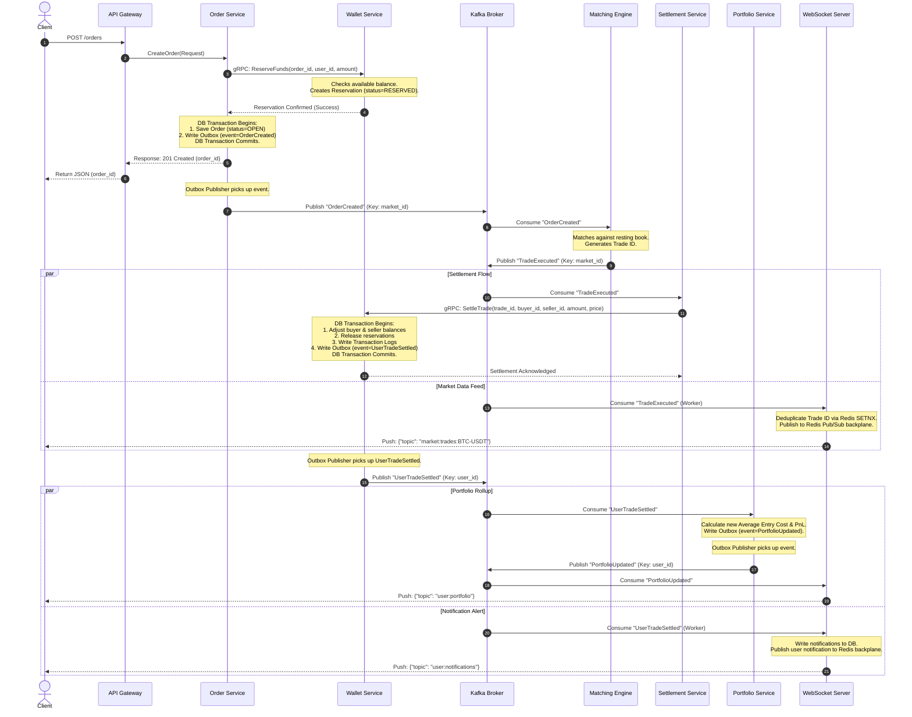
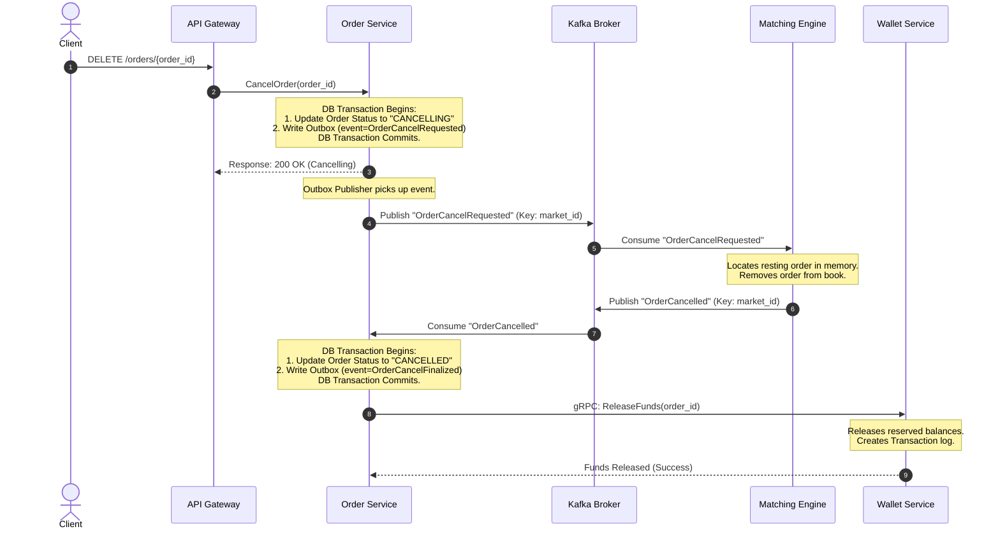

# TradeDrift — Event-Driven Architecture Design

> **Status:** ✅ Designed (V1.2)
> **Document:** 13_Event_Driven_Architecture.md
> **Service:** Platform Architecture
> **Version:** V1.2
> **Last Updated:** July 2026
> Revision notes: V1.2 aligns topics to versioned naming standard (e.g. trades.executed.v1) matching the Kafka Topic Design spec.

---

## 1. Overview & Architectural Principles

TradeDrift utilizes an **asynchronous, event-driven architecture** as its primary integration plane for critical state transitions. By shifting cross-service workflows from synchronous RPC calls to decoupled messaging, the platform achieves horizontal scaling, fault isolation, and eventual consistency.

```
                 Order Service           Matching Engine         Settlement Service
                 +-------------+         +-------------+         +----------------+
                 | Outbox      |         | In-Memory   |         | Kafka Consumer |
                 | Publisher   |         | Engine      |         | & Wallet gRPC  |
                 +------+------+         +------+------+         +-------+--------+
                        |                       |                        |
             (OrderCreated)            (TradeExecuted)             (TradeSettled)
                        ▼                       ▼                        ▼
  [ KAFKA ] ════════════════════════════════════════════════════════════════════════════
                        │                       │                        │
                        ▼                       ▼                        ▼
                 Matching Engine        Settlement Service       Portfolio/Trade/Alerts
```

### Core Architecture Rules:
1. **Asynchronous Command/Event Boundaries:** Synchronous gRPC is reserved for write-blocking validations (e.g. fund reservation, balance checks). All downstream updates (e.g. match processing, trade clearing, portfolio rollup, push notifications) are triggered via Kafka events.
2. **Transactional Integrity (Outbox Pattern):** A service must never write to its local database and publish directly to Kafka within the same thread. All events must be persisted to a local `outbox` table in the same database transaction as the business state modification, then published asynchronously.
3. **Partitioning & Ordering Guarantees:** Kafka topics are partitioned to scale write throughput. Messages must use specific entity-centric correlation keys (e.g., `market_id` or `user_id`) to ensure that all events for a single market or user land on the same partition and are processed in strict chronological order.
4. **Idempotence by Design:** All event consumers must implement deduplication checks (e.g. `processed_events` log tables) to guarantee that a redelivered Kafka message will never result in duplicate database writes, balance updates, or visual double-ticks in WebSocket feeds.

### 1.2 Event Schema Evolution & Envelope Standard
To support zero-downtime rolling upgrades and contract evolution, every Kafka message published in the platform must be wrapped in a standard JSON envelope containing an explicit version identifier:

```json
{
  "event_id": "018f60f3-b780-7798-8422-dfa6b29f44ea",     // UUIDv7 event unique ID (for deduplication)
  "event_type": "OrderCreated",                           // Event name
  "event_version": 1,                                     // Integer schema version (starting at 1)
  "timestamp": "2026-07-10T18:07:40Z",                   // Event generation time
  "payload": {                                            // Event-specific business fields
    "order_id": "018f60f3-b780-7798-8422-dfa6b29f44ea",
    "market_id": "BTC-USDT",
    "user_id": "018f60f3-a120-7798-8422-cfb6a29e11aa",
    "price": "58200.0000000000",
    "quantity": "0.1000000000",
    "side": "BUY"
  }
}
```

* **Evolution Rule:** Consumer applications must inspect `event_version`. If a consumer encounters a newer `event_version` than it currently supports, it must either run a backwards-compatible parser (if possible) or route the event to the Dead Letter Queue (DLQ) rather than silently discarding or crashing. New fields added in updated versions should always be optional.

---

## 2. Kafka Topic & Partition Topology

Topics are configured with distinct partition keys to distribute load while preserving message ordering:

| Versioned Topic Name | Purpose | Partition Key | Publisher | Consumers |
|---|---|---|---|---|
| `orders.created.v1` | New limit order accepted and funded | `market_id` | Order Service | Matching Engine |
| `orders.cancel-requested.v1` | User requested order cancellation | `market_id` | Order Service | Matching Engine |
| `orders.cancelled.v1` | Order was cancelled by matching engine | `market_id` | Matching Engine | Order Service |
| `trades.executed.v1` | Engine matched buy and sell orders | `market_id` | Matching Engine | Settlement Service, Market Service, Notification Service (Worker) |
| `user-trades.settled.v1` | Wallet committed balances for trade side | `user_id` | Wallet Service | Trade Service, Portfolio Service, Notification Service (Worker) |
| `portfolios.updated.v1` | Calculated user holdings / PnL modified | `user_id` | Portfolio Service | Notification Service (Worker) |
| `admin.user-suspended.v1` | Administrative user account lock | `user_id` | Admin Service | Order Service, Wallet Service |
| `admin.market-halted.v1` | Emergency market trading stop | `market_id` | Admin Service | Matching Engine |
| `admin.market-commands.v1` | Market configuration updates | `market_id` | Admin Service | Matching Engine |
| `wallet.deposit_completed.v1` | Fiat/Crypto deposit successful | `user_id` | Wallet Service | Notification Service |
| `wallet.withdrawal-initiated.v1` | Withdrawal request processed | `user_id` | Wallet Service | Trade Service |
| `wallet.withdrawal-completed.v1` | Withdrawal funds sent to chain | `user_id` | Wallet Service | Notification Service |

> **Event Ownership Decision (`UserTradeSettled`):** The Wallet Service is the single authoritative source of truth for financial ledger modifications and balance updates. The `UserTradeSettled` event is published **exclusively by the Wallet Service** via its PostgreSQL outbox table after the balance settlement transaction commits. For every `TradeExecuted` message, the Wallet Service publishes two `UserTradeSettled` messages—one for the buyer (`partition_key = buyer_id`) and one for the seller (`partition_key = seller_id`).

> [!IMPORTANT]
> - **Schema Migrations:** The changes here alter DDL statements in the documentation. Since the codebase is not yet implemented, modifying the specifications now guarantees that the first migrations created will be correct and consistent.
> - **User-Centric Event Naming:** To preserve clear event contracts, the event is renamed from `TradeSettled` to `UserTradeSettled` (and topic to `user-trades.settled.v1`). Each message represents a single user's leg of the settlement, rather than the trade as a whole. This resolves the naming conflict without adding partition rekeying overhead.

### Partition Key Design Rationale:
* **`market_id` Partitioning:** Orders and matches for a specific market (e.g., `BTC-USDT`) must process sequentially. Partitioning by `market_id` ensures a single Matching Engine market goroutine handles all updates sequentially, preventing race conditions.
* **`user_id` Partitioning:** Portfolio rollups and balance histories are user-specific. Partitioning by `user_id` guarantees that a single user's balances are updated chronologically.

---

## 3. Saga Choreography Flows

TradeDrift implements the **Choreography-based Saga Pattern** to manage multi-service transactions without a single central orchestrator.

### 3.1 Order Placement & Match Lifecycle (Happy Path)



### 3.2 Order Cancellation Flow



---

## 4. Transactional Outbox Design Pattern

To prevent dual-write inconsistencies, all state-changing services implement the **Transactional Outbox Pattern**.

### 4.1 Schema Specification

Every service database contains a dedicated `outbox` table:

```sql
CREATE TABLE outbox (
    id             UUID PRIMARY KEY,                      -- UUIDv7 event identifier
    aggregate_id   UUID NOT NULL,                         -- Target aggregate UUID (e.g. order_id, user_id)
    event_type     VARCHAR(50) NOT NULL,                  -- Versioned type, e.g. 'orders.created.v1'
    payload        JSONB NOT NULL,                        -- Complete JSON payload content
    partition_key  VARCHAR(100) NOT NULL,                 -- Kafka partition key (market_id or user_id)
    status         VARCHAR(20) NOT NULL DEFAULT 'PENDING',-- 'PENDING', 'PUBLISHED', 'FAILED'
    failed_reason  TEXT,                                  -- Failure context/error traceback
    published_at   TIMESTAMPTZ,                           -- NULL until sent successfully
    created_at     TIMESTAMPTZ NOT NULL DEFAULT NOW()
);

-- Index for the publisher daemon
CREATE INDEX idx_outbox_pending ON outbox(created_at) WHERE status = 'PENDING';
```

### 4.2 Multi-Replica Publisher Daemon (Distributed Lock Free)

To scale services horizontally without running into duplicate event publishing anomalies, we deploy an **outbox publisher daemon** inside each service replica. The daemons lease batches of pending events from PostgreSQL, send them to Kafka, and mark them as published only after verification.

#### Correct Publisher Query Sequence:

```
  Step 1: Lease Pending Batch (Select)
  +-----------------------------------------------+
  | SELECT id, event_type, payload, partition_key |
  | FROM outbox WHERE status = 'PENDING'          |
  | ORDER BY created_at ASC LIMIT 100             |
  | FOR UPDATE SKIP LOCKED;                       |
  +-----------------------------------------------+
                         |
                         ▼
  Step 2: Publish to Kafka & Await Acks
  +-----------------------------------------------+
  | Loop through rows & write to Kafka topics     |
  | with acks=all (wait for ISR replication)      |
  +-----------------------------------------------+
                         |
                         ▼
  Step 3: Update Row Status & Commit Transaction
  +-----------------------------------------------+
  | UPDATE outbox SET status = 'PUBLISHED',       |
  |                   published_at = NOW()        |
  | WHERE id = ANY($1);                           |
  | COMMIT;                                       |
  +-----------------------------------------------+
```

1. **Lease Batch (Phase 1):** The publisher daemon starts a database transaction and queries `outbox` using `FOR UPDATE SKIP LOCKED` for the oldest 100 `PENDING` records. PostgreSQL locks these rows in the database, skipping any rows currently locked by other running publisher replicas.
2. **Publish to Kafka (Phase 2):** The code iterates through the selected batch and publishes the records to the Kafka brokers. It blocks until Kafka acknowledges successful receipt of all messages in the batch (`acks=all`).
3. **Finalize Status & Commit (Phase 3):** Only after Kafka has successfully written and replicated the batch does the database transaction update the row status to `PUBLISHED` and write `published_at` before issuing a `COMMIT`. 
4. **Error Rollback:** If the publisher crashes, loses database connectivity, or fails to get broker acknowledgements, the database transaction rolls back automatically. The rows remain marked as `PENDING`, allowing other replicas to grab them for retry. This guarantees that events are never lost and are only marked as `PUBLISHED` *after* they are successfully written to Kafka.

---

## 5. Message Delivery Guarantees & Idempotency

### 5.1 At-Least-Once Semantics
TradeDrift prioritizes data reliability over strict once-only delivery:
* **Producer Acks:** Outbox publishers send messages with `acks=all` (Kafka requires block replication across the ISR list before returning success).
* **Consumer Commits:** Consumers commit offsets **only after** successfully completing database writes or executing business logic. Auto-commits are strictly disabled (`enable.auto.commit = false`).

### 5.2 Deduplication & Idempotency Blueprints

Because at-least-once delivery results in duplicate message redeliveries during broker rebalances, every consumer implements safety checks based on their query paths:

#### 1. Database-Persisted Paths (Write-Heavy Consumers)
Services writing to PostgreSQL (e.g. Order, Wallet, Trade, Notification) maintain a `processed_events` table:

```sql
CREATE TABLE processed_events (
    event_id      UUID PRIMARY KEY,                      -- Event ID from Kafka header
    processed_at  TIMESTAMPTZ NOT NULL DEFAULT NOW()
);
```

* **Execution Pattern:**
  ```sql
  BEGIN TRANSACTION;
  
  -- Attempt to insert the message ID. If it already exists, the transaction fails.
  INSERT INTO processed_events (event_id) VALUES ($1);
  
  -- Execute business logic
  UPDATE wallet_balances SET available = available + $2 WHERE user_id = $3;
  
  COMMIT;
  ```
* **Retention Policy:** The Cron Role of each service purges entries in `processed_events` older than **7 days** to prevent size bloat.

#### 2. Live Public Ticker Feeds (Bypass DB Ingestion)
The Notification Service worker publishes trade records directly to Redis Pub/Sub (bypassing DB writes entirely). Because Bloom filters have a structural **false-positive rate** that could lead to silently dropping legitimate trades, we implement an exact key deduplication strategy using Redis:
* **Deduplication Check (`SETNX`):** Before broadcasting a trade event to the WebSocket backplane, the worker executes a single atomic Redis command using the trade ID:
  ```redis
  SET dedup:trades:{trade_id} 1 EX 3600 NX
  ```
  *(Sets the key with a 1-hour expiration only if the key does not already exist).*
* **Action:**
  - If Redis returns `OK` (key created), the trade is unique and is published to the Redis Pub/Sub channel `market:trades:{market_id}`.
  - If Redis returns `nil` (key already exists), the trade is a duplicate redelivery. The worker discards it immediately, preventing duplicate ticker feeds on client screens with zero risk of false positives.
* **Portfolio Update Feed (PortfolioUpdated):** Because portfolio messages push real-time value updates directly to the client socket, the client UI simply overrides the local display with the latest message values. Duplicate pushes are naturally idempotent on the frontend, so no extra deduplication overhead is required.

---

## 6. Dead Letter Queue (DLQ) & Error Strategy

Handling message ingestion failures cleanly prevents pipeline lockups:

```
                      +-----------------------------+
                      | Kafka Consumer Ingestion    |
                      +--------------+--------------+
                                     |
                         [ JSON Parsing Success? ]
                               /           \
                           (No)             (Yes)
                             /                 \
            +---------------v---+            +--v------------------+
            | Publish to        |            | Business Validation |
            | {topic}-dlq       |            +----------+----------+
            +-------------------+                       |
                                             [ Recoverable Failure? ]
                                                /              \
                                            (No)               (Yes)
                                            /                     \
                             +-------------v-----+           +-----v-------+
                             | Publish to        |           | Retries with|
                             | {topic}-dlq       |           | Exponential |
                             +-------------------+           | Backoff     |
                                                             +-------------+
```

### 6.1 Parsing Failures (Unrecoverable)
* **Trigger:** A consumer receives a corrupted JSON message or an event that violates the protobuf-defined struct mapping.
* **Mitigation:** The consumer immediately routes the raw payload to `{topic}-dlq` with custom headers (`x-exception-message`, `x-failed-at`, `x-original-topic`) and logs a high-severity error. The consumer offset is committed to keep the partition pipeline moving.

### 6.2 Transient Failures (Recoverable)
* **Trigger:** Database timeouts, deadlock conflicts, or connection disconnects.
* **Mitigation:** The consumer retries execution up to **5 times** using an exponential backoff strategy with jitter. If the database remains unreachable after 5 attempts, the consumer halts partition ingestion (fails readiness probe) to alert orchestration systems.

---

## 7. Service Invariants

- **EDA-1 (At-least-once outbox):** Events must be written in the same transaction as the parent database change, then polled lock-free using `FOR UPDATE SKIP LOCKED`.
- **EDA-2 (No Auto-Commits):** Kafka consumers must commit offsets manually only after the execution transaction has committed in the local database.
- **EDA-3 (Entity-Centric Partitioning):** All messages in a topic must be partitioned by their structural identity key (`market_id` for orders/matches, `user_id` for wallet/portfolio events) to guarantee strict serial execution order.
- **EDA-4 (Idempotency Logs):** Consumers writing state to disk must run all writes within a transaction guarded by `processed_events` entry checks.

---

## 8. Cancel-After-Fill Edge Case (Terminal Event Boundaries)

A race condition occurs when a user cancels an order at the same moment the Matching Engine fills it. Since cancellation requests are handled asynchronously through Kafka, we define strict terminal boundaries:

```
                          [ Client Sends DELETE /orders/{id} ]
                                            │
                                  Order Service Status
                                     → CANCELLING
                                            │
                             Kafka: OrderCancelRequested
                                            │
                                            ▼
                                  [ Matching Engine ]
                                   /             \
                       [ Order Resting? ]   [ Order Already Filled? ]
                              /                       \
                          (Yes)                       (Yes)
                            /                           \
          Publish: OrderCancelled (Qty)           Ignore / Discard Request
                            │                           │
                            ▼                           ▼
          Order Service Status                Order Service awaits
             → CANCELLED                      TradeSettled / OrderFilled
          Call Wallet: ReleaseFunds           Status → FILLED
```

### 8.1 The Fully-Filled Race Condition
1. **The Scenario:** Client sends a cancellation request. Order Service transitions the order to `CANCELLING` and publishes `OrderCancelRequested`. Concurrently, the Matching Engine executes a trade, filling the order, and publishes `TradeExecuted`.
2. **Matching Engine Handling:** The engine receives `OrderCancelRequested` but finds the order has already been fully removed from the active book. The engine silently discards the cancellation request.
3. **Terminal Event Resolution:** The Order Service receives `TradeExecuted` or `OrderFilled` from Kafka. Since this represents the true terminal state, the Order Service updates the order status to `FILLED` (overriding `CANCELLING`). No funds are released to the Wallet Service, as the assets have been traded.

### 8.2 The Partially-Filled Race Condition
1. **The Scenario:** Client cancels a partially filled order. The Matching Engine has executed a match on part of the order, but a portion remains resting.
2. **Matching Engine Handling:** The engine removes the remaining portion from the book and publishes `OrderCancelled` to Kafka, containing the exact `cancelled_quantity`.
3. **Terminal Event Resolution:** The Order Service consumes the `OrderCancelled` event:
   - It transitions the order to `CANCELLED` (or `PARTIALLY_FILLED_CANCELLED`).
   - It immediately triggers a synchronous gRPC call to `Wallet.ReleaseFunds(order_id, remaining_amount)` using the calculated unexecuted portion. This releases the remaining reserved funds back to the user's available balance, finalizing the transaction.
