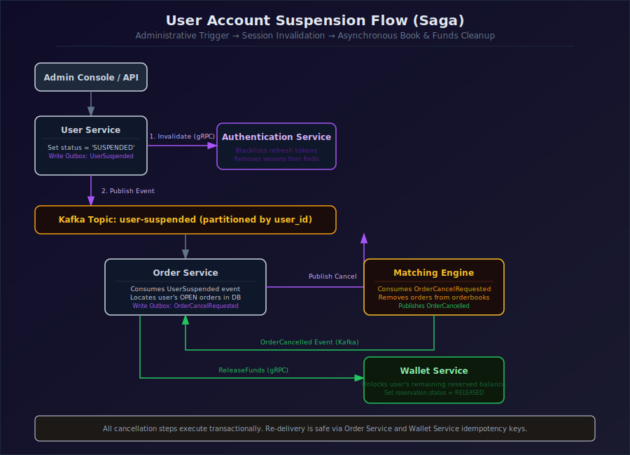
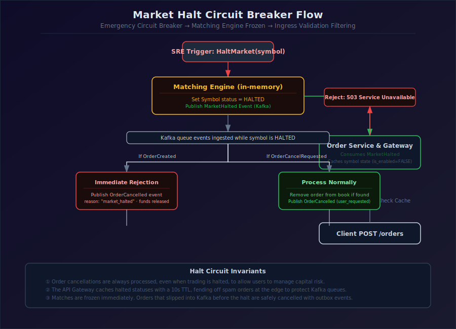

# TradeDrift — Administrative & Security Workflows

> **Status:** ✅ Designed (V1.0)
> **Document:** 24_Admin_Workflows.md
> **Service:** Platform Architecture
> **Version:** V1.0
> **Last Updated:** July 2026

---

## 1. Purpose

This document specifies the administrative actions, governance workflows, and security boundaries required to operate the TradeDrift exchange platform. It outlines how operational failures, compliance holds, and abuse prevention mechanisms are enforced consistently across the service mesh.

---

## 2. Administrative Control Workflows

To ensure proper audit trails and ledger integrity, administrative mutations are choreographed across service boundaries using transaction-safe workflows.

### 2.1 Suspend User Account

A suspension locks a user out of the system, terminates active trading sessions, and clears any resting orders on the book.



#### Steps:
1. **State Mutation:** User Service updates the user record in PostgreSQL setting `status = 'SUSPENDED'` within a transaction.
2. **Session Invalidation:** User Service makes a gRPC call to the Authentication Service, which immediately blacklists all active refresh tokens for the user in Redis. Subsequent API calls using existing access tokens will fail validation at the API Gateway within 5 minutes (access token TTL).
3. **Resting Order Cleanup:** User Service writes a `UserSuspended` event to its outbox, which is published to Kafka.
4. **Order Cancellation:** The Order Service consumes the `UserSuspended` event and fetches all `OPEN` or `PARTIALLY_FILLED` orders for that user. For each order:
   - Transition status to `CANCELLING`.
   - Publish `OrderCancelRequested` to Kafka, ensuring the Matching Engine cancels the resting book entry and returns funds to available balance.

---

### 2.2 Freeze Wallet

Freezing prevents any movement of a user's funds (reservations or settlements) while keeping balances visible.

* **Trigger:** Admin sets `is_frozen = TRUE` in the `wallets` table for a specific `(user_id, asset)` tuple in the Wallet Service database.
* **Service Enforcement:**
  * **`ReserveFunds`:** If the wallet is frozen, Wallet Service immediately returns a gRPC error `FAILED_PRECONDITION: WALLET_FROZEN` and rejects the reservation.
  * **`ReleaseFunds`:** Permitted even if frozen, to ensure cancellations can return funds to the ledger.
  * **`SettleTrade`:** If either the buyer's or seller's wallet is frozen, the gRPC call returns `FAILED_PRECONDITION: WALLET_FROZEN`. The Settlement Service does **not** retry this error type automatically; the trade goes straight to the Dead Letter Queue (DLQ) for manual SRE intervention.

---

### 2.3 Halt Trading (Emergency Circuit Breaker)

In the event of market anomaly or system maintenance, SRE can halt trading for a specific market symbol.



* **Matching Engine Behavior:**
  * When a `HaltMarket` command is received, the ME updates the market's state to `HALTED` in memory.
  * Any subsequent `OrderCreated` events consumed from the Kafka partition are immediately rejected: ME publishes an `OrderCancelled` event with reason `market_halted`, and does not add the order to the book.
  * `OrderCancelRequested` events are still processed normally to allow users to pull resting orders during a halt.
* **Order Service Behavior:**
  * Consumes the `MarketHalted` Kafka event and updates its local cache.
  * The API Gateway / Order Service immediately rejects incoming `POST /orders` requests for the halted symbol with a `503 Service Unavailable` response, reducing useless Kafka traffic.

---

### 2.4 Manual Settlement Retry & Reconciliation

If a trade settlement fails due to a transient failure (e.g. database locks, service outages) and exhausts its retry policy, or fails due to a frozen wallet, it lands in the Settlement Dead Letter Queue (DLQ).

1. **SRE Diagnosis:** SRE reviews the DLQ entries using the admin dashboard.
2. **Remediation:** If the blocker is resolved (e.g. the wallet is unfrozen), the administrator invokes the `/admin/settlement/retry` endpoint on the Settlement Service.
3. **Execution:** The Settlement Service:
   - Pulls the trade event from the DLQ.
   - Force-retries the two-phase execution pipeline (Phase 1, Phase 2 `SettleTrade` call, and Phase 3 completion).
   - If successful, acknowledges the DLQ record.

---

## 3. Security Boundaries & Authorization

TradeDrift implements zero-trust network boundaries internally to ensure services cannot perform operations outside their designated domain.

```
                  [ mTLS Boundary ]
┌─────────────────┐               ┌─────────────────┐
│  Order Service  ├──(Reserve)───►│ Wallet Service  │ (Validates SPIFFE ID)
└─────────────────┘               └─────────────────┘
                                           ▲
                                           │
                                       (Settle)
                                           │
                                  ┌────────┴────────┐
                                  │Settlement Serv. │
                                  └─────────────────┘
```

### 3.1 Service-to-Service gRPC mTLS

Internal gRPC routes are secured with Mutual TLS (mTLS). Service identities are managed via SPIFFE/SPIRE, injecting X.509 SVID credentials into each service container.

All services validate the client's SPIFFE ID inside a gRPC authorization interceptor before executing the handler:

| Target RPC Endpoint | Allowed Caller Identities (SPIFFE IDs) |
|---|---|
| `InitializeWallet` | `spiffe://cluster.local/ns/tradedrift/sa/auth-service` |
| `ReserveFunds` | `spiffe://cluster.local/ns/tradedrift/sa/order-service` |
| `ReleaseFunds` | `spiffe://cluster.local/ns/tradedrift/sa/order-service` |
| `SettleTrade` | `spiffe://cluster.local/ns/tradedrift/sa/settlement-service` |
| `GetSupportedAssets` | `spiffe://cluster.local/ns/tradedrift/sa/market-service` |

---

### 3.2 Abuse Controls & Velocity Limits

To prevent platform denial-of-service and market manipulation, the API Gateway and services enforce rate and velocity boundaries.

#### API Gateway Global Rate Limits:
* **Implementation:** Redis-backed Token Bucket algorithm.
* **Unauthenticated Routes (Auth endpoints):** Max 5 requests/sec per IP address.
* **Authenticated Public Routes (GET queries):** Max 50 requests/sec per user.
* **Authenticated Order Mutation (POST/DELETE):** Max 100 requests/sec per user (burst up to 150).

#### Order Service Velocity Control:
To protect the Matching Engine from message flooding (which could delay matching loops), the Order Service enforces a strict **Order Placement Velocity Limit**:
* **Rule:** A maximum of **10 order placements per second per user account** is permitted.
* **Mechanism:** Verified in-memory at the Order Service layer using a sliding-window counter in Redis.
* **Action:** Exceeding placements are rejected immediately at the Order Service layer with a `429 Too Many Requests` error, preventing the request from ever generating a UUIDv7, calling the Wallet Service, or publishing to Kafka.
