# TradeDrift V1 — Production Infrastructure Architecture

> **Status:** ✅ Frozen (V1.0)
> **Document:** 25_Production_Infrastructure_Architecture.md
> **Directory:** docs/02_Platform/
> **Last Updated:** July 2026

This document specifies the distributed infrastructure topology, networking protocols, caching frameworks, reliability systems, scaling parameters, and operational runbooks that enable the TradeDrift trading platform to perform securely and reliably under high load in a production environment.

---

# 1. Domain Name System (DNS)

## Purpose
The Domain Name System (DNS) is the directory service of the internet. It translates human-readable hostnames (e.g. `api.tradedrift.com`) into computer-routable IP addresses (e.g. `198.51.100.12`). In distributed platforms, DNS serves as the entry point for clients, handling global traffic steering, disaster recovery failover, and basic load balancing.

## What is it?
From first principles, DNS is a hierarchical, distributed database. At the root are the Root Nameservers, followed by Top-Level Domain (TLD) nameservers (like `.com`), Authoritative Nameservers managed by DNS providers (like AWS Route 53 or Cloudflare), and Local Resolvers/Caches. Resolution utilizes UDP port 53 (switching to TCP for large zone file transfers or DNSSEC data) and caching at every level using Time-to-Live (TTL) headers.

## Where is it used?
DNS sits at the edge of the architecture. Before any client application (web, mobile, or API) can transmit an HTTP payload, it must execute a DNS query to resolve the endpoint. It communicates with local ISP recursive resolvers, which eventually query authoritative nameservers.

## Why TradeDrift needs it
TradeDrift uses DNS to resolve the public-facing API Gateway and WebSocket endpoints. In multi-region active-passive deployments, DNS is the primary failover lever: changing the primary record's target shifts 100% of incoming client traffic to the disaster recovery site.

## How it works
1. **Query Initiation:** The client requests resolution for `api.tradedrift.com`.
2. **Cache Check:** The operating system checks its local hosts file and DNS resolver cache.
3. **Recursive Resolution:** If missing, a query goes to the ISP Recursive Resolver.
4. **Authoritative Lookup:** The resolver queries the Root, TLD, and finally TradeDrift’s Authoritative Nameserver (e.g. AWS Route 53).
5. **Response & Cache:** Route 53 returns the A/AAAA record (IP addresses) or CNAME (pointing to CDN/Load Balancer) with a TTL. The recursive resolver and client cache this value.

## Types
* **Simple Record:** Maps a name to a single IP address (A/AAAA).
* **Latency-Based Routing:** Routes queries to the region providing the lowest network latency.
* **Failover Routing:** Active-passive setup. Checks secondary endpoints and steers traffic to backup if primary health checks fail.
* **Geolocation Routing:** Steers traffic based on the client's geographic location.

## Configuration / Best Practices
* **TTL Settings:** Set public API TTLs to **60 seconds** to allow rapid failover. Static domains (e.g. static assets) should use **86,400 seconds (24 hours)**.
* **DNSSEC:** Enable DNS Security Extensions to prevent DNS spoofing and cache poisoning attacks.

## Failure Scenarios
If the authoritative DNS provider goes down, clients cannot resolve TradeDrift hostnames, resulting in total outage. Mitigation requires using **Dual-Provider DNS hosting**, synchronizing zone files across two independent authoritative providers (e.g. Route 53 and Cloudflare).

## Advantages
* Global scalability and load distribution.
* Zero client configuration required.
* Low latency via global edge caches.

## Limitations
* DNS changes are not instant due to cached resolvers ignoring TTL policies.
* Vulnerable to DDoS attacks if not protected by a DDoS shield.

## TradeDrift Architecture Placement
```
[Client App] ──(Query api.tradedrift.com)──► [Recursive Resolver] ──► [Authoritative DNS]
```

## Diagram
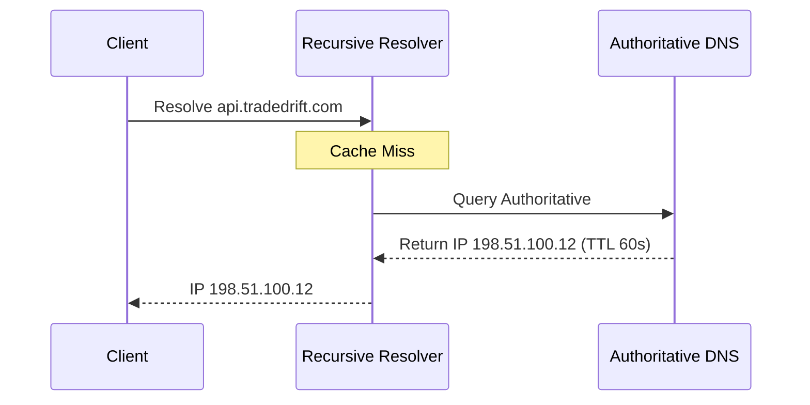
```mermaid
sequenceDiagram
    participant Client
    participant Resolver as Recursive Resolver
    participant DNS as Authoritative DNS
    Client->>Resolver: Resolve api.tradedrift.com
    Note over Resolver: Cache Miss
    Resolver->>DNS: Query Authoritative
    DNS-->>Resolver: Return IP 198.51.100.12 (TTL 60s)
    Resolver-->>Client: IP 198.51.100.12
```

## Design Decisions
We select Cloudflare/Route 53 with low TTL values (60s) on API subdomains to support automated health-check-driven failover.

---

# 2. Content Delivery Network (CDN)

## Purpose
A Content Delivery Network (CDN) optimizes performance by caching and serving static web assets (HTML, CSS, JS, images, fonts) close to the user, offloading work from backend servers.

## What is it?
A CDN is a globally distributed network of proxy servers called Point of Presence (PoP) edge nodes. PoPs store cached copies of static assets. When a client requests an asset, the CDN routes the request to the nearest PoP, reducing round-trip latency.

## Where is it used?
CDNs sit between DNS and the Load Balancer, handling client requests for static assets and proxying dynamic API requests directly to the origin.

## Why TradeDrift needs it
TradeDrift distributes web dashboard assets (compiled React/Vue bundles, icons, landing pages) globally. Using a CDN ensures that these assets load instantly for users worldwide while protecting the API Gateway from static file serving loads.

## How it works
1. **Request routing:** The user requests `https://tradedrift.com/index.html`.
2. **Edge intercept:** DNS resolves the hostname to the nearest CDN edge server IP.
3. **Cache hit:** If the edge server has a cached copy, it immediately returns the file.
4. **Cache miss:** If missing or expired, the edge server fetches the file from the Origin Server (TradeDrift S3 Bucket/Web Server), caches it locally, and delivers it to the user.

## Configuration / Best Practices
* **Cache Headers:** Use `Cache-Control: public, max-age=31536000, immutable` for version-hashed assets.
* **Origin Shielding:** Configure a mid-tier CDN proxy node to cache requests from edge nodes, protecting origin servers from concurrent cache miss storms.

## Failure Scenarios
If the CDN provider suffers an outage, web clients cannot load the user interface. Mitigation requires configuring **origin failover policies** to route asset queries directly to the public S3 bucket or fallback hosting site.

## Advantages
* Significantly reduces origin server bandwidth consumption.
* Improves page load speed via geographical closeness.
* Shields origin servers from application-level DDoS attempts.

## Limitations
* Cache invalidation is hard; updates require cache busting via file naming hashes.
* High cost for high outbound traffic volumes.

## TradeDrift Architecture Placement
```
Client ──► [CDN Edge PoP] ──(Cache Miss)──► [Origin Static Bucket]
```

## Diagram
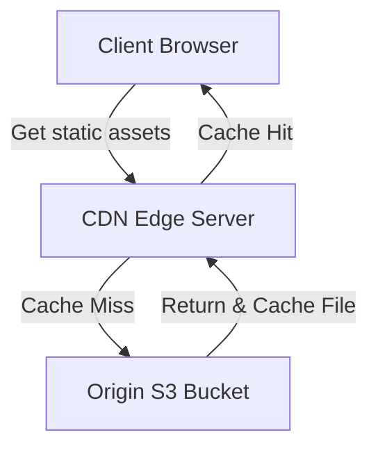
```mermaid
graph TD
    Client[Client Browser] -->|Get static assets| CDN[CDN Edge Server]
    CDN -->|Cache Hit| Client
    CDN -->|Cache Miss| Origin[Origin S3 Bucket]
    Origin -->|Return & Cache File| CDN
```

## Design Decisions
TradeDrift deploys static assets to AWS S3 fronted by Cloudfront/Cloudflare CDN, employing build-time content hashing for cache busting.

---

# 3. Reverse Proxy

## Purpose
A Reverse Proxy sits in front of backend web servers to direct incoming client traffic. It acts as an intermediary, shielding backend services from direct exposure, handling TLS negotiation, logging, and routing.

## What is it?
A Reverse Proxy takes requests from public clients and forwards them to internal servers on a private network. Unlike a forward proxy (which hides client IPs), a reverse proxy hides backend server identities and configurations.

## Where is it used?
A Reverse Proxy is positioned directly behind the public load balancer and in front of the API Gateway or internal microservices.

## Why TradeDrift needs it
TradeDrift uses a reverse proxy layer (e.g. NGINX) to manage inbound request forwarding, enforce header rewriting (e.g. setting `X-Forwarded-For`), and log raw HTTP headers before they reach the API Gateway.

## How it works
1. **Connection:** Client establishes a TCP connection with the proxy.
2. **Parsing:** Proxy receives and parses the HTTP header.
3. **Forwarding:** Proxy evaluates configuration rules and forwards the request to an available backend server.
4. **Response:** Proxy receives the backend response and sends it back to the client.

## Configuration / Best Practices
* **Gzip/Brotli Compression:** Enable compression for JSON responses.
* **Buffers:** Configure large header buffers to prevent `413 Request Entity Too Large` on long JWT auth tokens.

## Failure Scenarios
A proxy failure cuts off all client access to internal services. Redundancy is achieved by deploying multiple stateless proxy replicas in a container host group, managed by a Layer 4 Network Load Balancer.

## Advantages
* Shields internal service topologies.
* Simplifies logging, header validation, and compression.
* Offloads SSL/TLS encryption.

## Limitations
* Introduces an additional network hop.
* Misconfiguration can compromise backend service security.

## TradeDrift Architecture Placement
```
Client ──► Load Balancer ──► [Reverse Proxy (NGINX)] ──► API Gateway
```

## Diagram
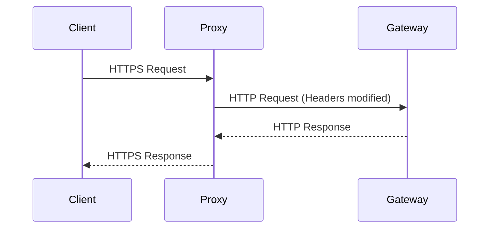
```mermaid
sequenceDiagram
    Client->>Proxy: HTTPS Request
    Proxy->>Gateway: HTTP Request (Headers modified)
    Gateway-->>Proxy: HTTP Response
    Proxy-->>Client: HTTPS Response
```

## Design Decisions
NGINX is chosen as the reverse proxy for its efficiency under high concurrency.

---

# 4. Load Balancer

## Purpose
A Load Balancer distributes network traffic across multiple backend servers to prevent overload on any single instance, ensuring high availability and fault tolerance.

## What is it?
From first principles, a load balancer sits at the network layer (L4) or application layer (L7), distributing incoming sockets or request frames to target pools based on predefined algorithms (e.g. Round Robin).

## Where is it used?
Load Balancers are deployed at two primary boundaries:
1. **Edge:** Directs public internet traffic to API Gateway nodes.
2. **Internal:** Directs service-to-service gRPC or HTTP requests to active internal microservice replicas.

## Why TradeDrift needs it
TradeDrift must scale horizontally to handle volatile market volume. The Load Balancer ensures that API requests, WebSocket sessions, and internal gRPC calls are evenly distributed across the running replicas of our microservices.

## How it works
1. **Ingress:** The load balancer accepts a client socket connection.
2. **Algorithm Execution:** Evaluates backend pool health and selects a target server using an algorithm like Least Connections.
3. **Routing:** Passes the connection or routes request packets to the selected server.

## Types

| Feature | Layer 4 (L4) Load Balancer | Layer 7 (L7) Load Balancer |
|---|---|---|
| **Protocol Layer** | Transport (TCP/UDP) | Application (HTTP/HTTPS/HTTP2) |
| **Routing Criteria** | IP Address & Port | Request Path, Host, Cookies, Headers |
| **Throughput** | High (less packet inspection) | Moderate (requires parsing headers) |
| **Trade-offs** | Cannot read path routes | Supports intelligent routing & TLS offload |

## Configuration / Best Practices
* **Least Connections Algorithm:** Use for database-heavy APIs or WebSocket nodes where session duration varies.
* **Sticky Sessions:** **Disable** for stateless microservices to allow uniform scaling.

## Failure Scenarios
If the load balancer fails, all backend routing stops. Mitigation requires deploying active-passive load balancer pairs (e.g. AWS Network Load Balancer) with automated failover via virtual IP address shifting.

## Advantages
* Prevents individual node exhaustion.
* Supports zero-downtime rolling updates.
* Enables automated health monitoring.

## Limitations
* Can become a single point of failure if not deployed in active-passive pairs.
* Can create a throughput bottleneck at Layer 7 under heavy load.

## TradeDrift Architecture Placement
```
Public Client ──► [L4 Network Load Balancer] ──► API Gateways ──► [Internal L7 Load Balancer] ──► Microservices
```

## Diagram
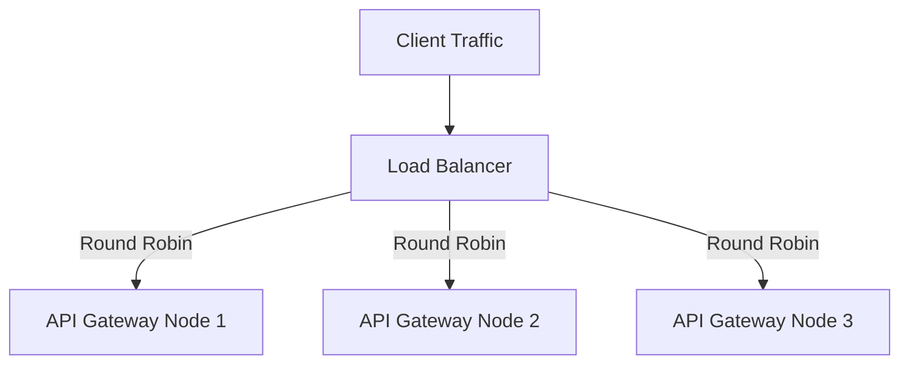
```mermaid
graph TD
    Client[Client Traffic] --> LB[Load Balancer]
    LB -->|Round Robin| Node1[API Gateway Node 1]
    LB -->|Round Robin| Node2[API Gateway Node 2]
    LB -->|Round Robin| Node3[API Gateway Node 3]
```

## Design Decisions
Use AWS Network Load Balancers (L4) at the entry point for raw TCP/TLS WebSocket throughput, and Kubernetes Services (ClusterIP) for internal gRPC traffic routing.

---

# 5. API Gateway

## Purpose
An API Gateway acts as a single entry point for all client requests, routing them to the appropriate backend microservice while consolidating cross-cutting concerns like authentication, rate limiting, and request validation.

## What is it?
An API Gateway is a Layer 7 application routing engine. It exposes unified HTTP endpoints to clients, handles protocol translation (e.g., REST to gRPC), inspects authorization headers, and routes requests to internal backend services.

## Where is it used?
It sits at the boundary of the internal network, behind the reverse proxies/load balancers, routing traffic directly to internal microservices.

## Why TradeDrift needs it
Instead of exposing individual services (Auth, Wallet, Order) directly to the public internet, TradeDrift routes all client traffic through a unified API Gateway. The Gateway validates JWT access tokens, enforces IP/User rate limits, validates idempotency keys, and forwards requests internally via gRPC.

## How it works
1. **Ingress:** Receives a public HTTPS request.
2. **Auth Verification:** Decodes and validates the JWT signature; looks up token ID (JTI) in the Redis blacklist.
3. **Rate Limiting:** Queries Redis to check if client IP/User has exceeded the request threshold.
4. **Idempotency Guard:** Checks if a mutation request contains an `Idempotency-Key` and returns cached responses on duplicates.
5. **gRPC Mapping:** Serializes the JSON payload and calls the respective microservice via gRPC.
6. **Egress:** Returns the gRPC response to the client as a JSON payload.

## Configuration / Best Practices
* **Keep it Stateless:** Never store user sessions or shared state inside gateway memory; rely on Redis or database backends.
* **Circuit Breakers:** Configure short circuit timeouts to backend services to prevent resource leaks during backend failure.

## Failure Scenarios
A Gateway failure shuts down all external API access. Mitigation requires running the Gateway as a stateless deployment with multiple replicas distributed across availability zones, scaling automatically on CPU/Memory usage.

## Advantages
* Shield internal network structures.
* Consolidates authentication, authorization, and rate-limiting.
* Translates REST to internal gRPC protocols.

## Limitations
* Adds network hop latency.
* Can become an development bottleneck if multiple teams share the routing configuration.

## TradeDrift Architecture Placement
```
Public Inbound ──► Load Balancer ──► [API Gateway] ──(gRPC)──► Order/Wallet Services
```

## Diagram
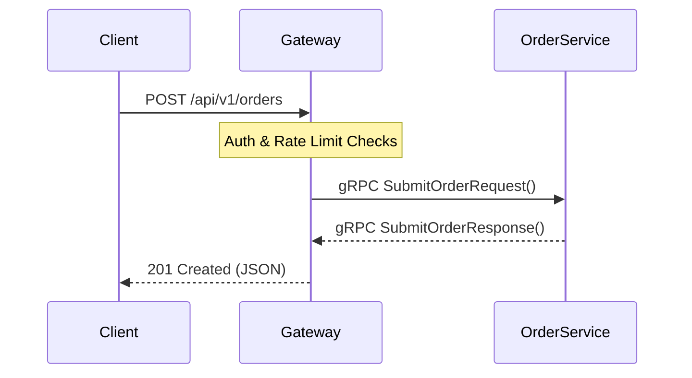
```mermaid
sequenceDiagram
    Client->>Gateway: POST /api/v1/orders
    Note over Gateway: Auth & Rate Limit Checks
    Gateway->>OrderService: gRPC SubmitOrderRequest()
    OrderService-->>Gateway: gRPC SubmitOrderResponse()
    Gateway-->>Client: 201 Created (JSON)
```

## Design Decisions
Build a custom Go-based API Gateway using `grpc-gateway` to compile protobuf contracts directly into JSON-REST endpoints, minimizing translation overhead.

---

# 6. Service Discovery

## Purpose
Service Discovery allows microservices in a dynamic cloud environment to locate and communicate with each other without hardcoding IP addresses.

## What is it?
Service Discovery consists of two main parts:
1. **Service Registry:** A database storing the current IP addresses and ports of all active service instances.
2. **Discovery Mechanism:** Client-side or Server-side lookup logic querying the registry to find target endpoints.

## Where is it used?
Used internally within the private network to manage gRPC and HTTP communication between microservices.

## Why TradeDrift needs it
TradeDrift microservices run inside a containerized cluster where pods are created, destroyed, and rescheduled dynamically. Service Discovery ensures the Order Service can locate the Wallet Service's active instances without static configuration files.

## How it works
1. **Registration:** On startup, a microservice instance publishes its name, IP, and port to the Service Registry.
2. **Health Check:** The registry sends regular heartbeat pings to the instance; if it fails to respond, the instance is removed.
3. **Resolution:** When Service A needs to call Service B, it queries the Registry to get B's active IPs.
4. **Execution:** Service A calls Service B directly using one of the returned IP addresses.

## Types
* **Client-Side Discovery:** The calling client queries the registry directly, performs load balancing, and calls the destination node.
* **Server-Side Discovery (Kubernetes Services):** The caller sends requests to a stable proxy server (e.g. ClusterIP), which queries the registry (DNS) and forwards the request to an available instance.

## Configuration / Best Practices
* **Use Kubernetes DNS:** Leverage native Kubernetes CoreDNS for platform service discovery, avoiding the operational overhead of managing external Consul or Eureka clusters.
* **Short Cache TTLs:** Ensure DNS caching within microservices is set to low values to prevent traffic from hitting decommissioned IP addresses.

## Failure Scenarios
If the discovery registry fails, microservices cannot find each other, halting internal communication. Mitigation requires using highly available, distributed registries like etc.d or ZooKeeper (built into Kubernetes control planes) with multi-node consensus algorithms (Raft).

## Advantages
* Automates dynamic scaling and updates.
* Enables routing based on service health.
* Decouples service logic from infrastructure topology.

## Limitations
* Adds DNS lookups or proxy hop overhead.
* Registry replication lag can cause temporary routing failures to dead nodes.

## TradeDrift Architecture Placement
```
Order Service ──(Lookup: wallet-service)──► [Service Registry (K8s CoreDNS)]
      │                                                │
      └──(grpc Call to Resolved IP)◄───────────────────┘
```

## Diagram
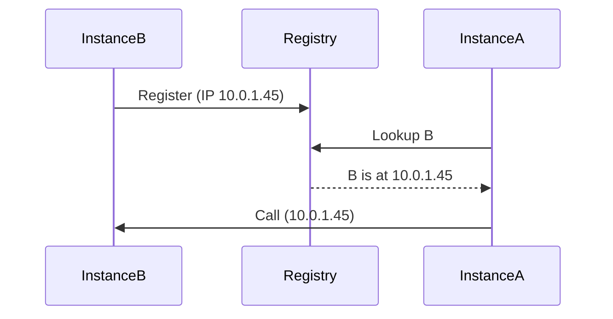
```mermaid
sequenceDiagram
    InstanceB->>Registry: Register (IP 10.0.1.45)
    InstanceA->>Registry: Lookup B
    Registry-->>InstanceA: B is at 10.0.1.45
    InstanceA->>InstanceB: Call (10.0.1.45)
```

## Design Decisions
Use native Kubernetes CoreDNS and Server-Side Load Balancing (ClusterIP Services) to simplify routing and avoid client-side discovery logic overhead.

---

# 7. Network Communication (HTTP, HTTPS, HTTP/2, gRPC, TCP, TLS)

## Purpose
Network Communication protocols define the rules for data transmission across the platform, establishing secure, reliable, and high-performance transport channels.

## What is it?
This stack represents layers 4 to 7 of the OSI model:
* **TCP:** Connection-oriented Layer 4 transport protocol ensuring ordered packet delivery.
* **TLS:** Layer 5 security protocol providing encryption and identity verification.
* **HTTP/HTTPS:** Layer 7 application protocols for client-server communication.
* **HTTP/2:** Upgraded HTTP protocol supporting multiplexing and header compression.
* **gRPC:** High-performance Layer 7 Remote Procedure Call framework running over HTTP/2.

## Where is it used?
* **TCP/TLS:** Base protocol for all external client HTTPS and WebSocket connections.
* **HTTP/HTTPS:** Client-to-API Gateway REST endpoints.
* **gRPC:** Microservice-to-microservice internal communications.

## Why TradeDrift needs it
TradeDrift requires low-latency execution for order processing and secure connections for financial transactions. We use external HTTPS for client APIs, WebSockets for live market feeds, and internal gRPC to minimize latency between services.

## Comparison of Protocol Tiers

| Protocol | Transport | Latency | Overhead | Multiplexing | Typical Use Case |
|---|---|---|---|---|---|
| **HTTP/1.1** | TCP / TLS | Moderate | High (text headers) | No (Head-of-Line blocking) | Legacy web API |
| **HTTP/2** | TCP / TLS | Low | Low (binary framing) | Yes (single connection) | Internal microservices |
| **gRPC** | HTTP/2 | Very Low | Minimal (Protobuf binary) | Yes | High-performance RPC |

## Configuration / Best Practices
* **gRPC Keepalives:** Configure keepalive pings to prevent load balancers from cutting idle internal connections.
* **TLS Cipher Suites:** Restrict external TLS to **TLS 1.3** to eliminate insecure legacy ciphers.

## Failure Scenarios
* **Packet Loss:** Causes TCP socket retransmissions, increasing tail latency. Mitigation: Optimize Linux TCP buffer sizes.
* **TLS Handshake Failures:** Occurs when certificates expire or ciphers mismatch. Mitigation: Automate certificate renewal (e.g. Let's Encrypt / Cert-Manager).

## Advantages
* **gRPC:** High throughput, low CPU overhead, and static contract typing.
* **HTTP/2:** Single connection multiplexing reduces connection handshakes.

## Limitations
* gRPC is hard to inspect directly with standard network diagnostics tools.
* TLS introduces negotiation latency on initial connection.

## TradeDrift Architecture Placement
```
Client ──(HTTPS/REST/WS)──► API Gateway ──(gRPC / HTTP2)──► Microservices
```

## Diagram
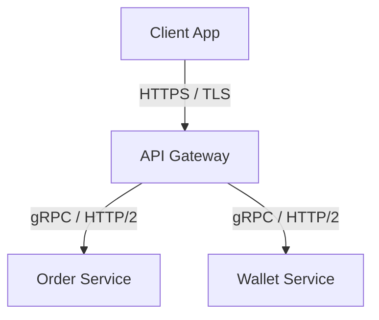
```mermaid
graph TD
    Client[Client App] -->|HTTPS / TLS| GW[API Gateway]
    GW -->|gRPC / HTTP/2| ServiceA[Order Service]
    GW -->|gRPC / HTTP/2| ServiceB[Wallet Service]
```

## Design Decisions
Standardize on gRPC (Protobuf binary serialization) for internal service-to-service communication to reduce serialization overhead and latency compared to JSON-over-HTTP.

---

# 8. Caching Layers

## Purpose
Caching layers store copy data in fast memory to serve read requests quickly, protecting primary databases from read overload and improving response times.

## What is it?
From first principles, a caching layer is a high-speed data access system. It stores subset query results in memory (RAM), avoiding the need to execute expensive disk operations or complex computations.

## Where is it used?
Across multiple architectural boundaries:
1. **Client Cache:** Browser/Local Storage caching config data.
2. **CDN Cache:** Edge server caching static assets.
3. **Database Cache:** Redis caching active trade pairs, user balances, and session metadata.

## Why TradeDrift needs it
Executing SQL queries to rebuild L2 orderbooks or active market statistics on every request would degrade PostgreSQL performance under load. TradeDrift uses Redis caches to store ticker metrics and L2 snapshots, serving public queries instantly without database hits.

## How it works
1. **Request:** The application receives a request for a resource.
2. **Cache Read (Query):** The app checks the Cache.
3. **Cache Hit:** If found, the data is returned directly.
4. **Cache Miss:** If not found, the app queries the primary database, stores the result in the cache, and returns it to the client.

## Caching Strategy Comparison

| Strategy | Write Path | Read Path | Advantages | Disadvantages |
|---|---|---|---|---|
| **Cache-Aside** | Write directly to DB. | Check cache; on miss, read from DB and write to cache. | Simple; safe from cache pollution. | Potential stale data if DB updates directly. |
| **Write-Through** | Write to cache first; cache synchronously writes to DB. | Check cache; serve on hit. | Cache always current. | High write latency. |
| **Write-Behind (Write-Back)** | Write to cache first; cache asynchronously writes to DB in batches. | Check cache; serve on hit. | Low write latency; writes are batched. | Data loss risk on cache crash before DB write. |

## Configuration / Best Practices
* **Cache Expirations (TTLs):** Set explicit TTLs on all cached items to prevent stale data.
* **Eviction Policies:** Use **LRU (Least Recently Used)** for general API caches.

## Failure Scenarios
* **Cache Stampede (Thundering Herd):** Concurrent requests hit a cache miss simultaneously, overloading the database. Mitigation: Use **Go Singleflight** to collapse concurrent calls into a single query.
* **Cache Penetration:** Requests for non-existent keys bypass the cache to hit the DB. Mitigation: Store empty/null placeholders with short TTLs or use Bloom Filters.

## Advantages
* Drastically reduces primary database read load.
* Delivers sub-millisecond read response times.

## Limitations
* Introduces cache invalidation complexity.
* Increases infrastructure cost (RAM is expensive).

## TradeDrift Architecture Placement
```
Client ──► API Gateway ──► Service ──(1. Check Cache)──► [Redis Cache]
                             │
                             └──(2. Cache Miss: DB)──► [PostgreSQL]
```

## Diagram
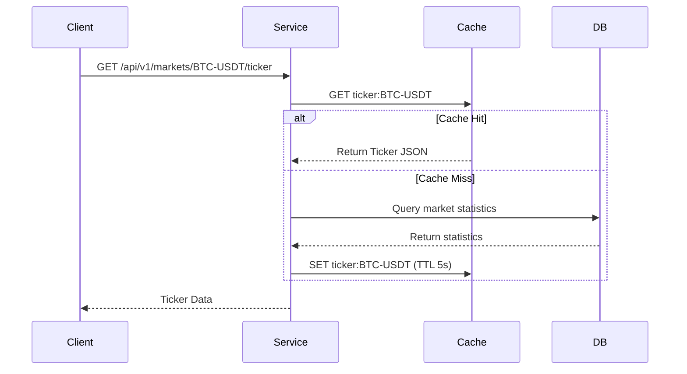
```mermaid
sequenceDiagram
    Client->>Service: GET /api/v1/markets/BTC-USDT/ticker
    Service->>Cache: GET ticker:BTC-USDT
    alt Cache Hit
        Cache-->>Service: Return Ticker JSON
    else Cache Miss
        Service->>DB: Query market statistics
        DB-->>Service: Return statistics
        Service->>Cache: SET ticker:BTC-USDT (TTL 5s)
    end
    Service-->>Client: Ticker Data
```

## Design Decisions
Use a Cache-Aside strategy using Redis Sentinel clusters for public query paths (tickers, orderbook snapshots), while maintaining a strict zero-cache policy on the core double-entry wallet ledger to prevent stale balance readings.

---

# 9. Redis Cache

## Purpose
Redis (Remote Dictionary Server) acts as a high-performance, in-memory, key-value data store used as a database, cache, message broker, and queue.

## What is it?
Redis is an in-memory database that stores data in RAM for sub-millisecond read and write execution. It is single-threaded at its core, eliminating concurrency conflicts, and supports complex data structures (Strings, Hashes, Lists, Sets, Sorted Sets).

## Where is it used?
Redis is positioned behind the microservices, acting as a shared caching layer and session blacklist store.

## Why TradeDrift needs it
TradeDrift uses Redis to cache:
- **L2 Orderbooks:** The Matching Engine writes L2 aggregate updates to Redis, enabling the Market Service to serve orderbook queries instantly.
- **Active Session Blacklists:** Access token revocations are stored in Redis (`JTI` blacklist) for gateway-level authentication validation.
- **Rate-Limiting States:** The API Gateway runs a Redis Lua script to track IP and user request counts.

## How it works
1. **Command Processing:** Redis receives commands over a TCP socket.
2. **Memory Execution:** Commands are executed sequentially in memory.
3. **Persistence (Optional):** Changes are asynchronously written to disk using Append Only File (AOF) or Redis Database (RDB) snapshots to prevent data loss.

## Configuration / Best Practices
* **Redis Sentinel:** Deploy in a Sentinel topology to automate failover and maintain high availability.
* **Memory Limit:** Configure `maxmemory` and set the eviction policy to `volatile-lru` or `allkeys-lru`.

## Failure Scenarios
* **Cluster Outage:** If Redis goes down, microservices fallback to PostgreSQL, which can overload the database. Mitigation: Implement rate limits on database fallbacks and use Redis replicas.

## Advantages
* Sub-millisecond performance.
* Rich data structures (e.g., Sorted Sets for time-series and leaderboards).
* Single-threaded execution guarantees atomic commands.

## Limitations
* Limited by physical RAM size.
* AOF persistence can introduce latency spikes under heavy write load.

## TradeDrift Architecture Placement
```
Microservices ──► [Redis Cluster (Master + Replicas)]
```

## Diagram
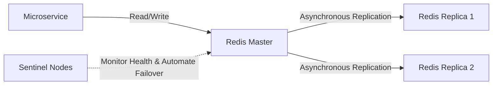
```mermaid
graph LR
    Service[Microservice] -->|Read/Write| Master[Redis Master]
    Master -->|Asynchronous Replication| Replica1[Redis Replica 1]
    Master -->|Asynchronous Replication| Replica2[Redis Replica 2]
    Sentinel[Sentinel Nodes] -.->|Monitor Health & Automate Failover| Master
```

## Design Decisions
Use Redis Sentinel clusters with RDB+AOF persistence enabled for session blacklists, while using non-persistent (RAM-only) Redis instances for transient L2 orderbook feeds to maximize throughput.

---

# 10. Connection Pooling

## Purpose
Connection Pooling reduces database CPU and memory overhead by maintaining a reusable pool of active database connections, avoiding the cost of establishing a new connection on every query.

## What is it?
From first principles, establishing a database connection requires a TCP handshake and SSL/TLS negotiation, which takes time and consumes resources. A Connection Pool keeps a set of active connections open. When a query is run, the application leases an active connection from the pool, executes the query, and returns the connection to the pool.

```
[ Application Thread ] ──(Lease Connection)──► [ Connection Pool ] ──► [ Database Server ]
```

## Where is it used?
Inside every microservice that communicates with a SQL database (PostgreSQL) or a cache (Redis).

## Why TradeDrift needs it
TradeDrift microservices execute concurrent database operations. Without connection pooling, spawning a new TCP connection to PostgreSQL on every order placement or wallet transaction would saturate PostgreSQL process limits, causing latency spikes and connection failures.

## How it works
1. **Initialization:** The application starts and creates a pool of database connections up to `MinConnections`.
2. **Lease:** A database query request arrives. The driver leases an idle connection from the pool.
3. **Execution:** The application executes the SQL query.
4. **Return:** The connection is returned to the pool, remaining active for the next request.
5. **Clean up:** If connections remain idle longer than `MaxIdleTime`, they are closed to release database resources.

## Configuration / Best Practices
* **Max Connections:** Set the pool maximum limit based on the database capacity. Example formula:
  $$\text{MaxConnectionsPerPool} = \frac{\text{PostgresMaxConnections}}{\text{ActiveServicePods}}$$
* **PgBouncer:** Use a database-side connection pooler like PgBouncer in front of PostgreSQL to handle thousands of concurrent client connections.

## Failure Scenarios
* **Pool Exhaustion:** If all connections are leased, subsequent queries block until a connection is returned. If they exceed the queue timeout, they fail. Mitigation: Optimize query execution times, adjust connection pool sizes, and configure query timeouts.

## Advantages
* Eliminates TCP/TLS connection handshake latency on queries.
* Limits database resource utilization.

## Limitations
* Active idle connections consume database memory.
* If a pool size is set too large, concurrent services can exhaust database connection limits.

## TradeDrift Architecture Placement
```
Microservice (Go) ──(Pool Manager)──► [PgBouncer Proxy] ──► [PostgreSQL]
```

## Diagram
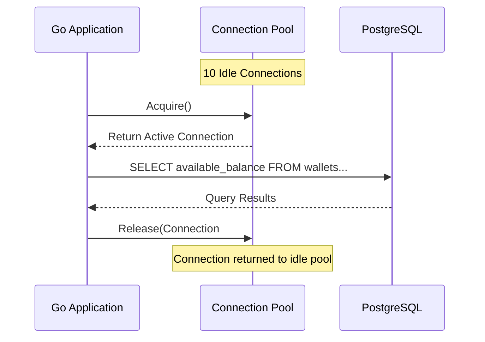
```mermaid
sequenceDiagram
    participant App as Go Application
    participant Pool as Connection Pool
    participant DB as PostgreSQL
    Note over Pool: 10 Idle Connections
    App->>Pool: Acquire()
    Pool-->>App: Return Active Connection #3
    App->>DB: SELECT available_balance FROM wallets...
    DB-->>App: Query Results
    App->>Pool: Release(Connection #3)
    Note over Pool: Connection returned to idle pool
```

## Design Decisions
Implement PgBouncer in transaction mode in front of PostgreSQL to scale connection capabilities while limiting database-side process memory consumption.

---

# 11. Rate Limiting

## Purpose
Rate Limiting protects internal services from abuse, system overload, and denial-of-service (DDoS) attacks by restricting the number of requests a client can make within a given timeframe.

## What is it?
Rate Limiting defines a threshold check: "Has this client identity (IP, User ID, or API Key) sent more than $N$ requests in the last $T$ seconds?" If yes, subsequent requests are rejected before consuming downstream resources.

## Where is it used?
Typically enforced at the API Gateway layer to block excessive traffic at the edge of the internal network.

## Why TradeDrift needs it
Automated trading bots can generate high traffic volumes. Rate limiting protects TradeDrift's matching engine and database from being overloaded by misconfigured client loops.

## How it works (Token Bucket Algorithm)
1. **Request Ingress:** A request arrives at the API Gateway.
2. **Identify Client:** The Gateway extracts the client identifier (e.g. IP or Authorization User ID).
3. **Read Bucket:** Queries Redis for the client's current token count.
4. **Token Verification:**
   - If token count $> 0$, decrement the count, save the update to Redis, and forward the request.
   - If token count $= 0$, reject the request with `HTTP 429 Too Many Requests`.
5. **Replenish Bucket:** Tokens are added back to the bucket at a fixed rate over time up to the maximum bucket capacity.

## Rate Limiting Algorithms

| Algorithm | Mechanism | Advantages | Disadvantages |
|---|---|---|---|
| **Fixed Window** | Counts requests in fixed time windows (e.g., minutes). | Very low memory overhead. | Traffic spikes at window boundaries can double the rate limit. |
| **Sliding Window Log** | Stores timestamps for every request in a sorted set. | Highly accurate; no window boundary spikes. | High memory usage (stores every request timestamp). |
| **Token Bucket** | Tokens accumulate in a bucket up to a maximum; requests consume tokens. | Allows burst traffic while maintaining a steady average rate. | Requires state updates on every request. |

## Configuration / Best Practices
* **Enforce at the Edge:** Rejects requests at the API Gateway layer to avoid downstream service load.
* **Return Headers:** Include rate limit status headers in HTTP responses:
  ```http
  X-RateLimit-Limit: 100
  X-RateLimit-Remaining: 95
  X-RateLimit-Reset: 1718000000
  ```

## Failure Scenarios
* **Redis Cache Outage:** If Redis goes down, the rate limiter can default-open (allowing all traffic, risking database overload) or default-closed (blocking all requests, causing an outage). Mitigation: Fallback to local API Gateway memory rate limiters on Redis connection failure.

## Advantages
* Protects database and CPU from overload.
* Enforces fair resource sharing among users.
* Helps mitigate application-layer DDoS attacks.

## Limitations
* Requires shared cache state (Redis), adding latency to the request path.
* Legitimate high-frequency clients may experience false rejections.

## TradeDrift Architecture Placement
```
Client ──► API Gateway ──(Check/Update Token Bucket)──► [Redis Rate-Limit Store]
             │
             └──(Passed)──► Downstream Services
```

## Diagram
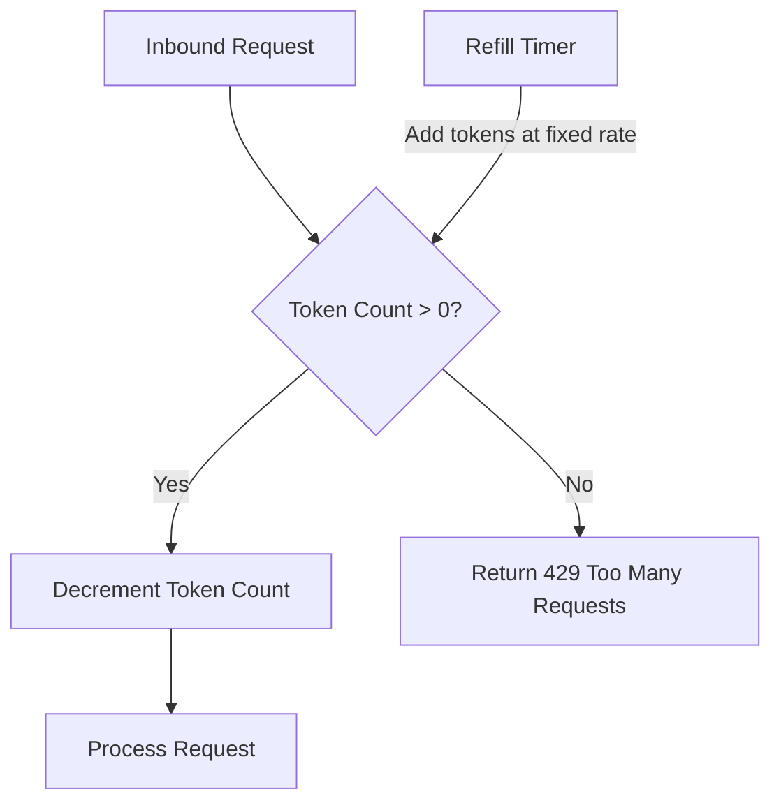
```mermaid
graph TD
    Request[Inbound Request] --> Limiter{Token Count > 0?}
    Limiter -->|Yes| Decrement[Decrement Token Count]
    Decrement --> Process[Process Request]
    Limiter -->|No| Reject[Return 429 Too Many Requests]
    Refiller[Refill Timer] -->|Add tokens at fixed rate| Limiter
```

## Design Decisions
Implement the **Token Bucket** algorithm inside the API Gateway using a Redis Lua script to check and decrement token counts atomically in a single round-trip.

---

# 12. Circuit Breaker

## Purpose
A Circuit Breaker prevents system failures from cascading across microservices by quickly failing requests to an unhealthy service, allowing it time to recover instead of saturating resources with retries.

## What is it?
From first principles, a Circuit Breaker is an application-level state machine wrapper around network calls. It operates in three states:
1. **Closed:** Requests pass through normally. If failures exceed a threshold, it transitions to *Open*.
2. **Open:** Requests fail immediately with a local error, bypassing the target service.
3. **Half-Open:** After a cooldown period, a limited number of test requests are allowed through. If they succeed, it returns to *Closed*; if any fail, it returns to *Open*.

## Where is it used?
Enforced on client-side HTTP/gRPC callers inside microservices when making synchronous calls to downstream services.

## Why TradeDrift needs it
If the Wallet Service experiences a database lock slowdown, incoming orders from the Order Service calling `ReserveFunds` will build up, exhausting Go goroutines and thread pools. A Circuit Breaker trips the `ReserveFunds` call immediately, returning an error to the user and protecting the Order Service from resource exhaustion.

## How it works
1. **Closed State:** The caller tracks the failure rate of downstream calls over a sliding window.
2. **Tripping:** If the error rate exceeds the threshold (e.g. 50% failures over 10 seconds), the circuit transitions to **Open**.
3. **Bypassing:** All subsequent calls fail instantly with a `CIRCUIT_OPEN` error, bypassing the network hop.
4. **Cooldown:** After a set time (e.g. 30 seconds), the circuit transitions to **Half-Open**.
5. **Recovery:** The caller sends a limited amount of test traffic. If the test calls succeed, the circuit closes; if they fail, the circuit returns to the Open state.

## Diagram
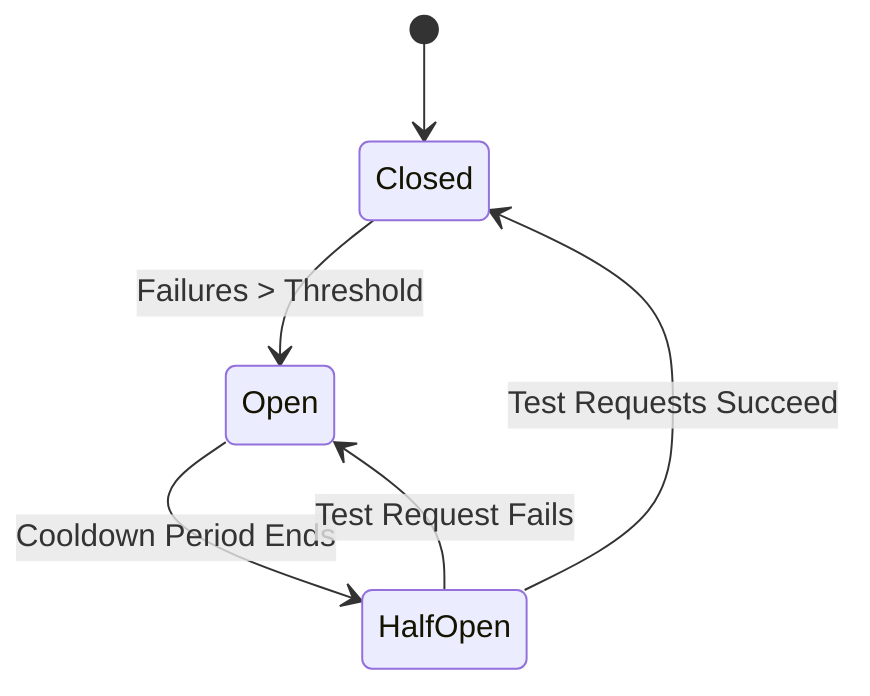
```mermaid
stateDiagram-v2
    [*] --> Closed
    Closed --> Open : Failures > Threshold
    Open --> HalfOpen : Cooldown Period Ends
    HalfOpen --> Closed : Test Requests Succeed
    HalfOpen --> Open : Test Request Fails
```

## Configuration / Best Practices
* **Do Not Use for Idempotent Writes:** Avoid using circuit breakers on critical ledger settlement mutations where failing fast could leave the system in an inconsistent state.
* **Failure Definitions:** Configure circuit breakers to ignore user-validation errors (e.g. `400 Bad Request` or `401 Unauthorized`) and only trigger on network timeouts, socket drops, or `5xx` server errors.

## Failure Scenarios
* **State Sync Failure:** If replica instances of a service maintain independent circuit breaker states, one node may trip while another continues to send requests to an unhealthy backend. Mitigation: Use local, in-memory circuit breaker states (e.g. using Netflix Hystrix or Go-resiliency libraries) to keep service instances independent and resilient.

## Advantages
* Prevents failures from cascading across the platform.
* Automatically recovers when downstream services stabilize.
* Saves resources by avoiding useless network calls.

## Limitations
* Hard to configure optimal thresholds and cooldown intervals.
* Clients must be designed to handle fast-failing fallback responses.

## TradeDrift Architecture Placement
```
Order Service ──► [Circuit Breaker Wrapper] ──(gRPC ReserveFunds)──► Wallet Service
```

## Design Decisions
Implement in-memory circuit breakers on the Order Service's outgoing gRPC client to the Wallet Service, with a 50% failure rate threshold over a 10-second sliding window.

---

# 13. Retry Strategy

## Purpose
A Retry Strategy increases system resilience by automatically re-sending failed network requests caused by transient glitches, such as temporary packet loss or short database lock conflicts.

## What is it?
From first principles, a Retry Strategy intercepts execution errors. Instead of failing immediately, it waits for a short period and attempts the operation again.

## Where is it used?
* **Synchronous Clients:** Within HTTP/gRPC client configurations.
* **Asynchronous Workers:** Inside database outbox publishers and event consumers (e.g., Settlement Service reading from Kafka).

## Why TradeDrift needs it
During periods of high trading activity, database updates may hit temporary locking conflicts (e.g., PostgreSQL serialization conflicts). Rather than returning an error to the user, a Retry Strategy automatically retries the operation, resolving the conflict transparently.

## How it works (Exponential Backoff with Jitter)
1. **Network Attempt:** The client sends a request.
2. **Transient Failure:** The request fails due to a network glitch or lock timeout.
3. **Wait Calculation:** Calculate backoff delay with exponential growth and random jitter:
   $$\text{Delay} = 2^{\text{attempt}} \times \text{BaseDelay} + \text{random\_jitter}$$
4. **Retry Loop:** Wait for the calculated delay and retry. Repeat up to `MaxAttempts`.
5. **Abort:** If all attempts fail, return the error to the caller.

## Configuration / Best Practices
* **Idempotency is Mandatory:** Never retry non-idempotent operations (e.g., order creation without an `Idempotency-Key` or database balance debits) to prevent duplicate executions.
* **Add Jitter:** Always introduce random jitter to prevent all failing clients from retrying at the exact same millisecond, causing a "thundering herd" load spike on the destination service.

## Failure Scenarios
* **Infinite Loops:** Retrying non-transient errors (such as `400 Bad Request` or database constraint violations) will exhaust resources. Mitigation: Restrict retries exclusively to network connectivity issues or transient SQL errors (e.g. PostgreSQL error code `40001` - Serialization Failure).

## Advantages
* Resolves transient network errors transparently.
* Improves overall platform success metrics.

## Limitations
* Increases request latency on failures.
* Can worsen downstream service overload if retries are not throttled.

## TradeDrift Architecture Placement
```
Consumer/Client ──► [Retry Manager (Backoff + Jitter)] ──► Target Service
```

## Diagram
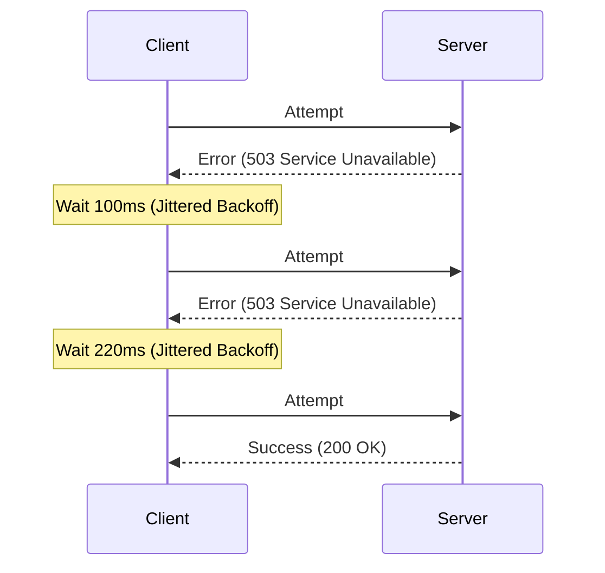
```mermaid
sequenceDiagram
    participant Client
    participant Server
    Client->>Server: Attempt #1
    Server-->>Client: Error (503 Service Unavailable)
    Note over Client: Wait 100ms (Jittered Backoff)
    Client->>Server: Attempt #2
    Server-->>Client: Error (503 Service Unavailable)
    Note over Client: Wait 220ms (Jittered Backoff)
    Client->>Server: Attempt #3
    Server-->>Client: Success (200 OK)
```

## Design Decisions
Standardize on **Exponential Backoff with Jitter** for all internal gRPC clients and Kafka consumers, restricting retries to a maximum of 3 attempts with a base delay of 50ms and a max delay of 1,000ms.

---

# 14. Timeout Strategy

## Purpose
A Timeout Strategy protects system resources by ensuring that a network request is abandoned if it takes too long to respond, preventing threads or goroutines from waiting indefinitely on hanging connections.

## What is it?
From first principles, a Timeout Strategy sets a strict deadline on a connection or request. If the destination service does not respond within this window, the caller aborts the socket connection, releases local memory, and returns a timeout error.

## Where is it used?
Across all client HTTP connections, internal gRPC calls, and database operations.

## Why TradeDrift needs it
If the Wallet Service becomes unresponsive due to a network partition, the Order Service must not wait indefinitely for the `ReserveFunds` call to return. Applying a timeout ensures the Order Service can quickly release resources (goroutines) to process other orders.

## How it works (Go Context)
1. **Initiation:** The caller wraps the request inside a Go Context with a deadline:
   ```go
   ctx, cancel := context.WithTimeout(context.Background(), 2000*time.Millisecond)
   defer cancel()
   ```
2. **Forwarding:** The context is passed along the call stack and propagated through network calls (e.g., inside gRPC metadata headers).
3. **Execution:** Downstream services and databases monitor the context channel (`<-ctx.Done()`).
4. **Abort:** If the execution time exceeds 2,000ms, the context cancels, halting the database transaction and returning a `DeadlineExceeded` error up the call stack.

## Configuration / Best Practices
* **Symmetric Deadlines:** Match timeouts to service SLAs. Standard internal gRPC deadlines are **2,000ms**; database queries are capped at **5,000ms**.
* **Clean up Resources:** Always invoke the context cancel function (`defer cancel()`) to release allocated OS threads and buffers.

## Failure Scenarios
* **Hanging Connections:** Missing timeouts on third-party HTTP clients can cause thread pools to fill up with blocked connections, eventually crashing the host service. Mitigation: Configure explicit timeouts at all connection boundaries (connect timeout, read timeout, write timeout).

## Advantages
* Prevents resource leakage from slow connections.
* Defines predictable latency boundaries (SLA).

## Limitations
* Abandoning requests early can cause data inconsistency if the downstream mutation completes after the timeout. (This requires idempotent endpoints and reconciliation loops).

## TradeDrift Architecture Placement
```
Order Service ──(Context Timeout: 2s)──► [gRPC Call] ──► Wallet Service
```

## Diagram
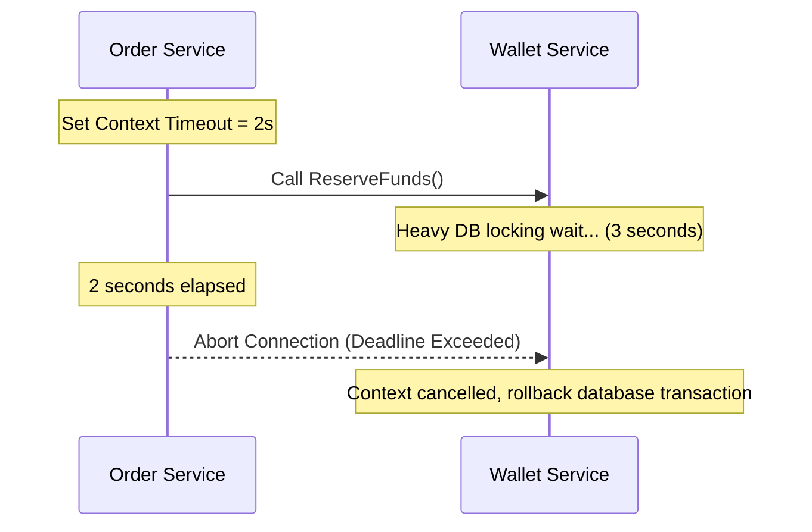
```mermaid
sequenceDiagram
    participant Caller as Order Service
    participant Target as Wallet Service
    Note over Caller: Set Context Timeout = 2s
    Caller->>Target: Call ReserveFunds()
    Note over Target: Heavy DB locking wait... (3 seconds)
    Note over Caller: 2 seconds elapsed
    Caller-->>Target: Abort Connection (Deadline Exceeded)
    Note over Target: Context cancelled, rollback database transaction
```

## Design Decisions
Configure Go context deadlines across all gRPC handlers, capping service-to-service calls at a maximum timeout of 2.0 seconds.

---

# 15. Health Checks (Liveness, Readiness, Startup)

## Purpose
Health Checks allow container orchestration systems (like Kubernetes) to monitor service health, automatically restarting dead instances and directing traffic away from overloaded or disconnected services.

## What is it?
From first principles, Health Checks are diagnostic HTTP/gRPC endpoints exposed by microservices, returning HTTP status codes representing their current state.

```
                  ┌──► GET /live   ──► Status 200 OK (Process Running)
[ Kubernetes ] ───┼──► GET /ready  ──► Status 503 Service Unavailable (DB Connection Lost)
                  └──► GET /startup──► Status 200 OK (Config loaded, ready for probes)
```

## Where is it used?
Exposed by every microservice and audited regularly by the Kubernetes kubelet daemon.

## Why TradeDrift needs it
TradeDrift runs inside a containerized cluster. If a service instance (e.g., the Portfolio Service) loses its connection to PostgreSQL, it cannot serve requests. The health system detects this, removes the unhealthy instance from the load balancer routing pool, and routes requests to healthy replicas instead.

## Probe Types

* **Startup Probe:** Validates that the application has finished launching (e.g., loading config files or caches). All other probes are paused until this succeeds.
* **Liveness Probe:** Checks if the service process is running. If it fails, Kubernetes kills and restarts the container.
* **Readiness Probe:** Checks if the service can handle incoming traffic (e.g., has active database and message broker connections). If it fails, the container is removed from the load balancer pool, stopping new traffic from hitting it.

## Configuration / Best Practices
* **Lightweight Probes:** Keep checks lightweight. Do not execute heavy SQL operations (e.g. `SELECT COUNT(*)`); instead, run simple database pings (e.g. `SELECT 1`).
* **Configure Failures:** Set `failureThreshold: 3` and `periodSeconds: 10` to avoid restarting containers during brief network hiccups.

## Failure Scenarios
* **Deadlock Probes:** If a health check queries a database that is locked, the check will hang, causing Kubernetes to falsely restart the container. Mitigation: Configure short timeouts on health check database calls.

## Advantages
* Enables automated container recovery.
* Prevents traffic from hitting dead or disconnected containers.
* Supports zero-downtime rolling deployments.

## Limitations
* Misconfigured probes can trigger infinite restart loops.
* Health check requests add noise to logs if not filtered.

## TradeDrift Architecture Placement
```
Kubernetes Kubelet ──(Poll diagnostic probes)──► Microservice [HTTP Gateway]
```

## Diagram
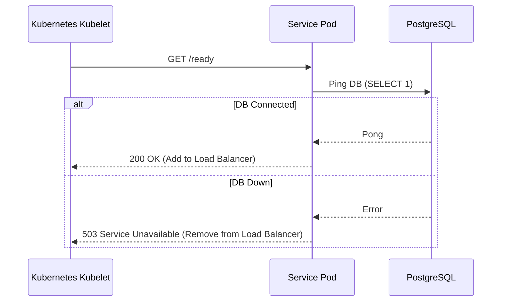
```mermaid
sequenceDiagram
    participant K8s as Kubernetes Kubelet
    participant Pod as Service Pod
    participant DB as PostgreSQL
    K8s->>Pod: GET /ready
    Pod->>DB: Ping DB (SELECT 1)
    alt DB Connected
        DB-->>Pod: Pong
        Pod-->>K8s: 200 OK (Add to Load Balancer)
    else DB Down
        DB-->>Pod: Error
        Pod-->>K8s: 503 Service Unavailable (Remove from Load Balancer)
    end
```

## Design Decisions
Expose dedicated, stateless diagnostic endpoints (`/live`, `/ready`, `/health`) on a separate administrative port (e.g. `8081`) to prevent public users from probing system internals.

---

# 16. Horizontal Scaling

## Purpose
Horizontal Scaling allows the platform to handle increased load by adding more application instances (nodes/pods), rather than upgrading the CPU or RAM of existing servers.

## What is it?
From first principles, Horizontal Scaling is scale-out. A load balancer distributes client traffic across $N$ running replicas of a service. As load increases, the system dynamically spins up additional replicas, adjusting $N \rightarrow N+x$.

## Where is it used?
Applied to stateless application services (API Gateway, Authentication Service, Order Service, etc.) running inside the Kubernetes cluster.

## Why TradeDrift needs it
Cryptocurrency markets experience sudden, high volume traffic spikes. Horizontal scaling allows TradeDrift to automatically spin up additional API Gateways and Order Services to handle the load, scaling back down when volume decreases to save costs.

## How it works
1. **Monitoring:** The Kubernetes Horizontal Pod Autoscaler (HPA) monitors CPU and memory usage.
2. **Scaling Trigger:** Average CPU usage exceeds the defined threshold (e.g., 70% CPU usage).
3. **Instance Provisioning:** HPA launches new container instances.
4. **Service Discovery Registry:** The new pods register their IPs with CoreDNS.
5. **Load Balancing:** The Load Balancer begins routing requests to the new instances.

## Comparison

| Metric | Horizontal Scaling (Scale-Out) | Vertical Scaling (Scale-Up) |
|---|---|---|
| **Mechanism** | Add more server instances. | Increase CPU/RAM on existing servers. |
| **Downtime** | Zero (rolling updates). | Requires a restart (temporary downtime). |
| **Limitation** | Limited by database synchronization capacity. | Limited by maximum physical host hardware. |
| **Cost** | Pay-as-you-use pricing. | Exponential cost increases for high-spec servers. |

## Configuration / Best Practices
* **Keep Code Stateless:** Stateless application layers are easier to scale out since instances do not need to sync memory structures.
* **Graceful Shutdown:** Implement `SIGTERM` interception. Allow Go servers to finish active requests before exiting.

## Failure Scenarios
* **Database Bottleneck:** Scaling out stateless services increases the number of concurrent connections to the database, which can overload PostgreSQL. Mitigation: Use connection poolers (PgBouncer) and read replicas.

## Advantages
* Offers virtual scale limits.
* High redundancy (individual node failures don't cause outages).
* Cost-effective pay-as-you-use resource scaling.

## Limitations
* Adds service routing and deployment complexity.
* Cannot easily scale stateful nodes (like databases).

## TradeDrift Architecture Placement
```
Load Balancer ──► [ Pod 1 ] [ Pod 2 ] [ Pod 3 (HPA Added) ] ──► PostgreSQL
```

## Diagram
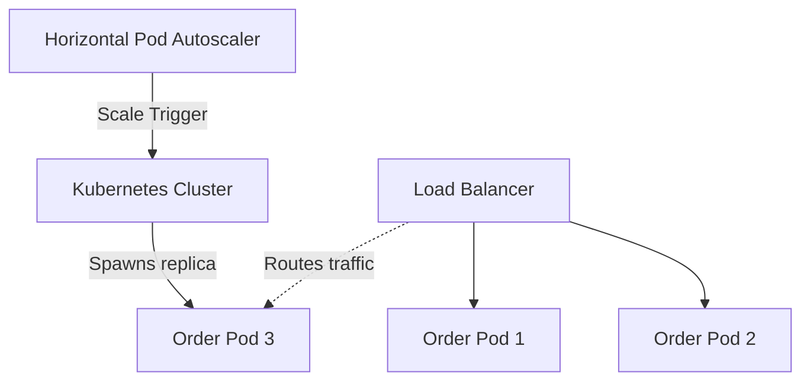
```mermaid
graph TD
    HPA[Horizontal Pod Autoscaler] -->|Scale Trigger| Cluster[Kubernetes Cluster]
    Cluster -->|Spawns replica| Pod3[Order Pod 3]
    LB[Load Balancer] --> Pod1[Order Pod 1]
    LB --> Pod2[Order Pod 2]
    LB -.->|Routes traffic| Pod3
```

## Design Decisions
Use stateless Go services in Kubernetes, managed by Horizontal Pod Autoscalers (HPAs) triggered when average CPU usage exceeds 70%.

---

# 17. Vertical Scaling

## Purpose
Vertical Scaling increases the capacity of the system by adding resources (CPU, RAM, disk, or network bandwidth) to a single server instance.

## What is it?
From first principles, Vertical Scaling is scale-up. It involves upgrading a server to a larger virtual machine size or hardware configuration (e.g., upgrading from 4 cores and 16GB RAM to 64 cores and 256GB RAM).

## Where is it used?
Applied to stateful, non-distributable components like the primary relational database (PostgreSQL) and the sequential Matching Engine.

## Why TradeDrift needs it
The Matching Engine processes orders sequentially in-memory to prevent race conditions and maintain strict execution FIFO ordering. Because this matching loop cannot be run concurrently across multiple nodes, it must run on a single instance with high single-core CPU speeds and fast RAM.

## How it works
1. **Assessment:** System monitors indicate the database or matching engine CPU/RAM is saturated.
2. **Shutdown:** The active instance is gracefully stopped (often during a maintenance window).
3. **Upgrade:** The cloud provider updates the instance configuration to a larger VM size.
4. **Startup:** The instance starts up with the new CPU and memory limits.

## Configuration / Best Practices
* **Single Thread Performance:** Choose CPU families with high single-core clock speeds (e.g. AMD EPYC or Intel Xeon Platinum) for sequential matching engines.
* **Database Tuning:** Adjust PostgreSQL settings (like `shared_buffers` and `effective_cache_size`) to leverage the upgraded RAM.

## Failure Scenarios
* **Hardware Ceiling:** If the system exhausts the maximum instance size offered by the cloud provider, it cannot scale further vertically. Mitigation: Implement application-level sharding (e.g. partitioning markets across separate matching engine instances).

## Advantages
* Simple implementation (no application code changes needed).
* Keeps data highly consistent by avoiding network partition concerns.

## Limitations
* Hardware scaling limits.
* Upgrading single instances often requires temporary downtime.
* High hardware costs for top-tier virtual machines.

## TradeDrift Architecture Placement
```
Order Service ──(Kafka)──► [ Matching Engine (Upgraded to High-CPU VM) ]
```

## Diagram
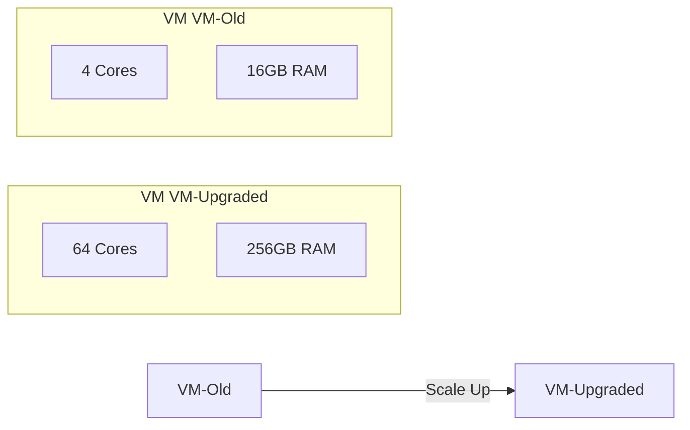
```mermaid
graph LR
    subgraph VM VM-Upgraded
        CPU[64 Cores]
        RAM[256GB RAM]
    end
    subgraph VM VM-Old
        cpu[4 Cores]
        ram[16GB RAM]
    end
    VM-Old -->|Scale Up| VM-Upgraded
```

## Design Decisions
Deploy the Matching Engine on high-CPU compute instances, using vertical scaling to ensure the sequential matching loop has sufficient resources.

---

# 18. High Availability (HA)

## Purpose
High Availability (HA) ensures that a system remains operational and accessible even during hardware failures, network partitions, or server crashes.

## What is it?
From first principles, High Availability is built on **redundancy** and **failover**. Redundancy ensures there is no single point of failure by running duplicate components across isolated infrastructure zones (Availability Zones). Failover is the automated process of routing traffic to healthy backup instances when a primary node fails.

```
                              ┌──► [ App Node 1 (AZ-A) ] (Active)
[ Traffic Ingress ] ── (LB) ──┼──► [ App Node 2 (AZ-B) ] (Active)
                              └──► [ App Node 3 (AZ-C) ] (Active)
```

## Where is it used?
Applied across every layer of the TradeDrift platform: DNS, Load Balancers, API Gateways, Microservices, Redis Caches, PostgreSQL databases, and Kafka message brokers.

## Why TradeDrift needs it
Trading platforms must operate 24/7. An outage during market volatility can result in significant financial losses. High Availability ensures that if a physical rack or data center availability zone fails, the system automatically redirects traffic to maintain service uptime.

## Configuration / Best Practices
* **Multi-AZ Deployments:** Run services across at least three independent availability zones.
* **Anti-Affinity Rules:** Configure Kubernetes schedules to ensure replica pods of the same service are not hosted on the same physical server.

## Failure Scenarios
* **AZ Outage:** A physical zone goes dark due to power or network failure. Mitigation: The load balancer automatically stops routing traffic to the failed zone, distributing the load across the remaining active zones.

## Advantages
* Drastically reduces system downtime.
* Enables maintenance and upgrades without service disruption.
* Prevents data center outages from causing system failures.

## Limitations
* Increases infrastructure costs.
* Data replication across zones introduces minor latency overhead.

## TradeDrift Architecture Placement
```
           Availability Zone A         Availability Zone B
         ┌─────────────────────┐     ┌─────────────────────┐
Ingress ─┼─► [ Order Service ] ├─────┼─► [ Order Service ] │
         │          │          │     │          │          │
         │   [ DB Primary ] ◄──┼─────┼───► [ DB Replica ]  │
         └─────────────────────┘     └─────────────────────┘
```

## Diagram
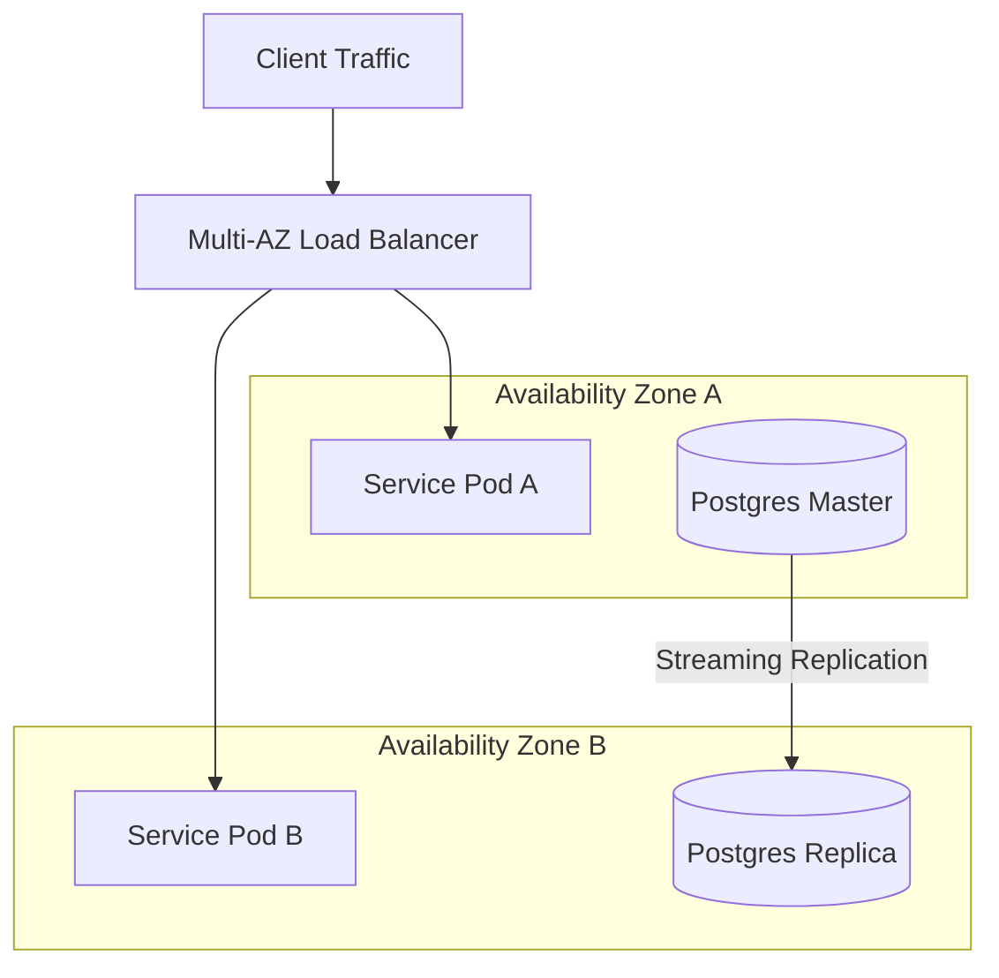
```mermaid
graph TD
    Client[Client Traffic] --> LB[Multi-AZ Load Balancer]
    subgraph AZ1 [Availability Zone A]
        NodeA[Service Pod A]
        DBMaster[(Postgres Master)]
    end
    subgraph AZ2 [Availability Zone B]
        NodeB[Service Pod B]
        DBReplica[(Postgres Replica)]
    end
    LB --> NodeA
    LB --> NodeB
    DBMaster -->|Streaming Replication| DBReplica
```

## Design Decisions
Run all services as Multi-AZ deployments with replication factors of 3 in Kafka, sentinel configurations in Redis, and active-passive replication in PostgreSQL.

---

# 19. Distributed Locking

## Purpose
Distributed Locking coordinates access to shared resources across independent nodes, preventing concurrent operations from causing data races and inconsistencies.

## What is it?
From first principles, a Distributed Lock is a mutual exclusion lock (Mutex) stored in a shared database or key-value store (like Redis or Consul). Nodes attempt to acquire the lock by writing a unique key with a lease timeout. If the key exists, other nodes are blocked from accessing the resource.

## Where is it used?
Inside microservice business logic when executing operations that must not run concurrently across nodes.

## Why TradeDrift needs it
If the Settlement Service runs multiple concurrent worker pods, they must not process the same executed trade simultaneously. A distributed lock ensures that only one worker pod processes a specific `trade_id` at a time, preventing duplicate ledger entries.

## How it works (Redlock Algorithm)
1. **Acquisition:** A worker generates a random string value (token) and attempts to write a key in Redis with a TTL:
   ```
   SET trade:018f67:lock <token> NX PX 10000
   ```
2. **nx Policy:** The `NX` option ensures the write succeeds only if the lock key does not exist.
3. **Lease:** If successful, the worker holds the lock for up to 10 seconds.
4. **Execution:** The worker processes the database settlement.
5. **Release:** The worker releases the lock using a Lua script that verifies the token matches before deleting the key, ensuring a worker only deletes its own lock.

## Configuration / Best Practices
* **Always Set TTL:** Never acquire a distributed lock without an expiration timeout, otherwise a crashed node could hold a lock indefinitely, blocking the system.
* **Lock Expiry Renewals:** For long running processes, implement a background renewal loop to extend the lock TTL while the worker is active.

## Failure Scenarios
* **Split Brain (Redis Master Outage):** If a master node crashes after granting a lock but before replicating it to replicas, a failover replica may grant the same lock to another worker. Mitigation: Use the **Redlock** algorithm, which requires acquiring locks from a majority (e.g. 3 out of 5) of independent Redis nodes.

## Advantages
* Prevents concurrent writes and data corruption.
* Synchronizes execution across dynamic containers.

## Limitations
* Relies on accurate system clocks.
* Adds latency to operations.

## TradeDrift Architecture Placement
```
Worker Pod 1 ──(Acquire Lock NX)──► [Redis Cluster] ◄──(Block: Lock exists)── Worker Pod 2
```

## Diagram
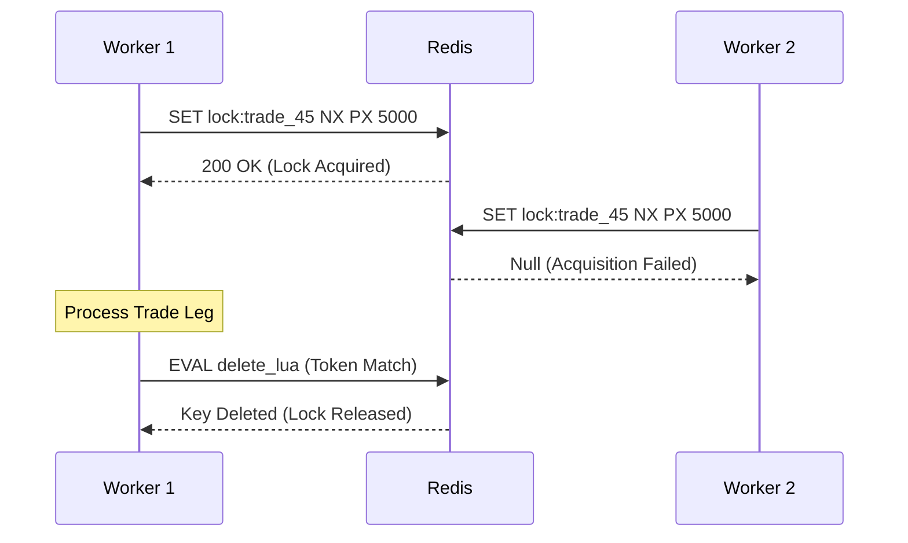
```mermaid
sequenceDiagram
    participant Worker 1
    participant Redis
    participant Worker 2
    Worker 1->>Redis: SET lock:trade_45 NX PX 5000
    Redis-->>Worker 1: 200 OK (Lock Acquired)
    Worker 2->>Redis: SET lock:trade_45 NX PX 5000
    Redis-->>Worker 2: Null (Acquisition Failed)
    Note over Worker 1: Process Trade Leg
    Worker 1->>Redis: EVAL delete_lua (Token Match)
    Redis-->>Worker 1: Key Deleted (Lock Released)
```

## Design Decisions
Use Redlock over Redis Sentinel nodes to coordinate batch workers and settle tasks, keeping locks out of high frequency matching paths.

---

# 20. Secrets Management

## Purpose
Secrets Management secures sensitive credentials (database passwords, API keys, private keys, certificates) by keeping them encrypted and restricting access, avoiding the risk of hardcoding secrets in source repositories.

## What is it?
From first principles, a Secrets Manager is a secure vault database. Secrets are encrypted at rest using strong encryption algorithms (e.g. AES-256) and accessed at runtime via authenticated API calls or secure environment injections.

## Where is it used?
Secrets are injected into microservice containers at startup or fetched dynamically from the vault at runtime.

## Why TradeDrift needs it
TradeDrift manages sensitive credentials, including PostgreSQL passwords, Kafka TLS certificates, JWT signing keys, and external banking bridge keys. We use a Secrets Manager to prevent these credentials from being exposed in git repositories or Docker images.

## How it works (Kubernetes SealedSecrets / Vault)
1. **Storage:** Admin stores database credentials in the Vault (e.g., HashiCorp Vault or AWS Secrets Manager).
2. **Access Policy:** An access role is created allowing only the Wallet Service to read the wallet database password.
3. **Injection:** When the Wallet Service pod starts, the container engine retrieves the secret and injects it as an environment variable or a local file mount.
4. **Utilization:** The Go application reads the credential from memory at boot.

## Configuration / Best Practices
* **Automated Rotation:** Schedule automated password rotation policies (e.g. every 90 days).
* **Audit Logging:** Enable audit logs to track which service requested a secret and when.

## Failure Scenarios
* **Vault Unavailability:** If the secrets manager is unreachable during a service deployment, the container boot fails. Mitigation: Cache decrypted secrets in-memory inside the container, resolving fresh reads only on startup or configuration reloads.

## Advantages
* Prevents credential exposure in source code.
* Simplifies secret rotation.
* Restricts credential access using roles (IAM).

## Limitations
* Adds dependency overhead to the container deployment pipeline.
* Decrypting secrets at boot can slow down container startup times.

## TradeDrift Architecture Placement
```
Pod Deployment ──► [Vault Provider] ──(Decrypt & Inject)──► Container Memory
```

## Diagram
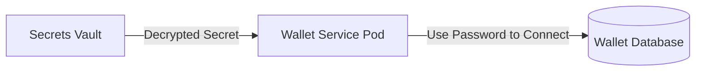
```mermaid
graph LR
    Vault[Secrets Vault] -->|Decrypted Secret| Pod[Wallet Service Pod]
    Pod -->|Use Password to Connect| DB[(Wallet Database)]
```

## Design Decisions
Deploy HashiCorp Vault integrated with Kubernetes Service Accounts to inject secrets as temporary in-memory environment variables.

---

# 21. Configuration Management

## Purpose
Configuration Management decouples application settings from the codebase, allowing developers to change system behavior without rebuilding or redeploying code.

## What is it?
From first principles, Configuration Management is a system that externalizes runtime parameters (such as connection strings, feature flags, log levels, and database limits) from the compiled application binary.

## Where is it used?
Every microservice reads configuration files or queries a configuration server at boot time.

## Why TradeDrift needs it
TradeDrift microservices deploy to multiple environments (Local Dev, Staging, Production). Configuration management allows us to use the same compiled Go binary across all environments by changing the config parameters (e.g. pointing to different PostgreSQL database endpoints).

## How it works (Viper Config Loader)
1. **File Reading:** At boot, the Go application uses a library (like Viper) to load configuration files (e.g. `config.yaml`).
2. **Overriding:** The library reads environment variables (e.g. `DATABASE_HOST`) to override values in the config file.
3. **Application Setup:** The application parses these configurations into a structured config object and initializes dependencies.

## Comparison

| Feature | Static Config Files | Dynamic Configuration |
|---|---|---|
| **Mechanism** | Read from local files (YAML/JSON) at boot. | Fetch from a central server (Consul/ZooKeeper). |
| **Updates** | Requires a pod restart to apply changes. | Updates apply dynamically in real-time. |
| **Complexity** | Low (simple file read). | High (requires config change listeners). |
| **Use Case** | DB endpoints, port configurations. | Feature flags, dynamic rate limit adjustments. |

## Configuration / Best Practices
* **Environment Overrides:** Ensure every config parameter in the configuration files can be overridden by an environment variable.
* **Fail Fast:** If required configurations (like connection strings) are missing or invalid at boot, crash the process immediately to prevent the service from running in a corrupted state.

## Failure Scenarios
* **Invalid Configuration:** Pushing a malformed config file (e.g. syntax error in YAML) will crash service pods during updates. Mitigation: Validate configuration schemas during CI/CD pipeline builds.

## Advantages
* Uses the same compiled binary across all environments.
* Simplifies deployment pipelines.
* Enables fast runtime changes.

## Limitations
* Externalizing configuration can make local debugging harder if settings are not well documented.
* Dynamic configuration updates can introduce race conditions in running processes.

## TradeDrift Architecture Placement
```
Kubernetes ConfigMap ──(Mount config.yaml)──► Viper Loader (Go Code) ──► Go Struct
```

## Diagram
```mermaid
graph TD
    CM[Kubernetes ConfigMap] -->|Inject config.yaml| Container[Service Container]
    Env[Environment Variables] -->|Override values| Container
    Container -->|Viper Parser| Struct[Go Config Struct]
```

## Design Decisions
Use Kubernetes `ConfigMaps` to mount environment-specific configurations at runtime, parsing them with the Go `Viper` SDK at boot.

---

# 22. SSL / TLS Termination

## Purpose
SSL/TLS Termination offloads the resource intensive work of decrypting HTTPS requests from backend microservices to edge devices, simplifying certificate management and reducing CPU overhead on internal servers.

## What is it?
From first principles, establishing an encrypted SSL/TLS connection requires a handshake protocol using asymmetric cryptography (e.g., RSA or Elliptic Curves). This handshake is CPU intensive. TLS Termination decrypts the HTTPS traffic at an edge proxy (e.g. Load Balancer) and routes the unencrypted HTTP traffic internally over a secure private network.

```
                  HTTPS (Encrypted)                 HTTP (Plaintext)
[ Public Client ] ────────────────► [ Load Balancer ] ─────────────► [ API Gateway / Services ]
                                     (Terminates SSL)
```

## Where is it used?
Executed at the edge of the network, typically at the public Load Balancer or the API Gateway.

## Why TradeDrift needs it
TradeDrift handles sensitive financial transactions, requiring HTTPS encryption for all external API endpoints. By offloading TLS decryption at the Load Balancer, internal microservices (like Order and Wallet) can focus their CPU resources on processing business logic and trade matches.

## How it works
1. **Client Handshake:** The client initiates an HTTPS connection to `api.tradedrift.com`.
2. **Decryption:** The Load Balancer terminates the TLS connection, decrypts the request using the certificate private key, and validates the request.
3. **Internal Forwarding:** The Load Balancer forwards the decrypted request internally as plain HTTP/gRPC traffic to the API Gateway.
4. **Encryption:** The Load Balancer encrypts the server's response and sends it back to the client.

## Configuration / Best Practices
* **Automate Certificates:** Use automated certificate managers (like Let’s Encrypt with Cert-Manager) to handle certificate creation and renewal.
* **Keep Private Keys Secure:** Private keys must reside only on the load balancer or edge proxy.

## Failure Scenarios
* **Certificate Expiry:** If the SSL/TLS certificate expires, browsers and APIs will block connections to TradeDrift. Mitigation: Set up automated monitoring alerts for certificate expiry (e.g. alerting at 30 days remaining).

## Advantages
* Reduces CPU load on internal microservices.
* Simplifies certificate management by centralizing updates.
* Enables edge-level request inspection and security analysis.

## Limitations
* Traffic travels as unencrypted HTTP inside the private network. (If internal security requires encryption, use mTLS - mutual TLS).

## TradeDrift Architecture Placement
```
Client ──(HTTPS)──► [AWS NLB (SSL Termination)] ──(HTTP/gRPC)──► API Gateway
```

## Diagram
```mermaid
sequenceDiagram
    Client->>NLB: Client Hello (TLS Handshake)
    NLB-->>Client: Server Hello, Certificate Exchange
    Note over Client,NLB: TLS Session Key Established
    Client->>NLB: Encrypted Payload
    Note over NLB: Decrypts SSL
    NLB->>Gateway: Plaintext HTTP / gRPC
    Gateway-->>NLB: Plaintext Response
    Note over NLB: Encrypts SSL
    NLB-->>Client: Encrypted Response
```

## Design Decisions
Terminate SSL/TLS at the AWS Network Load Balancer (NLB) to offload decryption work, using plain HTTP/gRPC inside the private Kubernetes VPC network.

---

# 23. Deployment Strategies (Rolling, Blue Green, Canary)

## Purpose
Deployment Strategies define the processes for releasing new versions of services, ensuring updates are deployed safely with minimal risk and zero downtime.

## What is it?
From first principles, a deployment strategy coordinates how the load balancer and container engine transition traffic from the old version (V1) to the new version (V2) of a service.

## Comparison

| Strategy | Mechanism | Advantages | Disadvantages |
|---|---|---|---|
| **Rolling** | Replaces old pods with new pods one by one. | Low cost (uses existing resources). | V1 and V2 co-exist during the update; rollbacks are slow. |
| **Blue-Green** | Deploys a complete duplicate V2 cluster (Green) alongside V1 (Blue); load balancer switches traffic all at once. | Instant switch; fast rollback. | Expensive (requires double the server capacity during deploy). |
| **Canary** | Routes a small percentage of traffic (e.g. 5%) to V2; if metrics are healthy, scales up V2 and retires V1. | Low risk; validates new code under actual production traffic. | Complex deployment pipeline; requires advanced traffic routing controls. |

## Configuration / Best Practices
* **Database Compatibility:** Ensure database changes are always backward-compatible (e.g., adding nullable columns instead of renaming columns) so V1 and V2 code can run concurrently during updates.
* **Automated Rollbacks:** Configure deployment pipelines to automatically roll back to the previous version if error metrics spike.

## Failure Scenarios
* **Deployment Crash Loop:** If the new service version has a bug that causes it to crash on startup, a **Rolling** deployment will pause when the first new pod fails its startup check, protecting the system from going down. Mitigation: Configure appropriate startup and readiness checks.

## Advantages
* Prevents update outages.
* Validates updates under production traffic.
* Enables fast rollbacks.

## Limitations
* Requires backward-compatible database schemas.
* Increases CI/CD pipeline complexity.

## TradeDrift Architecture Placement
```
[ CI/CD Pipeline ] ──► [ Kubernetes Deployments ] ──► [ Load Balancer Routing ]
```

## Diagram
```mermaid
graph TD
    subgraph Canary Deploy
        LB[Load Balancer] -->|95% Traffic| V1[Active Service V1]
        LB -->|5% Traffic| V2[Canary Service V2]
    end
```

## Design Decisions
Use **Rolling** deployments for general internal microservices to conserve resources, and **Canary** deployments for the API Gateway and Order Service to mitigate update risks.

---

# 24. Auto Scaling

## Purpose
Auto Scaling automatically adjusts the number of running server instances (scale-out/scale-in) or database resources based on real-time load, ensuring performance remains stable during traffic spikes while keeping costs low when traffic drops.

## What is it?
From first principles, Auto Scaling is a loop mechanism:
$$\text{Metrics Collection} \rightarrow \text{Evaluation against Target} \rightarrow \text{Provision/Terminate Instances}$$
The system continuously monitors CPU, memory, or custom metrics (e.g., HTTP request rate) and dynamically adjusts the replica count to maintain target utilization.

## Where is it used?
Applied to container clusters (Kubernetes HPA) and host node groups (AWS Auto Scaling Groups).

## Why TradeDrift needs it
Trading volume peaks during market openings or unexpected news and drops overnight. Auto scaling allows TradeDrift to run a lean cluster during low traffic periods and scale up automatically to handle peak volumes.

## How it works
1. **Metric Collection:** Prometheus or cloud monitors record CPU utilization across service pods.
2. **Autoscaler Evaluation:** The Horizontal Pod Autoscaler (HPA) evaluates the metrics:
   $$\text{DesiredReplicas} = \lceil \text{CurrentReplicas} \times \frac{\text{CurrentMetricValue}}{\text{TargetValue}} \rceil$$
3. **Execution:** If desired replicas differ from current, HPA calls the Kubernetes API to adjust the replica count.
4. **Provisioning:** Kubernetes starts new pods, which register with the load balancer.

## Configuration / Best Practices
* **Cooldown Periods:** Configure cooling delays (e.g., 5 minutes) to prevent "thrashing" (rapidly scaling up and down during minor traffic fluctuations).
* **Connection Pooling Scaling:** Ensure PgBouncer connection limits are configured to handle the maximum possible scale-out size of downstream services.

## Failure Scenarios
* **Cloud Quota Exhaustion:** If the autoscaler attempts to scale past the cloud provider's resource quotas, scaling stops, leaving the system vulnerable to overload. Mitigation: Set up alerts to monitor cloud resource quotas.

## Advantages
* Handles unexpected traffic spikes automatically.
* Optimizes hosting costs.
* Reduces the need for manual operations.

## Limitations
* Scaling is not instant (containers take time to boot).
* Stateful layers (databases) cannot scale dynamically using simple metrics.

## TradeDrift Architecture Placement
```
[ Prometheus Metrics ] ──► [ Kubernetes HPA ] ──(Scale Replicas)──► Order Service Pods
```

## Diagram
```mermaid
graph TD
    Prometheus[Prometheus Metrics] -->|Poll CPU utilization| HPA[Kubernetes HPA]
    HPA -->|Compare against target 70%| Evaluator{Over threshold?}
    Evaluator -->|Yes| ScaleUp[Increase replica count]
    Evaluator -->|No| ScaleDown[Maintain or decrease count]
```

## Design Decisions
Configure HPAs with a target CPU utilization of 70%, with a minimum of 3 replicas per service to ensure high availability.

---

# 25. Infrastructure Monitoring

## Purpose
Infrastructure Monitoring provides visibility into the health, resource utilization, and performance of the physical or virtual infrastructure, helping operations teams detect and resolve issues before they cause outages.

## What is it?
From first principles, Infrastructure Monitoring consists of collecting, storing, and visualizing time-series metrics (CPU, memory, disk I/O, network bandwidth, container metrics) from host machines, databases, caches, and container platforms.

## Where is it used?
Agents (like Prometheus Node Exporter) run on all virtual machines, Kubernetes hosts, databases, and message brokers to collect and send metrics to a central monitoring system.

## Why TradeDrift needs it
TradeDrift must maintain low execution latencies. Monitoring allows us to track host CPU load, disk usage, and network saturation, helping us detect performance bottlenecks (e.g., database disk exhaustion or memory leaks) before they impact trading performance.

## How it works
1. **Metrics Collection:** Prometheus pull daemons scrape metrics endpoints exposed by host nodes and containers.
2. **Storage:** Metrics are stored in a time-series database (TSDB).
3. **Visualization:** Grafana queries the TSDB to display real-time performance dashboards.
4. **Alerting:** Alertmanager evaluates rules and sends notifications (e.g., to Slack or PagerDuty) if metrics exceed thresholds.

## Metrics Checklist (Core Indicators)
* **CPU Load:** Virtual machine and container cores saturation.
* **Memory Saturation:** Available RAM and swap usage.
* **Disk I/O Latency:** Write/Read execution speeds.
* **Network Packets:** Inbound/outbound packet throughput.

## Configuration / Best Practices
* **Alerting Rules:** Define clear, actionable alerts (e.g. Alert if database disk space $> 85\%$).
* **Keep Dashboards Clean:** Build separate high-level summary dashboards for business health and detailed debug dashboards for troubleshooting.

## Failure Scenarios
* **Metrics Ingestion Failure:** If the metrics DB fills up or crashes, operations teams lose visibility into the system. Mitigation: Run monitoring systems on an isolated infrastructure environment separate from the production cluster.

## Advantages
* Provides visibility into system health.
* Helps identify performance bottlenecks early.
* Enables trend analysis and capacity planning.

## Limitations
* Storing large volumes of metrics can become expensive.
* Overly sensitive alerts can cause "alert fatigue," leading teams to ignore critical warnings.

## TradeDrift Architecture Placement
```
Production Cluster Nodes ──(Scrape Metrics)──► [ Prometheus Node Exporter ] ──► Grafana
```

## Diagram
```mermaid
graph LR
    Exporter[Node Exporter] -->|Scrape Endpoint| Prom[Prometheus TSDB]
    K8s[Kubernetes cAdvisor] -->|Scrape Endpoint| Prom
    Prom -->|Query Metrics| Grafana[Grafana Dashboard]
    Prom -->|Trigger Alerts| Alert[Alertmanager]
```

## Design Decisions
Use Prometheus and Grafana for metrics collection and dashboard visualization, deploying Prometheus agents in a pull configuration to collect metrics from Kubernetes nodes and service containers.

---

# 26. Logging Pipeline

## Purpose
A Logging Pipeline aggregates, processes, and stores log outputs from all services and containers in a central location, helping developers debug issues and maintain audit trails.

## What is it?
From first principles, a Logging Pipeline collects standard output (`stdout`) logs from container runtimes, parses them into a structured format (JSON), and forwards them to a central, searchable database.

```
[ Container stdout ] ──► [ Logging Daemon (Fluentbit) ] ──► [ Elasticsearch / Loki ] ──► [ UI (Grafana/Kibana) ]
```

## Where is it used?
Logging agents run on all container hosts to capture, format, and ship logs from running applications.

## Why TradeDrift needs it
In a distributed system like TradeDrift, requests traverse multiple microservices (API Gateway $\rightarrow$ Order Service $\rightarrow$ Wallet Service $\rightarrow$ Database). The Logging Pipeline aggregates logs from all these services in a single place, allowing developers to trace the entire lifecycle of a request using a unique `traceId`.

## How it works
1. **Log Output:** The application writes a structured JSON log line to `stdout`.
2. **Aggregation:** A local logging daemon (like Fluentbit) running on the node captures the log line from the container runtime.
3. **Enrichment:** Fluentbit adds cluster metadata (e.g., pod name, container name, namespace, host node IP).
4. **Transport:** Logs are forwarded to a central log store (Elasticsearch or Grafana Loki).
5. **Query:** Developers use Kibana or Grafana dashboards to query and analyze logs.

## Configuration / Best Practices
* **Structured Logs:** Always output logs in JSON format to make parsing and querying easy.
* **Filter Noise:** Exclude health check logs (`GET /live`, `GET /ready`) from the primary index to keep storage clean.
* **Never Log Secrets:** Enforce automated filters to mask passwords, API keys, or credit card numbers from log outputs.

## Failure Scenarios
* **Log Ingestion Failure:** During high traffic periods, logs can grow rapidly, exhausting log database storage and crashing the pipeline. Mitigation: Implement rate limits on logging pipelines and configure log rotation.

## Advantages
* Centralizes log access.
* Simplifies debugging in distributed systems.
* Provides audit trails for compliance.

## Limitations
* Storing large volumes of logs requires significant disk space.
* Processing and index generation can introduce CPU overhead on host nodes.

## TradeDrift Architecture Placement
```
Go Microservice (writes JSON to stdout) ──► fluent-bit agent ──► Grafana Loki
```

## Diagram
```mermaid
graph TD
    Pod1[Order Pod] -->|stdout| Agent[Fluent-Bit Daemon]
    Pod2[Wallet Pod] -->|stdout| Agent
    Agent -->|Enriched JSON Log| Loki[Grafana Loki / ES]
    Loki -->|Query logs| Kibana[Kibana / Grafana UI]
```

## Design Decisions
Use **Grafana Loki** as our central log store and **Fluent-Bit** as the node collector, formatting all application logs in structured JSON format.

---

# 27. Metrics Collection

## Purpose
Metrics Collection gathers real-time statistical indicators from running applications, providing visibility into system performance, error rates, and throughput.

## What is it?
From first principles, Metrics Collection gathers numerical data points over time. Unlike logs (which capture details of individual events), metrics provide a high-level summary of system performance (e.g. HTTP requests count, response latency).

## Where is it used?
Microservices expose metrics endpoints (e.g. `/metrics`) using libraries like the Prometheus Go client. These endpoints are scraped by a metrics collector.

## Why TradeDrift needs it
TradeDrift needs real-time visibility into trading performance. Metrics collection allows us to track the rate of placed orders, trade matching execution speeds, and error rates (e.g., comparing successful orders to rejections), helping us identify performance issues immediately.

## How it works (RED Method)
1. **Instrument:** The microservice implements metric counters and histograms using SDK libraries.
2. **Expose:** The service exposes a public `/metrics` HTTP endpoint displaying values in Prometheus format.
3. **Scrape:** Prometheus pulls metrics from the endpoint at a regular interval (e.g., every 15 seconds).
4. **Aggregate:** Prometheus stores the metrics in its time-series database.

## Metrics Strategy (RED vs USE)

* **RED Method (Service-Facing Metrics):**
  - **R**ate: The number of requests processed per second.
  - **E**rrors: The number of failed requests.
  - **D**uration: The time taken to process requests.
* **USE Method (Resource-Facing Infrastructure):**
  - **U**tilization: Average resource usage (CPU/RAM percentage).
  - **S**aturation: Queue lengths or waiting jobs.
  - **E**rrors: Device and hardware-level errors.

## Configuration / Best Practices
* **Standard Metrics:** Implement the RED method on all HTTP/gRPC interfaces and the USE method on all host machines.
* **Avoid High Cardinality:** Do not use high-cardinality values (like individual User IDs or Order IDs) as labels in metrics, as this can crash the metrics database.

## Failure Scenarios
* **Scrape Target Timeout:** If a service instance is overloaded, its `/metrics` endpoint may time out, causing Prometheus to mark the instance as offline and trigger false alerts. Mitigation: Configure appropriate timeouts on scraping scraping processes.

## Advantages
* Low storage overhead compared to logs.
* Enables automated alerting based on error rates and response latency.
* Supports auto-scaling triggers.

## Limitations
* Does not provide context for debugging individual requests (requires tracing).
* Misconfigured labels can cause metrics database performance degradation.

## TradeDrift Architecture Placement
```
Service Pod [/metrics] ◄──(Scrape every 15s)── Prometheus Server ──► Grafana
```

## Diagram
```mermaid
sequenceDiagram
    participant App as Service Pod
    participant Prom as Prometheus
    App->>App: Track Latency (Histogram)
    Prom->>App: GET /metrics
    App-->>Prom: return prometheus_formatted_metrics
    Note over Prom: Save metrics to TSDB
```

## Design Decisions
Standardize on the **RED** method using the Prometheus Go client SDK, exposing metrics endpoints on the administrative port (`8081`) of all microservices.

---

# 28. Tracing

## Purpose
Distributed Tracing tracks request paths as they traverse multiple microservices, providing developers visibility into call dependencies, execution paths, and performance bottlenecks across the platform.

## What is it?
From first principles, Distributed Tracing generates a unique identifier (`trace_id`) at the network edge. This ID is passed in the metadata headers of all downstream network calls. Each service creates a execution segment called a `span`, recording the start time, end time, and errors for the operation.

## Where is it used?
Implemented inside microservice middleware (gRPC interceptors, HTTP routers) and propagated across network boundaries via W3C `traceparent` headers.

## Why TradeDrift needs it
When a user places an order, the request traverses the API Gateway $\rightarrow$ Order Service $\rightarrow$ Wallet Service $\rightarrow$ PostgreSQL. If the order placement takes 2.5 seconds, distributed tracing allows developers to isolate exactly which service or database query caused the delay.

## How it works
1. **Creation:** The API Gateway receives a request, generates a unique `trace_id`, and creates the root span.
2. **Context Propagation:** The Gateway injects the `traceparent` header into the outgoing gRPC context:
   ```
   traceparent: 00-4bf92f3577b34da6a3ce929d0e0e4736-00f067aa0ba902b7-01
   ```
3. **Span Generation:** The Order Service receives the context, extracts the `trace_id`, starts a new child span, and records its execution metadata.
4. **Database Tracing:** Database driver wrappers generate spans for SQL execution.
5. **Collection:** Spans are asynchronously exported to a central tracing store (Jaeger or OpenTelemetry Collector) for visualization.

## Configuration / Best Practices
* **W3C Standards:** Standardize on W3C `traceparent` headers to ensure trace compatibility.
* **Sampling Rate:** In production, use **sampling policies** (e.g. trace only 1% of happy-path requests, but trace 100% of error or high-latency requests) to reduce storage and processing overhead.

## Failure Scenarios
* **Telemetry Collector Crash:** If the tracing collector goes down, services must not block. Mitigation: Export traces asynchronously using non-blocking, in-memory buffers that discard spans if the collector is unreachable.

## Advantages
* Visualizes call dependency trees.
* Helps isolate latency bottlenecks.
* Simplifies debugging of distributed systems.

## Limitations
* Storage intensive.
* Requires manual instrumentation of database drivers and HTTP/gRPC routing middleware.

## TradeDrift Architecture Placement
```
Client ──► API Gateway ──► Order Service ──► Wallet Service
             │               │                │
             └───────────────┼────────────────┘
                             ▼
                    [ OpenTelemetry Agent ] ──► Jaeger
```

## Diagram
```mermaid
sequenceDiagram
    participant Gateway as API Gateway
    participant Order as Order Service
    participant Wallet as Wallet Service
    Gateway->>Order: gRPC (Inject trace_id = 99238)
    Note over Order: Start Child Span 1
    Order->>Wallet: gRPC (Forward trace_id = 99238)
    Note over Wallet: Start Child Span 2
    Wallet-->>Order: Return Balance
    Note over Wallet: Export Span 2 to Jaeger
    Order-->>Gateway: Return Order ID
    Note over Order: Export Span 1 to Jaeger
    Note over Gateway: Export Root Span to Jaeger
```

## Design Decisions
Use **OpenTelemetry (OTel)** APIs for vendor-neutral client instrumentation, exporting spans asynchronously to a Jaeger backend for trace visualization.

---

# 29. Message Broker Infrastructure (Kafka)

## Purpose
A Message Broker acts as a central event log, enabling microservices to communicate asynchronously via decoupled publish-subscribe events.

## What is it?
From first principles, Apache Kafka is a distributed, partitioned, commit-log database. Producers append event records to the end of a log partition, and consumers read logs sequentially at their own pace, tracking their progress using partition offsets.

## Where is it used?
Kafka is the central nervous system of the TradeDrift platform, positioned between the matching engine and the downstream read-side microservices.

## Why TradeDrift needs it
To process transactions at scale, TradeDrift uses an event-driven architecture. When the Matching Engine matches an order, it publishes a `TradeExecuted` event to Kafka. The Settlement Service, Portfolio Service, Trade Service, and Notification Service independently consume this event to settle balances, calculate PnL, update histories, and push notifications without coupling to the Matching Engine.

## How it works (Event Log Lifecycle)
1. **Publish:** A service writes an event (e.g. `OrderCreated`) to a Kafka topic.
2. **Partitioning:** The Kafka producer hashes the message key (e.g., `market_id`) to determine which partition the message belongs to, guaranteeing that all events for a specific market are written to the same partition and processed in order.
3. **Commit Log Append:** The broker appends the message to the physical partition commit log file on disk.
4. **Replication:** The partition leader replicates the write to follower replica brokers.
5. **Consumption:** Consumers read messages sequentially, committing their offsets to Kafka to track progress.

## Configuration / Best Practices
* **Partition Keys:** Always use appropriate keys (e.g. `market_id` for orders, `user_id` for balance updates) to guarantee strict message ordering within partitions.
* **Idempotent Producers:** Enable `enable.idempotence = true` to prevent duplicate events from being written to the log during network retries.

## Failure Scenarios
* **Broker Partition Leader Outage:** If a leader broker node crashes, the partition becomes temporarily unavailable. Mitigation: Set `replication.factor = 3` and `min.insync.replicas = 2` to trigger automated failover, electing an in-sync follower to become the new partition leader.

## Advantages
* High throughput and durability.
* Decouples publishers and consumers.
* Supports event replay (event sourcing patterns).

## Limitations
* Does not support random access reads (only sequential reads).
* High operational complexity (requires ZooKeeper or KRaft KRaft metadata coordination clusters).

## TradeDrift Architecture Placement
```
Producers ──► [ Kafka Topic: trades.executed.v1 ] ──► Consumers
```

## Diagram
```mermaid
graph TD
    subgraph Kafka Broker Cluster
        Topic[Topic: trades.executed.v1]
        Topic --> Part0[Partition 0 (Key: BTC-USDT)]
        Topic --> Part1[Partition 1 (Key: ETH-USDT)]
    end
    ME[Matching Engine] -->|Publish| Topic
    Settlement[Settlement Service] -->|Consume| Part0
    Portfolio[Portfolio Service] -->|Consume| Part0
```

## Design Decisions
Deploy Apache Kafka using KRaft mode for metadata management, running topics with a replication factor of 3 and partitioning by `market_id` to guarantee ordered matching loop logs.

---

# 30. Database Replication

## Purpose
Database Replication copies database updates from a primary database node to backup replica nodes, enabling read-path load balancing and automated failover during outages.

## What is it?
From first principles, replication copies modifications from the write-active Primary node to read-only Replica nodes. This is achieved by streaming Write-Ahead Logs (WAL) over TCP connections.

```
                  WAL Stream (Asynchronous)
[ Postgres Primary ] ───────────────────► [ Postgres Replica ]
 (Accepts WRITES)                          (Accepts READS)
```

## Where is it used?
Applied at the database storage layer for all relational databases (PostgreSQL instances).

## Why TradeDrift needs it
TradeDrift executes a high volume of read queries (e.g., historical trades, user order history, portfolio balances). Running all these read queries against the primary database would degrade write performance. We use database replication to direct read traffic to replica nodes, reserving the primary node for write transactions.

## How it works
1. **Transaction Commit:** A write transaction commits on the PostgreSQL Primary node.
2. **WAL Append:** The Primary appends the transaction changes to its local Write-Ahead Log (WAL).
3. **Streaming Replication:** The WAL sender process on the Primary streams the WAL bytes over a TCP connection to the Replica.
4. **Apply changes:** The WAL receiver process on the Replica applies the WAL modifications to its local disk, updating the tables.
5. **Read Availability:** The Replica serves read queries with updated database states.

## Types

* **Synchronous Replication:** The Primary waits for confirmation from the Replica before acknowledging a commit to the application.
  * *Pros:* No data loss during primary failures.
  * *Cons:* Higher write latency; if the replica goes down, all writes on the primary block.
* **Asynchronous Replication:** The Primary commits transactions locally and streams WAL changes asynchronously.
  * *Pros:* Low write latency; primary continues to process writes even if replicas fail.
  * *Cons:* Risk of minor data loss if the primary crashes before WAL changes are replicated.

## Configuration / Best Practices
* **Asynchronous Default:** Use asynchronous replication for standard operations to optimize write performance.
* **Read-Replica Routing:** Implement application-level routing to direct all `SELECT` queries to read-replicas while routing write transactions to the primary database.

## Failure Scenarios
* **Primary Outage:** If the primary node fails, writes halt. Mitigation: A replication orchestrator (like Patroni) detects the outage, promotes the healthiest read replica to become the new primary, and updates client routing paths.

## Advantages
* Offloads read query load from the primary database.
* Enables high availability and fast disaster recovery.

## Limitations
* Asynchronous replication replication lag can cause temporary read-after-write inconsistencies (e.g., a user executes a transaction but doesn't see it immediately in their history).

## TradeDrift Architecture Placement
```
Order Service Writes ──► PostgreSQL Primary ──(Async WAL Stream)──► Read Replica
Order Service Reads  ──► PgBouncer Proxy    ──────────────────────► Read Replica
```

## Diagram
```mermaid
sequenceDiagram
    participant App as Service Code
    participant Master as Postgres Primary
    participant Replica as Postgres Replica
    App->>Master: INSERT INTO orders...
    Master->>Master: Write WAL & Commit locally
    Master-->>App: Commit Acknowledged (200 OK)
    Master->>Replica: Stream WAL logs (Asynchronous)
    Note over Replica: Apply WAL changes to tables
    App->>Replica: SELECT FROM orders... (Read data)
```

## Design Decisions
Use asynchronous physical streaming replication for PostgreSQL databases, coupled with Patroni for automated cluster management.

---

# 31. Database Failover

## Purpose
Database Failover automatically promotes a read-only database replica to become the active primary node during primary node outages, minimizing system downtime.

## What is it?
From first principles, database failover is a cluster state change:
$$\text{Primary Node Outage} \rightarrow \text{Leader Election} \rightarrow \text{Promote Replica} \rightarrow \text{Update Client Connections}$$
The system uses a consensus registry (like etc.d) to monitor node health. If the primary node goes offline, the registry elects a replica to become the new primary, updates routing paths, and restarts the old primary as a replica upon recovery.

## Where is it used?
Applied at the PostgreSQL database cluster layer.

## Why TradeDrift needs it
If the primary PostgreSQL database for the Wallet Service goes down, the entire system cannot process trades. Database failover ensures that the system can automatically recover and resume writes within seconds without manual intervention.

## How it works (Patroni + etc.d)
1. **Health Monitoring:** Patroni agents running on all database nodes maintain a leader key lease in etc.d.
2. **Lease Expiry:** The Primary node crashes, failing to renew its key lease in etc.d.
3. **Election:** The lease expires. The remaining Patroni replica agents elect the replica with the most up-to-date WAL log as the new leader.
4. **Promotion:** The elected replica is promoted to primary mode, enabling write transactions.
5. **Connection Update:** Dynamic routing proxies (like HAProxy or PgBouncer) update their connection targets to point to the new primary.

## Configuration / Best Practices
* **Consensus Node Count:** Deploy etc.d registry clusters across at least three nodes to prevent split-brain scenarios.
* **Auto-Reconnect:** Configure application database drivers with auto-reconnect loops to transparently re-establish database connections after failovers.

## Failure Scenarios
* **Split Brain:** Occurs when a network partition isolates database nodes, causing two nodes to assume they are the active primary. Mitigation: Ensure that leader elections require a majority consensus (quorum) in etc.d before promoting a node.

## Advantages
* Automates database recovery.
* Prevents data center outages from causing permanent database downtime.
* Reduces recovery time (RTO).

## Limitations
* Promoting a replica asynchronously can cause minor transaction loss (unreplicated commits).
* Failover execution takes time (typically 10 to 30 seconds), during which writes are blocked.

## TradeDrift Architecture Placement
```
[ etc.d Consensus Registry ] ◄──(Monitor Heartbeats)── Patroni Agent ──► Postgres Node
```

## Diagram
```mermaid
graph TD
    subgraph DB Cluster
        Master[Postgres Primary (Down)]
        Replica[Postgres Replica]
    end
    Proxy[HAProxy Connection Proxy] -->|Write query| Master
    Proxy -.->|Detect Failover| Replica
    Etcd[etcd Registry] -->|Heartbeat lost| Master
    Etcd -->|Promote to Primary| Replica
    Replica -->|Assume Leader Role| Proxy
```

## Design Decisions
Use **Patroni** and **etc.d** to automate PostgreSQL cluster monitoring and failover routing.

---

# 32. Storage Types

## Purpose
Storage Types define the underlying physical and virtual storage systems used to persist platform data, balancing cost, performance, and durability requirements.

## What is it?
From first principles, storage operates in three primary formats:
* **Block Storage:** High-performance physical disk volumes (e.g. SSDs) mounted directly to virtual machines, used for databases requiring high read/write I/O operations (IOPS).
* **Object Storage:** Flat, unstructured file storage accessible via API calls (e.g. HTTP GET/PUT), used for static files, backups, and log storage.
* **Ephemeral Storage:** Temporary disk storage tied to the lifecycle of a container, discarded when the container exits.

## Where is it used?
* **Block Storage:** PostgreSQL databases, Kafka log storage, Redis persistence.
* **Object Storage:** Storage of client build artifacts, daily database backups, historical logs.
* **Ephemeral Storage:** General stateless application container scratch folders.

## Why TradeDrift needs it
TradeDrift must store transaction logs, database schemas, and backups securely. We use block storage (SSD volumes) for PostgreSQL and Kafka to maximize write IOPS, and object storage (S3) for database backups and static web assets.

## Storage Types Comparison

| Attribute | Block Storage (SSD / EBS) | Object Storage (AWS S3) | File Storage (NFS / EFS) |
|---|---|---|---|
| **Access Protocol** | Fiber Channel / NVMe (Mount) | HTTP REST API | POSIX File System |
| **Performance** | Very High (Sub-millisecond) | Moderate (HTTP Latency) | Moderate |
| **Scale Limits** | Fixed size volumes (up to TBs) | Virtually Infinite | Scalable |
| **Best Use Case** | Databases, Kafka logs. | Daily Backups, Static Assets. | Shared media assets. |

## Configuration / Best Practices
* **IOPS Optimization:** Use SSD volumes with provisioned IOPS (e.g. AWS gp3 or io2) for database instances.
* **Encryption:** Enable encryption at rest (AES-256) for all block and object storage systems.

## Failure Scenarios
* **Disk Saturation:** If block storage disk space is exhausted, PostgreSQL stops processing transactions. Mitigation: Configure automated disk resizing policies to expand volume size dynamically when usage exceeds 80%.

## Advantages
* Block storage provides the low latency needed for transaction writes.
* Object storage scales virtually infinitely at low costs.

## Limitations
* Block storage cannot be shared across multiple container nodes concurrently.
* Object storage is too slow for transactional database writes.

## TradeDrift Architecture Placement
```
PostgreSQL / Kafka ──► [ Block Storage (NVMe SSD) ]
Backup Engine      ──► [ Object Storage (AWS S3) ]
```

## Diagram
```mermaid
graph TD
    Service[Stateful Service] -->|Block API (Fast NVMe)| NVMe[SSD Block Storage]
    Batch[Backup Engine] -->|HTTPS REST API| S3[AWS S3 Object Storage]
```

## Design Decisions
Use provisioned-IOPS SSD block storage (AWS EBS gp3) for PostgreSQL databases and Kafka brokers, while using AWS S3 object storage for backups and static assets.

---

# 33. Disaster Recovery Concepts

## Purpose
Disaster Recovery (DR) plans and systems ensure that a platform can recover data and resume operations after catastrophic events, such as entire cloud region outages or physical data center destructions.

## What is it?
From first principles, Disaster Recovery is measured by two metrics:
1. **Recovery Point Objective (RPO):** The maximum age of data that can be lost during an outage (e.g. "We must recover data up to 5 minutes before the crash").
2. **Recovery Time Objective (RTO):** The maximum target duration allowed to restore operations after an outage (e.g. "Operations must be fully restored within 30 minutes").

```
  [ Disaster Event ]
          │
          ├──◄── (Data lost)   ── RPO (Recovery Point Objective)
          └────► (Restoring)   ── RTO (Recovery Time Objective)
```

## Where is it used?
Enforced globally across the platform.

## Why TradeDrift needs it
Trading platforms must survive catastrophic failures. If AWS suffers an entire region outage, TradeDrift must be able to restore operations and account balances in a backup region, protecting user funds and trading records.

## Strategies Comparison

| Strategy | RTO Target | RPO Target | Cost | Operational Overhead |
|---|---|---|---|---|
| **Backup & Restore** | Hours / Days | 24 Hours | Low | Simple backups (cold storage). |
| **Pilot Light** | 10 - 30 mins | Minutes | Moderate | Idle database replica in backup site. |
| **Warm Standby** | 5 - 10 mins | Seconds | High | Running scaled-down services in standby site. |
| **Active-Active** | Near Instant | Near Zero | Very High | Live running replicas in both regions. |

## Configuration / Best Practices
* **Pilot Light / Warm Standby:** Use a **Pilot Light** or **Warm Standby** strategy. Maintain asynchronous database replication to the backup region and deploy services only during failover events to balance recovery targets and infrastructure costs.
* **Practice Failover Runs:** Schedule regular disaster recovery drills to test automation scripts and verify RTO metrics.

## Failure Scenarios
* **Replication Loop Loss:** If the primary region goes down, any database writes that occurred during the replication lag window (RPO) are lost. Mitigation: Keep transaction logs in local secure caches and run verification checks against client accounts before resuming trading.

## Advantages
* Protects user funds and account records.
* Ensures compliance with financial regulations.
* Minimizes losses from datacenter outages.

## Limitations
* Active Standby setups require duplicate infrastructure, increasing costs.
* Data replication across geographically distant regions is limited by the speed of light, introducing latency.

## TradeDrift Architecture Placement
```
Primary Region (AWS us-east-1) ──(Asynchronous WAL Stream)──► Standby Region (AWS us-west-2)
```

## Diagram
```mermaid
graph TD
    subgraph Primary Region (Active)
        LB1[Load Balancer] --> App1[App Nodes]
        App1 --> DBM1[(Postgres Primary)]
    end
    subgraph Standby Region (Passive Standby)
        LB2[Standby LB] -.-> App2[App Standby Nodes]
        App2 -.-> DBM2[(Postgres Replica)]
    end
    DBM1 -->|Cross-Region Async Replication| DBM2
    DNS[DNS Routing] -->|Active Route| LB1
    DNS -.->|DR Failover Switch| LB2
```

## Design Decisions
Adopt a **Pilot Light** disaster recovery strategy, maintaining active database replication to a secondary standby region to keep RPO under 5 seconds and RTO under 15 minutes.

---

## 34. Global TradeDrift Distributed System Architecture

The following consolidated layout illustrates how these components integrate across the network and VM layers, from client HTTP resolve down to internal gRPC microservices and data persistence stores:

```mermaid
graph TD
    Client[Client App] -->|1. DNS Resolve| DNS[Global DNS]
    Client -->|2. Get Static Assets| CDN[CDN Edge]
    Client -->|3. REST / WebSockets| LB[Network Load Balancer (SSL Terminated)]
    
    subgraph API Gateway Layer
        LB -->|HTTP/TCP| Proxy[Reverse Proxy (NGINX)]
        Proxy -->|JSON REST| GW[Go API Gateway]
        GW <-->|Check rate & auth| RedisAuth[(Redis Sentinel)]
    end
    
    subgraph Microservices Cluster (gRPC HTTP/2)
        GW -->|gRPC| AuthSvc[Authentication Service]
        GW -->|gRPC| WalletSvc[Wallet Service]
        GW -->|gRPC| OrderSvc[Order Service]
        GW -->|gRPC| MarketSvc[Market Service]
    end
    
    subgraph Asynchronous Event Pipelines
        OrderSvc -->|Publish Event| Kafka[Apache Kafka Cluster]
        ME[Matching Engine] -->|Publish execution| Kafka
        Kafka -->|Consume trade.executed| SettleSvc[Settlement Service]
        Kafka -->|Consume user-trade.settled| PortSvc[Portfolio Service]
        Kafka -->|Consume user-trade.settled| NotifSvc[Notification Service]
        SettleSvc -->|Compensate settle| WalletSvc
    end
    
    subgraph Persistent Storage Layer
        WalletSvc -->|Write transactional balance| Postgres[(PostgreSQL Primary)]
        Postgres -->|Async WAL replication| PostgresReplica[(PostgreSQL Read-Replica)]
        PortSvc -->|Read-only queries| PostgresReplica
    end
```
