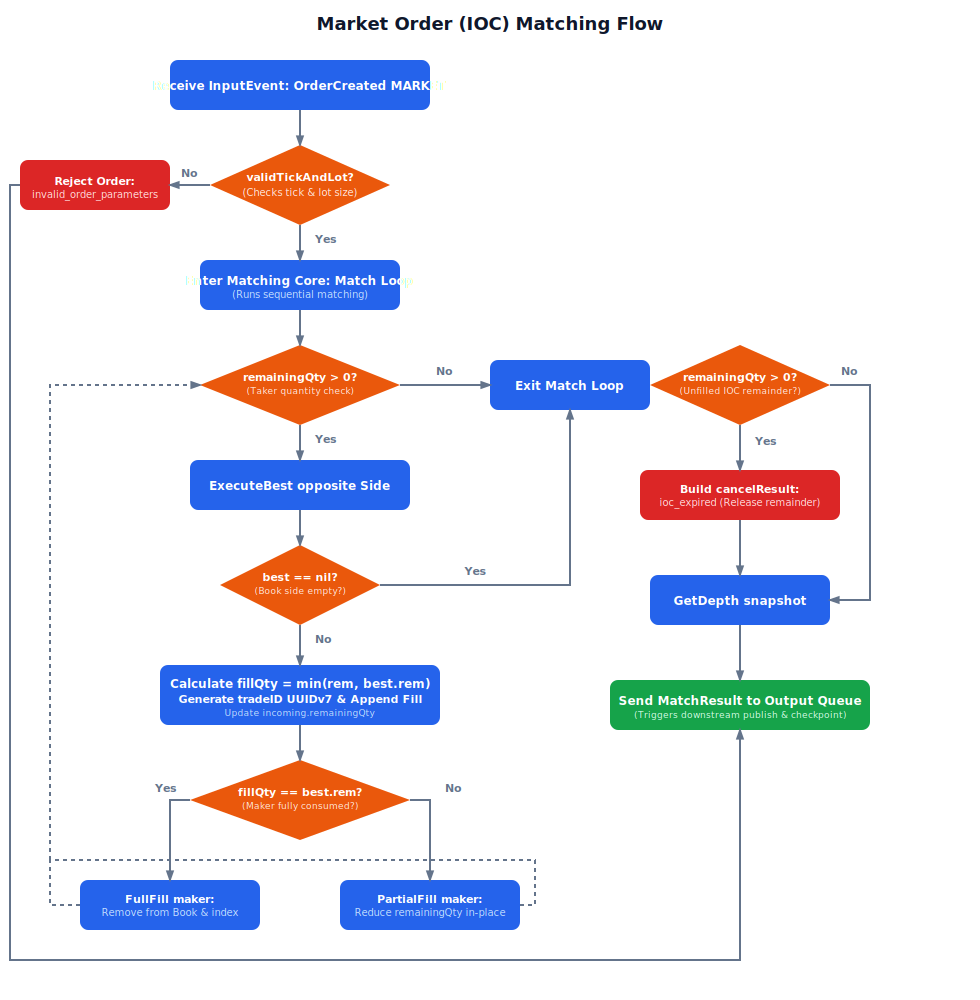
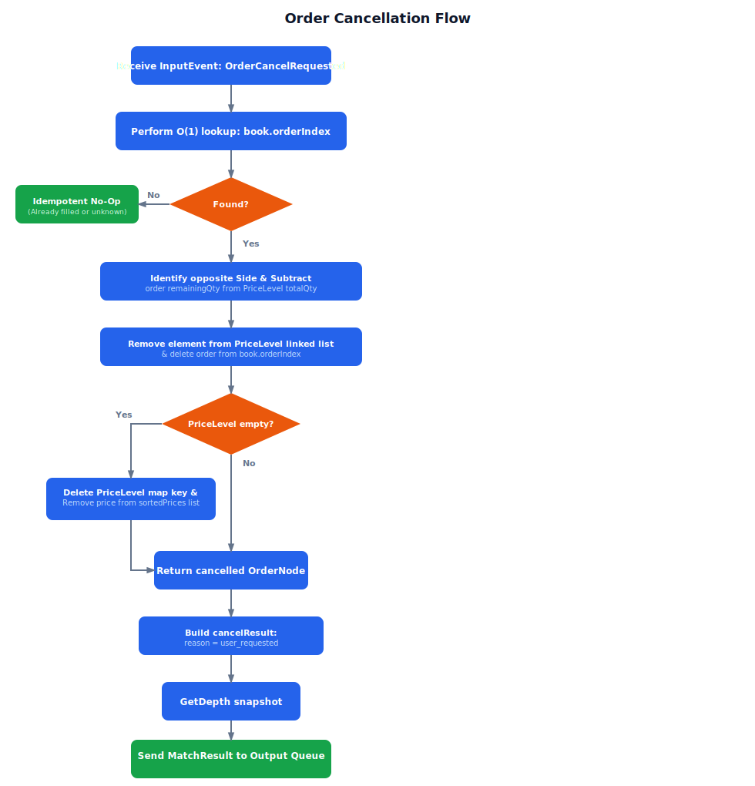
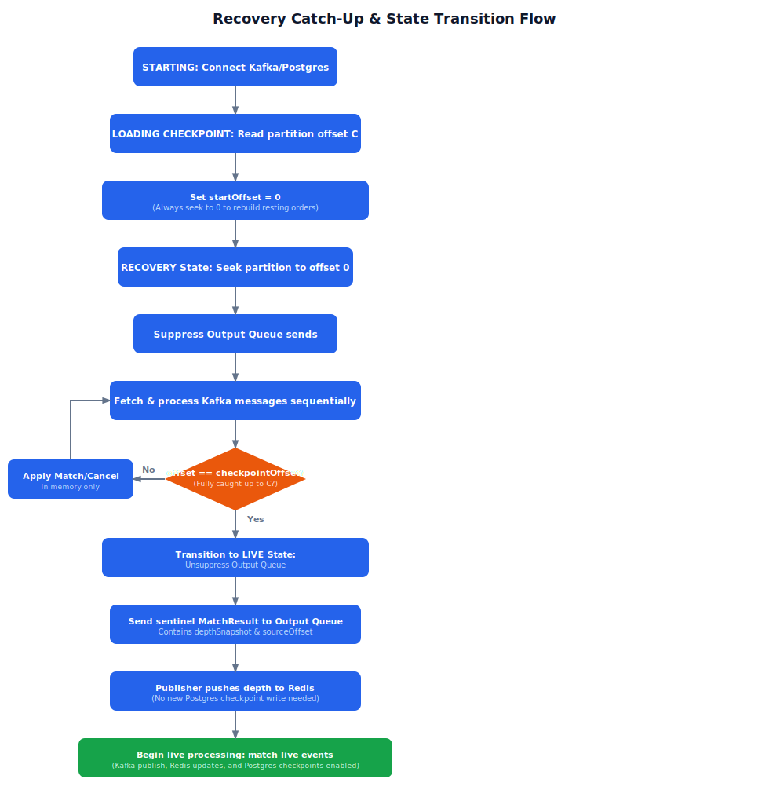

# TradeDrift Matching Engine — Flow Diagrams

**Document:** 13_Flow_Diagrams.md
**Service:** Matching Engine
**Version:** V1.0
**Last Updated:** July 2026

---

## 1. Limit Order Ingestion & Matching Flow

This flowchart describes the step-by-step process when the Event Loop receives an `OrderCreated` event for a **LIMIT** order.

The limit order ingestion flow first passes through tick and lot size validation checks. Valid orders enter the matching core loop to sweep opposite-side resting liquidity at overlapping prices, producing execution fills. Any remaining quantity after loop termination is inserted into the order book and indexed for $O(1)$ lookup, followed by a Redis depth update and offset checkpoint commit.

---

## 2. Market Order (IOC) Matching Flow

This flowchart describes the matching process when the Event Loop receives an `OrderCreated` event for a **MARKET** order. Market orders are always treated as Immediate-Or-Cancel (IOC) and never rest on the book.

The market order matching flow treats all incoming market orders as Immediate-Or-Cancel (IOC). If the order is valid, it sweeps resting liquidity on the opposite side of the book until fully filled or until no further liquidity exists. Any unfilled remaining quantity is immediately expired, producing an `OrderCancelled` event with reason `ioc_expired` to release the buyer/seller's reserved funds in the Wallet Service.

---

## 3. Order Cancellation Flow

This flowchart shows the workflow when a user requests to cancel an order.

The order cancellation flow begins with an $O(1)$ index lookup in the order map. If found, the order's remaining quantity is subtracted from its price level's total volume, and the node is removed from both the doubly linked queue and the map index. If the price level becomes empty, it is deleted from the active map and sorted price list, followed by pushing a depth snapshot and cancel result through the output queue.

---

## 4. Recovery Catch-Up & State Transition Flow

This flowchart shows the state transition and pipeline logic when a Market Engine starts and catches up from the Kafka log.

The recovery catch-up flow seeks the partition to offset 0 and replays events sequentially through the matching core in suppressed output mode. Once the replayed offset reaches the postgres-committed checkpoint, the engine transitions to LIVE mode, unsuppressing the output queue and sending a sentinel depth snapshot to initialize Redis. Subsequent offsets greater than the checkpoint are then matched live with active publishing and checkpoint updates.

---

## 5. References

- `05_Matching_Algorithm.md` — Ingestion logic details
- `07_Concurrency_Model.md §5` — Concrete Event Loop `processEvent` code
- `08_Recovery_Strategy.md` — Detailed catch-up sequences
- `04_Data_Structures/07_Algorithms.md` — Low-level code details
