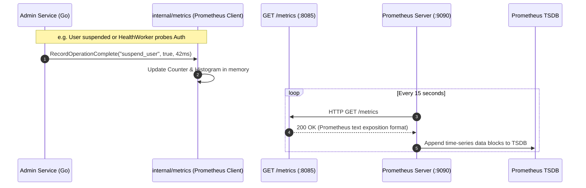
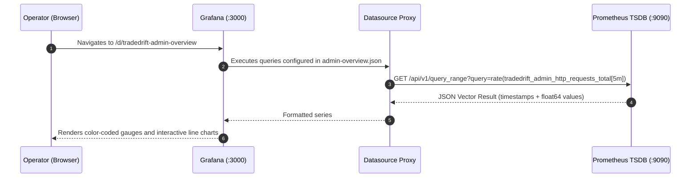
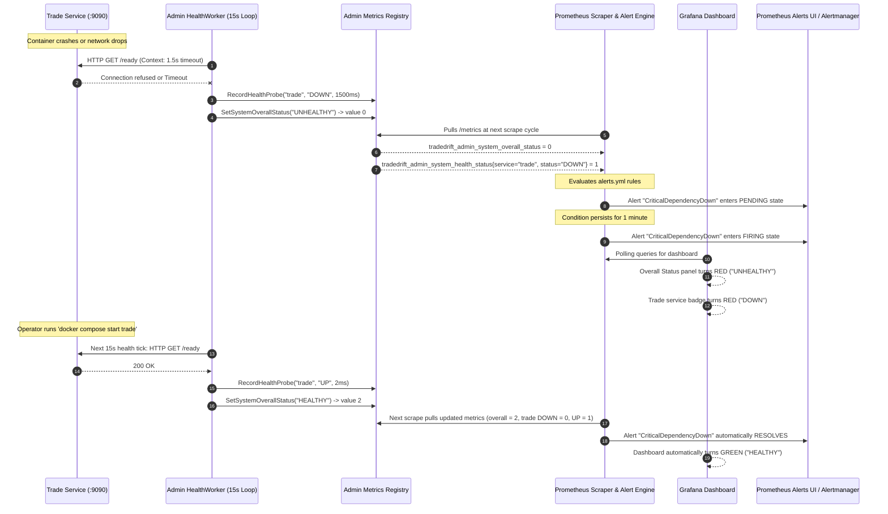

# TradeDrift Observability & Monitoring Infrastructure

This directory contains the complete, declarative **Observability and Telemetry Stack** for the TradeDrift platform, centered on **Prometheus** and **Grafana**. It enables automated metric scraping, alerting rules, declarative datasource provisioning, and operational dashboards.

---

## 1. Core Technologies: Prometheus & Grafana Explained

To understand this directory, it is essential to understand what **Prometheus** and **Grafana** are, why both are strictly required, and how they interact.

```
┌──────────────────────────────────────────────────────────────────────────────────┐
│                             TradeDrift Platform                                  │
│                                                                                  │
│  ┌─────────────────────────┐                 ┌────────────────────────────────┐  │
│  │   Admin Service         │                 │   Downstream Microservices     │  │
│  │   (Go 1.22+ runtime)    │                 │   (Trade, Portfolio, etc.)     │  │
│  │   • HealthWorker        │                 │   • Order matching engine      │  │
│  │   • OutboxPublisher     │                 │   • Balances & ledgers         │  │
│  │   • SagaWorker          │                 │                                │  │
│  │   Exposes: /metrics     │                 │   Exposes: /metrics            │  │
│  └────────────┬────────────┘                 └───────────────┬────────────────┘  │
└───────────────┼──────────────────────────────────────────────┼───────────────────┘
                │ HTTP Pull (every 15s)                        │ HTTP Pull (every 15s)
                ▼                                              ▼
┌──────────────────────────────────────────────────────────────────────────────────┐
│                                   PROMETHEUS                                     │
│  ┌────────────────────────────────────────────────────────────────────────────┐  │
│  │ 1. Scrape Engine: Periodically polls target endpoints via HTTP GET         │  │
│  │ 2. Time-Series DB (TSDB): Compressed, append-only disk storage              │  │
│  │ 3. PromQL Engine: Evaluates queries, rates, percentiles, histograms        │  │
│  │ 4. Alert Engine: Evaluates rules against live data (e.g. alerts.yml)       │  │
│  └─────────────────────────────────────┬──────────────────────────────────────┘  │
└────────────────────────────────────────┼─────────────────────────────────────────┘
                                         │ PromQL Queries over HTTP (:9090)
                                         ▼
┌──────────────────────────────────────────────────────────────────────────────────┐
│                                    GRAFANA                                       │
│  ┌────────────────────────────────────────────────────────────────────────────┐  │
│  │ 1. Datasource Proxy: Connects securely to Prometheus TSDB                  │  │
│  │ 2. Provisioning Engine: Auto-loads dashboards & datasources from disk      │  │
│  │ 3. Dashboard UI: Real-time gauges, time-series graphs, status maps         │  │
│  │ 4. Human Interface: The central operations cockpit for engineers/admins    │  │
│  └────────────────────────────────────────────────────────────────────────────┘  │
└──────────────────────────────────────────────────────────────────────────────────┘
```

### What is Prometheus?
Prometheus is a **time-series database and metric aggregation server**. It uses a **pull-based (scraping) model**:
- Every service exposes a lightweight HTTP endpoint (typically `/metrics`) formatted in Prometheus text notation.
- Prometheus reaches out on a configured interval (e.g., every 15 seconds) and pulls the current state of counters, gauges, and histograms.
- It stores this data with multi-dimensional labels (`service="trade"`, `status="DOWN"`, `route="/api/v1/admin/users/{user_id}/suspend"`).
- It continuously evaluates **alert rules** against incoming data using **PromQL** (Prometheus Query Language).

### What is Grafana?
Grafana is a **visualization and analytics platform**. It does **not** store time-series data itself:
- It connects to backing datastores (in our case, Prometheus) via configured datasources.
- It executes PromQL queries on-demand when an operator views a dashboard in their web browser.
- It renders visual components: color-coded health badges, latency quantile line graphs, transactional backlog gauges, and error rate percentages.

### Why do we need BOTH?
| Dimension | Prometheus Alone | Grafana Alone | Combined Architecture |
| :--- | :--- | :--- | :--- |
| **Data Collection** | Built-in pull scraper engine | Cannot scrape or collect data | Prometheus collects; Grafana queries |
| **Storage** | Highly optimized append-only TSDB | Has no metric storage engine | Prometheus stores; Grafana reads |
| **Alerting Engine** | Evaluates raw PromQL continuously | Can alert, but depends on a backend | Prometheus detects; Grafana visualizes |
| **Visual Dashboarding** | Basic, unstyled debug graphs | Rich, state-of-the-art dashboards | Prometheus feeds data; Grafana presents |
| **Role in Platform** | **The Storage Engine & Watchdog** | **The Operational Cockpit** | **Complete Observability Loop** |

Neither tool can replace the other:
- Without **Prometheus**, Grafana has zero data to display.
- Without **Grafana**, human operators would have to hand-craft PromQL expressions in a debug UI to understand platform health during an incident.

---

## 2. Directory Structure & Folder Purposes

The `monitoring/` tree is structured cleanly according to containerized Infrastructure-as-Code (IaC) best practices:

```
monitoring/
├── README.md                                  # Comprehensive architecture & operational documentation
├── prometheus/                                # Prometheus server configurations and alerting rules
│   ├── prometheus.yml                         # Global scrape intervals, target definitions, and rule file paths
│   └── alerts.yml                             # PromQL alert definitions and severity thresholds
└── grafana/                                   # Grafana UI, automation, and dashboard templates
    ├── dashboards/                            # Pre-built JSON dashboard layouts
    │   └── admin-overview.json                # Complete 11-panel TradeDrift Operations & Health dashboard
    └── provisioning/                          # Declarative startup configurations (no manual UI setup)
        ├── dashboards/                        # Automated dashboard loader settings
        │   └── dashboards.yml                 # Instructs Grafana to scan and mount the dashboards/ folder
        └── datasources/                       # Automated backend connections
            └── datasource.yml                 # Automatically binds Prometheus as default data source
```

---

## 3. Detailed File-by-File Analysis

### 3.1 [`monitoring/prometheus/prometheus.yml`](file:///c:/Users/AKHIL%20BABU/OneDrive/Desktop/tradedrift/monitoring/prometheus/prometheus.yml)
- **Path**: `monitoring/prometheus/prometheus.yml`
- **What Problem It Solves**: 
  Prometheus has no awareness of what servers exist in the Docker network unless instructed. Without this configuration, Prometheus does not know where to fetch metrics, how often to poll, or which alert rule files to execute.
- **How It Solves It**:
  1. **Global Configuration**:
     ```yaml
     global:
       scrape_interval: 15s
       evaluation_interval: 15s
     ```
     Sets a synchronized 15-second scrape cadence that matches the Admin Service's background `HealthWorker` cycle, ensuring real-time freshness without excessive network overhead.
  2. **Rule Inclusion**: Points directly to `/etc/prometheus/alerts.yml` inside the container.
  3. **Scrape Targets**: Declares static DNS targets within the Docker Compose network (`admin:8085`, `trade:9090`, `portfolio:9091`, `liquidity-engine:9090`, `notification:9092`), scraping each service's `/metrics` path.
- **Why We Need It**:
  Without this file, the Prometheus server boots up empty, scrapes nothing, stores nothing, and evaluates no alerts.

---

### 3.2 [`monitoring/prometheus/alerts.yml`](file:///c:/Users/AKHIL%20BABU/OneDrive/Desktop/tradedrift/monitoring/prometheus/alerts.yml)
- **Path**: `monitoring/prometheus/alerts.yml`
- **What Problem It Solves**:
  A monitoring system that only records data requires humans to constantly stare at screens to detect outages. In high-frequency financial platforms, outages must be identified autonomously the moment an anomaly breaches a threshold.
- **How It Solves It**:
  Defines 6 production alerting rules with strict PromQL thresholds and severity levels:

  1. **`AdminSagaTaskExhausted` (Severity: Critical)**:
     - *Expression*: `increase(tradedrift_admin_saga_tasks_total{result="EXHAUSTED"}[5m]) > 0`
     - *Condition*: A background distributed saga task (such as revoking user sessions or freezing wallets) has exceeded all exponential backoff retries and permanently stalled. Requires immediate operator intervention.
  2. **`AdminOutboxBacklogSpike` (Severity: Warning)**:
     - *Expression*: `tradedrift_admin_outbox_backlog_depth > 50 or tradedrift_admin_outbox_oldest_unpublished_seconds > 120`
     - *Condition*: Transactional events in PostgreSQL are not being published to Kafka fast enough, signaling Kafka broker congestion or downstream consumer backpressure.
  3. **`AdminServiceDown` (Severity: Critical)**:
     - *Expression*: `up{job="admin"} == 0 or absent(up{job="admin"}) == 1`
     - *Condition*: Prometheus cannot connect to the Admin Service process.
  4. **`CriticalDependencyDown` (Severity: Critical)**:
     - *Expression*: `tradedrift_admin_system_overall_status == 0`
     - *Condition*: The Admin Service's autonomous `HealthWorker` has detected a hard failure (`DOWN` or `TIMEOUT`) in a core dependency (PostgreSQL, Auth, Wallet, Trade, Portfolio, or Liquidity Engine).
  5. **`AdminHealthProbeStale` (Severity: Warning)**:
     - *Expression*: `time() - tradedrift_admin_health_probe_last_run_timestamp_seconds > 60`
     - *Condition*: The `HealthWorker` background loop has stopped executing probes for more than 60 seconds (worker deadlock or CPU starvation).
  6. **`HighAdminErrorRate` (Severity: Warning)**:
     - *Expression*: `(sum(rate(tradedrift_admin_http_requests_total{status=~"5.."}[5m])) / sum(rate(tradedrift_admin_http_requests_total[5m])) > 0.05) and (sum(rate(tradedrift_admin_http_requests_total[5m])) > 0)`
     - *Condition*: Admin HTTP requests return $>5\%$ 5xx server errors over a 5-minute rolling window (protected against division-by-zero during low traffic).
- **Why We Need It**:
  Transforms passive telemetry collection into an active detection system that flags critical failures within 60 seconds.

---

### 3.3 [`monitoring/grafana/provisioning/datasources/datasource.yml`](file:///c:/Users/AKHIL%20BABU/OneDrive/Desktop/tradedrift/monitoring/grafana/provisioning/datasources/datasource.yml)
- **Path**: `monitoring/grafana/provisioning/datasources/datasource.yml`
- **What Problem It Solves**:
  When Grafana starts up out of the box, it contains zero database connections. Typically, an administrator would have to log into the web UI (`http://localhost:3000`), click through settings, enter `http://prometheus:9090`, and save. This manual step breaks automated deployments, CI/CD, and reproducible Docker Compose environments.
- **How It Solves It**:
  Uses Grafana's native **Declarative Provisioning** schema:
  ```yaml
  apiVersion: 1
  datasources:
    - name: Prometheus
      type: prometheus
      access: proxy
      url: http://prometheus:9090
      isDefault: true
      editable: false
  ```
  On container boot, Grafana automatically creates the connection to `http://prometheus:9090`, designates it as the default datasource, and locks it against accidental manual tampering.
- **Why We Need It**:
  Achieves zero-touch infrastructure automation. Running `docker compose up -d` immediately provides a fully connected Grafana instance.

---

### 3.4 [`monitoring/grafana/provisioning/dashboards/dashboards.yml`](file:///c:/Users/AKHIL%20BABU/OneDrive/Desktop/tradedrift/monitoring/grafana/provisioning/dashboards/dashboards.yml)
- **Path**: `monitoring/grafana/provisioning/dashboards/dashboards.yml`
- **What Problem It Solves**:
  Just like datasources, dashboards normally require manual importing via the Grafana web UI. If a container restarts or is recreated, imported dashboards are lost unless backed by an external persistent database.
- **How It Solves It**:
  Configures a file-based dashboard provider:
  ```yaml
  apiVersion: 1
  providers:
    - name: 'TradeDrift Dashboards'
      orgId: 1
      folder: 'TradeDrift'
      type: file
      disableDeletion: false
      editable: true
      options:
        path: /etc/grafana/dashboards
  ```
  Instructs Grafana to scan `/etc/grafana/dashboards` inside the container and automatically mount any `.json` files it discovers into the "TradeDrift" folder.
- **Why We Need It**:
  Ensures dashboard definitions are version-controlled alongside application code in Git, rather than locked in a mutable database.

---

### 3.5 [`monitoring/grafana/dashboards/admin-overview.json`](file:///c:/Users/AKHIL%20BABU/OneDrive/Desktop/tradedrift/monitoring/grafana/dashboards/admin-overview.json)
- **Path**: `monitoring/grafana/dashboards/admin-overview.json`
- **What Problem It Solves**:
  Raw metric tables with dozens of Prometheus names (`tradedrift_admin_*`) are difficult to interpret under operational pressure. Operators need an intuitive, single-pane-of-glass visual dashboard.
- **How It Solves It**:
  Defines an 11-panel operations dashboard categorized into clear functional zones:
  1. **Row 1: System Health & Platform Availability**:
     - *Overall Platform Status*: Large stat panel color-coded dynamically (2 = Green `HEALTHY`, 1 = Yellow `DEGRADED`, 0 = Red `UNHEALTHY`).
     - *1-Hot Health Status Matrix*: Visual breakdown of downstream services (`auth`, `wallet`, `trade`, `portfolio`, `liquidity_engine`, `notification`, `postgres`, `kafka`) across `UP`, `DOWN`, `DEGRADED`, `TIMEOUT`, and `UNKNOWN`.
     - *Health Probe Latencies*: Millisecond/microsecond line graph tracking dependency probe responsiveness over time.
  2. **Row 2: HTTP Traffic & Latency**:
     - *Request Rate by Route*: Visualizes requests/sec grouped by normalized static routes (e.g. `/api/v1/admin/users/{user_id}/suspend`).
     - *p50 / p95 / p99 Latency Quantiles*: Histogram quantile graphs showing API performance.
  3. **Row 3: Admin Operations & Mutations**:
     - *Operations Completed/Failed*: Counter bar chart tracking Market Halts/Resumes and User Suspensions.
     - *Operations In-Flight*: Active concurrency gauge.
  4. **Row 4: Transactional Outbox & Saga Pipelines**:
     - *Outbox Backlog Depth*: Current count of unpublished events waiting in PostgreSQL.
     - *Oldest Unpublished Event Age*: Gauge tracking outbox lag in seconds.
     - *Outbox Retries & Worker Errors*: Bar charts highlighting broker delivery retries.
     - *Saga Task Queue*: Status distribution across `PENDING`, `RETRYING`, and `EXHAUSTED`.
- **Why We Need It**:
  Provides instant situational awareness for platform operators during incidents, deployments, and normal operation.

---

## 4. End-to-End Operational Flows

### Flow 1: Metric Collection & Ingestion Pipeline
How an internal Admin event reaches Prometheus storage:



---

### Flow 2: Live Operator Visualization Pipeline
How an operator views real-time metrics in Grafana:



---

### Flow 3: Dependency Outage, Detection, Alerting & Recovery Loop
How the platform detects a downstream failure, notifies Prometheus, triggers alerts, and automatically recovers:



---

## 5. Docker Compose Volume Mount Integration

In [`docker-compose.yml`](file:///c:/Users/AKHIL%20BABU/OneDrive/Desktop/tradedrift/docker-compose.yml), the monitoring services mount these folders as read-only volumes to guarantee consistent container startup:

```yaml
  prometheus:
    image: prom/prometheus:v2.51.0
    container_name: tradedrift-prometheus
    ports:
      - "9090:9090"
    volumes:
      - ./monitoring/prometheus/prometheus.yml:/etc/prometheus/prometheus.yml:ro
      - ./monitoring/prometheus/alerts.yml:/etc/prometheus/alerts.yml:ro
    depends_on:
      - admin

  grafana:
    image: grafana/grafana:10.4.0
    container_name: tradedrift-grafana
    ports:
      - "3000:3000"
    environment:
      - GF_SECURITY_ADMIN_USER=admin
      - GF_SECURITY_ADMIN_PASSWORD=admin
      - GF_USERS_ALLOW_SIGN_UP=false
    volumes:
      - ./monitoring/grafana/provisioning/datasources:/etc/grafana/provisioning/datasources:ro
      - ./monitoring/grafana/provisioning/dashboards:/etc/grafana/provisioning/dashboards:ro
      - ./monitoring/grafana/dashboards:/etc/grafana/dashboards:ro
    depends_on:
      - prometheus
```

### Quick Access Endpoints
- **TradeDrift Admin Service**: [http://localhost:8085](http://localhost:8085)
  - Metrics: [http://localhost:8085/metrics](http://localhost:8085/metrics)
  - Platform Diagnostic: [http://localhost:8085/api/v1/admin/system/health](http://localhost:8085/api/v1/admin/system/health)
- **Prometheus UI**: [http://localhost:9090](http://localhost:9090)
  - Active Targets: [http://localhost:9090/targets](http://localhost:9090/targets)
  - Alert States: [http://localhost:9090/alerts](http://localhost:9090/alerts)
- **Grafana Dashboard UI**: [http://localhost:3000](http://localhost:3000) (Credentials: `admin` / `admin`)
  - Direct Dashboard: [http://localhost:3000/d/tradedrift-admin-overview](http://localhost:3000/d/tradedrift-admin-overview)
