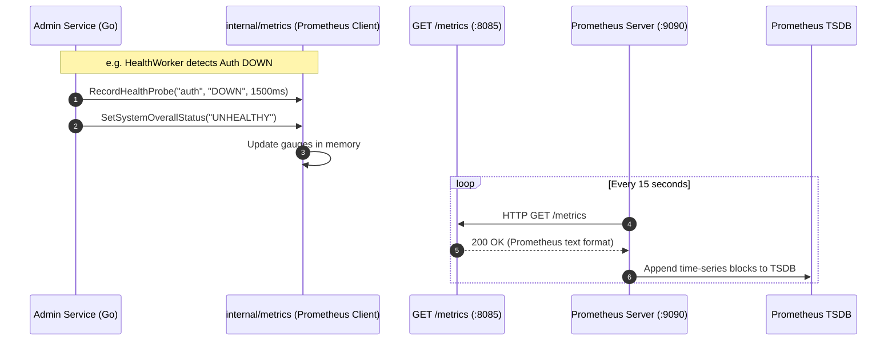
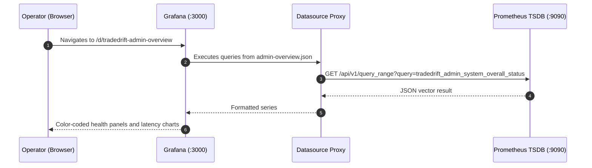
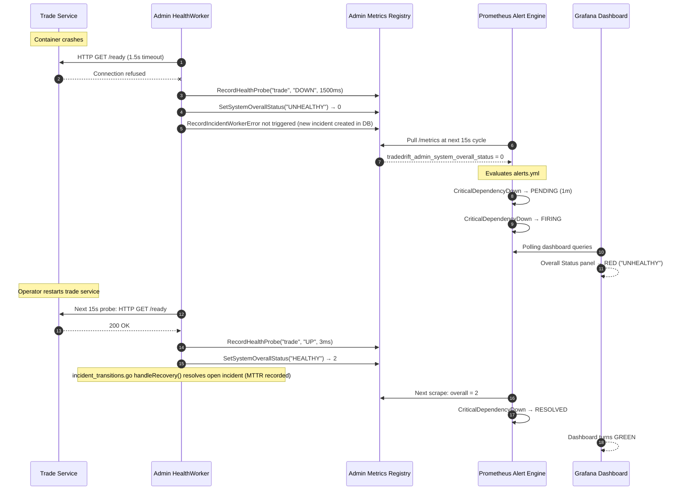

# TradeDrift Observability & Monitoring Infrastructure

This directory contains the complete, declarative **Observability and Telemetry Stack** for the TradeDrift platform, centered on **Prometheus** and **Grafana**. It enables automated metric scraping, alerting rules, declarative datasource provisioning, and operational dashboards.

---

## 1. Core Technologies: Prometheus & Grafana Explained

```
┌──────────────────────────────────────────────────────────────────────────────────┐
│                             TradeDrift Platform                                  │
│                                                                                  │
│  ┌─────────────────────────┐                 ┌────────────────────────────────┐  │
│  │   Admin Service         │                 │   Downstream Microservices     │  │
│  │   (Go 1.22+ runtime)    │                 │   (Trade, Portfolio, etc.)     │  │
│  │   • HealthWorker        │                 │   • Order matching engine      │  │
│  │   • OutboxPublisher     │                 │   • Balances & ledgers         │  │
│  │   • SagaWorker          │                 │                                │  │
│  │   • IncidentFSM         │                 │   Exposes: /metrics            │  │
│  │   Exposes: /metrics     │                 │                                │  │
│  └────────────┬────────────┘                 └───────────────┬────────────────┘  │
└───────────────┼──────────────────────────────────────────────┼───────────────────┘
                │ HTTP Pull (every 15s)                        │ HTTP Pull (every 15s)
                ▼                                              ▼
┌──────────────────────────────────────────────────────────────────────────────────┐
│                                   PROMETHEUS                                     │
│  1. Scrape Engine: Periodically polls target endpoints via HTTP GET              │
│  2. Time-Series DB (TSDB): Compressed, append-only disk storage                 │
│  3. PromQL Engine: Evaluates queries, rates, percentiles, histograms            │
│  4. Alert Engine: Evaluates rules against live data (alerts.yml)                │
└────────────────────────────────────────┬─────────────────────────────────────────┘
                                         │ PromQL Queries over HTTP (:9090)
                                         ▼
┌──────────────────────────────────────────────────────────────────────────────────┐
│                                    GRAFANA                                       │
│  1. Datasource Proxy: Connects securely to Prometheus TSDB                      │
│  2. Provisioning Engine: Auto-loads dashboards & datasources from disk          │
│  3. Dashboard UI: Real-time gauges, time-series graphs, status maps             │
│  4. Human Interface: The central operations cockpit for engineers/admins        │
└──────────────────────────────────────────────────────────────────────────────────┘
```

| Dimension | Prometheus Alone | Grafana Alone | Combined |
| :--- | :--- | :--- | :--- |
| **Data Collection** | Built-in pull scraper | Cannot collect data | Prometheus collects; Grafana queries |
| **Storage** | Optimized TSDB | No metric storage | Prometheus stores; Grafana reads |
| **Alerting** | Evaluates raw PromQL | Needs a backend | Prometheus detects; Grafana visualizes |
| **Dashboards** | Basic debug graphs | Rich state-of-the-art UI | Prometheus feeds; Grafana presents |

---

## 2. Directory Structure

```
monitoring/
├── README.md                                       # This document
├── prometheus/
│   ├── prometheus.yml                              # Global scrape intervals, targets, rule file paths
│   └── alerts.yml                                  # 10 PromQL alert definitions across 2 severity tiers
└── grafana/
    ├── dashboards/
    │   └── admin-overview.json                     # 11-panel TradeDrift Operations & Health dashboard
    └── provisioning/
        ├── dashboards/
        │   └── dashboards.yml                      # Auto-mounts dashboards/ folder on startup
        └── datasources/
            └── datasource.yml                      # Binds Prometheus as default datasource on startup
```

---

## 3. Detailed File-by-File Analysis

### 3.1 [`monitoring/prometheus/prometheus.yml`](file:///c:/Users/AKHIL%20BABU/OneDrive/Desktop/tradedrift/monitoring/prometheus/prometheus.yml)

- **Problem**: Prometheus has no awareness of services unless instructed. Without this file it scrapes nothing and evaluates no alerts.
- **How Solved**:
  1. **Global cadence**: `scrape_interval: 15s` — synchronized with the Admin `HealthWorker` probe cycle.
  2. **Rule inclusion**: `/etc/prometheus/alerts.yml` inside the container.
  3. **Scrape targets**: Static DNS targets within the Docker Compose network:

| Job | Target | Path |
| :--- | :--- | :--- |
| `admin` | `admin:8085` | `/metrics` |
| `trade` | `trade:9090` | `/metrics` |
| `portfolio` | `portfolio:9091` | `/metrics` |
| `liquidity-engine` | `liquidity-engine:9090` | `/metrics` |
| `notification` | `notification:9092` | `/metrics` |

---

### 3.2 [`monitoring/prometheus/alerts.yml`](file:///c:/Users/AKHIL%20BABU/OneDrive/Desktop/tradedrift/monitoring/prometheus/alerts.yml)

Defines **10 production alerting rules** across two groups: baseline operational health and Phase 3 advanced operational intelligence.

#### Group 1: Baseline Operational Alerts

| Alert | Severity | Expression | Fires When |
| :--- | :--- | :--- | :--- |
| `AdminSagaTaskExhausted` | **critical** | `increase(tradedrift_admin_saga_tasks_total{result="EXHAUSTED"}[5m]) > 0` | A distributed saga (Auth session invalidation, wallet freeze) has exceeded all retry attempts and permanently stalled. Requires immediate manual intervention. |
| `AdminOutboxBacklogSpike` | **warning** | `tradedrift_admin_outbox_backlog_depth > 50 or tradedrift_admin_outbox_oldest_unpublished_seconds > 120` | Transactional outbox events are not being published to Kafka fast enough — Kafka broker congestion or consumer backpressure. |
| `AdminServiceDown` | **critical** | `up{job="admin"} == 0 or absent(up{job="admin"}) == 1` | Prometheus cannot reach the Admin Service process at `admin:8085`. |
| `CriticalDependencyDown` | **critical** | `tradedrift_admin_system_overall_status == 0` | The Admin `HealthWorker` has detected a hard failure (`DOWN`/`TIMEOUT`) in a core dependency (PostgreSQL, Auth, Wallet, Trade, Portfolio, Liquidity Engine). |
| `AdminHealthProbeStale` | **warning** | `time() - tradedrift_admin_health_probe_last_run_timestamp_seconds > 60` | The `HealthWorker` background loop has stopped executing probes for >60 seconds — potential worker deadlock or CPU starvation. |
| `HighAdminErrorRate` | **warning** | `(sum(rate(tradedrift_admin_http_requests_total{status=~"5.."}[5m])) / sum(rate(...[5m])) > 0.05) and (sum(...) > 0)` | Admin HTTP requests return >5% 5xx errors over a 5-minute rolling window (guarded against division-by-zero during low traffic). |

#### Group 2: Phase 3 Advanced Operational & Anomaly Alerts

| Alert | Severity | Expression | Fires When |
| :--- | :--- | :--- | :--- |
| `MassUserSuspensionAnomaly` | **critical** | `increase(tradedrift_admin_operations_total{operation_type="SUSPEND_USER",status="SUCCESS"}[10m]) >= 5` | ≥5 user suspensions succeed within 10 minutes — possible compromised admin credential or runaway automation. |
| `MassWalletFreezeAnomaly` | **critical** | `increase(tradedrift_admin_operations_total{operation_type="FREEZE_WALLET",status="SUCCESS"}[10m]) >= 5` | ≥5 wallet freezes succeed within 10 minutes — potential account security incident. |
| `ExtendedMarketHaltWarning` | **warning** | `(tradedrift_admin_market_halt_status == 1) and ((time() - tradedrift_admin_market_halt_start_timestamp_seconds) > 1800)` | A market has been in `HALTED` state for >30 minutes. The halt start timestamp metric persists across Admin service restarts via `ReconstructMarketState()`. |
| `CascadingDependencyOutage` | **critical** | `count(tradedrift_admin_service_health_status{status="DOWN"} == 1) >= 2` | Two or more platform services simultaneously reporting `DOWN` — indicates cluster or network failure rather than an isolated service crash. |
| `AdminAPIHighErrorBudgetBurnRate` | **critical** | `(sum(rate(...5xx[5m])) / clamp_min(sum(rate(...total[5m])), 0.001)) > (14.4 * 0.01)` | 5xx error budget burning at 14.4× normal rate — consuming >2% of monthly error budget in 1 hour (SLO burn-rate alert). |

> **Why 10 rules?** The first 6 cover process-level reliability (the Admin service itself is alive and functional). The last 4 cover business-level anomalies and SLO compliance — behaviors that are technically "working" at the process level but represent security or operational risk.

---

### 3.3 [`monitoring/grafana/provisioning/datasources/datasource.yml`](file:///c:/Users/AKHIL%20BABU/OneDrive/Desktop/tradedrift/monitoring/grafana/provisioning/datasources/datasource.yml)

- **Problem**: Fresh Grafana has zero database connections. Manual UI setup breaks automated deployments.
- **How Solved**: Declarative provisioning schema auto-creates the Prometheus connection at container boot:
  ```yaml
  datasources:
    - name: Prometheus
      type: prometheus
      url: http://prometheus:9090
      isDefault: true
      editable: false
  ```

---

### 3.4 [`monitoring/grafana/provisioning/dashboards/dashboards.yml`](file:///c:/Users/AKHIL%20BABU/OneDrive/Desktop/tradedrift/monitoring/grafana/provisioning/dashboards/dashboards.yml)

- **Problem**: Dashboards imported via the UI are lost if the container is recreated.
- **How Solved**: File-based provider scans `/etc/grafana/dashboards` and auto-mounts any `.json` files into the "TradeDrift" folder. Dashboard definitions live in Git alongside application code.

---

### 3.5 [`monitoring/grafana/dashboards/admin-overview.json`](file:///c:/Users/AKHIL%20BABU/OneDrive/Desktop/tradedrift/monitoring/grafana/dashboards/admin-overview.json)

An 11-panel operations dashboard in 4 rows:

**Row 1: System Health & Platform Availability**
- *Overall Platform Status*: Large stat panel — `2=Green (HEALTHY)`, `1=Yellow (DEGRADED)`, `0=Red (UNHEALTHY)`.
- *1-Hot Health Status Matrix*: Breakdown of all 8 components (`auth`, `wallet`, `trade`, `portfolio`, `liquidity_engine`, `notification`, `postgres`, `kafka`) across 5 states (`UP`, `DOWN`, `DEGRADED`, `TIMEOUT`, `UNKNOWN`).
- *Health Probe Latencies*: Millisecond line graph per service.

**Row 2: HTTP Traffic & Latency**
- *Request Rate by Route*: requests/sec grouped by normalized static routes.
- *p50 / p95 / p99 Latency Quantiles*: Histogram quantile line graphs.

**Row 3: Admin Operations & Mutations**
- *Operations Completed/Failed*: Counter bar chart by operation type.
- *Operations In-Flight*: Active concurrency gauge.

**Row 4: Transactional Outbox & Saga Pipelines**
- *Outbox Backlog Depth*: Current unpublished event count.
- *Oldest Unpublished Event Age*: Outbox lag in seconds.
- *Outbox Retries & Worker Errors*: Bar charts highlighting delivery issues.
- *Saga Task Queue*: Status distribution across `PENDING`, `RETRYING`, `EXHAUSTED`.

---

## 4. Metric Catalog (Admin Service — `tradedrift_admin_*`)

| Metric Name | Type | Labels | Description |
| :--- | :--- | :--- | :--- |
| `tradedrift_admin_http_requests_total` | Counter | `method`, `route`, `status` | Total HTTP requests by normalized route |
| `tradedrift_admin_http_request_duration_seconds` | Histogram | `method`, `route` | Request duration in seconds |
| `tradedrift_admin_http_requests_in_flight` | Gauge | — | Currently executing HTTP requests |
| `tradedrift_admin_operations_total` | Counter | `operation_type`, `status` | Admin operations by type and result |
| `tradedrift_admin_operations_duration_seconds` | Histogram | `operation_type` | End-to-end operation duration |
| `tradedrift_admin_operations_in_flight` | Gauge | `operation_type` | In-flight operations by type |
| `tradedrift_admin_system_health_status` | Gauge | `service`, `status` | **1-hot** per-service health status |
| `tradedrift_admin_system_overall_status` | Gauge | — | `2=HEALTHY`, `1=DEGRADED`, `0=UNHEALTHY` |
| `tradedrift_admin_health_probe_latency_seconds` | Gauge | `service` | Last probe round-trip latency |
| `tradedrift_admin_health_probe_last_run_timestamp_seconds` | Gauge | `service` | Unix timestamp of last probe per service |
| `tradedrift_admin_health_failures_total` | Counter | `service`, `reason` | Probe failures by service and reason (`timeout`, `http_503`, `connection_error`, …) |
| `tradedrift_admin_outbox_backlog_depth` | Gauge | — | Unpublished outbox event count |
| `tradedrift_admin_outbox_oldest_unpublished_seconds` | Gauge | — | Age of oldest unpublished event |
| `tradedrift_admin_outbox_retries_total` | Counter | — | Outbox Kafka write retries |
| `tradedrift_admin_saga_tasks_total` | Counter | `result` | Saga task completions by result (`COMPLETED`, `EXHAUSTED`) |
| `tradedrift_admin_saga_queue_depth` | Gauge | `status` | Saga task count by status |
| `tradedrift_admin_market_halt_status` | Gauge | `market_id` | `1` if market is currently halted |
| `tradedrift_admin_market_halt_start_timestamp_seconds` | Gauge | `market_id` | Unix epoch when halt started (survives restarts via `ReconstructMarketState`) |
| `tradedrift_admin_incident_worker_errors_total` | Counter | `operation` | Incident FSM errors by operation (`lookup`, `create`, `heartbeat`, `resolve`) |

### 1-Hot Boolean Gauge Invariant
For each `(service, status)` combination:
```
tradedrift_admin_system_health_status{service="trade", status="UP"}      = 1.0  ← exactly one = 1
tradedrift_admin_system_health_status{service="trade", status="DOWN"}    = 0.0
tradedrift_admin_system_health_status{service="trade", status="DEGRADED"}= 0.0
tradedrift_admin_system_health_status{service="trade", status="TIMEOUT"} = 0.0
tradedrift_admin_system_health_status{service="trade", status="UNKNOWN"} = 0.0
                                                                           ─────
                                                                           SUM = 1.0
```
This prevents stale `DOWN=1` gauges lingering when a service recovers.

---

## 5. End-to-End Operational Flows

### Flow 1: Metric Collection & Ingestion Pipeline


```mermaid
sequenceDiagram
    autonumber
    participant App as Admin Service (Go)
    participant Metrics as internal/metrics (Prometheus Client)
    participant Endpoint as GET /metrics (:8085)
    participant Prom as Prometheus Server (:9090)
    participant Disk as Prometheus TSDB

    Note over App,Metrics: e.g. HealthWorker detects Auth DOWN
    App->>Metrics: RecordHealthProbe("auth", "DOWN", 1500ms)
    App->>Metrics: SetSystemOverallStatus("UNHEALTHY")
    Metrics->>Metrics: Update gauges in memory
    loop Every 15 seconds
        Prom->>Endpoint: HTTP GET /metrics
        Endpoint-->>Prom: 200 OK (Prometheus text format)
        Prom->>Disk: Append time-series blocks to TSDB
    end
```

### Flow 2: Live Operator Visualization


```mermaid
sequenceDiagram
    autonumber
    participant User as Operator (Browser)
    participant Grafana as Grafana (:3000)
    participant DS as Datasource Proxy
    participant Prom as Prometheus TSDB (:9090)

    User->>Grafana: Navigates to /d/tradedrift-admin-overview
    Grafana->>DS: Executes queries from admin-overview.json
    DS->>Prom: GET /api/v1/query_range?query=tradedrift_admin_system_overall_status
    Prom-->>DS: JSON vector result
    DS-->>Grafana: Formatted series
    Grafana-->>User: Color-coded health panels and latency charts
```

### Flow 3: Dependency Outage → Alert → Recovery


```mermaid
sequenceDiagram
    autonumber
    participant Downstream as Trade Service
    participant HW as Admin HealthWorker
    participant Metrics as Admin Metrics Registry
    participant Prom as Prometheus Alert Engine
    participant Grafana as Grafana Dashboard

    Note over Downstream: Container crashes
    HW->>Downstream: HTTP GET /ready (1.5s timeout)
    Downstream--XHW: Connection refused
    HW->>Metrics: RecordHealthProbe("trade", "DOWN", 1500ms)
    HW->>Metrics: SetSystemOverallStatus("UNHEALTHY") → 0
    HW->>Metrics: RecordIncidentWorkerError not triggered (new incident created in DB)

    Prom->>Metrics: Pull /metrics at next 15s cycle
    Metrics-->>Prom: tradedrift_admin_system_overall_status = 0
    Note over Prom: Evaluates alerts.yml
    Prom->>Prom: CriticalDependencyDown → PENDING (1m)
    Prom->>Prom: CriticalDependencyDown → FIRING

    Grafana->>Prom: Polling dashboard queries
    Grafana-->>Grafana: Overall Status panel → RED ("UNHEALTHY")

    Note over Downstream: Operator restarts trade service
    HW->>Downstream: Next 15s probe: HTTP GET /ready
    Downstream-->>HW: 200 OK
    HW->>Metrics: RecordHealthProbe("trade", "UP", 3ms)
    HW->>Metrics: SetSystemOverallStatus("HEALTHY") → 2
    Note over HW: incident_transitions.go handleRecovery() resolves open incident (MTTR recorded)

    Prom->>Metrics: Next scrape: overall = 2
    Prom->>Prom: CriticalDependencyDown → RESOLVED
    Grafana-->>Grafana: Dashboard turns GREEN
```

---

## 6. Docker Compose Volume Mount Integration

In [`docker-compose.yml`](file:///c:/Users/AKHIL%20BABU/OneDrive/Desktop/tradedrift/docker-compose.yml), the monitoring services mount these folders as read-only volumes:

```yaml
prometheus:
  image: prom/prometheus:v2.51.0
  container_name: tradedrift-prometheus
  ports:
    - "9090:9090"
  volumes:
    - ./monitoring/prometheus/prometheus.yml:/etc/prometheus/prometheus.yml:ro
    - ./monitoring/prometheus/alerts.yml:/etc/prometheus/alerts.yml:ro

grafana:
  image: grafana/grafana:10.4.0
  container_name: tradedrift-grafana
  ports:
    - "3000:3000"
  environment:
    - GF_SECURITY_ADMIN_USER=admin
    - GF_SECURITY_ADMIN_PASSWORD=admin
    - GF_USERS_ALLOW_SIGN_UP=false
  volumes:
    - ./monitoring/grafana/provisioning/datasources:/etc/grafana/provisioning/datasources:ro
    - ./monitoring/grafana/provisioning/dashboards:/etc/grafana/provisioning/dashboards:ro
    - ./monitoring/grafana/dashboards:/etc/grafana/dashboards:ro
  depends_on:
    - prometheus
```

---

## 7. Quick Access Endpoints

| Endpoint | URL |
| :--- | :--- |
| Admin Service Metrics | [http://localhost:8085/metrics](http://localhost:8085/metrics) |
| Admin Platform Diagnostic | [http://localhost:8085/api/v1/admin/system/health](http://localhost:8085/api/v1/admin/system/health) |
| Admin Topology | [http://localhost:8085/api/v1/admin/topology](http://localhost:8085/api/v1/admin/topology) |
| Prometheus UI | [http://localhost:9090](http://localhost:9090) |
| Prometheus Active Targets | [http://localhost:9090/targets](http://localhost:9090/targets) |
| Prometheus Alert States | [http://localhost:9090/alerts](http://localhost:9090/alerts) |
| Grafana Dashboard | [http://localhost:3000](http://localhost:3000) (admin / admin) |
| TradeDrift Dashboard | [http://localhost:3000/d/tradedrift-admin-overview](http://localhost:3000/d/tradedrift-admin-overview) |
