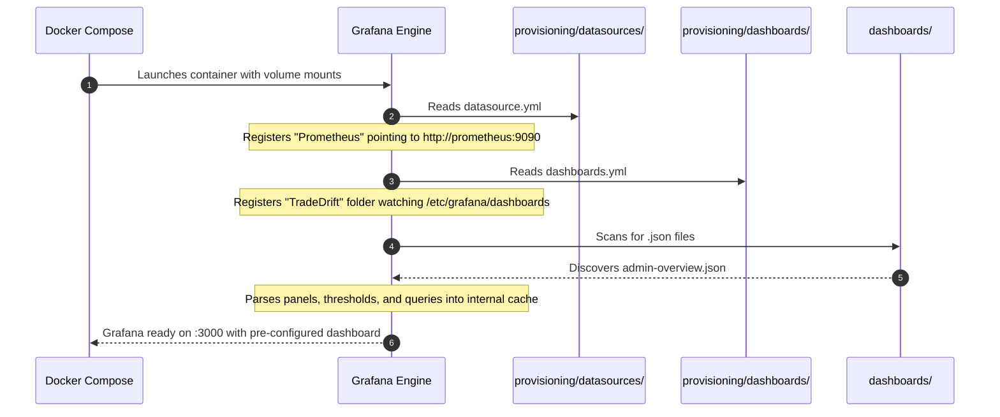
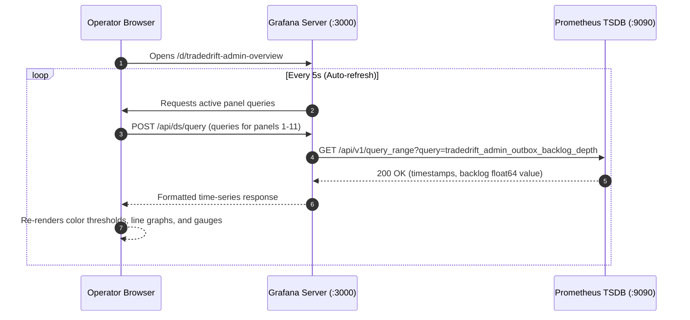

# Grafana Visualization & Provisioning Subsystem

This directory contains the declarative **Dashboard Configurations**, **Automated Provisioning Files**, and **Visual Layouts** for **Grafana** in the TradeDrift platform.

---

## 1. Directory Purpose & Folder Hierarchy

The `monitoring/grafana/` directory configures Grafana as the **operational cockpit and visualization glass** for TradeDrift.

```
monitoring/grafana/
├── README.md                              # This comprehensive architecture & operational documentation
├── dashboards/                            # Version-controlled JSON dashboard definitions
│   └── admin-overview.json                # Complete 11-panel Admin & Platform Health operations dashboard
└── provisioning/                          # Declarative Infrastructure-as-Code (IaC) configuration
    ├── dashboards/                        # Automated dashboard mounting definitions
    │   └── dashboards.yml                 # Instructs Grafana to discover and mount files from /etc/grafana/dashboards
    └── datasources/                       # Automated backend datasource definitions
        └── datasource.yml                 # Declares Prometheus (:9090) as the default data source
```

### Folder Purposes
1. **`monitoring/grafana/`**: Root container for all Grafana assets, provisioning configurations, and dashboards.
2. **`monitoring/grafana/provisioning/`**: Employs Grafana's native **Declarative Provisioning Engine**. When the container boots, it parses this tree to configure data sources and dashboards automatically, eliminating manual GUI setup.
3. **`monitoring/grafana/provisioning/datasources/`**: Contains datasource configuration files that instruct Grafana which time-series databases to connect to.
4. **`monitoring/grafana/provisioning/dashboards/`**: Contains provider definitions that tell Grafana which folders to watch for dashboard JSON templates.
5. **`monitoring/grafana/dashboards/`**: Contains exported, version-controlled JSON dashboard schemas. Any changes made here are immediately reflected in Grafana.

---

## 2. File-by-File Deep Dive

### 2.1 [`provisioning/datasources/datasource.yml`](file:///c:/Users/AKHIL%20BABU/OneDrive/Desktop/tradedrift/monitoring/grafana/provisioning/datasources/datasource.yml)

#### Purpose
`datasource.yml` automatically registers **Prometheus** as Grafana's default data source at boot time.

#### What Problem This File Solves
In a fresh Grafana deployment:
- Grafana has no pre-configured connection to any database.
- An operator would normally have to log into `http://localhost:3000`, navigate to *Connections $\to$ Data Sources $\to$ Add new data source*, choose Prometheus, type `http://prometheus:9090`, and click *Save & Test*.
- If the Grafana container is destroyed or upgraded, these manual settings are wiped out unless backed by a persistent external database.
- In automated CI/CD and Docker Compose environments, manual web UI configuration is unacceptable.

#### How It Solves the Problem
Uses declarative YAML conforming to Grafana's `apiVersion: 1`:
```yaml
apiVersion: 1

datasources:
  - name: Prometheus
    type: prometheus
    access: proxy
    url: http://prometheus:9090
    isDefault: true
    editable: false
```
- `name: Prometheus`: Canonical name referenced by panels and dashboards.
- `type: prometheus`: Activates Grafana's built-in Prometheus PromQL query editor and histogram processor.
- `access: proxy`: Grafana's server-side backend proxies queries directly over the internal Docker network (`http://prometheus:9090`). The operator's browser never needs direct network access to Prometheus port 9090.
- `isDefault: true`: Automatically routes all new panels and PromQL expressions to this source.
- `editable: false`: Locks the datasource against accidental modification or deletion through the Grafana web UI.

#### Why We Need This File
Without `datasource.yml`, Grafana cannot execute PromQL queries, and all dashboard panels will display an error: *"Datasource Prometheus was not found"*.

---

### 2.2 [`provisioning/dashboards/dashboards.yml`](file:///c:/Users/AKHIL%20BABU/OneDrive/Desktop/tradedrift/monitoring/grafana/provisioning/dashboards/dashboards.yml)

#### Purpose
`dashboards.yml` configures a **file-based dashboard provider** that instructs Grafana to scan a directory on disk and import all JSON dashboards found inside it.

#### What Problem This File Solves
- Dashboards created through the web UI are stored in Grafana's internal SQLite database inside the container.
- If the container is destroyed or rebuilt, dashboards are lost.
- Teams cannot code-review dashboard changes in Git pull requests if dashboards live solely in a container's database.

#### How It Solves the Problem
```yaml
apiVersion: 1

providers:
  - name: 'TradeDrift Dashboards'
    orgId: 1
    folder: 'TradeDrift'
    type: file
    disableDeletion: false
    editable: true
    options:
      path: /etc/grafana/dashboards
```
- `name: 'TradeDrift Dashboards'`: Logical provider name.
- `folder: 'TradeDrift'`: Automatically organizes imported dashboards into a dedicated "TradeDrift" folder in the Grafana UI.
- `type: file`: Instructs Grafana to read static `.json` files from the filesystem.
- `options.path: /etc/grafana/dashboards`: Points to the container path where [`monitoring/grafana/dashboards`](file:///c:/Users/AKHIL%20BABU/OneDrive/Desktop/tradedrift/monitoring/grafana/dashboards) is mounted via `docker-compose.yml`.

#### Why We Need This File
Without `dashboards.yml`, Grafana starts with an empty dashboard list. Operators would have to manually re-import `admin-overview.json` every time the container is recreated.

---

### 2.3 [`dashboards/admin-overview.json`](file:///c:/Users/AKHIL%20BABU/OneDrive/Desktop/tradedrift/monitoring/grafana/dashboards/admin-overview.json)

#### Purpose
`admin-overview.json` is the complete schema definition of the **TradeDrift Admin & Platform Operations Dashboard**. It translates TradeDrift's raw Prometheus telemetry into an intuitive, high-density operations center.

#### What Problem This File Solves
During production operation or an ongoing incident:
- Operators cannot manually construct PromQL histogram quantiles, regex routes, or 1-hot boolean status filters under stress.
- Raw metric values alone do not communicate high-level platform availability (e.g., is Kafka degradation impacting outbox publishing? Is an Auth gRPC failure causing saga retries to exhaust?).

#### How It Solves the Problem
Organizes 11 specialized panels across 4 visual rows:

```
┌─────────────────────────────────────────────────────────────────────────────────────────────┐
│ ROW 1: System Health & Platform Availability                                                │
│ ┌─────────────────────────┐ ┌─────────────────────────────────┐ ┌─────────────────────────┐ │
│ │  Overall Platform Status │ │ 1-Hot Health Status Matrix       │ │ Health Probe Latencies  │ │
│ │  (HEALTHY/DEGRADED/     │ │ (UP/DOWN/TIMEOUT/UNKNOWN by     │ │ (Preserves sub-ms       │ │
│ │   UNHEALTHY gauge)      │ │  service)                       │ │  latencies over time)   │ │
│ └─────────────────────────┘ └─────────────────────────────────┘ └─────────────────────────┘ │
├─────────────────────────────────────────────────────────────────────────────────────────────┤
│ ROW 2: HTTP Traffic & Latency                                                               │
│ ┌──────────────────────────────────────────────┐ ┌────────────────────────────────────────┐ │
│ │  HTTP Request Rate by Normalized Route       │ │  p50 / p95 / p99 Latency Quantiles     │ │
│ │  (Req/sec with zero dynamic ID explosion)    │ │  (From duration histogram buckets)     │ │
│ └──────────────────────────────────────────────┘ └────────────────────────────────────────┘ │
├─────────────────────────────────────────────────────────────────────────────────────────────┤
│ ROW 3: Admin Operations & Mutations                                                         │
│ ┌──────────────────────────────────────────────┐ ┌────────────────────────────────────────┐ │
│ │  Operations Total (Halt, Resume, Suspend)    │ │  Active Operations In-Flight           │ │
│ │  (Grouped by COMPLETED vs FAILED)            │ │  (Tracks active execution concurrency) │ │
│ └──────────────────────────────────────────────┘ └────────────────────────────────────────┘ │
├─────────────────────────────────────────────────────────────────────────────────────────────┤
│ ROW 4: Transactional Outbox & Saga Pipelines                                                │
│ ┌──────────────────────┐ ┌─────────────────────┐ ┌───────────────────┐ ┌──────────────────┐ │
│ │ Outbox Backlog Depth │ │ Oldest Event Lag(s) │ │ Outbox Retries    │ │ Saga Tasks Queue │ │
│ │ (Pending DB records) │ │ (Alerts if >120s)   │ │ (Broker ACK wait) │ │ (PENDING/RETRY/  │ │
│ │                      │ │                     │ │                   │ │  EXHAUSTED)      │ │
│ └──────────────────────┘ └─────────────────────┘ └───────────────────┘ └──────────────────┘ │
└─────────────────────────────────────────────────────────────────────────────────────────────┘
```

#### Detailed Panel Breakdown

1. **Overall Platform Status** (`Panel ID: 1`):
   - *PromQL*: `tradedrift_admin_system_overall_status`
   - *Mapping*: `2` $\to$ Green `HEALTHY`, `1` $\to$ Yellow `DEGRADED`, `0` $\to$ Red `UNHEALTHY`.
2. **1-Hot Component Health Matrix** (`Panel ID: 2`):
   - *PromQL*: `tradedrift_admin_system_health_status == 1`
   - *Mapping*: Displays active state for each dependency (`auth`, `wallet`, `trade`, `portfolio`, `liquidity_engine`, `notification`, `postgres`, `kafka`).
3. **Health Probe Latencies** (`Panel ID: 3`):
   - *PromQL*: `tradedrift_admin_health_probe_latency_seconds`
   - *Visual*: Line graph tracking response time per dependency with sub-millisecond precision.
4. **HTTP Request Rate by Route** (`Panel ID: 4`):
   - *PromQL*: `sum by (route) (rate(tradedrift_admin_http_requests_total[1m]))`
   - *Feature*: Protects against cardinality explosion using normalized route paths (`/api/v1/admin/users/{user_id}/suspend`).
5. **Request Latency Quantiles** (`Panel ID: 5`):
   - *PromQL*: `histogram_quantile(0.99, ...)` and `0.95`, `0.50`.
6. **Operations Rate & Status** (`Panel ID: 6`):
   - *PromQL*: `sum by (operation_type, result) (rate(tradedrift_admin_operations_total[5m]))`
7. **In-Flight Operations** (`Panel ID: 7`):
   - *PromQL*: `tradedrift_admin_operations_in_flight`
8. **Outbox Backlog Depth** (`Panel ID: 8`):
   - *PromQL*: `tradedrift_admin_outbox_backlog_depth`
   - *Threshold*: Turns yellow at 20 events, red at 50 events.
9. **Oldest Unpublished Outbox Age** (`Panel ID: 9`):
   - *PromQL*: `tradedrift_admin_outbox_oldest_unpublished_seconds`
   - *Threshold*: Turns red if an unpublished event has been queued longer than 120 seconds.
10. **Outbox Retries & Failures** (`Panel ID: 10`):
    - *PromQL*: `rate(tradedrift_admin_outbox_retries_total[5m])`
11. **Saga Queue Status** (`Panel ID: 11`):
    - *PromQL*: `tradedrift_admin_saga_queue_count`
    - *Coloring*: Yellow for `RETRYING`, bright red for `EXHAUSTED`.

#### Why We Need This File
Without this file, operators would have to manually build panels from scratch. It guarantees that every developer and operations engineer views the exact same verified telemetry layout.

---

## 3. Operational Flows

### Flow 1: Automated Boot & Provisioning Flow
How Grafana bootstraps itself without manual intervention:



---

### Flow 2: On-Demand Query & Rendering Flow
How a dashboard panel updates on the operator's screen:



---

## 4. Default Credentials & Access Information

When running via `docker compose up -d`:
- **URL**: [http://localhost:3000](http://localhost:3000)
- **Default Username**: `admin`
- **Default Password**: `admin`
- **Direct Dashboard Link**: [http://localhost:3000/d/tradedrift-admin-overview](http://localhost:3000/d/tradedrift-admin-overview)
- **Mounted Dashboard Folder**: Located under the **TradeDrift** folder in the left navigation sidebar.
