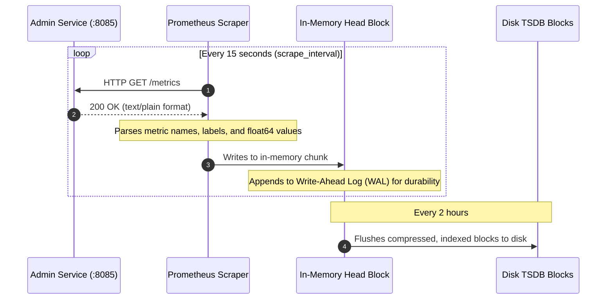
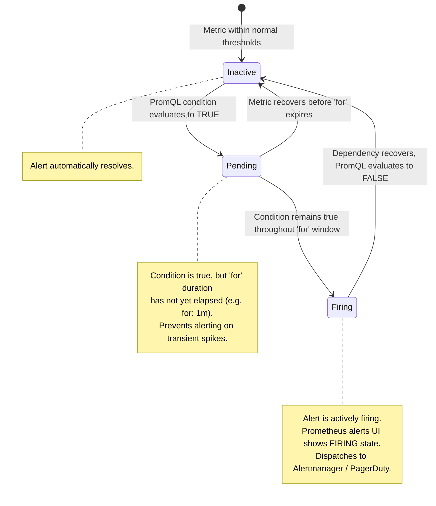

# Prometheus Monitoring & Alerting Subsystem

This directory contains the core configurations and alerting definitions for the **Prometheus** server in the TradeDrift platform.

---

## 1. Directory Purpose

The `monitoring/prometheus/` directory configures Prometheus as the **central time-series metrics collector and automated watchdog** for TradeDrift.

Prometheus acts as the engine of observability:
1. It discovers and pulls metrics from microservices across the internal Docker network.
2. It persists metrics in an optimized, append-only Time-Series Database (TSDB).
3. It evaluates alerting rules on a continuous 15-second evaluation loop.

```
monitoring/prometheus/
├── README.md             # This comprehensive architecture & operational documentation
├── prometheus.yml        # Main Prometheus configuration (scrape intervals, jobs, target URLs)
└── alerts.yml            # Production alerting rules and threshold triggers (PromQL)
```

---

## 2. File-by-File Deep Dive

### 2.1 [`prometheus.yml`](file:///c:/Users/AKHIL%20BABU/OneDrive/Desktop/tradedrift/monitoring/prometheus/prometheus.yml)

#### Purpose
`prometheus.yml` is the primary runtime configuration loaded by Prometheus on container startup. It controls **how frequently metrics are scraped**, **which services are targeted**, and **which alert files are active**.

#### What Problem This File Solves
In a distributed microservice platform:
- Services cannot push metrics directly without coupling them to a centralized collector.
- Prometheus has no built-in knowledge of what services exist or where their metrics endpoints live.
- Different microservices run on different internal ports (`8085`, `9090`, `9091`, `9092`).

Without `prometheus.yml`, Prometheus would start as a blank daemon without any collection targets or evaluation rules.

#### How It Solves the Problem
1. **Global Timing Synchronization**:
   ```yaml
   global:
     scrape_interval: 15s
     evaluation_interval: 15s
   ```
   - `scrape_interval: 15s`: Synchronizes with the Admin Service `HealthWorker` cycle (every 15s), guaranteeing that every background diagnostic update is recorded immediately without stale lag.
   - `evaluation_interval: 15s`: Ensures alerting rules are evaluated against live data every 15 seconds.

2. **Alert Rule Mounting**:
   ```yaml
   rule_files:
     - /etc/prometheus/alerts.yml
   ```
   Instructs Prometheus to parse and monitor the alerting rules defined in `alerts.yml`.

3. **Multi-Service Scrape Job Definitions**:
   ```yaml
   scrape_configs:
     - job_name: 'admin'
       metrics_path: '/metrics'
       static_configs:
         - targets: ['admin:8085']

     - job_name: 'trade'
       metrics_path: '/metrics'
       static_configs:
         - targets: ['trade:9090']

     - job_name: 'portfolio'
       metrics_path: '/metrics'
       static_configs:
         - targets: ['portfolio:9091']

     - job_name: 'liquidity-engine'
       metrics_path: '/metrics'
       static_configs:
         - targets: ['liquidity-engine:9090']

     - job_name: 'notification'
       metrics_path: '/metrics'
       static_configs:
         - targets: ['notification:9092']
   ```
   - Uses Docker's internal DNS resolver to map service names (`admin`, `trade`, etc.) to container IPs.
   - Polls the `/metrics` exposition endpoint of each microservice.

#### Why We Need This File
Without `prometheus.yml`, Prometheus cannot ingest any data from TradeDrift services.

---

### 2.2 [`alerts.yml`](file:///c:/Users/AKHIL%20BABU/OneDrive/Desktop/tradedrift/monitoring/prometheus/alerts.yml)

#### Purpose
`alerts.yml` defines the **production alert rules** that monitor TradeDrift's critical telemetry streams. It converts passive metrics into proactive operational alarms.

#### What Problem This File Solves
- Human operators cannot monitor dashboards 24/7.
- Silent failures (e.g. background saga retries exhausting, outbox events accumulating in PostgreSQL, or downstream gRPC timeouts) can cause severe business and financial disruption before an operator notices.

#### How It Solves the Problem
Defines 6 rules grouped under `tradedrift-admin-alerts`:

| Alert Name | Severity | Evaluation Window (`for`) | PromQL Expression | Problem Solved & Operational Impact |
| :--- | :--- | :--- | :--- | :--- |
| **`AdminSagaTaskExhausted`** | `critical` | `1m` | `increase(tradedrift_admin_saga_tasks_total{result="EXHAUSTED"}[5m]) > 0` | **Permanent distributed saga failure**: An administrative action (e.g. user session revocation or wallet freeze) failed all retry attempts and halted. Requires urgent manual reconciliation. |
| **`AdminOutboxBacklogSpike`** | `warning` | `2m` | `tradedrift_admin_outbox_backlog_depth > 50 or tradedrift_admin_outbox_oldest_unpublished_seconds > 120` | **Event delivery lag / Kafka congestion**: Transactional outbox events in PostgreSQL exceed 50 pending records or the oldest event is $>120$s old. Signals Kafka partition blocking or broker throttling. |
| **`AdminServiceDown`** | `critical` | `1m` | `up{job="admin"} == 0 or absent(up{job="admin"}) == 1` | **Admin Service Crash / OOM**: Prometheus cannot scrape the Admin Service. The administrative control plane is offline. |
| **`CriticalDependencyDown`** | `critical` | `1m` | `tradedrift_admin_system_overall_status == 0` | **Core Platform Outage**: The Admin `HealthWorker` detected that PostgreSQL, Auth, Wallet, Trade, Portfolio, or Liquidity Engine is `DOWN` or `TIMEOUT`. |
| **`AdminHealthProbeStale`** | `warning` | `1m` | `time() - tradedrift_admin_health_probe_last_run_timestamp_seconds > 60` | **HealthWorker Stall / Deadlock**: Probes haven't executed in $>60$ seconds. Distinguishes a dead background monitoring loop from actual downstream service health. |
| **`HighAdminErrorRate`** | `warning` | `5m` | `(sum(rate(tradedrift_admin_http_requests_total{status=~"5.."}[5m])) / sum(rate(tradedrift_admin_http_requests_total[5m])) > 0.05) and (sum(rate(tradedrift_admin_http_requests_total[5m])) > 0)` | **HTTP 5xx Error Spike**: Admin API requests return $>5\%$ 5xx status codes over 5 minutes. Includes zero-traffic division protection. |

#### Why We Need This File
Without `alerts.yml`, Prometheus only records numbers. It would never notify engineers of outages, outbox queue bottlenecks, or exhausted background sagas.

---

## 3. Operational Flows

### Flow 1: Metric Scraping & Time-Series Storage
How Prometheus collects and stores time-series data:



---

### Flow 2: Alert State Machine Lifecycle
How Prometheus transitions an alert from discovery to firing to resolution:



---

## 4. Useful PromQL Queries for TradeDrift

- **Check Admin Service Liveness**:
  ```promql
  up{job="admin"}
  ```
- **Overall Platform Availability Status (2=Healthy, 1=Degraded, 0=Unhealthy)**:
  ```promql
  tradedrift_admin_system_overall_status
  ```
- **Downstream Services Currently DOWN**:
  ```promql
  tradedrift_admin_system_health_status{status="DOWN"} == 1
  ```
- **99th Percentile HTTP Request Latency by Route (last 5m)**:
  ```promql
  histogram_quantile(0.99, sum(rate(tradedrift_admin_http_request_duration_seconds_bucket[5m])) by (le, route))
  ```
- **Outbox Pending Backlog Count**:
  ```promql
  tradedrift_admin_outbox_backlog_depth
  ```
- **Saga Tasks by Status**:
  ```promql
  tradedrift_admin_saga_queue_count
  ```
