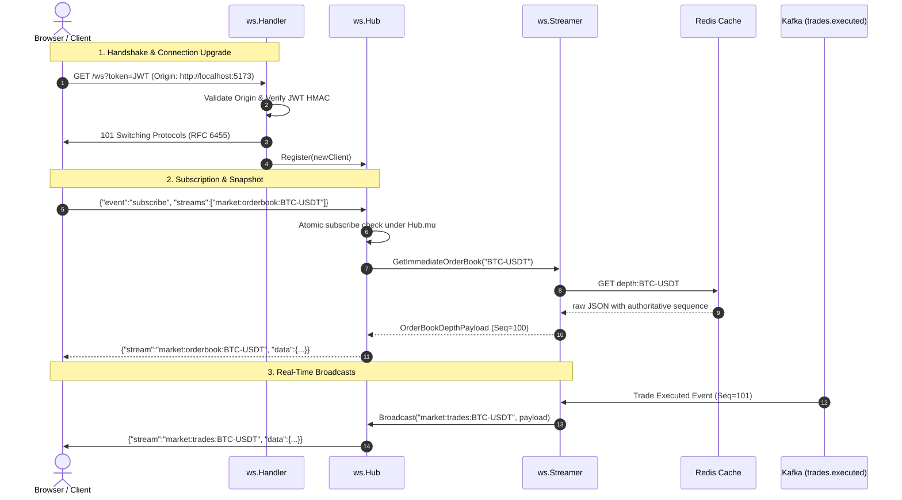

# WebSocket Subsystem Architecture (`internal/ws`)

## 1. Overview & Purpose
The `internal/ws` package serves as the **unified gateway entrypoint** for TradeDrift's real-time WebSocket subsystem. It provides a clean, high-performance, and backwards-compatible facade connecting HTTP clients to the internal matching engine, order book depth cache (Redis), and trade execution stream (Kafka).

```
                        HTTP / RFC 6455 Handshake
                                  │
                                  ▼
                     ┌─────────────────────────┐
                     │     internal/ws         │
                     │  (Facade & Public API)  │
                     └────────────┬────────────┘
                                  │
         ┌────────────────────────┼────────────────────────┐
         │                        │                        │
         ▼                        ▼                        ▼
┌──────────────────┐    ┌──────────────────┐    ┌──────────────────┐
│   ws/protocol    │    │      ws/hub      │    │   ws/streamer    │
│  DTOs & Contracts│    │ Connection & Mux │    │  Redis & Kafka   │
└──────────────────┘    └──────────────────┘    └──────────────────┘
```

---

## 2. Directory Structure & File Breakdown

| File / Folder | Purpose & Responsibility |
| :--- | :--- |
| [`ws.go`](file:///c:/Users/AKHIL%20BABU/OneDrive/Desktop/tradedrift/services/gateway/internal/ws/ws.go) | **Top-level Facade**: Re-exports core types, stream constants, constructors, and validation helpers from sub-packages so external callers (`main.go`) have a single unified import. |
| [`ws_test.go`](file:///c:/Users/AKHIL%20BABU/OneDrive/Desktop/tradedrift/services/gateway/internal/ws/ws_test.go) | **Integration & Wiring Tests**: Validates that all constructors, type aliases, and interfaces wire together seamlessly across sub-packages. |
| [`hub/`](file:///c:/Users/AKHIL%20BABU/OneDrive/Desktop/tradedrift/services/gateway/internal/ws/hub) | **Connection & Subscription Multiplexing**: Manages client WebSockets, read/write pumps, atomic subscriptions, and backpressure. |
| [`protocol/`](file:///c:/Users/AKHIL%20BABU/OneDrive/Desktop/tradedrift/services/gateway/internal/ws/protocol) | **Wire Models & Interface Contracts**: Pure DTOs, stream validation allowlists, `SnapshotProvider`, and `Broadcaster` interfaces. |
| [`streamer/`](file:///c:/Users/AKHIL%20BABU/OneDrive/Desktop/tradedrift/services/gateway/internal/ws/streamer) | **Data Ingestion Engine**: 250ms Redis depth poller (with xxhash deduplication), 1s ticker poller, and real-time Kafka trade consumer. |

---

## 3. Packages & Dependencies Used

| Package | Why It Is Used |
| :--- | :--- |
| `github.com/gorilla/websocket` | Standard Go WebSocket engine implementing RFC 6455 connection upgrade and frame transport. |
| `github.com/redis/go-redis/v9` | Low-latency Redis client used to poll Level-2 order book depth and 24h market tickers. |
| `go.uber.org/zap` | High-performance, zero-allocation structured logger. |

---

## 4. Functions & Types in `ws.go`

### Type Aliases
- `type Hub = hub.Hub`: Exposes connection router.
- `type Client = hub.Client`: Exposes active client session.
- `type Handler = hub.Handler`: Exposes HTTP upgrade handler.
- `type Streamer = streamer.Streamer`: Exposes background data streamer.
- `type SnapshotProvider = protocol.SnapshotProvider`: Interface for initial snapshot fetches.
- `type Broadcaster = protocol.Broadcaster`: Interface for broadcasting to WebSocket subscribers.
- DTO Aliases: `InboundFrame`, `OutboundEnvelope`, `OutboundEvent`, `OrderBookDepthPayload`, `TradePayload`, `TickerPayload`, `NotificationPayload`.

### Constructors
- `NewHub(logger *zap.Logger, provider SnapshotProvider) *Hub`: Instantiates the central connection hub.
- `NewHandler(h *Hub, jwtSecret string, corsOrigin string, logger *zap.Logger) *Handler`: Creates the HTTP upgrade handler with exact-match CORS and JWT validation.
- `NewStreamer(broadcaster Broadcaster, redisClient *redis.Client, kafkaBrokers []string, kafkaTopic string, kafkaGroupID string, logger *zap.Logger) *Streamer`: Creates the background poller and Kafka ingestion engine.

### Helper Functions
- `ValidateStream(stream string) (streamType, target string, ok bool)`: Validates stream format against strict allowlists.
- `ParseStreamType(stream string) (streamType, target string)`: Parses stream prefix.
- `MarshalEnvelope(env OutboundEnvelope) []byte`: Serializes outbound messages to JSON.

---

## 5. End-to-End WebSocket Flow



---

## 6. Private User Streams & Dual-Path Delivery Model

The Gateway manages private, user-isolated WebSocket channels (`user:notifications:{user_id}`, `user:portfolio:{user_id}`) multiplexed over a single Redis `PSUBSCRIBE`.

### Dual-Path Delivery Architecture

```
                       Client State Machine
                                │
                        [App Launch / Reconnect]
                                │
               ┌────────────────┴────────────────┐
               ▼                                 ▼
   1. Durable Catch-Up (Recovery)       2. Live Push Stream (Real-Time)
      REST API:                             WebSocket:
      GET /api/v1/notifications?limit=20    SUBSCRIBE user:notifications:{uid}
               │                                 │
               ▼                                 ▼
   Fetches durable inbox from            Receives real-time toasts
   PostgreSQL storage (zero drops)       while actively connected
```

### Key Semantics & Guarantees:
1. **Durable Inbox vs. Ephemeral Push**:
   - **PostgreSQL (`notifications` table)** is the authoritative, durable source of truth.
   - **Redis Pub/Sub** and **WebSockets** provide low-latency, best-effort live delivery for actively connected users.
   - **Frontend Reconnection Protocol**: On WebSocket `onopen` or reconnect after disconnect, the client must trigger `GET /api/v1/notifications` to reconcile any notifications published while offline.
2. **Private Channel Authorization & Strict UUID Validation**:
   - Stream validation strictly validates that private streams match `user:notifications:{UUID}` and `user:portfolio:{UUID}` where the target identifier is a syntactically valid UUID (`github.com/google/uuid`). Invalid identifiers or path traversal attempts (e.g. `../../admin`) are rejected immediately with `INVALID_STREAM`.
   - Subscription requests are then strictly authorized: `client.UserID()` derived from the cryptographically verified JWT must match the stream target UUID. Mismatches are rejected with `FORBIDDEN`.
3. **Per-Instance In-Memory Deduplication (`DedupCache`)**:
   - Gateway instances maintain an in-process thread-safe LRU/TTL deduplication cache (`DedupCache`) with a 60-second sliding TTL keyed by `event_id:notification_id`.
   - **Horizontal Scalability Note**: Each Gateway replica independently consumes Redis Pub/Sub pattern subscriptions (`user:notifications:*`). When a notification is published to Redis, every replica receives it, deduplicates it against its own local cache, and broadcasts to its locally connected clients. Deduping is per-instance because each WebSocket client is connected to exactly one Gateway instance at any given time.
4. **Client Keyset Cursor Reconnect Protocol**:
   - Because WebSocket push is ephemeral and Redis Pub/Sub does not retain history, disconnected clients may miss notifications emitted during transient network disconnects.
   - **Reconnect Flow**:
     1. Client reconnects and completes WebSocket handshake with JWT auth.
     2. Client subscribes to `user:notifications:{user_id}` for live push.
     3. Client queries the durable REST endpoint with its last-seen keyset cursor:
        ```http
        GET /api/v1/notifications?limit=20&cursor=2026-09-09T12:00:00.000Z,a0000000-0000-0000-0000-000000000001
        ```
     4. Client merges any missed notifications into its local state, deduplicating by `id`.
5. **Stream Semantic Differentiation**:
   - **`user:notifications:{UUID}`**: Deduplicated on `event_id:notification_id` with a 60-second sliding TTL. Enforces non-empty `event_id`, `notification_id`, and `data`.
   - **`user:portfolio:{UUID}`**: Ephemeral balance snapshots. Bypasses deduplication to ensure the freshest financial state is never dropped or suppressed.
6. **Channel Consistency Invariant**:
   - If the Redis message payload specifies an internal `channel`, it must match the subscribed Redis topic (`msg.Channel == env.Channel`), preventing spoofed or misrouted messages from crossing channel boundaries.
7. **Observability & Metrics**:
   - Gateway Streamer tracks atomic resilience metrics accessible via thread-safe getters:
     - `KafkaErrorsTotal()`: Cumulative Kafka consumer errors.
     - `KafkaReconnectsTotal()`: Cumulative Kafka consumer reconnection attempts.
     - `RedisUserReconnectsTotal()`: Cumulative Redis Pub/Sub reconnection attempts for user stream relay.
     - `RedisUserDropsTotal()`: Cumulative dropped Redis messages due to validation failure or deduplication.

