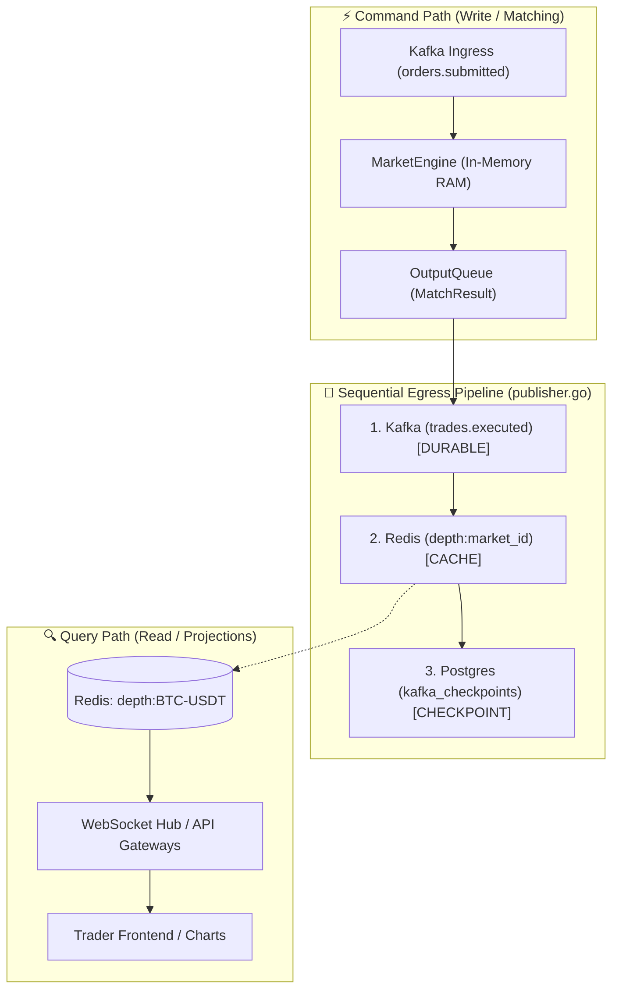
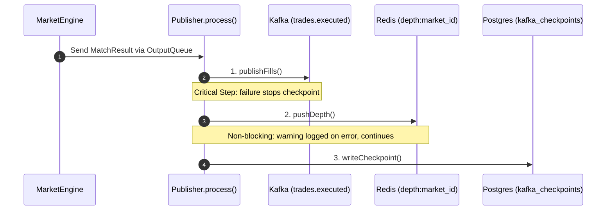
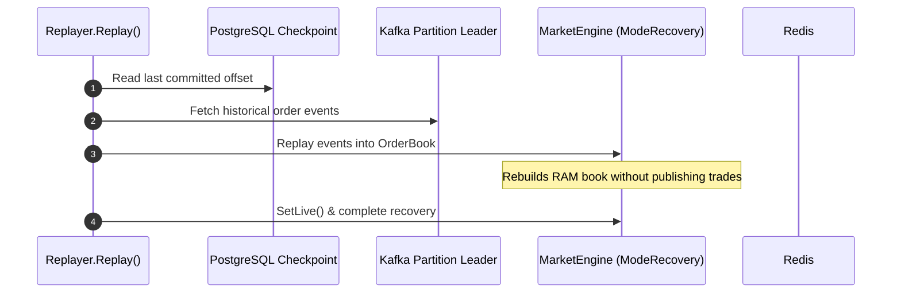
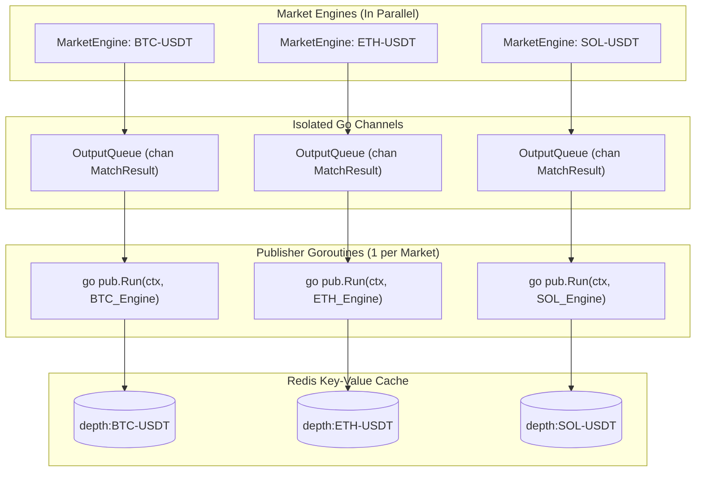

# 🔴 Redis Architecture & Usage in TradeDrift Matching Engine

This document provides an in-depth technical explanation of **where**, **why**, and **how** Redis is utilized within the TradeDrift Matching Engine. It details the exact data models stored, why specific data structures were chosen, which functions handle reads and writes, the goroutine concurrency model, and how Redis fits into the broader CQRS and fault-tolerant event processing architecture.

---

## 📑 Table of Contents

1. [Executive Architectural Summary](#1-executive-architectural-summary)
2. [Why Redis is Used (Core Architectural Drivers)](#2-why-redis-is-used-core-architectural-drivers)
3. [Exact Data Stored in Redis vs. Engine In-Memory State](#3-exact-data-stored-in-redis-vs-engine-in-memory-state)
4. [Where Redis is Used in the Codebase](#4-where-redis-is-used-in-the-codebase)
5. [Step-by-Step Function Execution & Code Flows](#5-step-by-step-function-execution--code-flows)
   - [A. Live Writing Path (Publisher)](#a-live-writing-path-publisher)
   - [B. Post-Crash Recovery Path (Replayer)](#b-post-crash-recovery-path-replayer)
   - [C. Read Path (Projection Reader)](#c-read-path-projection-reader)
6. [Goroutine Concurrency & Event-Driven Execution Model](#6-goroutine-concurrency--event-driven-execution-model)
   - [A. One Dedicated Goroutine Per Market](#a-one-dedicated-goroutine-per-market)
   - [B. Event-Driven Execution (0% Idle CPU)](#b-event-driven-execution-0-idle-cpu)
   - [C. Startup (Replayer) vs. Live Egress (Publisher)](#c-startup-replayer-vs-live-egress-publisher)
7. [Failure Semantics & Non-Blocking Guarantee](#7-failure-semantics--non-blocking-guarantee)
8. [Summary Comparison Table](#8-summary-comparison-table)

---

## 1. Executive Architectural Summary

TradeDrift adheres strictly to the **CQRS (Command Query Responsibility Segregation)** pattern:



* **Command (Execution) Side:** Operates purely in **in-memory RAM** (Go process heap) without network calls or mutex locks, achieving sub-microsecond matching latency.
* **Query (Read) Side:** Served entirely from **Redis** projections. Downstream services read order book depth from Redis without touching the matching engine's memory.

---

## 2. Why Redis is Used (Core Architectural Drivers)

### 1. Lock-Free Read Scalability (Eliminating Contention)
* **The Problem:** If external API gateways, WebSocket servers, or web clients queried the matching engine directly to render the order book, the matching engine would need mutex locks or channel queues to serialize incoming reads.
* **The Solution:** The engine acts as a **write-only producer** to Redis. Redis acts as a high-throughput read cache. Thousands of concurrent WebSocket clients can poll or stream the order book without adding a single nanosecond of latency to order matching.

### 2. Sub-Millisecond Read Latency
* Redis operates as an in-memory key-value store, responding to key queries in sub-millisecond times ($< 1\text{ms}$).

### 3. Batch Retrieval with Multi-GET (`MGET`)
* Instead of issuing individual `GET` network requests for each trading pair, downstream market overview services can fetch order book depth across 50+ markets in a single network round-trip using Redis `MGET`.

### 4. Resilient Decoupling (Non-Blocking Failure Model)
* Redis is designated as an **ephemeral cache**, not a durable event log.
* If Redis goes down or experiences network latency, matching and durable trade settlement are **not stopped**. The engine continues advancing checkpoints, and Redis self-heals as soon as it recovers.

---

## 3. Exact Data Stored in Redis vs. Engine In-Memory State

It is crucial to distinguish what resides in **Engine RAM** versus what is stored in **Redis**:

```
 ┌──────────────────────────────────────────────────────────┐
 │          ENGINE IN-MEMORY RAM (Full Level 3 Book)        │
 │  - Every individual Order Struct (ID, UserID, Time)      │
 │  - Price levels with FIFO Doubly-Linked Lists            │
 │  - Limit, Market, Cancel Order queues                    │
 └────────────────────────────┬─────────────────────────────┘
                              │  Aggregated Top-N Snapshot
                              ▼
 ┌──────────────────────────────────────────────────────────┐
 │              REDIS CACHE (Level 2 Projection)            │
 │  Key: "depth:BTC-USDT"                                   │
 │  - Only aggregated price levels (Price + Total Quantity) │
 │  - NO User IDs, NO Order IDs, NO individual orders       │
 └──────────────────────────────────────────────────────────┘
```

### Redis Key Format & Data Schema

* **Key Name:** `depth:{market_id}` (e.g. `depth:BTC-USDT`, `depth:ETH-USDT`)
* **TTL (Expiration):** `0` / None (Every new event overwrites the previous snapshot; the latest snapshot is always fresh).
* **Payload Format:** JSON serialized string.

#### JSON Payload Schema:
```json
{
  "market_id": "BTC-USDT",
  "bids": [
    { "price": "65000.00", "quantity": "3.50000000" },
    { "price": "64990.00", "quantity": "10.25000000" },
    { "price": "64980.00", "quantity": "1.10000000" }
  ],
  "asks": [
    { "price": "65010.00", "quantity": "2.00000000" },
    { "price": "65020.00", "quantity": "5.45000000" },
    { "price": "65050.00", "quantity": "14.80000000" }
  ],
  "snapshot_at": "2026-08-19T10:15:30.123456789Z"
}
```

---

## 4. Where Redis is Used in the Codebase

| Component / File | Role | Primary Operations |
| :--- | :--- | :--- |
| [`cmd/server/main.go`](file:///c:/Users/AKHIL%20BABU/OneDrive/Desktop/tradedrift/services/matching-engine/cmd/server/main.go#L140-L153) | **Connection Lifecycle** | Connects to Redis via `redis.NewClient()`, pings connection, passes client to Publisher and Replayer, runs deferred `rdb.Close()`. |
| [`internal/publisher/publisher.go`](file:///c:/Users/AKHIL%20BABU/OneDrive/Desktop/tradedrift/services/matching-engine/internal/publisher/publisher.go#L225-L245) | **Live Depth Egress** | `pushDepth()` writes `depthSnapshotMessage` to `depth:{market_id}` after every match/order event. |
| [`internal/recovery/replayer.go`](file:///c:/Users/AKHIL%20BABU/OneDrive/Desktop/tradedrift/services/matching-engine/internal/recovery/replayer.go) | **Recovery Isolation** | Genuinely side-effect-free recovery. Recovery does not write intermediate states to Redis. |
| [`internal/projection/reader.go`](file:///c:/Users/AKHIL%20BABU/OneDrive/Desktop/tradedrift/services/matching-engine/internal/projection/reader.go#L49-L109) | **Read Projection Client** | `GetOrderBook()` (single `GET`) and `GetOrderBooks()` (batch `MGET`) for reading depth with strict validation. |

---

## 5. Step-by-Step Function Execution & Code Flows

### A. Live Writing Path (Publisher)

When orders or cancellations are processed by the matching engine:



#### Function Details in `publisher.go`:

1. **`Publisher.Run(ctx, engine)`**
   Continuously reads `orderbook.MatchResult` items emitted from `engine.OutputQueue`.
2. **`Publisher.process(ctx, result)`**
   Coordinates the strict 3-step pipeline:
   * **Step 1:** Writes executed trades to Kafka.
   * **Step 2:** Calls [`pushDepth(ctx, result.DepthSnapshot)`](file:///c:/Users/AKHIL%20BABU/OneDrive/Desktop/tradedrift/services/matching-engine/internal/publisher/publisher.go#L225).
   * **Step 3:** Writes source Kafka offset checkpoint to PostgreSQL.
3. **`Publisher.pushDepth(ctx, snap)`**
   * Converts the in-memory `DepthSnapshot` bids and asks into stringified `depthLevel` structs.
   * Marshals the payload into JSON.
   * Executes:
     ```go
     p.redis.Set(ctx, "depth:"+snap.MarketID, bytes, 0)
     ```

---

### B. Post-Crash Recovery Path (Replayer)

When the service starts up or recovers from a crash:



#### Side-Effect-Free Recovery:
During Kafka history replay, no Redis operations occur. This isolates the recovery phase from downstream caching systems, ensuring recovery is 100% side-effect-free. Once the engine transitions to `ModeLive`, normal matching events will populate Redis depth projections.

---

### C. Read Path (Projection Reader)

Downstream consumers (WebSocket broadcast workers, REST API handlers) read market depth via `projection.Reader`:

#### 1. Single Market Query: `GetOrderBook`
```go
func (r *Reader) GetOrderBook(ctx context.Context, marketID string) (*OrderBookProjection, error) {
    key := "depth:" + marketID
    val, err := r.client.Get(ctx, key).Result()
    if err != nil {
        if errors.Is(err, redis.Nil) {
            return nil, ErrNotFound
        }
        return nil, err
    }
    return parseAndValidateSnapshot([]byte(val), marketID)
}
```

#### 2. Multi-Market Query: `GetOrderBooks` (Batch `MGET`)
```go
func (r *Reader) GetOrderBooks(ctx context.Context, marketIDs []string) (map[string]*OrderBookProjection, error) {
    keys := make([]string, len(marketIDs))
    for i, id := range marketIDs {
        keys[i] = "depth:" + id
    }

    // Fetches all market keys in 1 network round-trip
    vals, err := r.client.MGet(ctx, keys...).Result()
    ...
}
```

#### 3. Validation: `parseAndValidateSnapshot`
Protects downstream consumers against invalid data:
* Verifies `market_id` matches the expected key.
* Ensures `snapshot_at` is a valid RFC3339 timestamp.
* Enforces that all prices and quantities are **strictly positive decimals** ($> 0$).

---

## 6. Goroutine Concurrency & Event-Driven Execution Model

A common question is: *“Is a single goroutine constantly pushing data to Redis in a timer loop?”*

The answer is **no**: data is pushed via **isolated, event-driven goroutines per market**.



### A. One Dedicated Goroutine Per Market
In [`cmd/server/main.go:199-207`](file:///c:/Users/AKHIL%20BABU/OneDrive/Desktop/tradedrift/services/matching-engine/cmd/server/main.go#L199-L207):
```go
for _, engine := range manager.All() {
    wg.Add(1)
    e := engine // capture loop variable
    go func() {
        defer wg.Done()
        pub.Run(opCtx, e)
    }()
    log.Printf("[server] publisher started for market: %s", e.MarketID)
}
```
* **Full Isolation:** If the system runs 10 trading pairs, exactly **10 publisher goroutines** run concurrently.
* **No Cross-Market Blocking:** High order volume on `BTC-USDT` will never delay or block depth pushes for `ETH-USDT`.

---

### B. Event-Driven Execution (0% Idle CPU)
In [`internal/publisher/publisher.go:122-143`](file:///c:/Users/AKHIL%20BABU/OneDrive/Desktop/tradedrift/services/matching-engine/internal/publisher/publisher.go#L122-L143):
```go
func (p *Publisher) Run(ctx context.Context, engine *market.MarketEngine) {
    for {
        select {
        case result, ok := <-engine.OutputQueue:
            if !ok {
                return // channel closed — engine shut down
            }
            if err := p.process(ctx, result); err != nil {
                log.Printf("[publisher] process error: %v", err)
            }
        case <-ctx.Done():
            return
        }
    }
}
```
* **No Polling / No Timer Loops:** The goroutine uses Go channel `select`. When there are no incoming orders, the goroutine enters a **blocked wait state** (consuming **0% CPU**).
* **Immediate Push on Trade Event:** As soon as an order is matched, placed, or cancelled, the `MarketEngine` sends the `MatchResult` into `engine.OutputQueue`. The goroutine wakes up instantly and pushes the latest depth snapshot to Redis.

---

### C. Startup (Replayer) vs. Live Egress (Publisher)

| Phase | Handled By | Concurrency Model | Frequency |
| :--- | :--- | :--- | :--- |
| **Crash Recovery / Startup** | *None* | No Redis writes occur during recovery (Side-effect isolated). | *0 times* |
| **Live Trading Operations** | [`publisher.go:pub.Run`](file:///c:/Users/AKHIL%20BABU/OneDrive/Desktop/tradedrift/services/matching-engine/internal/publisher/publisher.go#L122) | Runs as a **dedicated goroutine per market**. | **Event-driven** (pushes immediately whenever an order event occurs). |

---

## 7. Failure Semantics & Non-Blocking Guarantee

A critical engineering decision in TradeDrift is how Redis failures are handled during live matching:

```
                      ┌────────────────────────────┐
                      │    Kafka publish fails?    │
                      └─────────────┬──────────────┘
                                    │
                         YES ───────┴─────── NO
                          │                   │
                          ▼                   ▼
                  [STOP & RETRY]     ┌────────────────────────────┐
               (Checkpoint not saved)│    Redis write fails?      │
                                     └─────────────┬──────────────┘
                                                   │
                                        YES ───────┴─────── NO
                                         │                   │
                                         ▼                   ▼
                                   [LOG WARNING]     [WRITE CHECKPOINT]
                               (Checkpoint proceeds)  (Postgres saved)
```

### Why Redis Writes are Non-Blocking:
* **PostgreSQL Checkpoints** mark the exact Kafka offset processed by the matching engine.
* **If Redis write failure was blocking:** A 5-minute Redis network hiccup would halt PostgreSQL checkpoints. On engine restart, the engine would replay 5 minutes of already-executed orders from Kafka, emitting **duplicate trade executions** to wallets and settlement systems.
* **With Non-Blocking Redis writes:** Redis push errors are logged as warnings, and the checkpoint advances. When Redis recovers, the very next match result immediately pushes the latest depth snapshot, **self-healing** the cache.

---

## 8. Summary Comparison Table

| Dimension | In-Memory RAM (Engine) | Redis Projection (`depth:{market_id}`) |
| :--- | :--- | :--- |
| **Primary Purpose** | Ultra-fast order matching & execution | Ultra-fast external reads & WebSocket distribution |
| **Data Scope** | Full L3 Order Book (every individual order & user ID) | Top-$N$ L2 Aggregated Depth (Price + Quantity only) |
| **Latency** | Sub-microsecond (RAM pointer operations) | Sub-millisecond (in-memory network I/O) |
| **Access Pattern** | Single-threaded private event loop per market | Highly concurrent multi-client `GET` / `MGET` |
| **Goroutine Model** | 1 Engine Goroutine per market (`engine.Run`) | 1 Publisher Goroutine per market (`pub.Run`) |
| **Push Trigger** | Order ingress (`InputQueue`) | Event-driven match output (`OutputQueue`) |
| **Durability Role** | Ephemeral working state (rebuilt from Kafka) | Ephemeral read projection (self-heals on next tick) |
| **Key Functions** | `matcher.Match()`, `orderbook.OrderBook` | `publisher.pushDepth()`, `projection.Reader` |
