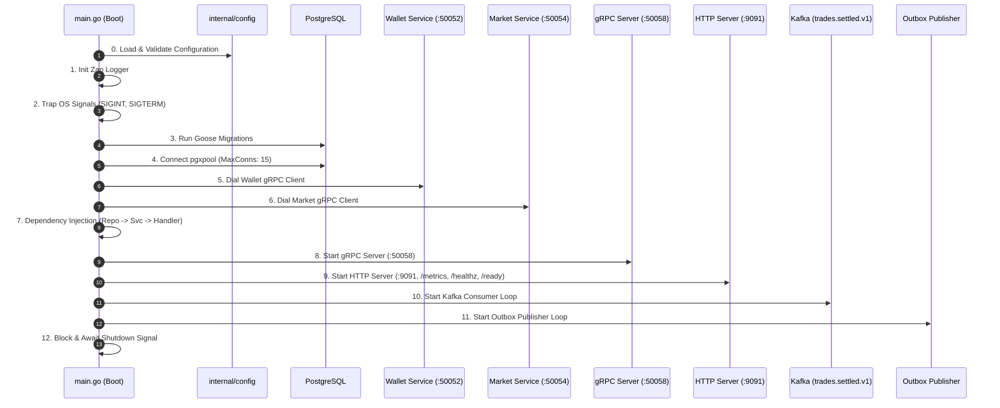
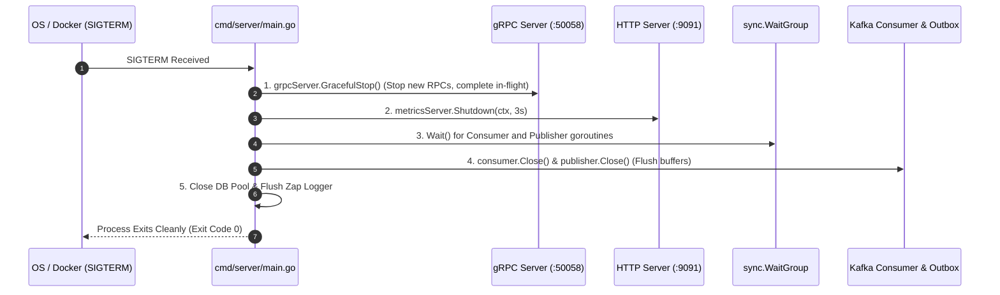

# Portfolio Service Entrypoint & Lifecycle (`cmd/server/main.go`)

## 1. Overview & System Role

The `services/portfolio/cmd/server/main.go` file is the **Composition Root and Lifecycle Orchestrator** for the **Portfolio Service** in TradeDrift.

In a distributed cryptocurrency exchange, user portfolios must maintain accurate ledger state, execute financial accounting in real time, and remain resilient during rolling updates.

`cmd/server/main.go` wires together:
1. Declarative database migrations (Goose).
2. PostgreSQL connection pooling (`pgxpool`).
3. External microservice gRPC clients (**Wallet Service** and **Market Service**).
4. Dependency-injected repository, domain valuation service, and gRPC presentation handler.
5. Synchronous gRPC server (port `:50058`).
6. HTTP Prometheus metrics and Kubernetes liveness/readiness server (port `:9091`).
7. Asynchronous Kafka consumer loop (`trades.settled.v1`).
8. Transactional outbox publisher worker (`portfolios.updated.v1`).
9. Clean 5-phase graceful teardown.

---

## 2. Problems Solved by This Entrypoint

| Problem | How `cmd/server/main.go` Solves It |
|---|---|
| **Stale Schema & Migration Drift** | Executes Goose migrations before binding any network sockets, ensuring tables (`holdings`, `processed_trades`, `portfolio_outbox`), constraints (`CHECK >= 0`), and partial indexes are in place before traffic arrives. |
| **Silent Fail-Late Configuration Crashes** | Calls `portfolioconfig.Load()` on step 0. If required variables (e.g. `PORTFOLIO_POSTGRES_DSN`) are missing, it panics immediately, preventing broken deployments in Kubernetes/Docker. |
| **Startup Race Conditions** | Strictly constructs components in dependency order: Config $\rightarrow$ Logger $\rightarrow$ Migrations $\rightarrow$ DB Pool $\rightarrow$ Wallet/Market gRPC Clients $\rightarrow$ Repo $\rightarrow$ Service $\rightarrow$ Handler $\rightarrow$ Servers $\rightarrow$ Kafka Workers. |
| **Dual-Protocol Serving (gRPC + HTTP)** | Concurrently binds and manages both an internal gRPC server (`:50058`) for gateway queries and an HTTP server (`:9091`) for Prometheus `/metrics` and Kubernetes `/healthz` & `/ready` probes. |
| **Resource Leaks & Event Loss on Teardown** | Traps OS termination signals (`SIGINT`, `SIGTERM`) and executes an orderly 5-stage drain: halts gRPC, drains HTTP, waits for active workers via `sync.WaitGroup`, flushes Kafka consumer commits, and closes the outbox publisher. |

---

## 3. Deterministic 13-Phase Lifecycle Breakdown



### Phase 0: Configuration Loading
```go
config.LoadEnv()
cfg, err := portfolioconfig.Load()
if err != nil {
    panic("invalid configuration: " + err.Error())
}
```
* **Purpose**: Parses environment variables into a validated `Config` struct.
* **Problem Solved**: Fails fast if mandatory database or broker strings are missing before allocating system resources.

### Phase 1: Structured Logger Initialization
```go
appLogger := logger.New(cfg.LogLevel)
defer appLogger.Sync()
```
* **Purpose**: Creates production JSON structured logging via Zap.
* **Problem Solved**: Standardizes log ingestion for CloudWatch/Datadog and flushes buffers on shutdown.

### Phase 2: OS Signal Context Trapping
```go
ctx, stop := signal.NotifyContext(context.Background(), syscall.SIGINT, syscall.SIGTERM)
defer stop()
```
* **Purpose**: Creates a root `context.Context` tied to OS interrupt signals (`SIGINT`, `SIGTERM`).
* **Problem Solved**: Allows container runtimes (Docker Compose, Kubernetes) to signal all background goroutines simultaneously for graceful termination.

### Phase 3: Database Migrations
```go
if err := platformpg.RunMigrations(cfg.PostgresDSN, cfg.MigrationsDir); err != nil {
    appLogger.Fatal("Failed to apply portfolio migrations", zap.Error(err))
}
```
* **Purpose**: Programmatically verifies and applies Goose SQL migrations in `services/portfolio/migration/`.
* **Problem Solved**: Guarantees zero code-to-schema drift.

### Phase 4: PostgreSQL Connection Pool
```go
dbPool, err := platformpg.NewPool(poolCtx, cfg.PostgresDSN, platformpg.PoolConfig{
    MaxConns: 15,
})
```
* **Purpose**: Initializes bounded `pgxpool.Pool` (15 max connections).
* **Problem Solved**: Prevents connection exhaustion during traffic bursts while providing connection health pooling.

### Phase 5 & 6: Dial Wallet & Market gRPC Clients
```go
walletConn, err := grpc.NewClient(cfg.WalletGRPCAddr, grpc.WithTransportCredentials(insecure.NewCredentials()))
marketConn, err := grpc.NewClient(cfg.MarketGRPCAddr, grpc.WithTransportCredentials(insecure.NewCredentials()))
```
* **Purpose**: Establishes non-blocking gRPC transport channels to the Wallet and Market microservices.
* **Problem Solved**: Connects the Portfolio Service to authoritative cash balances and real-time ticker prices.

### Phase 7: Composition & Dependency Injection
```go
repo := portfoliopg.New(dbPool)
svc := portfoliosvc.New(repo, walletClient, marketClient)
handler := portfoliohandler.New(svc, appLogger)
```
* **Purpose**: Pure manual dependency injection according to Clean Architecture.
* **Problem Solved**: Eliminates global variables and circular package references.

### Phase 8: Start gRPC Server (:50058)
```go
grpcServer := grpc.NewServer()
portfoliov1.RegisterPortfolioServiceServer(grpcServer, handler)
```
* **Purpose**: Binds gRPC server on `:50058` to serve API Gateway unary RPCs.

### Phase 9: Start HTTP Metrics & Health Server (:9091)
```go
metricsMux := http.NewServeMux()
metricsMux.Handle("/metrics", promhttp.Handler())
metricsMux.HandleFunc("/healthz", ...) // Liveness
metricsMux.HandleFunc("/ready", ...)   // Readiness (pings DB)
```
* **Purpose**: Exposes Prometheus metrics and Kubernetes probes.
* **Problem Solved**: `/ready` pings PostgreSQL to ensure traffic is only routed when the database is reachable.

### Phase 10 & 11: Start Kafka Consumer & Outbox Publisher Loops
```go
consumer := portfoliokafka.NewConsumer(...)
go consumer.Start(ctx)

publisher := portfoliokafka.NewOutboxPublisher(...)
go publisher.Start(ctx)
```
* **Purpose**: Spawns concurrent asynchronous background workers managed by `sync.WaitGroup`.

---

## 4. Graceful Teardown Flow (5-Stage Drain)

When Docker or Kubernetes stops the container (`SIGTERM`), `<-ctx.Done()` unblocks and executes a clean 5-phase drain:



---

## 5. Operational Port & Probe Reference

| Port | Protocol | Purpose | Key Endpoints / Methods |
|---|:---:|---|---|
| `:50058` | gRPC | Inbound Gateway Traffic | `GetPortfolioSummary`, `GetPortfolioHoldings` |
| `:9091` | HTTP | Telemetry & Probes | `/metrics` (Prometheus), `/healthz` (Liveness), `/ready` (Readiness) |
