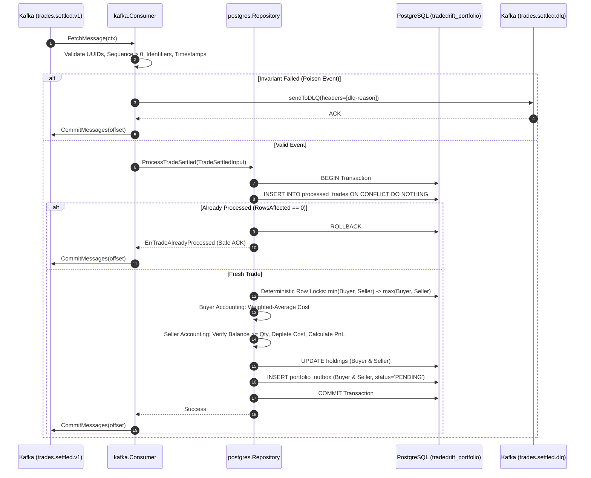
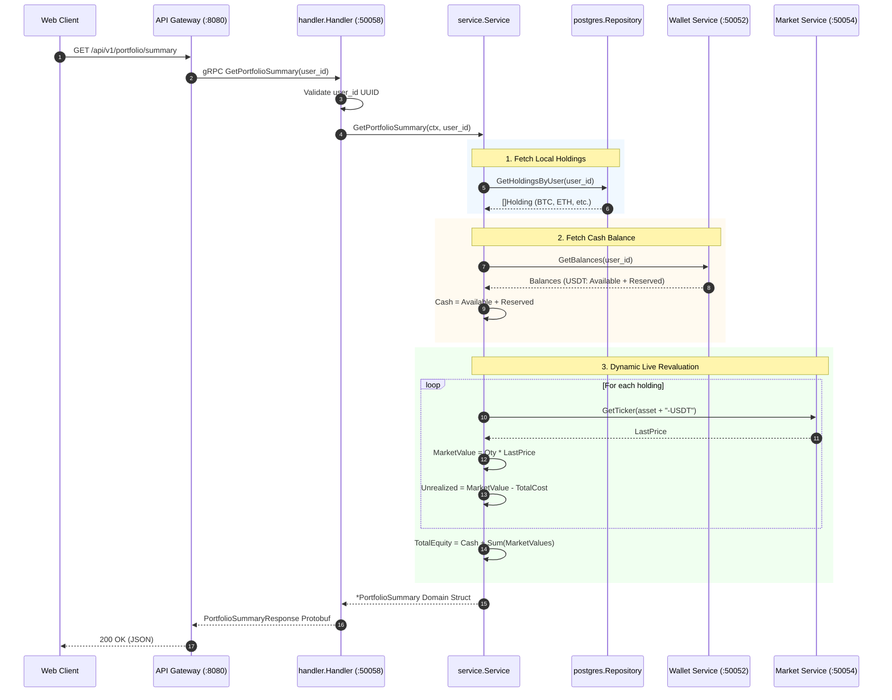
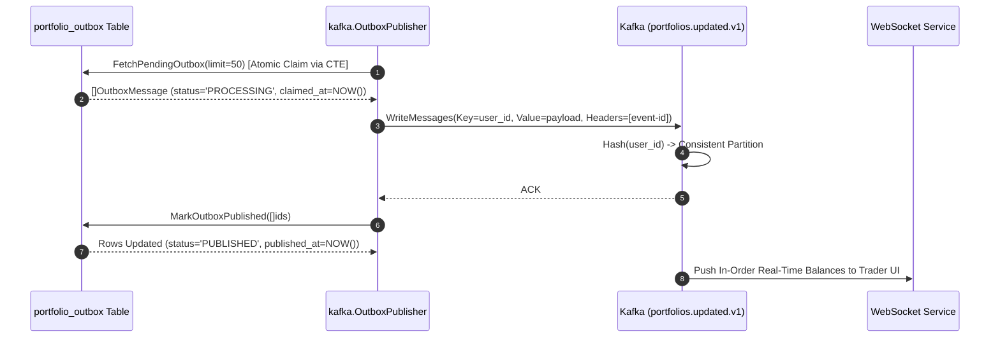

# Portfolio Service Internal Architecture (`services/portfolio/internal`)

## 1. Overview & Architectural Philosophy

The `services/portfolio/internal/` directory contains the complete domain, persistence, ingestion, event streaming, and presentation logic for the **Portfolio Service** in TradeDrift.

The service follows **Hexagonal / Clean Architecture (Ports and Adapters)**:
* **Domain Service (`service/`)**: Pure financial accounting and dynamic valuation calculations, isolated from transport protocols and databases.
* **Storage Port & Adapter (`repository/`)**: Defines the persistence contract in `repository.go` and implements atomic database transactions, deterministic row-locking, and outbox operations in `repository/postgres/`.
* **Asynchronous Messaging Adapters (`kafka/`)**: Handles event ingestion from `trades.settled.v1` (`consumer.go`) and streaming to `portfolios.updated.v1` (`publisher.go`).
* **Synchronous Transport Adapter (`handler/`)**: Implements the gRPC server protocol for high-throughput queries from the API Gateway.
* **Operational Telemetry (`metrics/`)**: Prometheus instrumentation tracking throughput, database latencies, outbox backlog, and financial invariant breaches.
* **Configuration Bootstrapper (`config/`)**: Environment loading with fail-fast validation.

```
                   ┌──────────────────────────────────────────────┐
                   │                 API Gateway                  │
                   │  GET /api/v1/portfolio/summary               │
                   │  GET /api/v1/portfolio/holdings              │
                   └──────────────────────┬───────────────────────┘
                                          │ gRPC (:50058)
                                          ▼
┌──────────────────┐               ┌───────────┐               ┌────────────┐
│  Kafka Topic     │  JSON Event   │  handler  │               │   config   │
│ trades.settled.v1├──────────────►│  (gRPC)   │               │ (Env/Boot) │
└────────┬─────────┘               └─────┬─────┘               └────────────┘
         │                               │
         │ async ingest                  ▼
         ▼                         ┌───────────┐      gRPC     ┌────────────┐
   ┌───────────┐                   │  service  ├──────────────►│   Wallet   │ (USDT Cash)
   │   kafka   │ calls SettleTrade │ (Domain)  │               └────────────┘
   │(Consumer) ├──────────────────►└─────┬─────┤      gRPC     ┌────────────┐
   └─────┬─────┘                         │     ├──────────────►│   Market   │ (Current Prices)
         │                               ▼     │               └────────────┘
         │ updates holdings &      ┌───────────┴──────────┐
         │ processed_trades &      │      repository      │
         │ transactional outbox    │ (holdings, outbox,   │
         │ in 1 atomic transaction │  processed_trades)   │
         │                         └──────────┬───────────┘
         ▼                                    │
   ┌───────────┐                              ▼
   │   Kafka   │◄──────────────────┌──────────────────────┐
   │(DLQ Topic)│  Outbox Publisher │ PostgreSQL           │
   │trades.    │  (portfolios.     │(tradedrift_portfolio)│
   │settled.dlq│   updated.v1)     └──────────────────────┘
   └───────────┘
```

---

## 2. Directory Structure & Responsibilities

| Directory | Layer / Responsibility | Key Source Files |
|---|---|---|
| **[`config/`](file:///c:/Users/AKHIL%20BABU/OneDrive/Desktop/tradedrift/services/portfolio/internal/config)** | Configuration & Fail-Fast Bootstrapper | `config.go` |
| **[`handler/`](file:///c:/Users/AKHIL%20BABU/OneDrive/Desktop/tradedrift/services/portfolio/internal/handler)** | gRPC Transport Adapter & Perimeter Validation | `grpc.go` |
| **[`kafka/`](file:///c:/Users/AKHIL%20BABU/OneDrive/Desktop/tradedrift/services/portfolio/internal/kafka)** | Asynchronous Ingestion & Outbox Streaming | `consumer.go`, `publisher.go`, `consumer_test.go` |
| **[`metrics/`](file:///c:/Users/AKHIL%20BABU/OneDrive/Desktop/tradedrift/services/portfolio/internal/metrics)** | Central Prometheus Observability & Alerting | `metrics.go` |
| **[`repository/`](file:///c:/Users/AKHIL%20BABU/OneDrive/Desktop/tradedrift/services/portfolio/internal/repository)** | Domain Storage Interface & PostgreSQL Engine | `repository.go`, `accounting_test.go`, `postgres/repository.go` |
| **[`service/`](file:///c:/Users/AKHIL%20BABU/OneDrive/Desktop/tradedrift/services/portfolio/internal/service)** | Domain Accounting & Dynamic Valuation Engine | `service.go`, `service_test.go` |

---

## 3. Deep Dive into Each Folder

### 3.1 `internal/config/`
* **Purpose**: Parses, normalizes, and validates service configuration from environment variables.
* **Problems Solved**:
  * Prevents late-stage runtime crashes by executing fail-fast checks at boot for mandatory dependencies (`PORTFOLIO_POSTGRES_DSN`, `KAFKA_BROKERS`).
  * Normalizes messy comma-delimited strings (e.g. `kafka1:9092, kafka2:9092`) by stripping whitespace.
* **Key Functions**:
  * `Load() (Config, error)`: Validates mandatory settings, applies container defaults, and constructs the immutable configuration object.
  * `parseBrokers(raw string) []string`: Splits and trims broker addresses.

---

### 3.2 `internal/handler/`
* **Purpose**: Implements the compiled gRPC server interface `portfoliov1.PortfolioServiceServer` on `:50058`.
* **Problems Solved**:
  * **Perimeter Defense**: Rejects malformed requests (empty or non-UUID `user_id`) before hitting the database or remote services.
  * **Canonical Error Translation**: Converts internal domain errors into standard gRPC codes (`InvalidArgument`, `Internal`).
  * **Decoupled Wire Format**: Translates Protobuf wire types to/from pure domain primitives.
* **Key Functions**:
  * `GetPortfolioSummary(ctx, req)`: Validates input, delegates to `service.GetPortfolioSummary`, and serializes the aggregate balance sheet.
  * `GetPortfolioHoldings(ctx, req)`: Validates input, delegates to `service.GetPortfolioHoldings`, and serializes per-asset holding breakdowns.

---

### 3.3 `internal/kafka/`
* **Purpose**: Manages event ingestion and transactional outbox event dispatching.
* **Problems Solved**:
  * **Head-of-Line Blocking**: Routes poison messages (invalid schema, corrupt dates, zero sequences, invariant breaks) to `trades.settled.dlq` so the consumer group partition progresses.
  * **Publish-Before-Commit Invariant**: Commits Kafka consumer offsets only after DLQ writes are confirmed by brokers, guaranteeing zero data loss.
  * **Per-User In-Order Delivery**: Partitions outbound `portfolios.updated.v1` events by `user_id`, ensuring downstream WebSockets stream position updates in strict chronological order.
* **Key Functions**:
  * `Consumer.Start(ctx)`: Polling loop handling transient retry backoff and DLQ routing.
  * `Consumer.processMessage(ctx, msg)`: Enforces strict UUID, decimal, and sequence validation before invoking atomic database accounting.
  * `Consumer.sendToDLQ(ctx, msg, reason)`: Appends diagnostic tracing headers and pushes poison messages to DLQ.
  * `OutboxPublisher.Start(ctx)`: Background timer polling PostgreSQL outbox every 100ms.
  * `OutboxPublisher.publishPending(ctx)`: Atomically claims batches of outbox records, publishes to Kafka, and marks records as `PUBLISHED`.

---

### 3.4 `internal/metrics/`
* **Purpose**: Central telemetry registry auto-registering Prometheus metrics under `namespace="tradedrift"`, `subsystem="portfolio"` on HTTP `:9091/metrics`.
* **Problems Solved**:
  * **Silent Invariant Degradation**: Tracks `AccountingViolationsTotal` to immediately alert on data corruption attempts (overselling, self-trades).
  * **Backpressure Detection**: Exposes `OutboxPending` gauge to detect worker lag before UI clients experience stale balances.
  * **Latency Attribution**: Distinguishes local database query duration from external Wallet and Market gRPC latencies.
* **Key Metrics**:
  * `EventsConsumedTotal`: Counter of trade events by status (`success`, `duplicate`, `poison`, `error`).
  * `DBDurationSeconds`: Query latency histogram with sub-millisecond buckets.
  * `ValuationDurationSeconds`: Duration of on-demand portfolio revaluations.
  * `OutboxPending`: Gauge of unpublished messages waiting in PostgreSQL.
  * `AccountingViolationsTotal`: P0 alerting metric for financial invariant breaches.

---

### 3.5 `internal/repository/`
* **Purpose**: Manages database persistence, concurrency control, and atomic accounting.
* **Problems Solved**:
  * **Deadlock Elimination**: Sorts buyer and seller UUIDs lexicographically before acquiring row locks, eliminating PostgreSQL `40P01` deadlock errors during concurrent Alice $\leftrightarrow$ Bob counter-trades.
  * **First-Time Holding Overwrite Bug**: Executes `INSERT ... ON CONFLICT DO NOTHING` before `SELECT ... FOR UPDATE` so first-time buyers acquire real row locks rather than phantom non-locks.
  * **Check-Then-Act Race Condition**: Replaces `SELECT EXISTS` with atomic `INSERT INTO processed_trades ... ON CONFLICT DO NOTHING` checking `RowsAffected == 0`.
  * **Outbox Race Condition**: Uses a CTE with `FOR UPDATE SKIP LOCKED` to transition messages to `PROCESSING` with a 1-minute lease timeout recovery.
  * **Zero-Reset Clamping**: Clamps `quantity = 0` and `total_cost = 0` upon full position liquidations to eliminate floating-point epsilon drift.
* **Key Functions**:
  * `ProcessTradeSettled(ctx, input)`: Executes the 1-atomic financial transaction (Buyer leg + Seller leg + ProcessedTrade dedup + Outbox generation).
  * `GetHoldingsByUser(ctx, userID)`: Fast index query fetching active crypto positions (`quantity > 0`).
  * `FetchPendingOutbox(ctx, limit)`: Atomically claims outbox records using `PROCESSING` state transition.
  * `MarkOutboxPublished(ctx, ids)`: Batch acknowledgment setting `status = 'PUBLISHED'`.
  * `lockHoldingRow(ctx, tx, userID, assetCode)`: Guarantees row existence and acquires exclusive lock `FOR UPDATE`.

---

### 3.6 `internal/service/`
* **Purpose**: Core business domain logic and dynamic financial valuation engine.
* **Problems Solved**:
  * **Cash Drift Elimination**: Does not store cash (`USDT`) in Portfolio DB. Queries live cash balance from `WalletService.GetBalances` on demand to prevent discrepancies with deposits, withdrawals, or fees.
  * **Write Amplification Mitigation**: Computes unrealized PnL and total net equity on read using live tickers from `MarketService.GetTicker` instead of writing to disk on every market price tick.
  * **Strict Consistency**: Fails the request if Wallet or Market dependencies are down rather than presenting misleading partial balances.
  * **Arbitrary Precision**: Uses `shopspring/decimal` with fixed 10-decimal string formatting.
* **Key Functions**:
  * `GetPortfolioSummary(ctx, userID)`: Blends local holdings, wallet cash, and live market prices into total equity, cash balance, realized PnL, and unrealized PnL.
  * `GetPortfolioHoldings(ctx, userID)`: Computes per-asset quantities, weighted average entry prices, live mark prices, and position unrealized PnL.

---

## 4. End-to-End System Flows

### Flow 1: Asynchronous Ingestion & Accounting (Write Path)



---

### Flow 2: Dynamic Portfolio Valuation (Synchronous Read Path)



---

### Flow 3: Transactional Outbox Streaming (Event Fan-out)



---

## 5. Architectural Invariants Enforced in `internal/`

| Invariant Code | Name | Package Enforcing | Description |
|---|---|:---:|---|
| **PI-1** | **No Cash Persistence** | `service`, `repository` | USDT cash is never stored in `holdings`. It is dynamically queried from Wallet Service. |
| **PI-2** | **No Unrealized PnL Persistence** | `service`, `repository` | Unrealized PnL is computed strictly in-memory on read; never written to database. |
| **PI-3** | **Deterministic Lock Order** | `repository/postgres` | Rows are always locked in sorted UUID order: `min(Buyer, Seller) -> max(Buyer, Seller)`. |
| **PI-4** | **1-Atomic Transaction** | `repository/postgres` | Holdings + ProcessedTrade + Outbox are committed in 1 atomic database transaction. |
| **PI-5** | **Strict Poison Quarantining** | `kafka/consumer` | Corrupt events route to DLQ; offset is committed only after DLQ write succeeds. |
| **PI-6** | **Strict Per-User Partitioning** | `kafka/publisher` | Outbound events use `PartitionKey = user_id` to ensure in-order delivery to WebSockets. |
