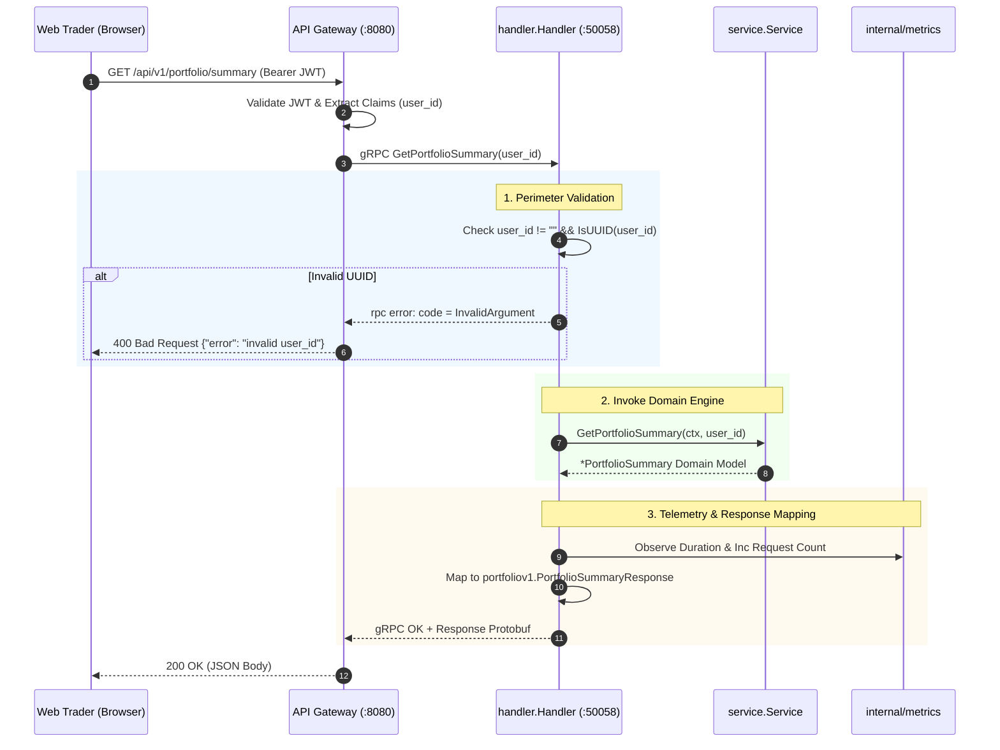

# Portfolio gRPC Presentation Handler (`services/portfolio/internal/handler`)

## 1. Overview & System Role

The `services/portfolio/internal/handler` package serves as the **Transport Adapter Layer** in Hexagonal / Clean Architecture for the **Portfolio Service**.

It implements the compiled gRPC server contract `portfoliov1.PortfolioServiceServer` generated from `proto/portfolio/v1/portfolio.proto`.

It is exposed on TCP port `:50058` and handles high-throughput, synchronous unary RPC calls originating from the **API Gateway** (`services/gateway`).

```
                    ┌──────────────────────────────┐
                    │         API Gateway          │
                    │  (GET /api/v1/portfolio/...) │
                    └──────────────┬───────────────┘
                                   │ gRPC (:50058)
                                   ▼
      ┌────────────────────────────────────────────────────────┐
      │         services/portfolio/internal/handler            │
      │                                                        │
      │  • Perimeter Request Validation (UUID Checks)          │
      │  • Golden Signal Telemetry (Requests, Latency)         │
      │  • Canonical gRPC Error Code Mapping                   │
      │  • Domain Model <-> Protobuf Wire DTO Translation      │
      └────────────────────────────┬───────────────────────────┘
                                   │
                                   ▼
      ┌────────────────────────────────────────────────────────┐
      │         services/portfolio/internal/service            │
      │              (Domain Valuation Engine)                 │
      └────────────────────────────────────────────────────────┘
```

---

## 2. Core Problems Solved by This Package

### 2.1 Perimeter Defense & Input Sanitization
* **The Problem**: Malformed requests (e.g. empty `user_id`, SQL injection strings, or corrupted tokens) reaching the internal database layer waste database connection pool slots and cause query failures.
* **How It Solves It**: Strict perimeter validation. Every incoming RPC checks that `user_id` is non-empty and represents a valid RFC 4122 UUID via `uuid.Parse(userID)`. Invalid requests are rejected immediately with `codes.InvalidArgument` (HTTP 400 at the gateway) before any downstream processing occurs.

### 2.2 Canonical Error Code Translation
* **The Problem**: Exposing internal database errors (e.g., `pq: relation "holdings" does not exist` or connection reset errors) directly to the API Gateway leaks internal infrastructure topology and prevents the gateway from producing proper HTTP status codes.
* **How It Solves It**: Maps all internal failures to standard gRPC status codes:
  * Missing/invalid parameters $\rightarrow$ `codes.InvalidArgument` (Gateway returns `400 Bad Request`).
  * Downstream or computation failure $\rightarrow$ `codes.Internal` (Gateway returns `500 Internal Server Error`).
  * Context cancellation / timeouts $\rightarrow$ `codes.Canceled` or `codes.DeadlineExceeded`.

### 2.3 Decoupling Wire Formats from Domain Models
* **The Problem**: Protobuf generated types are transport concerns. If the internal domain models are tied directly to protobuf structs, updating proto fields breaks core financial accounting calculations.
* **How It Solves It**: Clear architectural separation. The handler is responsible exclusively for:
  1. Unpacking protobuf requests.
  2. Passing pure Go primitives (`string`, `decimal.Decimal`) to `internal/service`.
  3. Translating the resulting domain structs (`PortfolioSummary`, `PortfolioHoldings`) into wire-format protobuf responses.

### 2.4 Automated Golden Signal Telemetry
* **The Problem**: Manual metrics instrumentation across every controller leads to boilerplate duplication and missed endpoints.
* **How It Solves It**: Deferred instrumentation blocks in each handler method capturing request count, response code, and latency in seconds:
  ```go
  start := time.Now()
  var statusCode codes.Code = codes.OK
  defer func() {
      metrics.GRPCRequestsTotal.WithLabelValues("GetPortfolioSummary", statusCode.String()).Inc()
      metrics.GRPCDurationSeconds.WithLabelValues("GetPortfolioSummary").Observe(time.Since(start).Seconds())
  }()
  ```

---

## 3. Function-by-Function Breakdown

### 3.1 `New`
```go
func New(svc *service.Service, logger *zap.Logger) *Handler
```
* **Purpose**: Composition Root constructor injecting the domain valuation service and structured logger.
* **Problem Solved**: Enables dependency injection, allowing handlers to be unit-tested without opening real network sockets.

---

### 3.2 `GetPortfolioSummary`
```go
func (h *Handler) GetPortfolioSummary(
    ctx context.Context,
    req *portfoliov1.GetPortfolioSummaryRequest,
) (*portfoliov1.PortfolioSummaryResponse, error)
```

* **Purpose**: Handles `rpc GetPortfolioSummary(GetPortfolioSummaryRequest) returns (PortfolioSummaryResponse)`.
* **Execution Steps**:
  1. Starts latency timer and registers deferred Prometheus telemetry.
  2. Validates `req.GetUserId()` is non-empty and a valid UUID.
  3. Calls `h.svc.GetPortfolioSummary(ctx, userID)`.
  4. On error, logs error with contextual fields and returns `status.Errorf(codes.Internal, ...)`.
  5. Translates domain `service.PortfolioSummary` into protobuf response:
     * `UserId`: Trader UUID.
     * `TotalValue`: Total equity in USDT (10 decimals).
     * `RealizedPnl`: Cumulative realized profit/loss in USDT.
     * `UnrealizedPnl`: Live unrealized profit/loss in USDT.
     * `CashBalance`: Total USDT cash in wallet.
     * `UpdatedAt`: RFC 3339 UTC timestamp.

---

### 3.3 `GetPortfolioHoldings`
```go
func (h *Handler) GetPortfolioHoldings(
    ctx context.Context,
    req *portfoliov1.GetPortfolioHoldingsRequest,
) (*portfoliov1.PortfolioHoldingsResponse, error)
```

* **Purpose**: Handles `rpc GetPortfolioHoldings(GetPortfolioHoldingsRequest) returns (PortfolioHoldingsResponse)`.
* **Execution Steps**:
  1. Starts latency timer and registers deferred Prometheus telemetry.
  2. Validates `req.GetUserId()` UUID format.
  3. Calls `h.svc.GetPortfolioHoldings(ctx, userID)`.
  4. Transforms domain slice `[]service.HoldingDetail` into protobuf `[]*portfoliov1.HoldingDetail`:
     * `Asset`: Asset code (e.g. `BTC`, `ETH`).
     * `TotalQuantity`: Held token amount.
     * `AverageEntryPrice`: Cost basis per token in USDT.
     * `CurrentPrice`: Live market mark price in USDT.
     * `UnrealizedPnl`: Position unrealized PnL in USDT.
  5. Returns `PortfolioHoldingsResponse` containing the full slice.

---

## 4. End-to-End Presentation Flow



---

## 5. gRPC Error Code Mapping

| Scenario | gRPC Status Code | API Gateway HTTP Code | Client Meaning |
|---|:---:|:---:|---|
| Missing `user_id` | `codes.InvalidArgument` | `400 Bad Request` | Client omitted authentication token or user identifier. |
| Malformed UUID | `codes.InvalidArgument` | `400 Bad Request` | User ID format is not a valid RFC 4122 UUID. |
| Valuation Engine Failure | `codes.Internal` | `500 Internal Error` | Downstream database or calculation failure. |
| Wallet / Market Timeout | `codes.Internal` | `500 Internal Error` | Upstream service dependency unavailable. |
