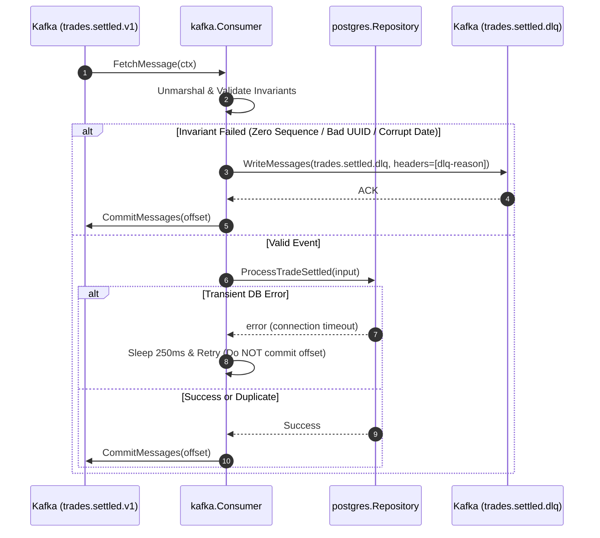
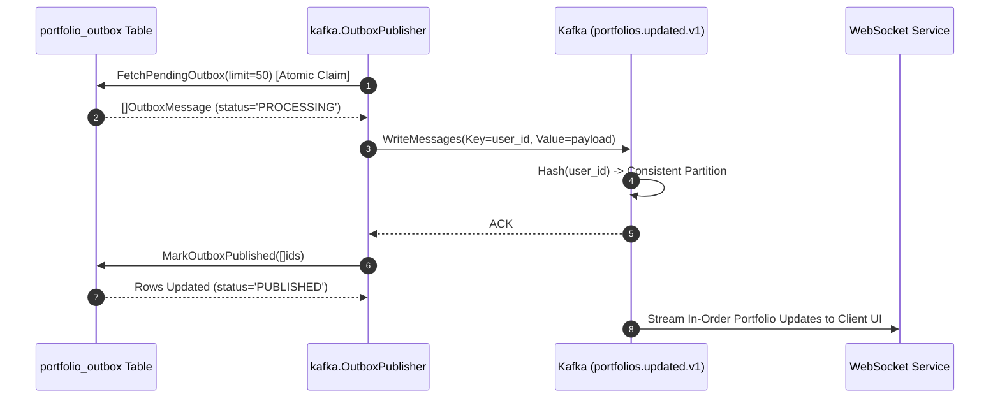

# Portfolio Messaging & Event Streaming (`services/portfolio/internal/kafka`)

## 1. Overview & System Role

The `services/portfolio/internal/kafka` package manages all asynchronous event-driven communication for the **Portfolio Service**.

It encapsulates two primary decoupled messaging engines:
1. **Inbound Settled Trade Ingestion ([`consumer.go`](file:///c:/Users/AKHIL%20BABU/OneDrive/Desktop/tradedrift/services/portfolio/internal/kafka/consumer.go))**:
   * Reads settled trade events from topic `trades.settled.v1` emitted by the Wallet Service outbox.
   * Enforces strict financial invariant validations.
   * Dispatches valid trades to the repository for atomic accounting.
   * Quarantines malformed or poisoned events to `trades.settled.dlq`.
   * Manages manual offset commits to guarantee zero message loss.
2. **Outbound Transactional Outbox Publisher ([`publisher.go`](file:///c:/Users/AKHIL%20BABU/OneDrive/Desktop/tradedrift/services/portfolio/internal/kafka/publisher.go))**:
   * Background polling worker that scans `portfolio_outbox` in PostgreSQL.
   * Atomically claims batches of `PENDING` or unacknowledged `PROCESSING` records.
   * Dispatches `PortfolioUpdated` events to Kafka topic `portfolios.updated.v1`.
   * Enforces per-user partition keying (`user_id`) to preserve strict chronological event delivery to the downstream **Notification & WebSocket Service**.

```
                           Kafka Topic: trades.settled.v1
                                        │
                                        ▼
                   ┌─────────────────────────────────────────┐
                   │             kafka.Consumer              │
                   │                                         │
                   │  1. Fetch Message (Manual Commit Mode)  │
                   │  2. Strict Validation (UUIDs, Sequence) │
                   │  3. Settle Trade (Atomic Repository)    │
                   └───────────┬─────────────────┬───────────┘
                               │                 │
                Valid Trade    │                 │ Poison / Accounting Error
                               ▼                 ▼
             ┌─────────────────────────┐   ┌─────────────────────────┐
             │   postgres.Repository   │   │  Kafka Topic (DLQ)      │
             │   (Holdings + Outbox)   │   │  trades.settled.dlq     │
             └─────────────┬───────────┘   └─────────────────────────┘
                           │
             portfolio_outbox table (status='PENDING')
                           │
                           ▼
             ┌─────────────────────────┐
             │  kafka.OutboxPublisher  │
             │                         │
             │  1. Claim Batch (CTE)   │
             │  2. Publish to Kafka    │
             │  3. Mark as PUBLISHED   │
             └─────────────┬───────────┘
                           │
                           ▼
                    Kafka Topic: portfolios.updated.v1
                    (Consumed by Notification & WebSockets)
```

---

## 2. Core Problems Solved by This Package

### 2.1 Head-of-Line Blocking Elimination via Dead-Letter Queue (DLQ)
* **The Problem**: If a producer emits a malformed payload (e.g., invalid UUID, corrupt date string, negative quantity, or missing sequence), a naive consumer that errors and retries will get stuck forever. The consumer partition halts, causing unbounded lag for all subsequent valid trades.
* **How It Solves It**: Strict separation between **transient errors** and **poison errors**:
  * **Transient Errors** (e.g., database network blip): The consumer retries with backoff without committing the offset.
  * **Poison Errors** (e.g., schema validation failure, self-trade, insufficient holdings): The consumer wraps the failure as `PoisonError`, forwards the original raw message to `trades.settled.dlq` with diagnostic headers, and commits the Kafka offset so the consumer group progresses without interruption.

### 2.2 DLQ Publish-Before-Commit Invariant
* **The Problem**: If the consumer commits an offset before verifying that the poison message was successfully persisted to the DLQ, and the DLQ write fails (e.g., Kafka broker timeout), the message is lost forever without an audit trail.
* **How It Solves It**: The consumer commits the offset **only after** `dlqWriter.WriteMessages` returns success:
  ```go
  if dlqErr := c.sendToDLQ(ctx, msg, poison.Error()); dlqErr != nil {
      c.logger.Error("failed to publish to DLQ; will not commit offset to prevent data loss", zap.Error(dlqErr))
      time.Sleep(500 * time.Millisecond)
      continue // Retry whole process without committing offset
  }
  c.commitMsg(ctx, msg) // Only commit after DLQ ACK
  ```

### 2.3 Strict Chronological Ordering per User
* **The Problem**: If a user executes multiple trades in rapid succession (e.g. Buy 1 BTC $\rightarrow$ Sell 0.5 BTC $\rightarrow$ Buy 2 BTC), and the resulting `PortfolioUpdated` events are written to different Kafka partitions, the downstream WebSocket Service could process them out of order, displaying flashing, backwards balances on client user interfaces.
* **How It Solves It**: The `OutboxPublisher` explicitly sets `msg.Key = []byte(msg.PartitionKey)` (which is the trader's `user_id`) and uses `kafkago.Hash{}` balancer:
  ```go
  kafkaMessages = append(kafkaMessages, kafkago.Message{
      Key:   []byte(msg.PartitionKey), // user_id
      Value: msg.Payload,
      Time:  msg.CreatedAt,
      Headers: []kafkago.Header{
          {Key: "event-type", Value: []byte(msg.EventType)},
          {Key: "event-id", Value: []byte(msg.ID)},
      },
  })
  ```
  Kafka guarantees that all records with the same partition key land on the same partition, preserving strict chronological arrival order.

### 2.4 Idempotent Delivery with Stable Event IDs
* **The Problem**: In network partitions or publisher restarts, outbox messages may be re-published (at-least-once delivery semantics).
* **How It Solves It**: The publisher injects a stable `event-id` header and embeds `event_id` in the JSON payload, allowing downstream WebSocket and analytics consumers to deduplicate events effortlessly.

---

## 3. Function-by-Function Breakdown

### 3.1 Inbound Consumer (`consumer.go`)

#### `NewConsumer`
```go
func NewConsumer(
    brokers []string,
    groupID string,
    topicTradeSettled string,
    topicDLQ string,
    repo repository.Repository,
    logger *zap.Logger,
) *Consumer
```
* **Purpose**: Initializes the Kafka reader and DLQ writer.
* **Key Configuration**:
  * `CommitInterval: 0`: Disables auto-commit to enforce explicit manual offset control.
  * `StartOffset: kafkago.FirstOffset`: Allows replay from beginning on disaster recovery.
  * `RequiredAcks: kafkago.RequireAll`: Ensures DLQ writes are acknowledged by all replicas before committing.

#### `Start`
```go
func (c *Consumer) Start(ctx context.Context) error
```
* **Purpose**: Executes the continuous message fetch-and-dispatch loop until context cancellation.
* **Error Handling Strategy**:
  * Inspects returned errors via `errors.As(err, &poison)`.
  * Transient errors trigger a 250ms backoff and retry without offset commit.
  * Poison errors invoke `sendToDLQ` and commit the offset upon DLQ success.

#### `processMessage`
```go
func (c *Consumer) processMessage(ctx context.Context, msg kafkago.Message) error
```
* **Purpose**: Unmarshals JSON payload into `TradeSettledEvent` and enforces strict pre-flight invariant validations:
  1. Valid UUIDs for `TradeID`, `BuyerID`, `SellerID`, `BuyOrderID`, `SellOrderID`.
  2. Non-empty `MarketID`, `BaseAsset`, `QuoteAsset`.
  3. Strict monotonic sequence verification (`Sequence > 0`).
  4. Self-trade rejection (`BuyerID != SellerID`).
  5. Positive decimal amounts for `Price` and `Quantity`.
  6. Strict RFC3339Nano parsing for `ExecutedAt` and `SettledAt` (fatal error $\rightarrow$ DLQ if invalid).
  7. Invokes `repo.ProcessTradeSettled(ctx, input)`. Handles harmless duplicates (`ErrTradeAlreadyProcessed`) without errors.

#### `sendToDLQ`
```go
func (c *Consumer) sendToDLQ(ctx context.Context, original kafkago.Message, reason string) error
```
* **Purpose**: Packages the poisoned message and dispatches it to `trades.settled.dlq` with tracing headers:
  * `dlq-reason`: Text description of the invariant failure.
  * `dlq-source-topic`: `trades.settled.v1`.
  * `dlq-partition`: Partition number of the original message.
  * `dlq-offset`: Offset of the original message.
  * `dlq-timestamp`: Time of DLQ routing.

#### `Close`
```go
func (c *Consumer) Close() error
```
* **Purpose**: Flushes in-flight messages and gracefully closes the reader and DLQ writer using `errors.Join`.

---

### 3.2 Outbound Outbox Publisher (`publisher.go`)

#### `NewOutboxPublisher`
```go
func NewOutboxPublisher(
    brokers []string,
    topic string,
    repo repository.Repository,
    logger *zap.Logger,
) *OutboxPublisher
```
* **Purpose**: Instantiates the background outbox worker with `pollInterval = 100ms` and `batchSize = 50`.
* **Writer Configuration**: Uses `kafkago.Hash{}` balancer and `RequireAll` acks.

#### `Start`
```go
func (p *OutboxPublisher) Start(ctx context.Context) error
```
* **Purpose**: Continuous background timer loop polling PostgreSQL for pending outbox messages.

#### `publishPending`
```go
func (p *OutboxPublisher) publishPending(ctx context.Context) error
```
* **Purpose**: The 3-phase outbox publish cycle:
  1. **Claim Batch**: Invokes `repo.FetchPendingOutbox(ctx, p.batchSize)` which uses an atomic CTE to mark messages as `PROCESSING` with a 1-minute lease.
  2. **Kafka Dispatch**: Converts messages to `kafkago.Message` with partition key `user_id` and headers, then executes `p.writer.WriteMessages`.
  3. **Acknowledge Batch**: Invokes `repo.MarkOutboxPublished(ctx, ids)` which updates PostgreSQL rows to `status = 'PUBLISHED'` and `published_at = NOW()`.

#### `Close`
```go
func (p *OutboxPublisher) Close() error
```
* **Purpose**: Flushes pending outbox producer buffers and closes the network connection.

---

## 4. End-to-End Architectural Flows

### Flow 1: Inbound Consumption, Invariant Check & DLQ Routing



---

### Flow 2: Outbox Publishing & Per-User Partitioning



---

## 5. Topic Reference & Schema Contracts

| Topic Name | Producer | Consumer | Partition Key | Guarantees |
|---|---|---|---|---|
| `trades.settled.v1` | Wallet Service Outbox | Portfolio Service (`kafka.Consumer`) | `trade_id` | At-least-once, immutable settlement event |
| `trades.settled.dlq` | Portfolio Service (`kafka.Consumer`) | Operational Admin / Audit Replay | Original Key | At-least-once, diagnostic headers included |
| `portfolios.updated.v1` | Portfolio Service (`kafka.OutboxPublisher`) | Notification & WebSocket Service | `user_id` | At-least-once, **strict per-user order** |
