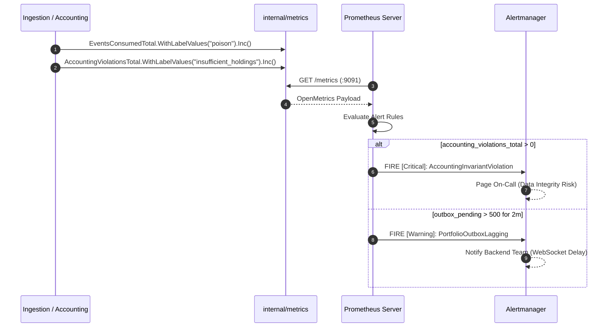

# Portfolio Observability & Prometheus Metrics (`services/portfolio/internal/metrics`)

## 1. Overview & Purpose

The `services/portfolio/internal/metrics` package provides the centralized telemetry and operational monitoring definitions for the **Portfolio Service**.

It instantiates and auto-registers Prometheus metric vectors using `promauto` under the standard TradeDrift platform naming convention:
* **Namespace**: `tradedrift`
* **Subsystem**: `portfolio`

All metrics defined here are exposed over HTTP on port `:9091` at `/metrics` via `promhttp.Handler()` inside [`cmd/server/main.go`](file:///c:/Users/AKHIL%20BABU/OneDrive/Desktop/tradedrift/services/portfolio/cmd/server/main.go).

```
 ┌─────────────────────────────────────────────────────────────────────────────┐
 │                      Portfolio Service Components                           │
 │                                                                             │
 │  ┌────────────────┐    ┌─────────────────┐    ┌──────────────────────────┐  │
 │  │ Kafka Consumer │    │   Repository    │    │      Domain Service      │  │
 │  │  (Ingestion)   │    │  (PostgreSQL)   │    │  (Valuation / Accounting)│  │
 │  └───────┬────────┘    └────────┬────────┘    └────────────┬─────────────┘  │
 │          │                      │                          │                │
 │          └──────────────┐       │       ┌──────────────────┘                │
 │                         ▼       ▼       ▼                                   │
 │             ┌──────────────────────────────────────────────┐                │
 │             │   metrics.go (Prometheus Instruments)        │                │
 │             │   • EventsConsumedTotal                      │                │
 │             │   • DBDurationSeconds                        │                │
 │             │   • ValuationDurationSeconds                 │                │
 │             │   • OutboxPending / OutboxPublishTotal       │                │
 │             │   • AccountingViolationsTotal (P0 Alert)     │                │
 │             └──────────────────────┬───────────────────────┘                │
 └────────────────────────────────────┼────────────────────────────────────────┘
                                      │ Scraped every 10s
                                      ▼
                       ┌──────────────────────────────┐
                       │ Prometheus / Grafana / Alert │
                       │    GET :9091/metrics         │
                       └──────────────────────────────┘
```

---

## 2. What Problems This Package Solves

### 2.1 Silent Financial Invariant Degradation
* **Problem**: If an upstream bug in the matching engine or settlement coordinator produces an impossible trade (such as a trader selling more crypto than they own, or a self-trade), the portfolio consumer catches it and rejects it. However, if this only writes to stdout logs, operators may not realize that trades are failing until customers complain.
* **How It Solves It**: Exposes `AccountingViolationsTotal` with label `violation_type="insufficient_holdings"` or `violation_type="self_trade"`. This allows Alertmanager to page on-call engineers immediately when `rate(accounting_violations_total[1m]) > 0`.

### 2.2 Outbox Processing Lag & WebSocket Staleness
* **Problem**: In an event-driven exchange, the transactional outbox must reliably stream position updates to the downstream WebSocket service. If the outbox worker crashes, hangs, or encounters Kafka write timeouts, outbox events accumulate in PostgreSQL without downstream consumers knowing that UI positions are stale.
* **How It Solves It**: Exposes the `OutboxPending` gauge and `OutboxPublishTotal` counter. An `OutboxPending > 500` alert detects publishing bottlenecks before users experience noticeable UI staleness.

### 2.3 Distributed Latency Attribution (DB vs. Remote RPCs)
* **Problem**: When `GetPortfolioSummary` experiences latency spikes (e.g. 500ms instead of 5ms), it is impossible to know whether the bottleneck is PostgreSQL lock contention, the Wallet Service balance lookup, or Market Service ticker lookups without granular instrumentation.
* **How It Solves It**: Provides separated latency histograms:
  * `db_duration_seconds`: Isolated PostgreSQL query time.
  * `valuation_duration_seconds`: Total end-to-end valuation time including remote gRPC calls.
  * `grpc_duration_seconds`: Total gRPC response latency to the API Gateway.

---

## 3. Metric Instruments Breakdown

### 3.1 `EventsConsumedTotal` (`CounterVec`)
```go
EventsConsumedTotal = promauto.NewCounterVec(
    prometheus.CounterOpts{
        Namespace: "tradedrift",
        Subsystem: "portfolio",
        Name:      "events_consumed_total",
        Help:      "Total number of settled trade events consumed from Kafka by status.",
    },
    []string{"status", "market"},
)
```
* **Labels**:
  * `status`: `success` | `duplicate` | `poison` | `error`
  * `market`: e.g. `BTC-USDT`, `ETH-USDT`
* **Purpose**: Measures trade consumption throughput and failure modes.
* **Problem Solved**: Instantly reveals if duplicate messages are arriving (`duplicate`), bad payloads are being quarantined to DLQ (`poison`), or PostgreSQL connection issues are causing retries (`error`).

---

### 3.2 `DBDurationSeconds` (`HistogramVec`)
```go
DBDurationSeconds = promauto.NewHistogramVec(
    prometheus.HistogramOpts{
        Namespace: "tradedrift",
        Subsystem: "portfolio",
        Name:      "db_duration_seconds",
        Help:      "Duration of database operations in seconds.",
        Buckets:   []float64{0.0005, 0.001, 0.0025, 0.005, 0.01, 0.025, 0.05, 0.1, 0.25, 0.5, 1.0},
    },
    []string{"query"},
)
```
* **Labels**:
  * `query`: `process_trade_settled` | `get_holdings_by_user` | `fetch_pending_outbox` | `mark_outbox_published`
* **Purpose**: Sub-millisecond to 1-second latency tracking for every database operation.
* **Problem Solved**: Detects transaction serialization delays, deterministic lock wait times, and index degradation under high load.

---

### 3.3 `ValuationDurationSeconds` (`HistogramVec`)
```go
ValuationDurationSeconds = promauto.NewHistogramVec(
    prometheus.HistogramOpts{
        Namespace: "tradedrift",
        Subsystem: "portfolio",
        Name:      "valuation_duration_seconds",
        Help:      "Duration of dynamic portfolio valuation computations in seconds.",
        Buckets:   []float64{0.001, 0.005, 0.01, 0.025, 0.05, 0.1, 0.25, 0.5, 1.0},
    },
    []string{"endpoint"},
)
```
* **Labels**:
  * `endpoint`: `summary` | `holdings`
* **Purpose**: Measures the duration of dynamic on-demand valuation calculations including remote Wallet and Market gRPC calls.
* **Problem Solved**: Identifies when downstream market price fetches or wallet balance queries are causing latency degradation for client dashboards.

---

### 3.4 `GRPCRequestsTotal` & `GRPCDurationSeconds`
```go
GRPCRequestsTotal = promauto.NewCounterVec(..., []string{"method", "code"})
GRPCDurationSeconds = promauto.NewHistogramVec(..., []string{"method"})
```
* **Labels**:
  * `method`: `GetPortfolioSummary` | `GetPortfolioHoldings`
  * `code`: `OK` | `InvalidArgument` | `Internal` | `Unavailable`
* **Purpose**: Standard golden signal telemetry for inbound gRPC requests from the API Gateway.
* **Problem Solved**: Monitors portfolio API throughput, error rates, and 99th percentile SLA compliance.

---

### 3.5 `OutboxPending` (`Gauge`) & `OutboxPublishTotal` (`CounterVec`)
```go
OutboxPending = promauto.NewGauge(...)
OutboxPublishTotal = promauto.NewCounterVec(..., []string{"status"})
```
* **Labels**:
  * `status`: `success` | `error`
* **Purpose**: Monitors the health and backlog of the transactional outbox pipeline.
* **Problem Solved**: `OutboxPending` measures queued events waiting in PostgreSQL. A growing gauge indicates that the outbox publisher is falling behind or Kafka brokers are unreachable.

---

### 3.6 `AccountingViolationsTotal` (`CounterVec`)
```go
AccountingViolationsTotal = promauto.NewCounterVec(
    prometheus.CounterOpts{
        Namespace: "tradedrift",
        Subsystem: "portfolio",
        Name:      "accounting_violations_total",
        Help:      "Total number of critical accounting invariant violations detected.",
    },
    []string{"violation_type"},
)
```
* **Labels**:
  * `violation_type`: `insufficient_holdings` | `self_trade`
* **Purpose**: High-severity financial invariant breach counter.
* **Problem Solved**: Guarantees immediate alert visibility when upstream components violate exchange invariants (e.g. attempting to sell non-existent balance or bypassing self-trade prevention).

---

## 4. Operational Telemetry & Alerting Flows



---

## 5. Recommended Grafana & Alertmanager PromQL Rules

| Alert Rule | Expression | Severity | Description |
|---|---|:---:|---|
| **Accounting Violation Detected** | `increase(tradedrift_portfolio_accounting_violations_total[1m]) > 0` | **Critical (P0)** | Upstream trade settled event attempted to over-sell or self-trade. |
| **Outbox Backlog Accumulating** | `tradedrift_portfolio_outbox_pending > 500` for 2m | **Warning (P1)** | Transactional outbox publisher is lagging behind database writes. |
| **High Poison Event Rate** | `rate(tradedrift_portfolio_events_consumed_total{status="poison"}[5m]) > 0.05` | **Warning (P1)** | Corrupted or malformed events are being pushed to DLQ. |
| **gRPC 99th Percentile Latency** | `histogram_quantile(0.99, rate(tradedrift_portfolio_grpc_duration_seconds_bucket[5m])) > 0.2` | **Warning (P2)** | 99% of portfolio requests taking longer than 200ms. |
