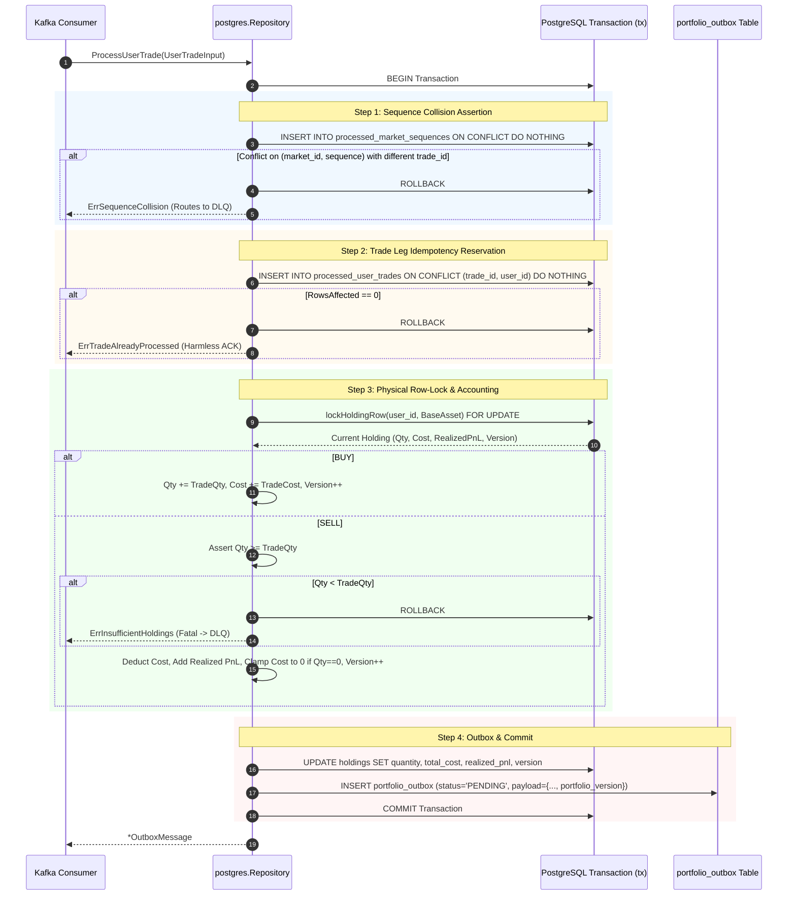
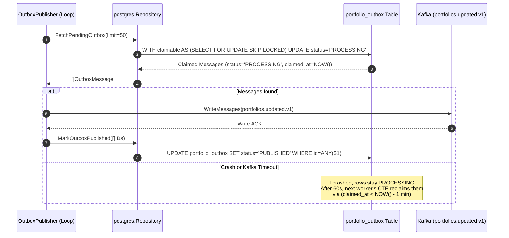

# Portfolio Persistence & Accounting Repository (`services/portfolio/internal/repository`)

## 1. Overview & System Role

The `services/portfolio/internal/repository` package contains the persistence layer, domain storage contracts, and stateful financial accounting engine for the **Portfolio Service**.

It is split into two core layers:
1. **Domain Contract (`repository.go`)**: Defines the domain structures (`Holding`, `ProcessedUserTrade`, `ProcessedMarketSequence`, `OutboxMessage`, `UserTradeInput`), invariant errors (`ErrInsufficientHoldings`, `ErrSequenceCollision`, `ErrTradeAlreadyProcessed`), and the storage interface (`Repository`).
2. **PostgreSQL Implementation (`postgres/repository.go`)**: Implements the `Repository` interface against PostgreSQL (`tradedrift_portfolio`) with atomic transactions, sequence collision guards, leg-scoped idempotency, row-level locking, monotonic version increments, and transactional outbox claiming.

```
                   ┌──────────────────────────────────────────────┐
                   │               Kafka Consumer                 │
                   │      (portfolio.user.trades.v1: user_id)     │
                   └──────────────────────┬───────────────────────┘
                                          │ ProcessUserTrade(input)
                                          ▼
┌─────────────────────────────────────────────────────────────────────────────────┐
│              services/portfolio/internal/repository/postgres                    │
│                                                                                 │
│   1. Sequence Collision Guard (processed_market_sequences: market_id, sequence) │
│   2. User Leg Idempotency Reservation (processed_user_trades: trade_id, user_id)│
│   3. Single User Physical Row Lock (lockHoldingRow FOR UPDATE)                  │
│   4. Role Accounting (BUY: weighted-avg cost, SELL: balance check, realized PnL)│
│   5. Zero Silent Clamping: Negative balance -> fatal ErrInsufficientHoldings     │
│   6. Monotonic Version Increment: version = version + 1                         │
│   7. Transactional Outbox (portfolio_outbox: PENDING with portfolio_version)    │
│   8. Atomic Commit (All tables in 1 single database transaction)                │
└────────────────────────────────────────┬────────────────────────────────────────┘
                                         │
                                         ▼
                   ┌──────────────────────────────────────────────┐
                   │           PostgreSQL Database                │
                   │         (tradedrift_portfolio)               │
                   │   • holdings (with monotonic version)        │
                   │   • processed_user_trades (leg dedup)        │
                   │   • processed_market_sequences (audit/coll)  │
                   │   • portfolio_outbox (snapshot queue)        │
                   └──────────────────────────────────────────────┘
```

---

## 2. Core Engineering Problems Solved

### 2.1 Sequence Collision vs. Trade Leg Idempotency Decoupling
* **The Problem**: A single matched trade at sequence $S$ produces two accounting events: a buyer leg and a seller leg. If the schema enforced `UNIQUE(market_id, sequence)` on a single user trade table, the second leg would be falsely rejected as a sequence collision! Conversely, if sequence was ignored, an upstream bug reusing sequence numbers across different trades would corrupt the accounting audit trail.
* **How It Solves It**: Decoupling sequence integrity from leg idempotency via two dedicated tables:
  1. `processed_market_sequences(market_id, sequence, trade_id)`: Records the first leg of a sequence. If another event arrives with the same `(market_id, sequence)`, it verifies `existing_trade_id == in.TradeID`. If different, it aborts with `ErrSequenceCollision`.
  2. `processed_user_trades(trade_id, user_id)`: Tracks each individual user's trade leg. Duplicate deliveries of the same user leg are skipped harmlessly via `ON CONFLICT (trade_id, user_id) DO NOTHING`.

### 2.2 First-Time Holding Concurrency & Overwrite Prevention
* **The Problem**: If Alice has never bought BTC before, no row exists in `holdings`. A standard `SELECT ... FOR UPDATE` finds 0 rows, meaning **no row lock is acquired**. If two buys for Alice execute concurrently, both see 0 holdings, both calculate `0 + Q`, and the second transaction executes `ON CONFLICT DO UPDATE SET quantity = EXCLUDED.quantity`, overwriting the first trade's balance.
* **How It Solves It**: Pre-emptive zero-row initialization inside `lockHoldingRow`:
  ```sql
  INSERT INTO holdings (user_id, asset_code, quantity, total_cost, realized_pnl, updated_at)
  VALUES ($1, $2, 0, 0, 0, NOW())
  ON CONFLICT (user_id, asset_code) DO NOTHING;

  SELECT ... FROM holdings WHERE user_id = $1 AND asset_code = $2 FOR UPDATE;
  ```
  `INSERT ... ON CONFLICT DO NOTHING` guarantees the physical row exists without mutating existing data. The subsequent `SELECT ... FOR UPDATE` is guaranteed to lock the row exclusively, serializing concurrent first-time trades safely.

### 2.3 Check-Then-Act Idempotency Race Condition
* **The Problem**: Executing `SELECT EXISTS(...)` followed by an insert at the end of the transaction creates a check-then-act gap. Under duplicate Kafka deliveries arriving simultaneously on different worker threads, both could check existence before either inserts.
* **How It Solves It**: Atomic reservation at transaction start:
  ```sql
  INSERT INTO processed_trades (trade_id, user_id, market_id, sequence, processed_at)
  VALUES ($1, $2, $3, $4, NOW())
  ON CONFLICT (trade_id) DO NOTHING;
  ```
  If `tag.RowsAffected() == 0`, the trade was already processed, and the transaction exits immediately with `ErrTradeAlreadyProcessed`.

### 2.4 Competing Outbox Publishers & Lease Recovery
* **The Problem**: When executing `SELECT ... FOR UPDATE SKIP LOCKED` outside a database transaction, PostgreSQL releases the lock immediately upon query completion. Multiple outbox publishers running in parallel will read the exact same rows and emit duplicate events. Furthermore, if a publisher crashes after publishing to Kafka, rows could remain stuck in limbo.
* **How It Solves It**: Atomic state transition with 1-minute lease timeout recovery in a single Common Table Expression### 2.6 Monotonic Holding Versioning & Stale Snapshot Prevention
* **The Problem**: If a network glitch or outbox replay delivers balance updates out of order to WebSocket clients, an older balance snapshot could overwrite a newer one on the user's dashboard.
* **How It Solves It**: Every time a user holding is updated in PostgreSQL:
  ```sql
  version = version + 1
  ```
  This monotonic version number is stamped into the holding row and copied directly into the outbox event payload (`portfolio_version`). Downstream WebSocket servers and browser clients ignore any event where `portfolio_version <= last_seen_version`.

---

## 3. Function-by-Function Breakdown

### 3.1 `GetHoldingsByUser`
```go
func (r *Repository) GetHoldingsByUser(ctx context.Context, userID string) ([]repository.Holding, error)
```
* **Purpose**: Retrieves all active crypto holdings where `quantity > 0` for a given user, ordered alphabetically by `asset_code`.
* **Problem Solved**: Fast read-path query utilizing index `idx_holdings_user`, filtering out closed positions to minimize memory footprint during portfolio valuation.

---

### 3.2 `ProcessUserTrade`
```go
func (r *Repository) ProcessUserTrade(ctx context.Context, in repository.UserTradeInput) (*repository.OutboxMessage, error)
```
* **Purpose**: Executes the complete 1-atomic financial transaction for a single user's trade leg (`BUY` or `SELL`).
* **Steps Executed Within the Atomic Transaction**:
  1. **Sequence Collision Guard**: Verifies `(market_id, sequence)` against `processed_market_sequences`. If the sequence was previously recorded for a different `trade_id`, rolls back immediately with `ErrSequenceCollision`.
  2. **Atomic Leg Idempotency Reservation**: Executes `INSERT INTO processed_user_trades (trade_id, user_id, ...) ON CONFLICT (trade_id, user_id) DO NOTHING`. If `RowsAffected == 0`, rolls back and returns `ErrTradeAlreadyProcessed`.
  3. **Single User Row Lock**: Pre-emptively inserts holding with 0 values (`ON CONFLICT DO NOTHING`) and acquires exclusive lock via `SELECT ... FOR UPDATE` on `(user_id, asset_code)`.
  4. **BUY Leg Accounting**:
     $$\text{TotalCost}_{\text{new}} = \text{TotalCost}_{\text{prev}} + (Q \times P)$$
     $$\text{Quantity}_{\text{new}} = \text{Quantity}_{\text{prev}} + Q$$
     $$\text{Version}_{\text{new}} = \text{Version}_{\text{prev}} + 1$$
  5. **SELL Leg Accounting**:
     * Balance Check: Verifies $\text{Quantity}_{\text{prev}} \ge Q$. If false, aborts with `ErrInsufficientHoldings` (fatal error $\rightarrow$ DLQ; zero silent clamping).
     * Calculates cost of sold: $\text{CostOfSold} = Q \times \bar{P}_{\text{entry}}$.
     * Calculates realized PnL delta: $\Delta_{\text{pnl}} = (Q \times P) - \text{CostOfSold}$.
     * Updates: $\text{Quantity}_{\text{new}} = \text{Quantity}_{\text{prev}} - Q$.
     * Updates: $\text{TotalCost}_{\text{new}} = \text{TotalCost}_{\text{prev}} - \text{CostOfSold}$.
     * Updates: $\text{RealizedPnL}_{\text{new}} = \text{RealizedPnL}_{\text{prev}} + \Delta_{\text{pnl}}$.
     * Clamps cost to 0 if fully closed ($\text{Quantity}_{\text{new}} == 0$).
     * Updates: $\text{Version}_{\text{new}} = \text{Version}_{\text{prev}} + 1$.
  6. **Update Holding**: Persists updated holding record with incremented version to `holdings`.
  7. **Transactional Outbox Insertion**: Generates single `PortfolioUpdated` outbox message containing `portfolio_version`, asset, quantity, and realized PnL with status `PENDING`.
  8. **Commit Transaction**: Atomically commits all changes.

---

### 3.3 `FetchPendingOutbox`
```go
func (r *Repository) FetchPendingOutbox(ctx context.Context, limit int) ([]repository.OutboxMessage, error)
```
* **Purpose**: Atomically claims up to `limit` pending outbox messages by transitioning their status to `PROCESSING` with `claimed_at = NOW()`.
* **Problem Solved**: Prevents multi-pod publisher race conditions and reclaims abandoned messages from crashed workers.

---

### 3.4 `MarkOutboxPublished`
```go
func (r *Repository) MarkOutboxPublished(ctx context.Context, ids []string) error
```
* **Purpose**: Transitions claimed outbox messages to `status = 'PUBLISHED'` and records `published_at = NOW()`.
* **Problem Solved**: Single batch query `WHERE id = ANY($1)` acknowledging successfully published Kafka batches.

---

### 3.5 Private Helper Functions

#### `lockHoldingRow`
```go
func lockHoldingRow(ctx context.Context, tx pgx.Tx, userID, assetCode string) (repository.Holding, error)
```
* Ensures row existence via `INSERT INTO holdings (...) ON CONFLICT DO NOTHING`.
* Acquires exclusive row lock via `SELECT ... FOR UPDATE`.

#### `upsertHolding`
```go
func upsertHolding(ctx context.Context, tx pgx.Tx, h repository.Holding) error
```
* Updates `quantity`, `total_cost`, `realized_pnl`, `version = h.Version`, and `updated_at = NOW()` for the locked user/asset.

#### `createOutboxMessage`
```go
func createOutboxMessage(ctx context.Context, tx pgx.Tx, h repository.Holding, now time.Time) (repository.OutboxMessage, error)
```
* Constructs JSON payload containing user position state, monotonic `portfolio_version`, and stable `event_id`.
* Inserts row into `portfolio_outbox` with status `PENDING` and partition key `user_id`.

---

## 4. End-to-End Architectural Flows

### Flow 1: `ProcessUserTrade` (1-Atomic Transaction)



---

### Flow 2: Outbox Publishing & Lease Recovery



---

## 5. Integration Test Coverage (`repository_test.go`)

The PostgreSQL implementation is verified against live PostgreSQL databases using real concurrent transactions:

| Test Case | Scenario Tested | Verification Invariant |
|---|---|---|
| `TestProcessUserTrade_OrderedBuyThenSell` | User buys 1 BTC @ 50k, then sells 1 BTC @ 60k | Balance transitions $0 \to 1 \to 0$, Realized PnL $= +10,000$, Cost resets to $0$, Version $= 2$ |
| `TestProcessUserTrade_OutOfOrderSellRejection` | User attempts to sell 1 BTC with 0 balance | Returns `ErrInsufficientHoldings` immediately, transaction rolled back |
| `TestProcessUserTrade_SequenceCollisionRejection` | Two different trades reuse `(market_id, sequence)` | Second trade rejected with `ErrSequenceCollision`, balance unchanged |
| `TestProcessUserTrade_DuplicateTradeSkipping` | Identical `(trade_id, user_id)` received twice | Second execution returns `ErrTradeAlreadyProcessed` without updating balance |
| `TestProcessUserTrade_FirstTimeConcurrentBuys` | 5 concurrent goroutines buy 1 BTC each for new user | Zero-row initialization serializes safely; final balance $= 5.0$, Version $= 5$ |
| `TestProcessTradeSettled_CrossedConcurrentTrades` | 16 concurrent trades between 4 users (Alice, Bob, Charlie, Dave) | Deterministic UUID row-locking prevents all deadlocks (`SQLSTATE 40P01 == 0`) |
| `TestOutbox_ClaimAndLeaseExpiryRecovery` | Outbox row claimed, artificially aged past 60s lease | Recovered by subsequent CTE claim and marked published without duplicate delivery |

---

## 6. Observability & Performance Metrics

* **`portfolio_db_duration_seconds`**: Histogram tracking query latencies (`process_user_trade`, `get_holdings_by_user`, `fetch_pending_outbox`, `mark_outbox_published`).
* **`portfolio_accounting_violations_total`**: Counter incremented on invariant breaks (`sequence_collision`, `insufficient_holdings`).
