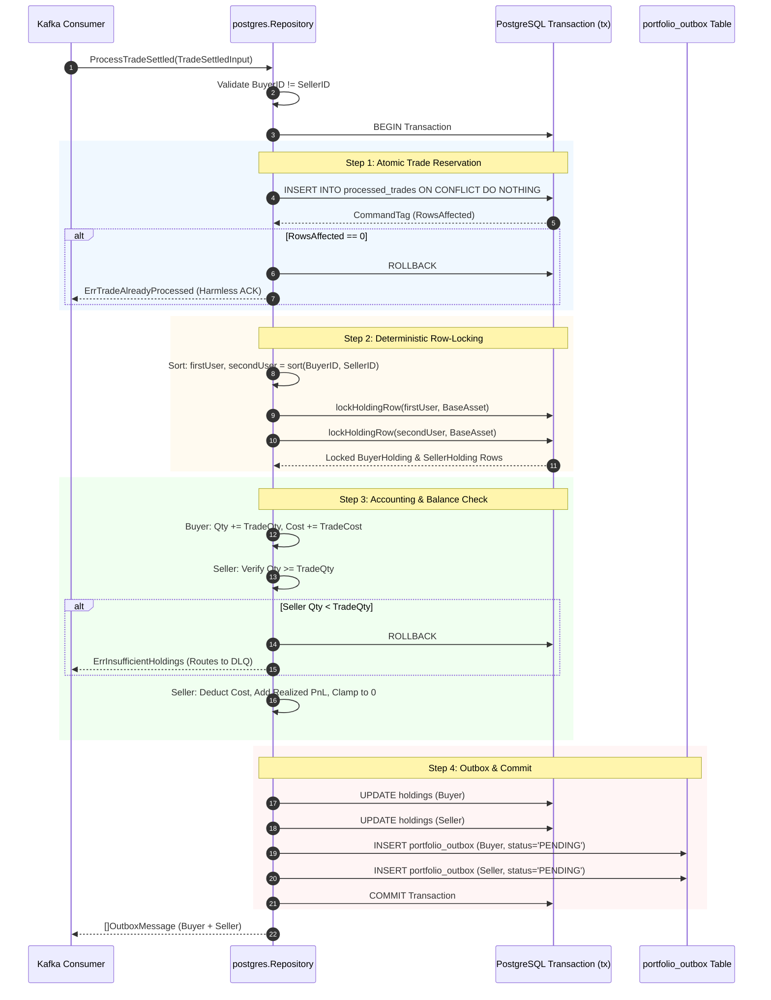
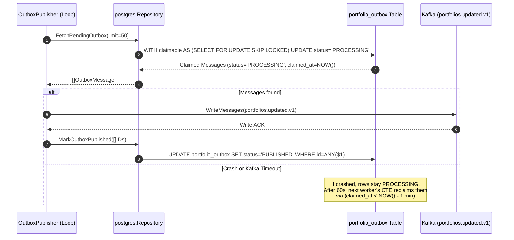

# Portfolio Persistence & Accounting Repository (`services/portfolio/internal/repository`)

## 1. Overview & System Role

The `services/portfolio/internal/repository` package contains the persistence layer, domain storage contracts, and stateful financial accounting engine for the **Portfolio Service**.

It is split into two core layers:
1. **Domain Contract (`repository.go`)**: Defines the domain structures (`Holding`, `ProcessedTrade`, `OutboxMessage`, `TradeSettledInput`), invariant errors (`ErrInsufficientHoldings`, `ErrSelfTrade`, `ErrTradeAlreadyProcessed`), and the storage interface (`Repository`).
2. **PostgreSQL Implementation (`postgres/repository.go`)**: Implements the `Repository` interface against PostgreSQL (`tradedrift_portfolio`) with atomic transactions, deterministic deadlock prevention, row-level locking, and transactional outbox claiming.

```
                   ┌──────────────────────────────────────────────┐
                   │               Kafka Consumer                 │
                   │           (trades.settled.v1)                │
                   └──────────────────────┬───────────────────────┘
                                          │ ProcessTradeSettled(input)
                                          ▼
┌─────────────────────────────────────────────────────────────────────────────────┐
│              services/portfolio/internal/repository/postgres                    │
│                                                                                 │
│   1. Reject Self-Trades (buyer == seller)                                       │
│   2. Atomic Dedup & Audit Log (processed_trades)                                │
│   3. Deterministic Row-Locking: min(buyer, seller) -> max(buyer, seller)       │
│   4. Buyer Accounting: Weighted-average cost basis                              │
│   5. Seller Accounting: Balance check, cost depletion, realized PnL, clamp to 0 │
│   6. Update Holdings (holdings)                                                 │
│   7. Transactional Outbox (portfolio_outbox: PENDING)                           │
│   8. Atomic Commit (All 3 tables in 1 database transaction)                     │
└────────────────────────────────────────┬────────────────────────────────────────┘
                                         │
                                         ▼
                   ┌──────────────────────────────────────────────┐
                   │           PostgreSQL Database                │
                   │         (tradedrift_portfolio)               │
                   │   • holdings                                 │
                   │   • processed_trades                         │
                   │   • portfolio_outbox                         │
                   └──────────────────────────────────────────────┘
```

---

## 2. Core Engineering Problems Solved

### 2.1 Deadlock Elimination on Concurrent Counter-Trades (Alice $\leftrightarrow$ Bob)
* **The Problem**: When Alice buys BTC from Bob in Trade 1 while Bob buys BTC from Alice in concurrent Trade 2, two separate database transactions attempt to lock the same two user rows in reverse order:
  * Transaction 1: Locks Alice $\rightarrow$ waits for Bob.
  * Transaction 2: Locks Bob $\rightarrow$ waits for Alice.
  * Result: PostgreSQL detects a cycle and terminates one transaction with `ERROR: deadlock detected (SQLSTATE 40P01)`.
* **How It Solves It**: Deterministic lexicographical UUID sorting. Before acquiring any row locks, the repository sorts the user IDs:
  ```go
  firstUser, secondUser := in.BuyerID, in.SellerID
  if firstUser > secondUser {
      firstUser, secondUser = secondUser, firstUser
  }
  firstHolding, err := lockHoldingRow(ctx, tx, firstUser, in.BaseAsset)
  secondHolding, err := lockHoldingRow(ctx, tx, secondUser, in.BaseAsset)
  ```
  Every concurrent transaction locks users in the exact same global order, making deadlocks mathematically impossible.

### 2.2 First-Time Holding Concurrency & Overwrite Prevention
* **The Problem**: If Alice has never bought BTC before, no row exists in `holdings`. A standard `SELECT ... FOR UPDATE` finds 0 rows, meaning **no row lock is acquired**. If two buys for Alice execute concurrently, both see 0 holdings, both calculate `0 + Q`, and the second transaction executes `ON CONFLICT DO UPDATE SET quantity = EXCLUDED.quantity`, overwriting the first trade's balance.
* **How It Solves It**: Pre-emptive zero-row initialization inside `lockHoldingRow`:
  ```sql
  INSERT INTO holdings (user_id, asset_code, quantity, total_cost, realized_pnl, updated_at)
  VALUES ($1, $2, 0, 0, 0, NOW())
  ON CONFLICT (user_id, asset_code) DO NOTHING;

  SELECT ... FROM holdings WHERE user_id = $1 AND asset_code = $2 FOR UPDATE;
  ```
  `INSERT ... ON CONFLICT DO NOTHING` guarantees the physical row exists without mutating existing data. The subsequent `SELECT ... FOR UPDATE` is guaranteed to lock the row exclusively, serializing concurrent first-time trades safely.

### 2.3 Check-Then-Act Idempotency Race Condition
* **The Problem**: Executing `SELECT EXISTS(...)` followed by an insert at the end of the transaction creates a check-then-act gap. Under duplicate Kafka deliveries arriving simultaneously on different worker threads, both could check existence before either inserts.
* **How It Solves It**: Atomic reservation at transaction start:
  ```sql
  INSERT INTO processed_trades (trade_id, user_id, market_id, sequence, processed_at)
  VALUES ($1, $2, $3, $4, NOW())
  ON CONFLICT (trade_id) DO NOTHING;
  ```
  If `tag.RowsAffected() == 0`, the trade was already processed, and the transaction exits immediately with `ErrTradeAlreadyProcessed`.

### 2.4 Competing Outbox Publishers & Lease Recovery
* **The Problem**: When executing `SELECT ... FOR UPDATE SKIP LOCKED` outside a database transaction, PostgreSQL releases the lock immediately upon query completion. Multiple outbox publishers running in parallel will read the exact same rows and emit duplicate events. Furthermore, if a publisher crashes after publishing to Kafka, rows could remain stuck in limbo.
* **How It Solves It**: Atomic state transition with 1-minute lease timeout recovery in a single Common Table Expression (CTE):
  ```sql
  WITH claimable AS (
      SELECT id
      FROM portfolio_outbox
      WHERE (status = 'PENDING')
         OR (status = 'PROCESSING' AND claimed_at < NOW() - INTERVAL '1 minute')
      ORDER BY created_at ASC
      LIMIT $1
      FOR UPDATE SKIP LOCKED
  )
  UPDATE portfolio_outbox
  SET status = 'PROCESSING', claimed_at = NOW()
  WHERE id IN (SELECT id FROM claimable)
  RETURNING id, aggregate_id, event_type, payload, partition_key, status, claimed_at, created_at;
  ```
  1. Each publisher claims exclusive rows by advancing their status to `PROCESSING`.
  2. Competing publishers skip claimed rows.
  3. If a publisher crashes, uncommitted rows automatically expire after 1 minute (`claimed_at < NOW() - INTERVAL '1 minute'`) and are reclaimed by the next publisher run.

### 2.5 Full Liquidation Zero-Reset (Floating-Point Epsilon Clamping)
* **The Problem**: Repeated partial sells followed by a full position close can leave residual micro-fractions (e.g. `0.0000000001` BTC with non-zero cost) due to division rounding.
* **How It Solves It**: Explicit zero-reset upon position closure:
  ```go
  if sellerHolding.Quantity.IsZero() || sellerHolding.Quantity.IsNegative() {
      sellerHolding.Quantity = decimal.Zero
      sellerHolding.TotalCost = decimal.Zero
  }
  ```

---

## 3. Function-by-Function Breakdown

### 3.1 `GetHoldingsByUser`
```go
func (r *Repository) GetHoldingsByUser(ctx context.Context, userID string) ([]repository.Holding, error)
```
* **Purpose**: Retrieves all active crypto holdings where `quantity > 0` for a given user, ordered alphabetically by `asset_code`.
* **Problem Solved**: Fast read-path query utilizing index `idx_holdings_user`, filtering out closed positions to minimize memory footprint during portfolio valuation.

---

### 3.2 `ProcessTradeSettled`
```go
func (r *Repository) ProcessTradeSettled(ctx context.Context, in repository.TradeSettledInput) ([]repository.OutboxMessage, error)
```
* **Purpose**: Executes the complete 1-atomic financial transaction for a settled trade.
* **Steps Executed Within the Atomic Transaction**:
  1. **Self-Trade Invariant Guard**: Checks `in.BuyerID != in.SellerID`. If equal, aborts with `repository.ErrSelfTrade`.
  2. **Atomic Idempotency Reservation**: Executes `INSERT INTO processed_trades ... ON CONFLICT DO NOTHING`. If `RowsAffected == 0`, returns `repository.ErrTradeAlreadyProcessed`.
  3. **Deterministic Row Locks**: Sorts `BuyerID` and `SellerID` alphabetically; executes `lockHoldingRow` for `firstUser`, then `secondUser`.
  4. **Buyer Accounting (Weighted-Average Cost)**:
     $$\text{TotalCost}_{\text{new}} = \text{TotalCost}_{\text{prev}} + (Q \times P)$$
     $$\text{Quantity}_{\text{new}} = \text{Quantity}_{\text{prev}} + Q$$
  5. **Seller Accounting (Balance Check & Realized PnL)**:
     * Validates: $\text{Quantity}_{\text{prev}} \ge Q$. If false, aborts with `repository.ErrInsufficientHoldings`.
     * Calculates cost of sold: $\text{CostOfSold} = Q \times \bar{P}_{\text{entry}}$.
     * Calculates realized PnL delta: $\Delta_{\text{pnl}} = (Q \times P) - \text{CostOfSold}$.
     * Updates: $\text{Quantity}_{\text{new}} = \text{Quantity}_{\text{prev}} - Q$.
     * Updates: $\text{TotalCost}_{\text{new}} = \text{TotalCost}_{\text{prev}} - \text{CostOfSold}$.
     * Updates: $\text{RealizedPnL}_{\text{new}} = \text{RealizedPnL}_{\text{prev}} + \Delta_{\text{pnl}}$.
     * Clamps cost to 0 if $\text{Quantity}_{\text{new}} == 0$.
  6. **Update Holdings**: Persists updated holding records to `holdings` table.
  7. **Transactional Outbox Insertion**: Generates two `PortfolioUpdated` outbox messages (one for buyer, one for seller) with stable `event_id` and initial status `PENDING`.
  8. **Commit Transaction**: Atomically commits all changes.

---

### 3.3 `FetchPendingOutbox`
```go
func (r *Repository) FetchPendingOutbox(ctx context.Context, limit int) ([]repository.OutboxMessage, error)
```
* **Purpose**: Atomically claims up to `limit` pending outbox messages by transitioning their status to `PROCESSING` with `claimed_at = NOW()`.
* **Problem Solved**: Prevents multi-pod publisher race conditions and reclaims abandoned messages from crashed workers.

---

### 3.4 `MarkOutboxPublished`
```go
func (r *Repository) MarkOutboxPublished(ctx context.Context, ids []string) error
```
* **Purpose**: Transitions claimed outbox messages to `status = 'PUBLISHED'` and records `published_at = NOW()`.
* **Problem Solved**: Single batch query `WHERE id = ANY($1)` acknowledging successfully published Kafka batches.

---

### 3.5 Private Helper Functions

#### `lockHoldingRow`
```go
func lockHoldingRow(ctx context.Context, tx pgx.Tx, userID, assetCode string) (repository.Holding, error)
```
* Ensures row existence via `INSERT INTO holdings (...) ON CONFLICT DO NOTHING`.
* Acquires exclusive row lock via `SELECT ... FOR UPDATE`.

#### `upsertHolding`
```go
func upsertHolding(ctx context.Context, tx pgx.Tx, h repository.Holding) error
```
* Updates `quantity`, `total_cost`, `realized_pnl`, and `updated_at = NOW()` for the locked user/asset.

#### `createOutboxMessage`
```go
func createOutboxMessage(ctx context.Context, tx pgx.Tx, h repository.Holding, now time.Time) (repository.OutboxMessage, error)
```
* Constructs JSON payload containing user position state and stable `event_id`.
* Inserts row into `portfolio_outbox` with status `PENDING` and partition key `user_id`.

---

## 4. End-to-End Architectural Flows

### Flow 1: `ProcessTradeSettled` (1-Atomic Transaction)



---

### Flow 2: Outbox Publishing & Lease Recovery



---

## 5. Observability & Performance Metrics

* **`portfolio_db_duration_seconds`**: Histogram tracking query latencies (`process_trade_settled`, `get_holdings_by_user`, `fetch_pending_outbox`, `mark_outbox_published`).
* **`portfolio_accounting_violations_total`**: Counter incremented on invariant breaks (`self_trade`, `insufficient_holdings`).
