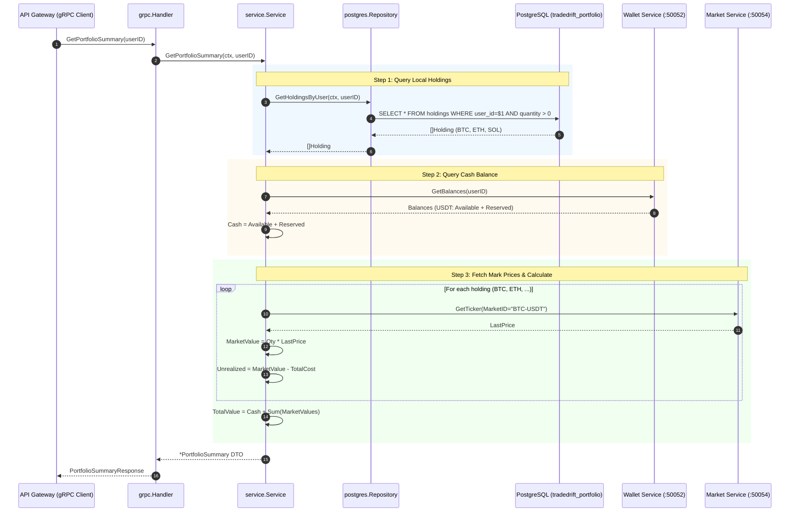
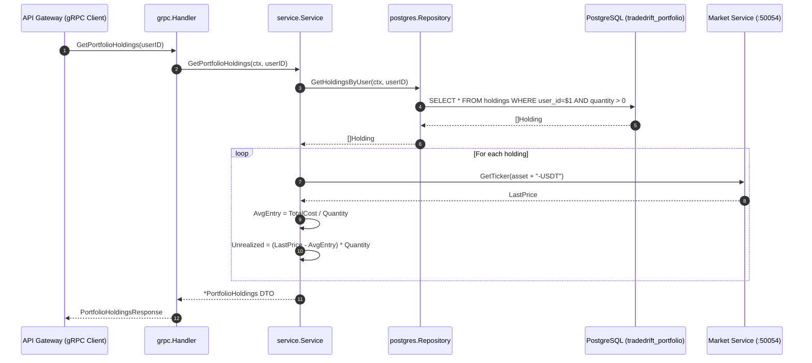

# Portfolio Domain & Valuation Service (`services/portfolio/internal/service`)

## 1. Overview & Architectural Role

The `services/portfolio/internal/service` package contains the core business domain logic and dynamic financial valuation engine for the **Portfolio Service** in TradeDrift.

In Hexagonal / Clean Architecture, this package serves as the **Domain Service Layer**:
* It sits between the transport adapters (`internal/handler` for gRPC) and data persistence (`internal/repository` for PostgreSQL).
* It orchestrates cross-service coordination between local crypto holdings, the **Wallet Service** (for cash balances), and the **Market Service** (for live asset prices).
* It enforces financial accounting rules, precision handling, and on-demand valuation calculations.

```
                    ┌────────────────────────────┐
                    │    internal/handler/grpc   │
                    │  (gRPC Transport Adapter)  │
                    └─────────────┬──────────────┘
                                  │
                                  ▼
      ┌───────────────────────────────────────────────────────┐
      │         services/portfolio/internal/service           │
      │                                                       │
      │  • PortfolioSummary Valuation Engine                  │
      │  • PortfolioHoldings Line-Item Position Calculator    │
      │  • Strict Consistency & Precision Clamping           │
      └───────────┬───────────────────┬───────────────────┬───┘
                  │                   │                   │
                  ▼                   ▼                   ▼
      ┌──────────────────────┐ ┌─────────────┐ ┌──────────────────────┐
      │ internal/repository  │ │ Wallet gRPC │ │     Market gRPC      │
      │  (Holdings from DB)  │ │(Cash Balances)│ │ (Live Mark Prices) │
      └──────────────────────┘ └─────────────┘ └──────────────────────┘
```

---

## 2. Core Problems Solved by This Package

### 2.1 Elimination of Cash Drift & Dual Bookkeeping
* **Problem**: If the Portfolio Service persisted user cash (`USDT`) balances in its local database alongside crypto holdings, any fiat/crypto deposit, withdrawal, fee debit, or referral credit handled by the Wallet Service would lead to out-of-sync cash discrepancies between Wallet and Portfolio.
* **How It Solves It**: The Portfolio Service **never stores USDT cash**. It delegates cash ownership exclusively to the Wallet Service and queries `WalletService.GetBalances(userID)` on demand during portfolio valuation. This guarantees total cash equity is always strictly consistent with the exchange ledger.

### 2.2 Eliminating Write Amplification from Live Market Fluctuation
* **Problem**: In a 24/7 crypto exchange, asset market prices change thousands of times per second. If the system attempted to pre-calculate and persist "unrealized PnL" or "total portfolio equity" into the database upon every ticker tick, the database write throughput would explode and corrupt under massive write amplification.
* **How It Solves It**: Dynamic on-demand valuation. The database stores only **immutable execution state** (`quantity`, `total_cost`, `realized_pnl`). Unrealized PnL and total portfolio value are computed purely in memory upon read requests using live ticker snapshots from the Market Service.

### 2.3 Strict Consistency vs. Misleading Financial Summaries
* **Problem**: If downstream dependencies (Wallet Service or Market Service) fail or time out, returning a partial response (e.g., zero cash or zero asset value) would show a trader an artificial 90% portfolio crash.
* **How It Solves It**: Strict error propagation. If the Wallet Service or Market Service is unavailable during summary generation, the service returns an explicit error rather than an inaccurate or misleading balance sheet.

### 2.4 IEEE-754 Floating-Point Drift Elimination
* **Problem**: Standard IEEE-754 64-bit floating-point arithmetic (`float64`) introduces binary rounding artifacts (e.g., `0.1 + 0.2 = 0.30000000000000004`). In financial accounting, this leads to cents disappearing or ghost balances remaining after full liquidations.
* **How It Solves It**: All arithmetic uses arbitrary-precision decimal representations via `github.com/shopspring/decimal` with fixed 10-decimal string formatting (`StringFixed(10)`).

---

## 3. Detailed Breakdown of Functions

### 3.1 `New`
```go
func New(
    repo repository.Repository,
    walletClient walletv1.WalletServiceClient,
    marketClient marketv1.MarketServiceClient,
) *Service
```

* **Purpose**: Composition Root constructor injecting the storage repository and gRPC client interfaces.
* **Problem Solved**: Decouples the domain valuation logic from concrete network sockets, databases, and connection pools, enabling full unit testability via in-memory mocks (`service_test.go`).

---

### 3.2 `GetPortfolioSummary`
```go
func (s *Service) GetPortfolioSummary(ctx context.Context, userID string) (*PortfolioSummary, error)
```

* **Purpose**: Calculates the aggregate high-level financial summary for a trader:
  1. Total portfolio net equity (in USDT).
  2. Total cumulative realized profit and loss (in USDT).
  3. Total dynamic unrealized profit and loss (in USDT).
  4. Total cash balance (available + reserved USDT).
* **Problem Solved**: Provides client web/mobile applications with a single, consolidated dashboard overview in a single round-trip, eliminating the need for the frontend to query the Wallet, Portfolio, and Market services separately and perform client-side math.

#### Mathematical Accounting Formulas

1. **Total Cash Balance ($\text{Cash}_{\text{USDT}}$)**:
   $$\text{Cash}_{\text{USDT}} = \text{AvailableBalance}_{\text{USDT}} + \text{ReservedBalance}_{\text{USDT}}$$

2. **Asset Valuation & Unrealized PnL**:
   For each crypto holding $i$ with quantity $Q_i$, cumulative cost $C_i$, and live mark price $P_{\text{last}, i}$:
   $$\text{MarketValue}_i = Q_i \times P_{\text{last}, i}$$
   $$\text{UnrealizedPnL}_i = \text{MarketValue}_i - C_i$$

3. **Aggregate Portfolio Metrics**:
   $$\text{TotalMarketValue} = \sum_{i} \text{MarketValue}_i$$
   $$\text{TotalRealizedPnL} = \sum_{i} \text{RealizedPnL}_i$$
   $$\text{TotalUnrealizedPnL} = \sum_{i} \text{UnrealizedPnL}_i$$
   $$\text{TotalPortfolioValue} = \text{Cash}_{\text{USDT}} + \text{TotalMarketValue}$$

---

### 3.3 `GetPortfolioHoldings`
```go
func (s *Service) GetPortfolioHoldings(ctx context.Context, userID string) (*PortfolioHoldings, error)
```

* **Purpose**: Returns the detailed per-asset position breakdown for all active crypto assets ($\text{quantity} > 0$):
  * Asset symbol (e.g. `BTC`, `ETH`).
  * Total held quantity.
  * Weighted average entry price.
  * Live market price.
  * Position unrealized PnL.
* **Problem Solved**: Delivers position-level transparency so traders can inspect which individual positions are profitable or underwater, their exact cost bases, and current market evaluations.

#### Position-Level Formulas

1. **Weighted Average Entry Price ($\bar{P}_{\text{entry}}$)**:
   $$\bar{P}_{\text{entry}} = \frac{C_i}{Q_i}$$
2. **Holding Unrealized PnL**:
   $$\text{UnrealizedPnL}_i = (P_{\text{last}, i} - \bar{P}_{\text{entry}}) \times Q_i$$

---

## 4. End-to-End System Flows

### Flow 1: `GetPortfolioSummary` Execution Lifecycle



---

### Flow 2: `GetPortfolioHoldings` Execution Lifecycle



---

## 5. Latency & Observability Metrics

Both methods observe execution latency using Prometheus histograms:

```go
timer := metrics.ValuationDurationSeconds.WithLabelValues("summary")
defer func() { timer.Observe(time.Since(start).Seconds()) }()
```

* Metric Name: `portfolio_valuation_duration_seconds`
* Labels: `endpoint="summary"`, `endpoint="holdings"`
* Purpose: Tracks p50, p90, and p99 latency of dynamic valuation calculations and downstream gRPC network dependencies.
