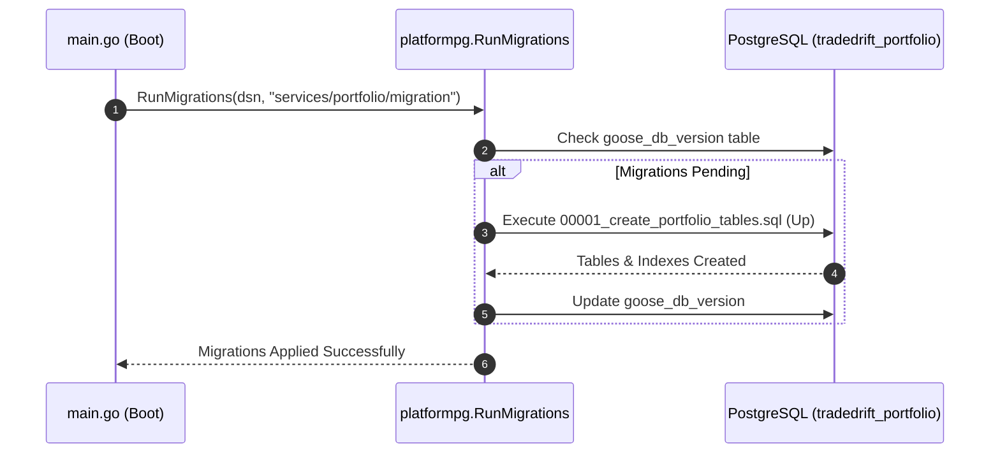

# Portfolio Database Schema Migrations (`services/portfolio/migration`)

## 1. Overview & System Role

The `services/portfolio/migration` directory contains the versioned, declarative SQL migrations managed by **Goose** for the **Portfolio Service** PostgreSQL database (`tradedrift_portfolio`).

It defines the physical storage models, constraints, and indexes supporting:
1. **Cumulative Crypto Holdings (`holdings`)**: Stores user token balances, weighted-average entry costs, and realized PnL.
2. **Idempotency & Sequence Ledger (`processed_trades`)**: Records settled trade IDs, market symbols, and matching-engine sequences to prevent double-counting.
3. **Transactional Outbox (`portfolio_outbox`)**: Implements the transactional outbox pattern with state transitions (`PENDING`, `PROCESSING`, `PUBLISHED`) and lease timeout recovery for reliable event streaming to Kafka.

Migrations are applied automatically upon service startup in [`cmd/server/main.go`](file:///c:/Users/AKHIL%20BABU/OneDrive/Desktop/tradedrift/services/portfolio/cmd/server/main.go) via `platformpg.RunMigrations()`:



---

## 2. Problems Solved by This Schema Design

### 2.1 Database-Level Invariant Enforcement (Anti-Corruption Defense)
* **The Problem**: Application-level bugs, race conditions, or unhandled rounding issues could theoretically calculate a negative balance (e.g. `-0.0001` BTC) or a negative cost basis. If written to the database, this corrupts user accounts and ledger reconciliation.
* **How It Solves It**: Strict SQL `CHECK` constraints:
  ```sql
  quantity    DECIMAL(30,10) NOT NULL DEFAULT 0 CHECK (quantity >= 0),
  total_cost  DECIMAL(30,10) NOT NULL DEFAULT 0 CHECK (total_cost >= 0)
  ```
  Even if application logic fails, PostgreSQL will reject any transaction resulting in negative balances or costs with a `check_violation` error (SQLSTATE `23514`).

### 2.2 Composite Uniqueness & Concurrency Lock Target
* **The Problem**: A user should only ever have **one** holding row per crypto asset (e.g., Alice has exactly one row for `BTC`, one for `ETH`). Without a composite unique key, concurrent inserts could duplicate rows for the same asset.
* **How It Solves It**: Composite primary key:
  ```sql
  PRIMARY KEY (user_id, asset_code)
  ```
  This creates a physical row-level lock target for `SELECT ... FOR UPDATE`, guaranteeing that all concurrent trades for the same user and asset are strictly serialized.

### 2.3 Elimination of Outbox Table Scan Bloat via Partial Indexes
* **The Problem**: Over months of operation, `portfolio_outbox` will accumulate millions of historical rows with `status = 'PUBLISHED'`. If the background outbox publisher uses standard indexes, querying for pending rows requires scanning index entries across millions of already published records.
* **How It Solves It**: High-performance **partial indexes** that only index unacknowledged rows:
  ```sql
  CREATE INDEX idx_portfolio_outbox_pending ON portfolio_outbox(created_at)
      WHERE status = 'PENDING';

  CREATE INDEX idx_portfolio_outbox_processing ON portfolio_outbox(claimed_at)
      WHERE status = 'PROCESSING';
  ```
  As soon as a row is updated to `PUBLISHED`, PostgreSQL automatically removes it from these indexes. The index size remains tiny (proportional to current in-flight backlog), ensuring sub-millisecond polling queries regardless of total table size.

---

## 3. Schema & Table Breakdown (`00001_create_portfolio_tables.sql`)

### 3.1 Table: `holdings`
Represents a trader's cumulative position in a single crypto asset.

```sql
CREATE TABLE IF NOT EXISTS holdings (
    user_id             UUID NOT NULL,
    asset_code          VARCHAR(10) NOT NULL,
    quantity            DECIMAL(30,10) NOT NULL DEFAULT 0 CHECK (quantity >= 0),
    total_cost          DECIMAL(30,10) NOT NULL DEFAULT 0 CHECK (total_cost >= 0),
    realized_pnl        DECIMAL(30,10) NOT NULL DEFAULT 0,
    updated_at          TIMESTAMPTZ NOT NULL DEFAULT NOW(),
    PRIMARY KEY (user_id, asset_code)
);

CREATE INDEX IF NOT EXISTS idx_holdings_user ON holdings(user_id);
```

| Column | Type | Constraints | Description |
|---|---|---|---|
| `user_id` | `UUID` | `NOT NULL` | The unique identifier of the trader. |
| `asset_code` | `VARCHAR(10)` | `NOT NULL` | Symbol of the base crypto asset (e.g. `BTC`, `ETH`, `SOL`). |
| `quantity` | `DECIMAL(30,10)` | `NOT NULL DEFAULT 0`, `CHECK (quantity >= 0)` | Total held token amount (10 decimals). |
| `total_cost` | `DECIMAL(30,10)` | `NOT NULL DEFAULT 0`, `CHECK (total_cost >= 0)` | Cumulative cost basis in USDT for the held quantity. |
| `realized_pnl` | `DECIMAL(30,10)` | `NOT NULL DEFAULT 0` | Cumulative historical profit/loss realized from selling this asset. |
| `updated_at` | `TIMESTAMPTZ` | `NOT NULL DEFAULT NOW()` | Timestamp of last position adjustment. |

* **Supporting Index**: `idx_holdings_user` speeds up `SELECT * FROM holdings WHERE user_id = $1 AND quantity > 0` during on-demand portfolio summary calculations.

---

### 3.2 Table: `processed_trades`
The authoritative deduplication and sequence audit ledger.

```sql
CREATE TABLE IF NOT EXISTS processed_trades (
    trade_id            UUID PRIMARY KEY,
    user_id             UUID NOT NULL,
    market_id           VARCHAR(20) NOT NULL DEFAULT '',
    sequence            BIGINT NOT NULL DEFAULT 0,
    processed_at        TIMESTAMPTZ NOT NULL DEFAULT NOW()
);
```

| Column | Type | Constraints | Description |
|---|---|---|---|
| `trade_id` | `UUID` | `PRIMARY KEY` | Globally unique trade identifier emitted by the Matching Engine. |
| `user_id` | `UUID` | `NOT NULL` | Buyer identifier recorded for auditing. |
| `market_id` | `VARCHAR(20)` | `NOT NULL DEFAULT ''` | Market pair (e.g. `BTC-USDT`). |
| `sequence` | `BIGINT` | `NOT NULL DEFAULT 0` | Matching engine trade execution sequence number. |
| `processed_at` | `TIMESTAMPTZ` | `NOT NULL DEFAULT NOW()` | Wall-clock time of ledger commit. |

* **Problem Solved**: Prevents Kafka replay double-counting. Inserting with `ON CONFLICT (trade_id) DO NOTHING` atomically verifies and reserves the trade in one operation. Storing `sequence` provides an audit trail tying portfolio balance states to matching engine sequences.

---

### 3.3 Table: `portfolio_outbox`
The transactional outbox queue for reliable downstream event streaming.

```sql
CREATE TABLE IF NOT EXISTS portfolio_outbox (
    id                  UUID PRIMARY KEY DEFAULT gen_random_uuid(),
    aggregate_id        UUID NOT NULL,
    event_type          VARCHAR(50) NOT NULL,
    payload             JSONB NOT NULL,
    partition_key       VARCHAR(50) NOT NULL,
    status              VARCHAR(20) NOT NULL DEFAULT 'PENDING',
    claimed_at          TIMESTAMPTZ,
    created_at          TIMESTAMPTZ NOT NULL DEFAULT NOW(),
    published_at        TIMESTAMPTZ
);

CREATE INDEX IF NOT EXISTS idx_portfolio_outbox_pending ON portfolio_outbox(created_at)
    WHERE status = 'PENDING';

CREATE INDEX IF NOT EXISTS idx_portfolio_outbox_processing ON portfolio_outbox(claimed_at)
    WHERE status = 'PROCESSING';
```

| Column | Type | Constraints | Description |
|---|---|---|---|
| `id` | `UUID` | `PRIMARY KEY DEFAULT gen_random_uuid()` | Stable event identifier embedded in payload and Kafka headers for downstream deduplication. |
| `aggregate_id` | `UUID` | `NOT NULL` | Trader's `user_id`. |
| `event_type` | `VARCHAR(50)` | `NOT NULL` | Event descriptor (e.g. `'PortfolioUpdated'`). |
| `payload` | `JSONB` | `NOT NULL` | Full position snapshot (asset, quantity, entry price, realized PnL, timestamp). |
| `partition_key` | `VARCHAR(50)` | `NOT NULL` | Trader's `user_id`, ensuring strict Kafka partition affinity and chronological ordering. |
| `status` | `VARCHAR(20)` | `NOT NULL DEFAULT 'PENDING'` | Lifecycle state: `'PENDING'` $\rightarrow$ `'PROCESSING'` $\rightarrow$ `'PUBLISHED'`. |
| `claimed_at` | `TIMESTAMPTZ` | `NULL` | Timestamp when a worker claimed the batch; used for lease timeout recovery. |
| `created_at` | `TIMESTAMPTZ` | `NOT NULL DEFAULT NOW()` | Time of outbox row creation within the atomic trade transaction. |
| `published_at` | `TIMESTAMPTZ` | `NULL` | Time of confirmed Kafka dispatch acknowledgment. |

---

## 4. Rollback Specification (`-- +goose Down`)

To support clean schema rollbacks in testing and staging environments, the rollback section drops objects in strict reverse dependency order:

```sql
-- +goose Down
DROP INDEX IF EXISTS idx_portfolio_outbox_processing;
DROP INDEX IF EXISTS idx_portfolio_outbox_pending;
DROP TABLE IF EXISTS portfolio_outbox;
DROP TABLE IF EXISTS processed_trades;
DROP INDEX IF EXISTS idx_holdings_user;
DROP TABLE IF EXISTS holdings;
```
