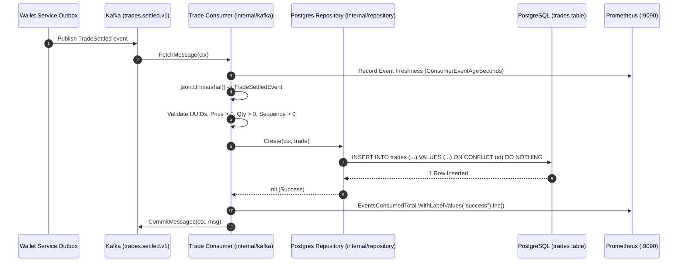
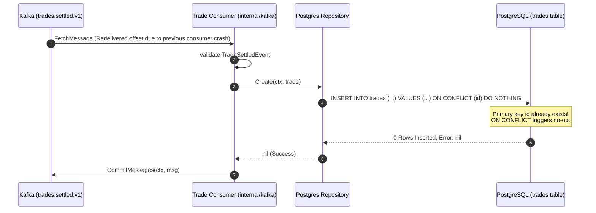
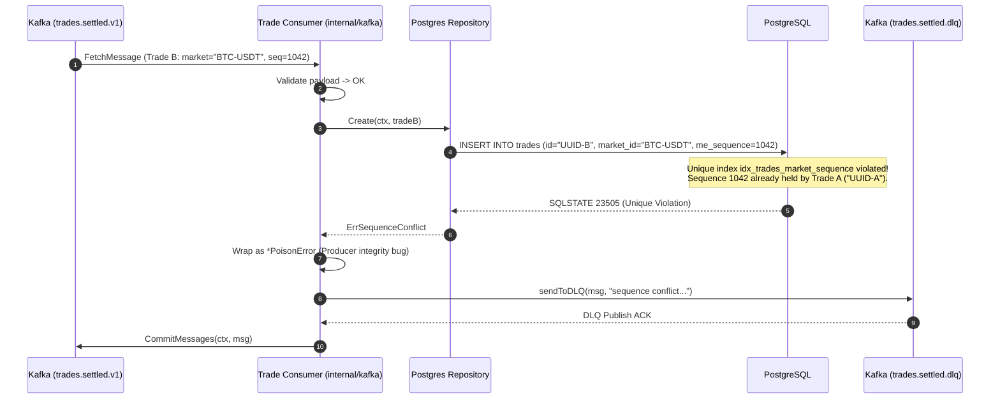
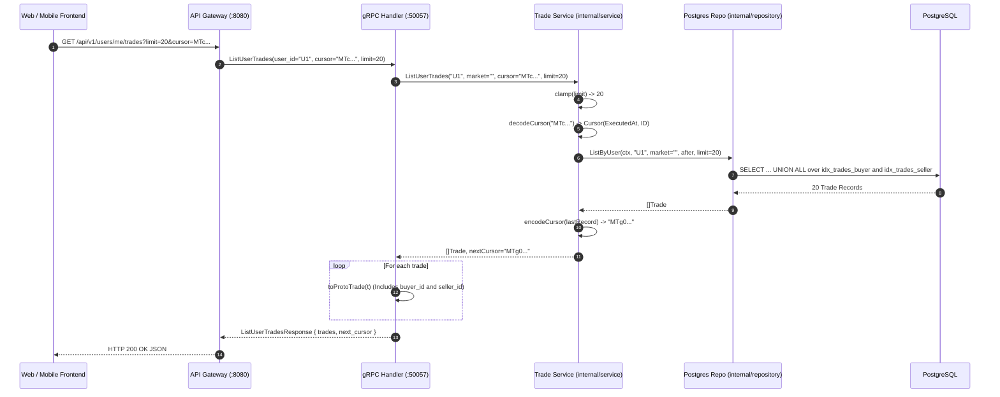
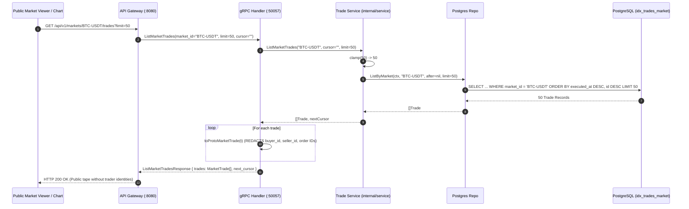
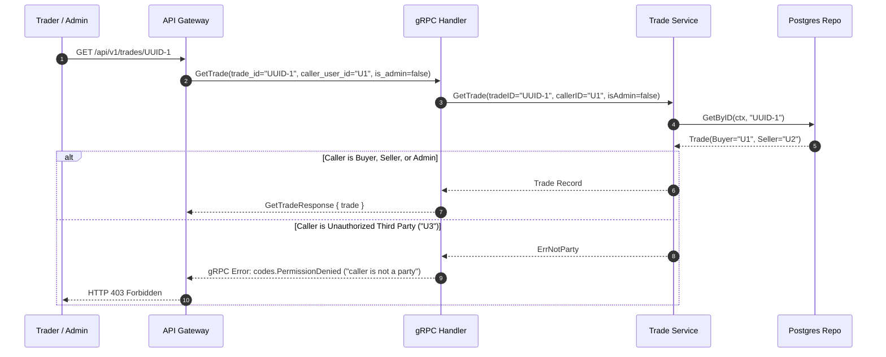

# Trade Service — Complete End-to-End System Flows

This document details every operational and data flow handled by the **Trade Service** (`services/trade`).

For the comprehensive folder, file, and function architecture breakdown, see [README.md](file:///c:/Users/AKHIL%20BABU/OneDrive/Desktop/tradedrift/services/trade/README.md).

---

## Table of Contents

1. [Flow 1: Bootstrap & Graceful Teardown Flow](#flow-1-bootstrap--graceful-teardown-flow)
2. [Flow 2: Happy-Path Kafka Ingestion & Persistence Flow](#flow-2-happy-path-kafka-ingestion--persistence-flow)
3. [Flow 3: Redelivery & Idempotent No-Op Flow](#flow-3-redelivery--idempotent-no-op-flow)
4. [Flow 4: Producer Sequence Collision Violation Flow](#flow-4-producer-sequence-collision-violation-flow)
5. [Flow 5: Poison Message DLQ Isolation Flow](#flow-5-poison-message-dlq-isolation-flow)
6. [Flow 6: Private User Fills Keyset-Paginated Query Flow](#flow-6-private-user-fills-keyset-paginated-query-flow)
7. [Flow 7: Public Market Tape Query Flow (TI-7 Counterparty Redaction)](#flow-7-public-market-tape-query-flow-ti-7-counterparty-redaction)
8. [Flow 8: Authorized Single Trade Retrieval Flow (TI-8 Party Check)](#flow-8-authorized-single-trade-retrieval-flow-ti-8-party-check)
9. [Flow 9: Observability, Liveness & Readiness Probing Flow](#flow-9-observability-liveness--readiness-probing-flow)
10. [Summary Matrix of System Invariants & Protections](#10-summary-matrix-of-system-invariants--protections)

---

### Flow 1: Bootstrap & Graceful Teardown Flow

```
[OS Boot / Container Start]
      │
      ▼
1. Load Environment Configuration (config.Load)
      │  ├─ Validates TRADE_POSTGRES_DSN and KAFKA_BROKERS
      │  └─ Rejects missing/malformed settings immediately (Fail-Fast)
      ▼
2. Instantiates Structured Logger (logger.New)
      ▼
3. Run Goose Database Migrations (platformpg.RunMigrations)
      │  └─ Executes 00001_create_trades.sql (creates table and 6 indexes)
      ▼
4. Connect PostgreSQL Pool (platformpg.NewPool)
      │  └─ Configures pool with MaxConns: 15; tests connection with dbPool.Ping()
      ▼
5. Dependency Injection Assembly
      │  ├─ Repo: tradepg.NewRepository(dbPool)
      │  ├─ Svc:  tradesvc.NewService(repo, logger)
      │  └─ Hdlr: tradehandler.NewGRPCHandler(svc, logger)
      ▼
6. Launch gRPC Server on :50057
      │  └─ Registers tradev1.TradeServiceServer; listens for inbound RPCs
      ▼
7. Launch HTTP Metrics & Health Server on :9090
      │  ├─ /metrics: Prometheus scraping
      │  ├─ /healthz: Liveness probe (200 OK)
      │  └─ /ready:   Readiness probe (tests dbPool.Ping())
      ▼
8. Launch Kafka Consumer on trades.settled.v1
      │  └─ Spawns consumer.Start(ctx) in background goroutine
      ▼
[SERVICE OPERATIONAL - SERVING TRAFFIC]
      │
[OS Signal: SIGINT / SIGTERM Intercepted]
      │
      ▼
9. Graceful Shutdown Phase (Coordinated via signal.NotifyContext)
      │  ├─ 1. grpcServer.GracefulStop() (finishes in-flight RPCs)
      │  ├─ 2. metricsServer.Shutdown() (drains HTTP probes)
      │  ├─ 3. Context cancellation terminates Kafka consumer loop
      │  ├─ 4. consumer.Close() shuts down Kafka reader and DLQ writer
      │  └─ 5. dbPool.Close() drains database connection pool
      ▼
[Process Exits Cleanly with Code 0]
```

---

### Flow 2: Happy-Path Kafka Ingestion & Persistence Flow



---

### Flow 3: Redelivery & Idempotent No-Op Flow



---

### Flow 4: Producer Sequence Collision Violation Flow



---

### Flow 5: Poison Message DLQ Isolation Flow

```mermaid
sequenceDiagram
    autonumber
    participant Kafka as Kafka (trades.settled.v1)
    participant Consumer as Trade Consumer (internal/kafka)
    participant DLQ as Kafka (trades.settled.dlq)
    participant Metrics as Prometheus (:9090)

    Kafka->>Consumer: FetchMessage (Corrupted payload: sequence=0 or invalid UUID)
    alt Malformed JSON
        Consumer->>DLQ: sendToDLQ(msg, "malformed JSON")
        Consumer->>Metrics: DLQEventsTotal("malformed_json").Inc()
        Consumer->>Kafka: CommitMessages(ctx, msg)
    else Validation Failed (e.g. self-trade: buyer_id == seller_id)
        Consumer->>Consumer: process() returns *PoisonError
        Consumer->>DLQ: sendToDLQ(msg, "self-trade...")
        Consumer->>Metrics: DLQEventsTotal("self_trade").Inc()
        Consumer->>Kafka: CommitMessages(ctx, msg)
    end
    Note over Consumer,Kafka: Corrupted message skipped; partition continues processing without stalling.
```

---

### Flow 6: Private User Fills Keyset-Paginated Query Flow



---

### Flow 7: Public Market Tape Query Flow (TI-7 Counterparty Redaction)



---

### Flow 8: Authorized Single Trade Retrieval Flow (TI-8 Party Check)



---

### Flow 9: Observability, Liveness & Readiness Probing Flow

```
                         HTTP Management Port (:9090)
                                       │
        ┌──────────────────────────────┼──────────────────────────────┐
        ▼                              ▼                              ▼
GET /healthz                   GET /ready                     GET /metrics
(Liveness Probe)               (Readiness Probe)              (Prometheus Scrape)
        │                              │                              │
Check process status           Ping PostgreSQL Connection     Scrape Telemetry Counters:
- Return HTTP 200 "OK"         - dbPool.Ping(ctx)             - events_consumed_total
                               - Return 200 "READY" if ok     - dlq_events_total
                               - Return 503 if unreachable    - consumer_event_age_seconds
                                                              - db_duration_seconds
                                                              - grpc_requests_total
                                                              - grpc_duration_seconds
```

---

## 10. Summary Matrix of System Invariants & Protections

| Invariant / Requirement | Enforced In | Mechanism | Failure Mode Prevented |
|---|---|---|---|
| **Public Tape Privacy (TI-7)** | `handler.toProtoMarketTrade` | Strips `buyer_id`, `seller_id`, `buy_order_id`, and `sell_order_id` | Counterparty deanonymization on public tape |
| **Private Trade Access Control (TI-8)** | `service.GetTrade` | Verifies `caller == BuyerID \|\| caller == SellerID \|\| isAdmin` | Unauthorized trade inspection by third parties |
| **Ingestion Idempotency** | `postgres.Create` | `INSERT INTO trades ... ON CONFLICT (id) DO NOTHING` | Duplicate trade records on Kafka offset redelivery |
| **Monotonic Sequence Integrity** | PostgreSQL + `postgres.Create` | `idx_trades_market_sequence` unique index + `ErrSequenceConflict` | Out-of-order execution or duplicate sequence producer bugs |
| **Poison Message Deadlock Isolation** | `kafka.Consumer` | Identifies `*PoisonError`, routes to DLQ with headers, ACKs offset | Partition stall / head-of-line blocking on corrupted events |
| **Zero Data Loss on DLQ Failure** | `kafka.Consumer.Start` | Skips offset commit if `sendToDLQ` fails | Dropping poison events without persisting to DLQ |
| **O(log N) Query Performance** | `repository.postgres` | Keyset pagination `(executed_at, id) < ($1, $2)` | O(N) full-table scans from deep `OFFSET` pagination |
| **Index-Optimized User Fills** | `postgres.ListByUser` | `UNION ALL` of separate `buyer_id` and `seller_id` subqueries | Degraded execution plans caused by PostgreSQL `OR` bitmap scans |
| **High-Precision Financials** | Database schema | `DECIMAL(30,10)` stored in PostgreSQL, mapped via `decimal.Decimal` | Floating-point rounding errors and balance discrepancies |
| **Clean Shutdown Lifecycle** | `cmd/server/main.go` | 4-stage teardown with `grpcServer.GracefulStop()` and context wait | Dropping active database transactions or in-flight gRPC calls |
