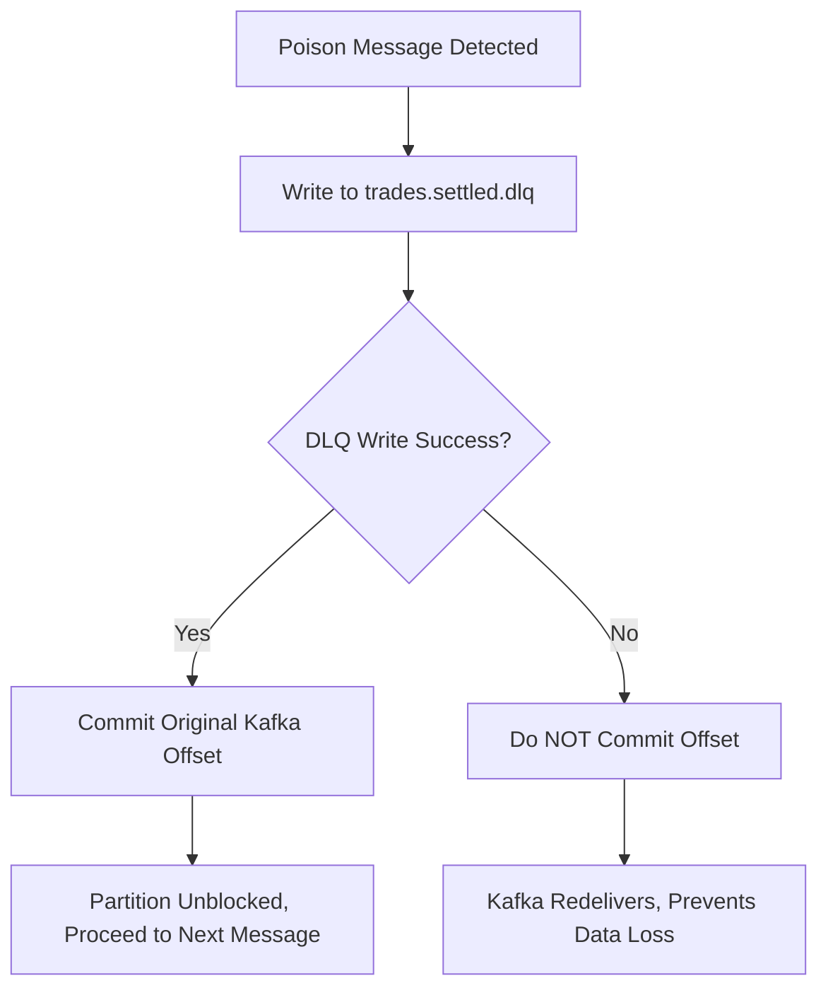

# Major Engineering Problems Faced & Solutions in Trade Service

This document provides a comprehensive technical retrospective of the **architectural, data-integrity, concurrency, and security problems** encountered while designing, implementing, and stabilizing the **Trade Service** in TradeDrift, along with the precise solutions and code locations.

---

## Table of Problems

1. [Defining the Correct Domain Ownership of a Trade](#1-defining-the-correct-domain-ownership-of-a-trade)
2. [Choosing the Correct Kafka Event (`trades.settled.v1` vs `trades.executed`)](#2-choosing-the-correct-kafka-event)
3. [Handling Kafka's At-Least-Once Delivery & Duplicate Ingestion](#3-handling-kafkas-at-least-once-delivery--duplicate-ingestion)
4. [Preventing Duplicate vs. Corrupted Sequence Records (`idx_trades_market_sequence`)](#4-preventing-duplicate-vs-corrupted-sequence-records)
5. [Designing Safe Dead Letter Queue (DLQ) & Poison Message Routing](#5-designing-safe-dead-letter-queue-dlq--poison-message-routing)
6. [The Go Zero-Value JSON Deserialization Gap (`Sequence == 0`)](#6-the-go-zero-value-json-deserialization-gap)
7. [Designing Authorization for Private Trade Data (TI-8 Enforcement)](#7-designing-authorization-for-private-trade-data-ti-8)
8. [Preventing Trader Identity Leakage Through Public Tapes (TI-7 Enforcement)](#8-preventing-trader-identity-leakage-through-public-tapes-ti-7)
9. [Eliminating Offset Pagination Performance Degradation ($O(\log N)$ Keyset Pagination)](#9-eliminating-offset-pagination-performance-degradation)
10. [Optimizing User History Queries: Eliminating Postgres `OR` Full-Table Scans via `UNION ALL`](#10-optimizing-user-history-queries-via-union-all)
11. [Lossless Financial Decimal Representation](#11-lossless-financial-decimal-representation)
12. [Enforcing Append-Only Immutability for Regulatory Auditability](#12-enforcing-append-only-immutability)
13. [Separating Real-Time Execution Feeds from Historical Query Paths](#13-separating-real-time-execution-feeds-from-historical-query-paths)
14. [Matching Engine Sequence Semantics (`me_sequence` vs API Keyset)](#14-matching-engine-sequence-semantics)
15. [Graceful Shutdown Orchestration Without Event Loss](#15-graceful-shutdown-orchestration-without-event-loss)
16. [Rebuildable CQRS Read-Side Projection from Event Streams](#16-rebuildable-cqrs-read-side-projection)

---

### 1. Defining the Correct Domain Ownership of a Trade

* **The Problem**:
  In a distributed cryptocurrency exchange, multiple services touch an execution: Matching Engine (matches orders), Settlement Service (coordinates two-phase balance changes), Wallet Service (holds user ledgers), and Trade Service. If the Trade Service created or settled trades directly, it would violate single-responsibility boundaries and create distributed 2-phase commit bottlenecks.
* **How It Was Solved**:
  We adopted a strict CQRS (Command Query Responsibility Segregation) pattern:
  - **Matching Engine**: Authority on *crossing orders* (emits `trades.executed`).
  - **Settlement Service**: Authority on *clearing & risk evaluation*.
  - **Wallet Service**: Authority on *asset ledger transfers* (emits `trades.settled.v1`).
  - **Trade Service**: Pure *read-side projection* and *historical record keeper*. It never initiates financial state transitions.
* **Code Location**:
  - [`services/trade/cmd/server/main.go`](file:///c:/Users/AKHIL%20BABU/OneDrive/Desktop/tradedrift/services/trade/cmd/server/main.go)
  - Architectural overview in [`services/trade/README.md`](file:///c:/Users/AKHIL%20BABU/OneDrive/Desktop/tradedrift/services/trade/README.md).

---

### 2. Choosing the Correct Kafka Event

* **The Problem**:
  Consuming `trades.executed` directly from the Matching Engine would make trades visible to users *before* money actually moved. If the buyer or seller lacked sufficient available balances (e.g. self-trade collision or settlement lock failure), the trade would be rejected in Settlement, but already displayed in the user's trade history.
* **How It Was Solved**:
  The Trade Service subscribes exclusively to **`trades.settled.v1`**, which is published by the **Wallet Service Outbox** *only after* PostgreSQL debit/credit transactions have committed atomically.
* **Code Location**:
  - [`services/trade/internal/kafka/consumer.go#L39-L61`](file:///c:/Users/AKHIL%20BABU/OneDrive/Desktop/tradedrift/services/trade/internal/kafka/consumer.go#L39-L61)
  - [`services/trade/internal/config/config.go#L42`](file:///c:/Users/AKHIL%20BABU/OneDrive/Desktop/tradedrift/services/trade/internal/config/config.go#L42)

```go
// services/trade/internal/config/config.go:42
KafkaTopic: config.GetEnv("KAFKA_TOPIC_TRADE_SETTLED", "trades.settled.v1"),
```

---

### 3. Handling Kafka's At-Least-Once Delivery & Duplicate Ingestion

* **The Problem**:
  Kafka guarantees at-least-once delivery. If the Trade Service inserts a trade into PostgreSQL and crashes, or if a network rebalance occurs before `reader.CommitMessages()` finishes, Kafka redelivers the same event on restart. A naive `INSERT` query would crash with a primary key constraint error or duplicate rows.
* **How It Was Solved**:
  1. The `Trade.ID` is a deterministic UUID generated upstream by the Matching Engine.
  2. The database write uses PostgreSQL `ON CONFLICT (id) DO NOTHING`.
  3. Duplicate deliveries execute as harmless no-ops, return `nil`, and the consumer acknowledges the offset.
* **Code Location**:
  - [`services/trade/internal/repository/postgres/repository.go#L43-L50`](file:///c:/Users/AKHIL%20BABU/OneDrive/Desktop/tradedrift/services/trade/internal/repository/postgres/repository.go#L43-L50)

```sql
INSERT INTO trades (
    id, buyer_id, seller_id, buy_order_id, sell_order_id,
    market_id, base_asset, quote_asset, price, quantity,
    me_sequence, executed_at, settled_at
) VALUES ($1, $2, $3, $4, $5, $6, $7, $8, $9, $10, $11, $12, $13)
ON CONFLICT (id) DO NOTHING
```

---

### 4. Preventing Duplicate vs. Corrupted Sequence Records

* **The Problem**:
  Not all duplicate events are benign:
  - If a message arrives with `id = X` and `(market_id, me_sequence) = (BTC-USDT, 10)`, and `id = X` is already in DB, it is a **benign Kafka retry**.
  - But if a message arrives with `id = Y` (a *different* trade) claiming the *same* `(market_id, me_sequence) = (BTC-USDT, 10)`, this indicates **data corruption or a Matching Engine sequence bug**. Treating this as a harmless duplicate would silently drop trade `Y`!
* **How It Was Solved**:
  1. We added a PostgreSQL unique compound index: `CREATE UNIQUE INDEX idx_trades_market_sequence ON trades(market_id, me_sequence)`.
  2. In `repo.Create()`, we inspect PostgreSQL error codes: if `pgErr.Code == "23505"` on `idx_trades_market_sequence`, we classify it as `ErrSequenceConflict`.
  3. The consumer intercepts `ErrSequenceConflict`, wraps it as a `PoisonError`, and sends it to the Dead Letter Queue.
* **Code Location**:
  - Index DDL: [`services/trade/migration/00001_create_trades.sql#L48-L49`](file:///c:/Users/AKHIL%20BABU/OneDrive/Desktop/tradedrift/services/trade/migration/00001_create_trades.sql#L48-L49)
  - Error detection: [`services/trade/internal/repository/postgres/repository.go#L58-L60`](file:///c:/Users/AKHIL%20BABU/OneDrive/Desktop/tradedrift/services/trade/internal/repository/postgres/repository.go#L58-L60)
  - Poison wrapping: [`services/trade/internal/kafka/consumer.go#L291-L294`](file:///c:/Users/AKHIL%20BABU/OneDrive/Desktop/tradedrift/services/trade/internal/kafka/consumer.go#L291-L294)

```go
// services/trade/internal/repository/postgres/repository.go:58
if isSequenceConflict(err) {
    return repository.ErrSequenceConflict
}

// services/trade/internal/kafka/consumer.go:291
if errors.Is(err, repository.ErrSequenceConflict) {
    return poisonf("sequence conflict for trade %s: market_id=%s sequence=%d already exists with a different trade_id (producer integrity bug)",
        event.TradeID, event.MarketID, event.Sequence)
}
```

---

### 5. Designing Safe Dead Letter Queue (DLQ) & Poison Message Routing

* **The Problem**:
  If an unparseable or corrupt message reaches Kafka, a traditional consumer has two terrible failure modes:
  1. *Fail and don't commit offset*: The consumer infinite-loops on the poison message, stalling all subsequent trades on that partition forever.
  2. *Log and commit offset*: If writing to the DLQ fails (e.g. network blip or DLQ broker disconnect), committing the offset causes **silent permanent data loss**.
* **How It Was Solved**:
  We implemented a **Fail-Safe Poison Pipeline**:
  1. Permanent errors are wrapped in `*PoisonError`.
  2. `sendToDLQ()` publishes the raw message to `trades.settled.dlq` along with headers (`dlq-reason`, `dlq-topic`, `dlq-partition`, `dlq-offset`).
  3. **Crucial Rule**: Only if `sendToDLQ` returns `nil` does the consumer commit the Kafka offset. If the DLQ write fails, the offset is **NOT** committed, forcing a retry until the DLQ is available.
* **Code Location**:
  - [`services/trade/internal/kafka/consumer.go#L170-L193`](file:///c:/Users/AKHIL%20BABU/OneDrive/Desktop/tradedrift/services/trade/internal/kafka/consumer.go#L170-L193)
  - [`services/trade/internal/kafka/consumer.go#L305-L325`](file:///c:/Users/AKHIL%20BABU/OneDrive/Desktop/tradedrift/services/trade/internal/kafka/consumer.go#L305-L325)



---

### 6. The Go Zero-Value JSON Deserialization Gap

* **The Problem**:
  In Go, `json.Unmarshal` assigns default zero values to missing struct fields. If an upstream producer omitted `"sequence": 123`, Go set `event.Sequence = 0`.
  In PostgreSQL, `me_sequence BIGINT NOT NULL` rejects `NULL`, but `0` is a valid number! Storing `0` violates the Matching Engine's invariant that all sequences are strictly positive monotonic integers ($> 0$).
* **How It Was Solved**:
  We introduced an explicit validation check in `process()` before invoking the repository:
  ```go
  if event.Sequence == 0 {
      return poisonf("invalid sequence for trade %s: must be > 0 (got 0 — field absent or producer bug)", event.TradeID)
  }
  ```
* **Code Location**:
  - [`services/trade/internal/kafka/consumer.go#L248-L250`](file:///c:/Users/AKHIL%20BABU/OneDrive/Desktop/tradedrift/services/trade/internal/kafka/consumer.go#L248-L250)

---

### 7. Designing Authorization for Private Trade Data (TI-8)

* **The Problem**:
  `GetTrade(id)` returns full trade metadata, including `buyer_id`, `seller_id`, `buy_order_id`, and `sell_order_id`. If any authenticated user could query any trade ID, rogue users could scrape competitor order IDs and trade counterparty identities.
* **How It Was Solved**:
  We enforced the **TI-8 Authorization Invariant**:
  - The API Gateway extracts `user_id` and `is_admin` from the validated JWT claims and forwards them to the gRPC handler.
  - In `service.GetTrade()`, we verify:
    ```go
    if !isAdmin && callerUserID != t.BuyerID && callerUserID != t.SellerID {
        return nil, ErrNotParty
    }
    ```
  - The gRPC handler translates `ErrNotParty` into `codes.PermissionDenied` (HTTP `403 Forbidden`).
* **Code Location**:
  - Service rule: [`services/trade/internal/service/service.go#L45-L48`](file:///c:/Users/AKHIL%20BABU/OneDrive/Desktop/tradedrift/services/trade/internal/service/service.go#L45-L48)
  - Handler translation: [`services/trade/internal/handler/grpc.go#L64-L67`](file:///c:/Users/AKHIL%20BABU/OneDrive/Desktop/tradedrift/services/trade/internal/handler/grpc.go#L64-L67)

---

### 8. Preventing Trader Identity Leakage Through Public Tapes (TI-7)

* **The Problem**:
  Public trade tapes (`GET /api/v1/markets/BTC-USDT/trades`) are accessed anonymously by charting widgets, retail traders, and bots. If `buyer_id` or `seller_id` leaked in this payload, market participants could track institutional wallet accumulation and front-run orders.
* **How It Was Solved**:
  We decoupled the protobuf schema into two distinct messages:
  1. `tradev1.Trade`: Private message containing full counterparty IDs and order IDs.
  2. `tradev1.MarketTrade`: Public message containing strictly: `trade_id`, `market_id`, `base_asset`, `quote_asset`, `price`, `quantity`, `executed_at`.
  The handler mapper `toProtoMarketTrade()` guarantees counterparty fields are physically omitted from the response.
* **Code Location**:
  - Public mapper: [`services/trade/internal/handler/grpc.go#L161-L173`](file:///c:/Users/AKHIL%20BABU/OneDrive/Desktop/tradedrift/services/trade/internal/handler/grpc.go#L161-L173)
  - Public endpoint handler: [`services/trade/internal/handler/grpc.go#L129-L132`](file:///c:/Users/AKHIL%20BABU/OneDrive/Desktop/tradedrift/services/trade/internal/handler/grpc.go#L129-L132)

---

### 9. Eliminating Offset Pagination Performance Degradation

* **The Problem**:
  High-frequency trade tables contain millions of rows. Traditional SQL pagination using `OFFSET 50000 LIMIT 20` forces PostgreSQL to scan 50,020 rows and discard the first 50,000, leading to multi-second queries and CPU spikes.
* **How It Was Solved**:
  We implemented **Keyset / Cursor Pagination**:
  - The query uses an index-friendly tuple range predicate:
    ```sql
    WHERE ($2::timestamptz IS NULL OR (executed_at, id) < ($2, $3::uuid))
    ORDER BY executed_at DESC, id DESC
    LIMIT $4
    ```
  - PostgreSQL performs a direct B-Tree index seek in $O(\log N)$ time, remaining under 1ms regardless of how deep the user paginates.
  - The service encodes `(ExecutedAt, ID)` into an opaque URL-safe Base64 token (`encodeCursor`) returned to clients as `next_cursor`.
* **Code Location**:
  - Keyset SQL: [`services/trade/internal/repository/postgres/repository.go#L120-L121`](file:///c:/Users/AKHIL%20BABU/OneDrive/Desktop/tradedrift/services/trade/internal/repository/postgres/repository.go#L120-L121)
  - Opaque token codec: [`services/trade/internal/service/service.go#L116-L151`](file:///c:/Users/AKHIL%20BABU/OneDrive/Desktop/tradedrift/services/trade/internal/service/service.go#L116-L151)

---

### 10. Optimizing User History Queries via `UNION ALL`

* **The Problem**:
  To show a user's full trade history, the query must check both sides:
  ```sql
  SELECT * FROM trades WHERE buyer_id = $1 OR seller_id = $1
  ```
  PostgreSQL's query planner cannot efficiently use standard B-Tree indexes with an `OR` condition across different columns. It frequently falls back to sequential full table scans.
* **How It Was Solved**:
  We rewrote the query as a **`UNION ALL`** of two independent index scans:
  ```sql
  SELECT id, buyer_id, seller_id, ...
  FROM (
      SELECT * FROM trades WHERE buyer_id = $1
      UNION ALL
      SELECT * FROM trades WHERE seller_id = $1
  ) t
  WHERE ($2::timestamptz IS NULL OR (executed_at, id) < ($2, $3::uuid))
  ORDER BY executed_at DESC, id DESC
  LIMIT $4
  ```
  PostgreSQL executes two direct index seeks (`idx_trades_buyer` and `idx_trades_seller`) and merges them in memory, avoiding table scans completely.
* **Code Location**:
  - [`services/trade/internal/repository/postgres/repository.go#L111-L138`](file:///c:/Users/AKHIL%20BABU/OneDrive/Desktop/tradedrift/services/trade/internal/repository/postgres/repository.go#L111-L138)
  - Supporting indexes: [`services/trade/migration/00001_create_trades.sql#L24-L38`](file:///c:/Users/AKHIL%20BABU/OneDrive/Desktop/tradedrift/services/trade/migration/00001_create_trades.sql#L24-L38)

---

### 11. Lossless Financial Decimal Representation

* **The Problem**:
  Using binary floating-point types (`float64`, `double precision`) causes IEEE-754 precision loss (e.g. `0.1 + 0.2 = 0.30000000000000004`). In a crypto exchange dealing with Satoshis and micro-lots, rounding errors lead to regulatory fines and audit failures.
* **How It Was Solved**:
  - In PostgreSQL: Defined columns as `DECIMAL(30,10)`.
  - In Go: Handled prices and volumes strictly using `github.com/shopspring/decimal`.
  - In Protobuf wire format: Represented prices and quantities as exact decimal strings (e.g. `"96450.00"`, `"0.01000000"`).
* **Code Location**:
  - Migration schema: [`services/trade/migration/00001_create_trades.sql#L12-L13`](file:///c:/Users/AKHIL%20BABU/OneDrive/Desktop/tradedrift/services/trade/migration/00001_create_trades.sql#L12-L13)
  - Decimal parsing: [`services/trade/internal/repository/postgres/repository.go#L213-L220`](file:///c:/Users/AKHIL%20BABU/OneDrive/Desktop/tradedrift/services/trade/internal/repository/postgres/repository.go#L213-L220)
  - Consumer validation: [`services/trade/internal/kafka/consumer.go#L253-L260`](file:///c:/Users/AKHIL%20BABU/OneDrive/Desktop/tradedrift/services/trade/internal/kafka/consumer.go#L253-L260)

---

### 12. Enforcing Append-Only Immutability

* **The Problem**:
  Financial trades are permanent legal records. Allowing updates or deletions opens vulnerabilities to internal fraud, database tampering, and ledger corruption.
* **How It Was Solved**:
  - The repository interface exposes only `Create`, `GetByID`, `ListByUser`, and `ListByMarket`.
  - There is **no `Update` or `Delete` method** anywhere in the Trade Service codebase.
  - The PostgreSQL user role in production has only `SELECT` and `INSERT` privileges.
* **Code Location**:
  - Interface contract: [`services/trade/internal/repository/repository.go#L49-L69`](file:///c:/Users/AKHIL%20BABU/OneDrive/Desktop/tradedrift/services/trade/internal/repository/repository.go#L49-L69)

---

### 13. Separating Real-Time Execution Feeds from Historical Query Paths

* **The Problem**:
  If frontend clients queried the Trade Service to receive real-time ticker tape updates, thousands of active WebSocket connections would hammer PostgreSQL, starving the historical query pool.
* **How It Was Solved**:
  We enforced an architectural separation of concerns:
  - **Real-Time Streaming Path**: Handled upstream by the Matching Engine and Market Data Service over WebSockets directly from Kafka execution events.
  - **Historical Query Path**: Handled by the Trade Service via gRPC/REST for initial chart hydration, page refreshes, and deep account fill history.
* **Code Location**:
  - Architectural overview in [`services/trade/README.md`](file:///c:/Users/AKHIL%20BABU/OneDrive/Desktop/tradedrift/services/trade/README.md).

---

### 14. Matching Engine Sequence Semantics

* **The Problem**:
  Engineers often confuse the Matching Engine's `me_sequence` counter with a global database ID:
  - `me_sequence` is monotonic **per market**, not globally (i.e. BTC-USDT and ETH-USDT both have sequences starting from 1).
  - It cannot be used directly as a global pagination cursor across markets.
* **How It Was Solved**:
  - `me_sequence` is strictly used for **internal auditability and integrity reconciliation** via `idx_trades_market_sequence`.
  - API pagination universally uses **`(executed_at DESC, id DESC)`**, which is globally unique, time-ordered, and stable across all markets.
* **Code Location**:
  - Cursor definition: [`services/trade/internal/repository/repository.go#L40-L45`](file:///c:/Users/AKHIL%20BABU/OneDrive/Desktop/tradedrift/services/trade/internal/repository/repository.go#L40-L45)
  - Sequence uniqueness: [`services/trade/migration/00001_create_trades.sql#L48-L49`](file:///c:/Users/AKHIL%20BABU/OneDrive/Desktop/tradedrift/services/trade/migration/00001_create_trades.sql#L48-L49)

---

### 15. Graceful Shutdown Orchestration Without Event Loss

* **The Problem**:
  During a deployment or rolling restart, sending `SIGKILL` or abruptly canceling contexts can interrupt an active PostgreSQL transaction after the database write has occurred, but before the Kafka offset commit. While `ON CONFLICT DO NOTHING` absorbs the redelivery, an uncoordinated shutdown can cause Kafka consumer group rebalances and latency spikes.
* **How It Was Solved**:
  In `cmd/server/main.go`, shutdown follows an ordered 5-step sequence:
  1. `ctx.Done()` unblocks on `SIGINT`/`SIGTERM`.
  2. `grpcServer.GracefulStop()` drains active client RPCs and rejects new ones.
  3. `metricsServer.Shutdown()` shuts down HTTP health probes to pull the pod out of load balancer rotations.
  4. `consumer.Start(ctx)` loop notices context cancellation and finishes the active message.
  5. `consumer.Close()` explicitly commits pending offsets and closes Kafka connections.
  6. `dbPool.Close()` drains database connections cleanly.
* **Code Location**:
  - [`services/trade/cmd/server/main.go#L146-L167`](file:///c:/Users/AKHIL%20BABU/OneDrive/Desktop/tradedrift/services/trade/cmd/server/main.go#L146-L167)

---

### 16. Rebuildable CQRS Read-Side Projection

* **The Problem**:
  If the `tradedrift_trade` database is lost, corrupted, or needs schema re-indexing, restoring from traditional database backups can be slow and out-of-sync with Kafka offsets.
* **How It Was Solved**:
  Because the Trade Service is an event-driven projection of `trades.settled.v1`:
  1. The Kafka topic acts as the **durable event stream of record**.
  2. The database can be wiped (`TRUNCATE trades`) or migrated.
  3. By starting the consumer with `StartOffset: FirstOffset`, the Trade Service replays the topic from offset 0, completely regenerating the entire trade history with zero loss of fidelity.
* **Code Location**:
  - [`services/trade/internal/kafka/consumer.go#L94`](file:///c:/Users/AKHIL%20BABU/OneDrive/Desktop/tradedrift/services/trade/internal/kafka/consumer.go#L94)

---

## Summary Matrix

| Problem | Root Cause | Technical Solution | Primary File |
|---|---|---|---|
| **Trade Ownership** | Mixed responsibilities across services | CQRS projection pattern | [`README.md`](file:///c:/Users/AKHIL%20BABU/OneDrive/Desktop/tradedrift/services/trade/README.md) |
| **Premature Trade Exposure** | Consuming `trades.executed` pre-settlement | Consume `trades.settled.v1` only | [`kafka/consumer.go`](file:///c:/Users/AKHIL%20BABU/OneDrive/Desktop/tradedrift/services/trade/internal/kafka/consumer.go) |
| **Kafka Redelivery Duplicates** | At-least-once delivery semantics | `ON CONFLICT (id) DO NOTHING` | [`postgres/repository.go`](file:///c:/Users/AKHIL%20BABU/OneDrive/Desktop/tradedrift/services/trade/internal/repository/postgres/repository.go) |
| **Sequence Collisions** | Producer corruption bugs | `UNIQUE(market_id, me_sequence)` -> DLQ | [`migration/00001_create_trades.sql`](file:///c:/Users/AKHIL%20BABU/OneDrive/Desktop/tradedrift/services/trade/migration/00001_create_trades.sql) |
| **Partition Stalls on Poison** | Unhandled consumer errors | DLQ routing with headers before ACK | [`kafka/consumer.go`](file:///c:/Users/AKHIL%20BABU/OneDrive/Desktop/tradedrift/services/trade/internal/kafka/consumer.go) |
| **Go Missing JSON Zero Gap** | Go default `uint64(0)` for missing keys | Validation `Sequence > 0` before insert | [`kafka/consumer.go`](file:///c:/Users/AKHIL%20BABU/OneDrive/Desktop/tradedrift/services/trade/internal/kafka/consumer.go) |
| **Private Data Snooping** | Unrestricted `GetTrade` calls | TI-8 party check (`buyer \|\| seller \|\| admin`) | [`service/service.go`](file:///c:/Users/AKHIL%20BABU/OneDrive/Desktop/tradedrift/services/trade/internal/service/service.go) |
| **Identity Leak on Public Tape** | Re-using domain entity for public API | TI-7 redaction via `MarketTrade` proto | [`handler/grpc.go`](file:///c:/Users/AKHIL%20BABU/OneDrive/Desktop/tradedrift/services/trade/internal/handler/grpc.go) |
| **Slow Deep Pagination** | `OFFSET N` full scans | Keyset `(executed_at, id)` pagination | [`postgres/repository.go`](file:///c:/Users/AKHIL%20BABU/OneDrive/Desktop/tradedrift/services/trade/internal/repository/postgres/repository.go) |
| **Postgres OR Degradation** | `OR` across columns prevents index use | `UNION ALL` across dedicated indexes | [`postgres/repository.go`](file:///c:/Users/AKHIL%20BABU/OneDrive/Desktop/tradedrift/services/trade/internal/repository/postgres/repository.go) |
| **Financial Rounding Errors** | IEEE-754 binary floats | `DECIMAL(30,10)` + `decimal.Decimal` | [`repository/repository.go`](file:///c:/Users/AKHIL%20BABU/OneDrive/Desktop/tradedrift/services/trade/internal/repository/repository.go) |
| **Audit Log Tampering** | Mutable records | Append-only repository contract | [`repository/repository.go`](file:///c:/Users/AKHIL%20BABU/OneDrive/Desktop/tradedrift/services/trade/internal/repository/repository.go) |
| **WebSocket Contention** | Mixing streaming and historical data | Trade Service serves query-only path | [`README.md`](file:///c:/Users/AKHIL%20BABU/OneDrive/Desktop/tradedrift/services/trade/README.md) |
| **Per-Market Sequence Semantics**| Conflating market sequence with global cursor | Timestamps + UUID for keyset cursor | [`service/service.go`](file:///c:/Users/AKHIL%20BABU/OneDrive/Desktop/tradedrift/services/trade/internal/service/service.go) |
| **Data Loss on Shutdown** | Context kill during active insert | 5-phase orderly drain and close | [`cmd/server/main.go`](file:///c:/Users/AKHIL%20BABU/OneDrive/Desktop/tradedrift/services/trade/cmd/server/main.go) |
| **Disaster Recovery** | Database loss | Event stream replay from offset 0 | [`kafka/consumer.go`](file:///c:/Users/AKHIL%20BABU/OneDrive/Desktop/tradedrift/services/trade/internal/kafka/consumer.go) |
