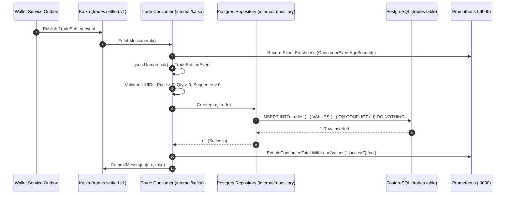
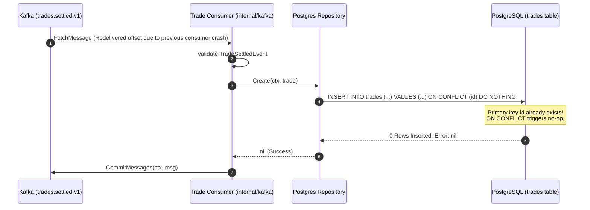
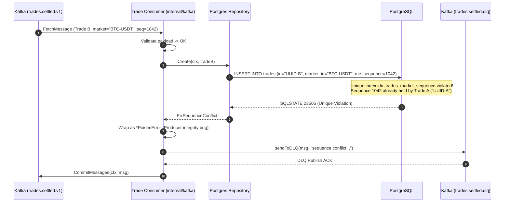
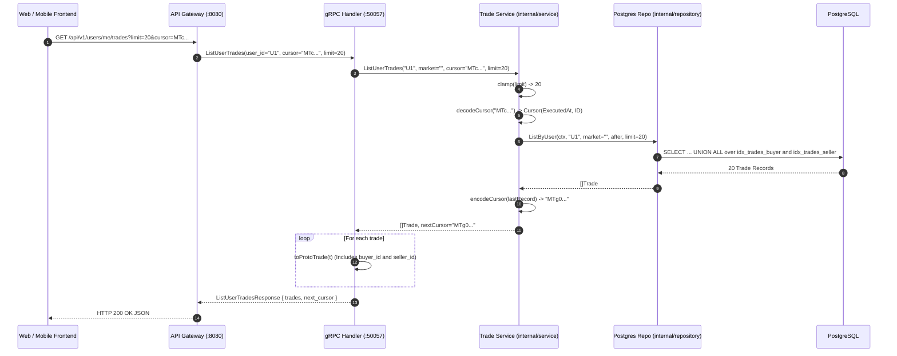
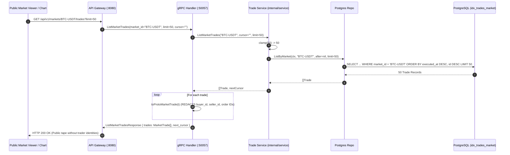
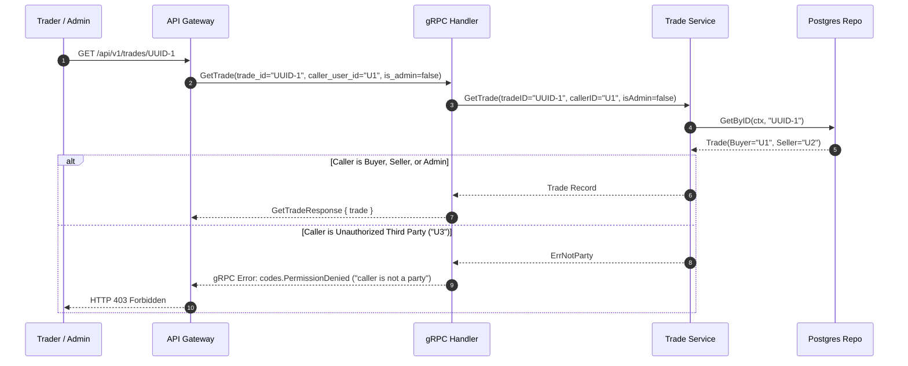

# Trade Service (`services/trade`) — Architectural & Engineering Guide

This document provides a comprehensive technical breakdown of the **Trade Service** in TradeDrift. It details the purpose of every folder, the problems solved by each file and function, the design mechanisms implemented, and the complete end-to-end system flows.

---

## Table of Contents

1. [Executive Summary & System Role](#1-executive-summary--system-role)
2. [Directory Tree & File Map](#2-directory-tree--file-map)
3. [Folder-by-Folder, File-by-File & Function-by-Function Breakdown](#3-folder-by-folder-file-by-file--function-by-function-breakdown)
   - [3.1 `cmd/` — Application Entrypoint & Composition Root](#31-cmd--application-entrypoint--composition-root)
   - [3.2 `internal/config/` — Environment & Configuration Management](#32-internalconfig--environment--configuration-management)
   - [3.3 `internal/handler/` — Transport Layer & gRPC Server](#33-internalhandler--transport-layer--grpc-server)
   - [3.4 `internal/kafka/` — Asynchronous Ingestion & DLQ Protection](#34-internalkafka--asynchronous-ingestion--dlq-protection)
   - [3.5 `internal/metrics/` — Prometheus Telemetry Registry](#35-internalmetrics--prometheus-telemetry-registry)
   - [3.6 `internal/repository/` — Data Access & PostgreSQL Engine](#36-internalrepository--data-access--postgresql-engine)
   - [3.7 `internal/service/` — Domain Query Engine & Security Rules](#37-internalservice--domain-query-engine--security-rules)
   - [3.8 `migration/` — Database Schema & Specialized Index DDL](#38-migration--database-schema--specialized-index-ddl)
4. [End-to-End System Flows](#4-end-to-end-system-flows)
   - [Flow 1: Bootstrap & Graceful Teardown Flow](#flow-1-bootstrap--graceful-teardown-flow)
   - [Flow 2: Happy-Path Kafka Ingestion & Persistence Flow](#flow-2-happy-path-kafka-ingestion--persistence-flow)
   - [Flow 3: Redelivery & Idempotent No-Op Flow](#flow-3-redelivery--idempotent-no-op-flow)
   - [Flow 4: Producer Sequence Collision Violation Flow](#flow-4-producer-sequence-collision-violation-flow)
   - [Flow 5: Poison Message DLQ Isolation Flow](#flow-5-poison-message-dlq-isolation-flow)
   - [Flow 6: Private User Fills Keyset-Paginated Query Flow](#flow-6-private-user-fills-keyset-paginated-query-flow)
   - [Flow 7: Public Market Tape Query Flow (TI-7 Counterparty Redaction)](#flow-7-public-market-tape-query-flow-ti-7-counterparty-redaction)
   - [Flow 8: Authorized Single Trade Retrieval Flow (TI-8 Party Check)](#flow-8-authorized-single-trade-retrieval-flow-ti-8-party-check)
   - [Flow 9: Observability, Liveness & Readiness Probing Flow](#flow-9-observability-liveness--readiness-probing-flow)
5. [Summary Matrix of System Invariants & Protections](#5-summary-matrix-of-system-invariants--protections)

---

## 1. Executive Summary & System Role

The **Trade Service** is the authoritative, immutable ledger and query engine for all executed and settled trades across the TradeDrift cryptocurrency exchange.

### Architectural Placement in TradeDrift
1. **Matching Engine (ME)** matches orders deterministically in memory according to price-time priority, generating an execution event (`trades.executed`).
2. **Settlement Service** orchestrates two-phase settlement, calling the **Wallet Service** via gRPC.
3. **Wallet Service** commits double-entry balance transfers atomically in PostgreSQL and writes a `TradeSettled` event to its transactional outbox.
4. **Outbox Relayer** publishes the event to Kafka topic `trades.settled.v1`.
5. **Trade Service** ingests `trades.settled.v1`, performs defense-in-depth validation, writes the record immutably to PostgreSQL (`tradedrift_trade`), and serves high-throughput historical queries via gRPC (`:50057`) to the API Gateway.

```
┌─────────────────┐      Kafka       ┌────────────────────┐      gRPC       ┌─────────────────┐
│ Matching Engine ├─────────────────►│ Settlement Service ├────────────────►│  Wallet Service │
└─────────────────┘ (trades.executed)└────────────────────┘  (SettleTrade)  └────────┬────────┘
                                                                                     │ Outbox Publish
                                                                                     ▼
┌─────────────────┐      gRPC        ┌────────────────────┐   Kafka Event   ┌─────────────────┐
│   API Gateway   │◄─────────────────┤   Trade Service    │◄────────────────┤   Kafka Topic   │
│  (:8080 HTTP)   │     (:50057)     │ (Immutable Ledger) │ (trades.settled)│trades.settled.v1│
└─────────────────┘                  └─────────┬──────────┘                 └─────────────────┘
                                               │
                                               ▼
                                     ┌────────────────────┐
                                     │     PostgreSQL     │
                                     │ (tradedrift_trade) │
                                     └────────────────────┘
```

---

## 2. Directory Tree & File Map

```
services/trade/
├── cmd/
│   ├── README.md                 # Composition root and boot sequence documentation
│   └── server/
│       └── main.go               # Process entrypoint, dependency wiring, shutdown lifecycle
├── internal/
│   ├── README.md                 # Internal package architecture guide
│   ├── config/
│   │   ├── README.md             # Configuration options and defaults guide
│   │   └── config.go             # Typed configuration struct, parsing, fail-fast validation
│   ├── handler/
│   │   ├── README.md             # Transport layer and error mapping guide
│   │   └── grpc.go               # gRPC server implementation (tradev1.TradeServiceServer)
│   ├── kafka/
│   │   ├── README.md             # Consumer loop and DLQ routing documentation
│   │   ├── consumer.go           # Event loop, payload validation, poison handling, DLQ writer
│   │   └── consumer_test.go      # Unit and integration tests for poison/retry cases
│   ├── metrics/
│   │   ├── README.md             # Telemetry metrics dictionary and PromQL guide
│   │   └── metrics.go            # Prometheus counters, gauges, histograms (promauto)
│   ├── repository/
│   │   ├── README.md             # Storage interface and pagination contract guide
│   │   ├── repository.go         # Domain entity (Trade), Cursor struct, Repository interface
│   │   └── postgres/
│   │       └── repository.go     # pgxpool engine, keyset queries, UNION ALL optimization
│   └── service/
│       ├── README.md             # Query business logic and cursor encoding guide
│       ├── service.go            # TI-8 party enforcement, cursor base64 codec, limit clamping
│       └── service_test.go       # Mock repository test suite for service layer
├── migration/
│   ├── README.md                 # Database schema design and index strategy guide
│   └── 00001_create_trades.sql   # Goose migration for trades table and 6 specialized indexes
├── Dockerfile                    # Multi-stage production container build
├── go.mod                        # Go module definition
├── go.sum                        # Cryptographic checksums
├── PROBLEMS_FACED.md             # Production failure modes, edge cases, bug fixes
└── README.md                     # Master engineering guide
```

---

## 3. Folder-by-Folder, File-by-File & Function-by-Function Breakdown

---

### 3.1 `cmd/` — Application Entrypoint & Composition Root

#### Folder Purpose
The `cmd/` directory contains the application's executable entrypoints. It owns zero domain or storage logic; its sole responsibility is assembling the system's dependencies, establishing connections, launching concurrent runtime engines, and coordinating graceful process teardown.

#### File: `cmd/server/main.go`
* **Purpose**: Orchestrates the 10-stage boot sequence and 4-stage graceful teardown.
* **What Problem It Solves**: Prevents race conditions during initialization, unmigrated database crashes, connection pool starvation, and message loss during pod termination.
* **How It Solves It**:
  1. Loads configuration before creating network sockets.
  2. Runs Goose database migrations synchronously prior to opening the connection pool.
  3. Binds gRPC and HTTP listeners on distinct ports (`:50057` and `:9090`).
  4. Intercepts `SIGINT` and `SIGTERM` signals using Go's `signal.NotifyContext` and drains connections gracefully with a 5-second deadline.

#### Functions in `cmd/server/main.go`:
1. **`main()`**:
   * **Signature**: `func main()`
   * **Purpose**: Composition root of the Trade Service process.
   * **Problem Solved**: Centralizes dependency injection so that subcomponents remain loosely coupled and easily testable.
   * **Logic & Execution Steps**:
     1. Calls `config.LoadEnv()` and `tradeconfig.Load()` to load and validate environment variables. Panics early if invalid.
     2. Instantiates structured Zap logger (`logger.New(cfg.LogLevel)`).
     3. Initializes root context with `signal.NotifyContext(context.Background(), syscall.SIGINT, syscall.SIGTERM)`.
     4. Runs Goose SQL migrations using `platformpg.RunMigrations(cfg.PostgresDSN, cfg.MigrationsDir)`.
     5. Establishes PostgreSQL connection pool via `platformpg.NewPool(poolCtx, cfg.PostgresDSN, PoolConfig{MaxConns: 15})`.
     6. Instantiates dependency graph: `tradepg.NewRepository(dbPool)` $\rightarrow$ `tradesvc.NewService(repo, logger)` $\rightarrow$ `tradehandler.NewGRPCHandler(svc, logger)`.
     7. Creates `grpc.NewServer()`, registers `tradev1.TradeServiceServer`, and binds to `cfg.GRPCPort` (`:50057`) in a background goroutine.
     8. Configures HTTP server on `cfg.MetricsPort` (`:9090`) with `/metrics` (Prometheus), `/healthz` (liveness: 200 OK), and `/ready` (readiness: tests `dbPool.Ping()`).
     9. Instantiates `tradekafka.NewConsumer(...)` and spawns `consumer.Start(ctx)` in a background goroutine.
     10. Blocks on `<-ctx.Done()`. On signal receipt, coordinates orderly teardown: `grpcServer.GracefulStop()` $\rightarrow$ `metricsServer.Shutdown()` $\rightarrow$ `wg.Wait()` $\rightarrow$ `consumer.Close()`.

---

### 3.2 `internal/config/` — Environment & Configuration Management

#### Folder Purpose
The `internal/config/` directory provides type-safe access to environment variables, enforcing mandatory configuration rules and applying standardized fallbacks.

#### File: `internal/config/config.go`
* **Purpose**: Defines the `Config` struct, parses environment variables, and validates mandatory parameters.
* **What Problem It Solves**: Prevents runtime panics caused by missing database DSNs, invalid ports, or whitespace-corrupted Kafka broker lists.
* **How It Solves It**: Validates non-empty DSNs and parses broker lists by splitting on commas and stripping whitespace before returning a typed `Config` struct.

#### Functions in `internal/config/config.go`:
1. **`Load()`**:
   * **Signature**: `func Load() (Config, error)`
   * **Purpose**: Constructs a populated, validated `Config` instance from the runtime environment.
   * **Problem Solved**: Eliminates configuration drift and ensures fail-fast startup behavior.
   * **Logic & Error Handling**:
     - Reads `TRADE_POSTGRES_DSN`. Returns error `"TRADE_POSTGRES_DSN is required"` if empty.
     - Reads `KAFKA_BROKERS` (defaulting to `"localhost:9092"`), passing it to `parseBrokers()`. Returns error if broker slice is empty.
     - Reads remaining parameters with defaults: `TRADE_MIGRATIONS_DIR` (`"migration"`), `KAFKA_GROUP_ID` (`"trade-service"`), `KAFKA_TOPIC_TRADE_SETTLED` (`"trades.settled.v1"`), `KAFKA_TOPIC_TRADE_DLQ` (`"trades.settled.dlq"`), `TRADE_GRPC_PORT` (`":50057"`), `TRADE_METRICS_PORT` (`":9090"`), `LOG_LEVEL` (`"info"`).
2. **`parseBrokers(raw string)`**:
   * **Signature**: `func parseBrokers(raw string) []string`
   * **Purpose**: Sanitizes comma-delimited broker strings.
   * **Problem Solved**: Prevents connection failures caused by trailing commas or whitespace (e.g. `"kafka:9092, kafka2:9092"`).
   * **Logic**: Splits string by `,`, trims spaces from each token, and omits empty entries.

---

### 3.3 `internal/handler/` — Transport Layer & gRPC Server

#### Folder Purpose
The `internal/handler/` directory implements the network transport boundary. It acts as the gRPC adapter converting Protobuf requests into Go domain calls, enforcing caller authorization and sanitizing responses.

#### File: `internal/handler/grpc.go`
* **Purpose**: Implements `tradev1.TradeServiceServer`.
* **What Problem It Solves**: 
  - Prevents counterparty de-anonymization on public feeds (TI-7).
  - Enforces party authorization on private trade records (TI-8).
  - Translates internal domain errors into standard gRPC status codes.
* **How It Solves It**:
  - `ListMarketTrades` maps records to `MarketTrade` proto messages, completely omitting `buyer_id` and `seller_id`.
  - `GetTrade` checks caller identity against buyer/seller IDs or admin claims before returning private trade details.
  - Automatically records Prometheus request counts and latency histograms on every invocation.

#### Functions in `internal/handler/grpc.go`:
1. **`NewGRPCHandler(svc *service.Service, log *zap.Logger)`**:
   * **Signature**: `func NewGRPCHandler(svc *service.Service, log *zap.Logger) *GRPCHandler`
   * **Purpose**: Constructor injecting the domain service and logger.
2. **`GetTrade(ctx context.Context, req *tradev1.GetTradeRequest)`**:
   * **Signature**: `func (h *GRPCHandler) GetTrade(ctx context.Context, req *tradev1.GetTradeRequest) (*tradev1.GetTradeResponse, error)`
   * **Purpose**: Fetches a single trade by UUID with caller authorization.
   * **Problem Solved**: Prevents unauthorized market participants from snooping on competitors' execution details.
   * **Logic**:
     1. Starts Prometheus latency timer (`GRPCDurationSeconds`).
     2. Validates `TradeId` presence and UUID format. Returns `codes.InvalidArgument` on error.
     3. Parses `CallerUserId` UUID if provided.
     4. Calls `svc.GetTrade(ctx, tradeID, callerID, req.IsAdmin)`.
     5. Maps `repository.ErrTradeNotFound` to `codes.NotFound`, `service.ErrNotParty` to `codes.PermissionDenied`, and unexpected errors to `codes.Internal`.
     6. Converts domain `Trade` to full proto message `toProtoTrade(t)` and returns.
3. **`ListUserTrades(ctx context.Context, req *tradev1.ListUserTradesRequest)`**:
   * **Signature**: `func (h *GRPCHandler) ListUserTrades(ctx context.Context, req *tradev1.ListUserTradesRequest) (*tradev1.ListUserTradesResponse, error)`
   * **Purpose**: Returns the authenticated user's private fill history.
   * **Problem Solved**: Delivers keyset-paginated user trade history sorted newest-first.
   * **Logic**:
     1. Validates `UserId` presence and UUID format.
     2. Calls `svc.ListUserTrades(ctx, userID, req.MarketId, req.Cursor, req.Limit)`.
     3. Converts slice of domain trades into `[]*tradev1.Trade` using `toProtoTrade`.
     4. Returns trades and opaque `next_cursor`.
4. **`ListMarketTrades(ctx context.Context, req *tradev1.ListMarketTradesRequest)`**:
   * **Signature**: `func (h *GRPCHandler) ListMarketTrades(ctx context.Context, req *tradev1.ListMarketTradesRequest) (*tradev1.ListMarketTradesResponse, error)`
   * **Purpose**: Returns the public market trade tape for charting and ticker widgets.
   * **Problem Solved**: Enforces TI-7 privacy protection by redacting counterparty identities from public streams.
   * **Logic**:
     1. Validates `MarketId` presence.
     2. Calls `svc.ListMarketTrades(ctx, req.MarketId, req.Cursor, req.Limit)`.
     3. Maps records using `toProtoMarketTrade`, ensuring `buyer_id` and `seller_id` are never populated.
     4. Returns public trades and `next_cursor`.
5. **`toProtoTrade(t *repository.Trade)`**:
   * **Signature**: `func toProtoTrade(t *repository.Trade) *tradev1.Trade`
   * **Purpose**: Maps internal domain trade to full proto message including counterparty and order IDs.
6. **`toProtoMarketTrade(t *repository.Trade)`**:
   * **Signature**: `func toProtoMarketTrade(t *repository.Trade) *tradev1.MarketTrade`
   * **Purpose**: Maps internal domain trade to public proto message with counterparty IDs omitted.

---

### 3.4 `internal/kafka/` — Asynchronous Ingestion & DLQ Protection

#### Folder Purpose
The `internal/kafka/` directory manages asynchronous message consumption from Apache Kafka. It is the write gateway into the Trade Service ledger.

#### File: `internal/kafka/consumer.go`
* **Purpose**: Consumes `TradeSettledEvent`s from `trades.settled.v1`, performs deep payload validation, writes to PostgreSQL, routes poison messages to DLQ, and manages offset commits.
* **What Problem It Solves**:
  - Prevents head-of-line blocking on malformed or corrupted messages.
  - Detects producer bugs (self-trades, missing sequence numbers, sequence conflicts).
  - Guarantees zero data loss by never committing an offset if a DLQ publish fails.
  - Sanitizes log output to prevent PII/financial data leakage.
* **How It Solves It**:
  - Implements a clear error taxonomy separating retryable database failures from unrecoverable `*PoisonError`s.
  - `sendToDLQ` wraps poison messages with diagnostic headers (`dlq-reason`, `dlq-offset`, `dlq-partition`) before committing offsets.

#### Functions in `internal/kafka/consumer.go`:
1. **`NewConsumer(...)`**:
   * **Signature**: `func NewConsumer(brokers []string, groupID, topic, dlqTopic string, repo repository.Repository, log *zap.Logger) *Consumer`
   * **Purpose**: Instantiates the Kafka consumer with manual commit control (`CommitInterval: 0`).
2. **`Start(ctx context.Context)`**:
   * **Signature**: `func (c *Consumer) Start(ctx context.Context)`
   * **Purpose**: Main event loop processing Kafka messages sequentially per partition.
   * **Logic**:
     1. Fetches raw message via `c.reader.FetchMessage(ctx)`. Exits cleanly if `ctx.Err() != nil`.
     2. Deserializes JSON payload into `TradeSettledEvent` (via custom `UnmarshalJSON` accepting both `buyer_user_id`/`seller_user_id` and legacy `buyer_id`/`seller_id`, plus `event_id`). If unmarshal fails:
        - Logs error without logging raw payload bytes (PII protection).
        - Publishes to DLQ via `sendToDLQ`.
        - Commits Kafka offset only after successful DLQ publish.
     3. Records message freshness lag in Prometheus (`ConsumerEventAgeSeconds`).
     4. Calls `c.process(ctx, event)`.
     5. If `process` returns `*PoisonError`:
        - Routes to DLQ, increments `dlq_events_total`, and commits offset.
     6. If `process` returns retryable error:
        - Does NOT commit offset; allows Kafka to redeliver after backoff.
     7. On success: increments `events_consumed_total{status="success"}` and commits offset.
3. **`process(ctx context.Context, event TradeSettledEvent)`**:
   * **Signature**: `func (c *Consumer) process(ctx context.Context, event TradeSettledEvent) error`
   * **Purpose**: Validates fields and persists the trade into PostgreSQL.
   * **Validation Steps**:
     - Parses `trade_id`, `buyer_id`, `seller_id`, `buy_order_id`, `sell_order_id` as UUIDs. Returns `PoisonError` if invalid.
     - **Self-Trade Guard**: Checks `buyer_id == seller_id`. Returns `PoisonError` if true.
     - **Sequence Guard**: Checks `event.Sequence > 0`. Catches unpopulated Go `uint64` zero values.
     - **Financial Precision**: Parses `Price` and `Quantity` as positive `decimal.Decimal`.
     - **Timestamp Validation**: Parses `ExecutedAt` and `SettledAt` as `RFC3339Nano`.
     - Calls `c.repo.Create(ctx, trade)`. If `ErrSequenceConflict` is returned, wraps in `PoisonError`.
4. **`sendToDLQ(ctx context.Context, original kafkago.Message, reason string)`**:
   * **Signature**: `func (c *Consumer) sendToDLQ(ctx context.Context, original kafkago.Message, reason string) error`
   * **Purpose**: Writes corrupted messages to `trades.settled.dlq` preserving original bytes and attaching diagnostic headers.
5. **`commitMsg(ctx context.Context, msg kafkago.Message)`**:
   * **Signature**: `func (c *Consumer) commitMsg(ctx context.Context, msg kafkago.Message)`
   * **Purpose**: Commits Kafka partition offset to acknowledge processed or DLQ-routed messages.
6. **`Close()`**:
   * **Signature**: `func (c *Consumer) Close() error`
   * **Purpose**: Closes the Kafka reader and DLQ writer cleanly on shutdown.
7. **`classifyReason(errStr string)`**:
   * **Signature**: `func classifyReason(errStr string) string`
   * **Purpose**: Maps error descriptions to low-cardinality Prometheus labels (`invalid_uuid`, `self_trade`, `zero_sequence`, etc.).

---

### 3.5 `internal/metrics/` — Prometheus Telemetry Registry

#### Folder Purpose
The `internal/metrics/` directory centralizes all telemetry instrumentation across the service.

#### File: `internal/metrics/metrics.go`
* **Purpose**: Defines Prometheus counters, gauges, and histograms using `promauto`.
* **What Problem It Solves**: Prevents operational blindness and eliminates high-cardinality label explosion.
* **How It Solves It**:
  - Uses fixed, low-cardinality label sets (`status`, `reason`, `method`, `code`, `partition`).
  - Preconfigures sub-millisecond histogram buckets for database and gRPC operations.

#### Metric Definitions:
1. **`EventsConsumedTotal`**: `CounterVec(["status"])` — Tracks events consumed (`success`, `duplicate`, `poison`, `retryable_error`).
2. **`DLQEventsTotal`**: `CounterVec(["reason"])` — Tracks DLQ offloads by failure cause.
3. **`ConsumerEventAgeSeconds`**: `GaugeVec(["partition"])` — Measures lag between trade execution timestamp and consumption.
4. **`DBDurationSeconds`**: `HistogramVec(["operation"])` — Query execution latency with buckets from 0.5ms to 1.0s.
5. **`GRPCRequestsTotal`**: `CounterVec(["method", "code"])` — Request counts partitioned by RPC name and status code.
6. **`GRPCDurationSeconds`**: `HistogramVec(["method"])` — gRPC method latency with buckets from 0.5ms to 1.0s.

---

### 3.6 `internal/repository/` — Data Access & PostgreSQL Engine

#### Folder Purpose
The `internal/repository/` directory encapsulates data access patterns and coordinates with PostgreSQL. It adheres to Clean Architecture by exposing a domain-level interface.

#### File: `internal/repository/repository.go`
* **Purpose**: Declares domain types (`Trade`, `Cursor`), sentinel errors, and the `Repository` interface.
* **Sentinel Errors**:
  - `ErrSequenceConflict`: Raised when `(market_id, me_sequence)` is already taken by a different trade ID.
  - `ErrTradeNotFound`: Raised when a trade ID does not exist.

#### File: `internal/repository/postgres/repository.go`
* **Purpose**: Concrete `Repository` implementation backed by `jackc/pgx/v5`.
* **What Problem It Solves**:
  - Eliminates slow `OFFSET` table scans using keyset cursor pagination.
  - Bypasses slow `OR` bitmap index scans via optimized `UNION ALL` queries.
  - Enforces database-level idempotency via `ON CONFLICT (id) DO NOTHING`.
  - Traps unique constraint violations (SQLSTATE `23505`) on `idx_trades_market_sequence`.

#### Functions in `internal/repository/postgres/repository.go`:
1. **`NewRepository(pool *pgxpool.Pool)`**:
   * **Signature**: `func NewRepository(pool *pgxpool.Pool) *Repository`
   * **Purpose**: Instantiates repository with an active PostgreSQL pool.
2. **`Create(ctx context.Context, t *repository.Trade)`**:
   * **Signature**: `func (r *Repository) Create(ctx context.Context, t *repository.Trade) error`
   * **Purpose**: Inserts a trade record idempotently.
   * **Logic**:
     - Starts Prometheus timer (`DBDurationSeconds.WithLabelValues("create")`).
     - Executes `INSERT INTO trades (...) VALUES (...) ON CONFLICT (id) DO NOTHING`.
     - If unique violation occurs on `idx_trades_market_sequence`, returns `ErrSequenceConflict`.
     - Duplicate trade IDs result in a no-op (returns `nil`).
3. **`GetByID(ctx context.Context, id uuid.UUID)`**:
   * **Signature**: `func (r *Repository) GetByID(ctx context.Context, id uuid.UUID) (*repository.Trade, error)`
   * **Purpose**: Single trade lookup by primary key.
   * **Logic**: Executes `SELECT ... WHERE id = $1`. Returns `ErrTradeNotFound` if `pgx.ErrNoRows`.
4. **`ListByUser(ctx context.Context, userID uuid.UUID, marketID string, after *repository.Cursor, limit int)`**:
   * **Signature**: `func (r *Repository) ListByUser(ctx context.Context, userID uuid.UUID, marketID string, after *repository.Cursor, limit int) ([]repository.Trade, error)`
   * **Purpose**: Queries fills where the user is either buyer OR seller.
   * **Problem Solved**: Avoids full-table scans by splitting queries into two indexed subqueries:
     ```sql
     SELECT * FROM (
         SELECT * FROM trades WHERE buyer_id = $1
         UNION ALL
         SELECT * FROM trades WHERE seller_id = $1
     ) t
     WHERE ($2::timestamptz IS NULL OR (executed_at, id) < ($2, $3::uuid))
     ORDER BY executed_at DESC, id DESC
     LIMIT $4
     ```
5. **`ListByMarket(ctx context.Context, marketID string, after *repository.Cursor, limit int)`**:
   * **Signature**: `func (r *Repository) ListByMarket(ctx context.Context, marketID string, after *repository.Cursor, limit int) ([]repository.Trade, error)`
   * **Purpose**: Queries public market tape using `idx_trades_market`.
6. **Helper Functions**:
   - `isSequenceConflict(err error)`: Verifies SQLSTATE `23505` and constraint `idx_trades_market_sequence`.
   - `cursorArgs(c *repository.Cursor)`: Unpacks cursor timestamp and UUID safely.
   - `scanOne(row rowScanner)`: Parses decimal strings into `decimal.Decimal` and populates `Trade`.
   - `scanMany(rows pgx.Rows)`: Iterates rows, returning a slice of trades.

---

### 3.7 `internal/service/` — Domain Query Engine & Security Rules

#### Folder Purpose
The `internal/service/` directory owns query-side business logic, security rule enforcement, and pagination token management.

#### File: `internal/service/service.go`
* **Purpose**: Implements TI-8 authorization checks, URL-safe Base64 cursor encoding/decoding, and limit clamping.
* **What Problem It Solves**: Prevents unauthorized trade inspection, malformed pagination crashes, and out-of-memory DoS attacks from huge limit requests.

#### Functions in `internal/service/service.go`:
1. **`NewService(repo repository.Repository, log *zap.Logger)`**:
   * **Signature**: `func NewService(repo repository.Repository, log *zap.Logger) *Service`
   * **Purpose**: Constructor injecting the repository and logger.
2. **`GetTrade(ctx context.Context, tradeID, callerUserID uuid.UUID, isAdmin bool)`**:
   * **Signature**: `func (s *Service) GetTrade(ctx context.Context, tradeID uuid.UUID, callerUserID uuid.UUID, isAdmin bool) (*repository.Trade, error)`
   * **Purpose**: Retrieves trade and enforces TI-8 authorization.
   * **Logic**:
     - Fetches trade by ID. Returns error if not found.
     - If `!isAdmin && callerUserID != t.BuyerID && callerUserID != t.SellerID`, returns `ErrNotParty`.
3. **`ListUserTrades(ctx context.Context, userID uuid.UUID, marketID, cursorStr string, limit int32)`**:
   * **Signature**: `func (s *Service) ListUserTrades(ctx context.Context, userID uuid.UUID, marketID string, cursorStr string, limit int32) ([]repository.Trade, string, error)`
   * **Purpose**: Clamps limit (`[1, 100]`), decodes cursor, queries repository, and generates `next_cursor`.
4. **`ListMarketTrades(ctx context.Context, marketID, cursorStr string, limit int32)`**:
   * **Signature**: `func (s *Service) ListMarketTrades(ctx context.Context, marketID string, cursorStr string, limit int32) ([]repository.Trade, string, error)`
   * **Purpose**: Clamps limit (`[1, 200]`), decodes cursor, queries repository, and generates `next_cursor`.
5. **`encodeCursor(c repository.Cursor)`**:
   * **Signature**: `func encodeCursor(c repository.Cursor) string`
   * **Purpose**: Encodes `unix_nano:uuid` as an opaque, URL-safe Base64 token (`base64.RawURLEncoding`).
6. **`decodeCursor(cursorStr string)`**:
   * **Signature**: `func decodeCursor(cursorStr string) (*repository.Cursor, error)`
   * **Purpose**: Decodes and parses Base64 cursor back into `time.Time` and `uuid.UUID`. Returns `nil, nil` for the first page.
7. **`clamp(limit, defaultLim, maxLim int)`**:
   * **Signature**: `func clamp(limit, defaultLim, maxLim int) int`
   * **Purpose**: Constrains query limits within safe boundaries.

---

### 3.8 `migration/` — Database Schema & Specialized Index DDL

#### Folder Purpose
The `migration/` directory contains versioned SQL migrations executed via Goose.

#### File: `migration/00001_create_trades.sql`
* **Purpose**: Establishes the `trades` table and 6 specialized indexes.
* **What Problem It Solves**: Prevents schema drift, enforces numeric precision (`DECIMAL(30,10)`), and provides index paths for every query pattern.

#### Schema & Index Architecture:
```sql
CREATE TABLE IF NOT EXISTS trades (
    id            UUID           PRIMARY KEY,      -- trade_id (UUIDv7 from ME)
    buyer_id      UUID           NOT NULL,
    seller_id     UUID           NOT NULL,
    buy_order_id  UUID           NOT NULL,
    sell_order_id UUID           NOT NULL,
    market_id     VARCHAR(20)    NOT NULL,
    base_asset    VARCHAR(16)    NOT NULL,
    quote_asset   VARCHAR(16)    NOT NULL,
    price         DECIMAL(30,10) NOT NULL,
    quantity      DECIMAL(30,10) NOT NULL,
    me_sequence   BIGINT         NOT NULL,         -- Monotonic counter per market (> 0)
    executed_at   TIMESTAMPTZ    NOT NULL,         -- Matching Engine execution time
    settled_at    TIMESTAMPTZ    NOT NULL          -- Wallet settlement time
);
```

#### Index Justification Matrix:
| Index Name | Column Specification | Purpose & Query Pattern |
|---|---|---|
| `idx_trades_buyer` | `(buyer_id, executed_at DESC, id DESC)` | Keyset pagination for buyer fills across all markets |
| `idx_trades_seller` | `(seller_id, executed_at DESC, id DESC)` | Keyset pagination for seller fills across all markets |
| `idx_trades_buyer_market` | `(buyer_id, market_id, executed_at DESC, id DESC)` | Keyset pagination for buyer fills in a specific market |
| `idx_trades_seller_market` | `(seller_id, market_id, executed_at DESC, id DESC)` | Keyset pagination for seller fills in a specific market |
| `idx_trades_market` | `(market_id, executed_at DESC, id DESC)` | Keyset pagination for public market tape |
| `idx_trades_market_sequence` | `UNIQUE (market_id, me_sequence)` | Enforces per-market monotonic sequence integrity |

---

## 4. End-to-End System Flows

---

### Flow 1: Bootstrap & Graceful Teardown Flow

```
[OS Boot / Container Start]
      │
      ▼
1. Load Environment Configuration (config.Load)
      │  ├─ Validates TRADE_POSTGRES_DSN and KAFKA_BROKERS
      │  └─ Rejects missing/malformed settings immediately (Fail-Fast)
      ▼
2. Instantiates Structured Logger (logger.New)
      ▼
3. Run Goose Database Migrations (platformpg.RunMigrations)
      │  └─ Executes 00001_create_trades.sql (creates table and 6 indexes)
      ▼
4. Connect PostgreSQL Pool (platformpg.NewPool)
      │  └─ Configures pool with MaxConns: 15; tests connection with dbPool.Ping()
      ▼
5. Dependency Injection Assembly
      │  ├─ Repo: tradepg.NewRepository(dbPool)
      │  ├─ Svc:  tradesvc.NewService(repo, logger)
      │  └─ Hdlr: tradehandler.NewGRPCHandler(svc, logger)
      ▼
6. Launch gRPC Server on :50057
      │  └─ Registers tradev1.TradeServiceServer; listens for inbound RPCs
      ▼
7. Launch HTTP Metrics & Health Server on :9090
      │  ├─ /metrics: Prometheus scraping
      │  ├─ /healthz: Liveness probe (200 OK)
      │  └─ /ready:   Readiness probe (tests dbPool.Ping())
      ▼
8. Launch Kafka Consumer on trades.settled.v1
      │  └─ Spawns consumer.Start(ctx) in background goroutine
      ▼
[SERVICE OPERATIONAL - SERVING TRAFFIC]
      │
[OS Signal: SIGINT / SIGTERM Intercepted]
      │
      ▼
9. Graceful Shutdown Phase (Coordinated via signal.NotifyContext)
      │  ├─ 1. grpcServer.GracefulStop() (finishes in-flight RPCs)
      │  ├─ 2. metricsServer.Shutdown() (drains HTTP probes)
      │  ├─ 3. Context cancellation terminates Kafka consumer loop
      │  ├─ 4. consumer.Close() shuts down Kafka reader and DLQ writer
      │  └─ 5. dbPool.Close() drains database connection pool
      ▼
[Process Exits Cleanly with Code 0]
```

---

### Flow 2: Happy-Path Kafka Ingestion & Persistence Flow



---

### Flow 3: Redelivery & Idempotent No-Op Flow



---

### Flow 4: Producer Sequence Collision Violation Flow



---

### Flow 5: Poison Message DLQ Isolation Flow

```mermaid
sequenceDiagram
    autonumber
    participant Kafka as Kafka (trades.settled.v1)
    participant Consumer as Trade Consumer (internal/kafka)
    participant DLQ as Kafka (trades.settled.dlq)
    participant Metrics as Prometheus (:9090)

    Kafka->>Consumer: FetchMessage (Corrupted payload: sequence=0 or invalid UUID)
    alt Malformed JSON
        Consumer->>DLQ: sendToDLQ(msg, "malformed JSON")
        Consumer->>Metrics: DLQEventsTotal("malformed_json").Inc()
        Consumer->>Kafka: CommitMessages(ctx, msg)
    else Validation Failed (e.g. self-trade: buyer_id == seller_id)
        Consumer->>Consumer: process() returns *PoisonError
        Consumer->>DLQ: sendToDLQ(msg, "self-trade...")
        Consumer->>Metrics: DLQEventsTotal("self_trade").Inc()
        Consumer->>Kafka: CommitMessages(ctx, msg)
    end
    Note over Consumer,Kafka: Corrupted message skipped; partition continues processing without stalling.
```

---

### Flow 6: Private User Fills Keyset-Paginated Query Flow



---

### Flow 7: Public Market Tape Query Flow (TI-7 Counterparty Redaction)



---

### Flow 8: Authorized Single Trade Retrieval Flow (TI-8 Party Check)



---

### Flow 9: Observability, Liveness & Readiness Probing Flow

```
                         HTTP Management Port (:9090)
                                       │
        ┌──────────────────────────────┼──────────────────────────────┐
        ▼                              ▼                              ▼
GET /healthz                   GET /ready                     GET /metrics
(Liveness Probe)               (Readiness Probe)              (Prometheus Scrape)
        │                              │                              │
Check process status           Ping PostgreSQL Connection     Scrape Telemetry Counters:
- Return HTTP 200 "OK"         - dbPool.Ping(ctx)             - events_consumed_total
                               - Return 200 "READY" if ok     - dlq_events_total
                               - Return 503 if unreachable    - consumer_event_age_seconds
                                                              - db_duration_seconds
                                                              - grpc_requests_total
                                                              - grpc_duration_seconds
```

---

## 5. Summary Matrix of System Invariants & Protections

| Invariant / Requirement | Enforced In | Mechanism | Failure Mode Prevented |
|---|---|---|---|
| **Public Tape Privacy (TI-7)** | `handler.toProtoMarketTrade` | Strips `buyer_id`, `seller_id`, `buy_order_id`, and `sell_order_id` | Counterparty deanonymization on public tape |
| **Private Trade Access Control (TI-8)** | `service.GetTrade` | Verifies `caller == BuyerID \|\| caller == SellerID \|\| isAdmin` | Unauthorized trade inspection by third parties |
| **Ingestion Idempotency** | `postgres.Create` | `INSERT INTO trades ... ON CONFLICT (id) DO NOTHING` | Duplicate trade records on Kafka offset redelivery |
| **Monotonic Sequence Integrity** | PostgreSQL + `postgres.Create` | `idx_trades_market_sequence` unique index + `ErrSequenceConflict` | Out-of-order execution or duplicate sequence producer bugs |
| **Poison Message Deadlock Isolation** | `kafka.Consumer` | Identifies `*PoisonError`, routes to DLQ with headers, ACKs offset | Partition stall / head-of-line blocking on corrupted events |
| **Zero Data Loss on DLQ Failure** | `kafka.Consumer.Start` | Skips offset commit if `sendToDLQ` fails | Dropping poison events without persisting to DLQ |
| **O(log N) Query Performance** | `repository.postgres` | Keyset pagination `(executed_at, id) < ($1, $2)` | O(N) full-table scans from deep `OFFSET` pagination |
| **Index-Optimized User Fills** | `postgres.ListByUser` | `UNION ALL` of separate `buyer_id` and `seller_id` subqueries | Degraded execution plans caused by PostgreSQL `OR` bitmap scans |
| **High-Precision Financials** | Database schema | `DECIMAL(30,10)` stored in PostgreSQL, mapped via `decimal.Decimal` | Floating-point rounding errors and balance discrepancies |
| **Clean Shutdown Lifecycle** | `cmd/server/main.go` | 4-stage teardown with `grpcServer.GracefulStop()` and context wait | Dropping active database transactions or in-flight gRPC calls |
