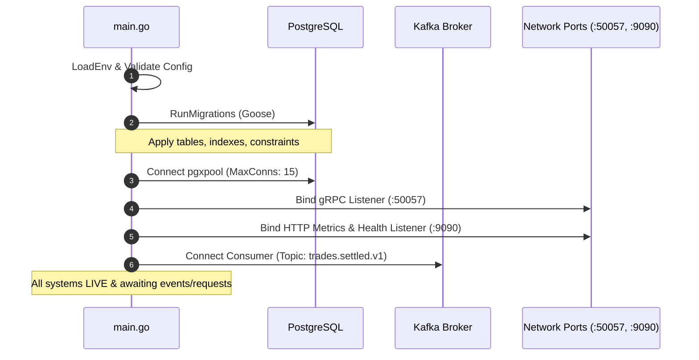
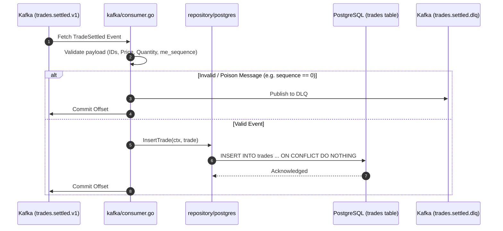
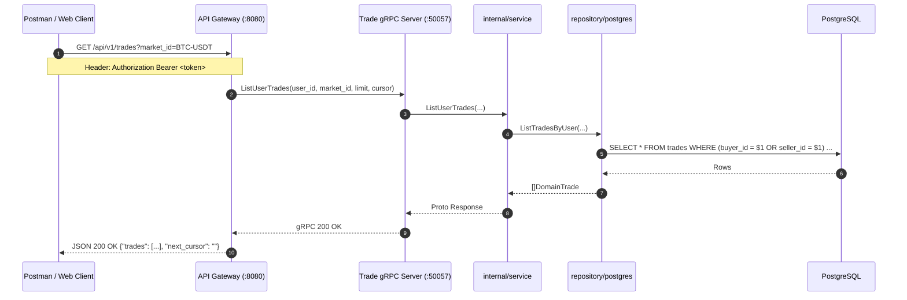
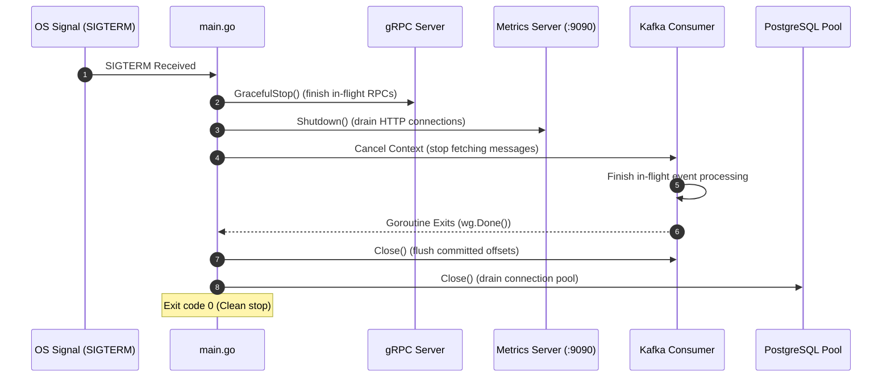

# Trade Service Entrypoint (`cmd/server/main.go`)

## 1. Overview & Purpose

The `services/trade/cmd/server/main.go` file is the **composition root and lifecycle orchestrator** for the Trade Service in TradeDrift.

In an event-driven, high-frequency cryptocurrency exchange, historical trades and public market tape data must be:
1. **Accurately ingested** from asynchronous settled events (`trades.settled.v1`).
2. **Safely persisted** with strict sequence ordering, idempotency, and gap detection.
3. **High-throughput readable** through low-latency gRPC endpoints queried by API Gateways, web clients, and trading bots.
4. **Resiliently operated** with zero message loss during deployments, crashes, or rolling updates.

`cmd/server/main.go` wires together the database migrations, connection pools, domain services, Kafka event consumers, gRPC RPC servers, and Prometheus observability servers into a cohesive, production-grade daemon.

---

## 2. Problems This File Solves

| Problem | How `cmd/server/main.go` Solves It |
|---|---|
| **Stale Schema & Migration Drift** | Applies Goose database migrations before opening network listeners, ensuring tables, indexes, and constraints (`me_sequence`, unique compound indexes) match binary expectations. |
| **Silent Failures on Startup** | Validates all environment variables strictly during configuration boot (`tradeconfig.Load()`). Panics immediately if required variables are missing or malformed rather than failing halfway into execution. |
| **Resource Leaks & Data Corruption on Restart** | Traps OS signals (`SIGINT`, `SIGTERM`) and triggers an orderly 4-stage graceful shutdown: stops new traffic, completes in-flight RPCs, flushes Kafka consumer commits, and closes DB pools. |
| **Dual Interface Serving (gRPC + HTTP)** | Concurrently binds and manages both an internal gRPC server (port `:50057`) for gateway queries and an HTTP server (port `:9090`) for Kubernetes health probes and Prometheus metrics. |
| **Partial Startup Race Conditions** | Sequentially constructs dependencies in dependency order (Config → Logger → Migrations → DB Pool → Repo → Service → Transport/Consumer) before accepting traffic. |

---

## 3. Function & Phase Breakdown

`main()` executes a deterministic 10-phase sequence:

### Phase 0: Configuration Loading
```go
config.LoadEnv()
cfg, err := tradeconfig.Load()
```
* **Purpose**: Reads `.env` files (if present) and parses environment variables (`TRADE_POSTGRES_DSN`, `TRADE_GRPC_PORT`, `KAFKA_BROKERS`, etc.) into typed structs with defaults.
* **Problem Solved**: Prevents hardcoded ports or credentials. Fails fast if required configurations (e.g., PostgreSQL DSN) are missing before any network or DB sockets are opened.

---

### Phase 1: Structured Logger Initialization
```go
appLogger := logger.New(cfg.LogLevel)
defer appLogger.Sync()
```
* **Purpose**: Initializes a high-performance Zap logger formatted for production JSON output.
* **Problem Solved**: Standard `log.Print` produces unstructured text that is difficult to parse in log collectors (Datadog, Loki, CloudWatch). `appLogger.Sync()` guarantees buffered logs are flushed to stdout before the process terminates.

---

### Phase 2: OS Signal Context Trapping
```go
ctx, stop := signal.NotifyContext(context.Background(), syscall.SIGINT, syscall.SIGTERM)
defer stop()
```
* **Purpose**: Creates a root `context.Context` that automatically cancels when Docker or Kubernetes sends `SIGINT` (Ctrl+C) or `SIGTERM` (container stop).
* **Problem Solved**: Eliminates abrupt process kills. All long-running goroutines (Kafka consumer, gRPC server, HTTP server) inherit this root context and can cleanly shut down in unison.

---

### Phase 3: Database Migrations
```go
if err := platformpg.RunMigrations(cfg.PostgresDSN, cfg.MigrationsDir); err != nil {
    appLogger.Fatal("Failed to apply trade migrations", zap.Error(err))
}
```
* **Purpose**: Runs Goose database migrations located in `services/trade/migration/` against PostgreSQL.
* **Problem Solved**: Prevents schema mismatch bugs (e.g. missing `me_sequence` column or indexes). If a migration fails, the service halts (`Fatal`) to prevent corrupted reads/writes.

---

### Phase 4: PostgreSQL Connection Pool
```go
dbPool, err := platformpg.NewPool(poolCtx, cfg.PostgresDSN, platformpg.PoolConfig{
    MaxConns: 15,
})
```
* **Purpose**: Establishes a thread-safe `pgxpool.Pool` connection pool with bounded connections (`MaxConns: 15`).
* **Problem Solved**: Bounded connection pools prevent PostgreSQL connection starvation under high concurrent read loads (e.g. hundreds of clients requesting `/api/v1/markets/BTC-USDT/trades` simultaneously).

---

### Phase 5: Dependency Injection Wire-Up
```go
repo    := tradepg.NewRepository(dbPool)
svc     := tradesvc.NewService(repo, appLogger)
handler := tradehandler.NewGRPCHandler(svc, appLogger)
```
* **Purpose**: Follows clean architecture:
  - `Repository`: Database queries (`InsertTrade`, `GetTradeByID`, `ListTradesByMarket`, `ListTradesByUser`).
  - `Service`: Business logic, authorization rules (TI-8 user visibility checks), input validation.
  - `Handler`: Translates gRPC protobuf requests to domain calls.
* **Problem Solved**: Decouples transport (gRPC) from business logic and database persistence. Makes individual components unit-testable with mock repositories.

---

### Phase 6: gRPC Server Goroutine
```go
grpcServer := grpc.NewServer()
tradev1.RegisterTradeServiceServer(grpcServer, handler)
lis, err := net.Listen("tcp", cfg.GRPCPort)
// ... run in goroutine with wg.Add(1)
```
* **Purpose**: Binds port `:50057` and registers the compiled protobuf `TradeService` contract.
* **Problem Solved**: Provides high-throughput, binary-serialized RPC access for the API Gateway (`services/gateway`) to execute keyset-paginated queries with minimal CPU and latency overhead.

---

### Phase 7: Observability & Health Server Goroutine
```go
metricsMux := http.NewServeMux()
metricsMux.Handle("/metrics", promhttp.Handler())
metricsMux.HandleFunc("/healthz", ...)
metricsMux.HandleFunc("/ready", ...)
// ... run in goroutine with wg.Add(1)
```
* **Purpose**: Binds port `:9090` and exposes:
  - `/healthz`: Liveness probe (returns `200 OK` as long as the process is alive).
  - `/ready`: Readiness probe (executes `dbPool.Ping(ctx)` to verify PostgreSQL connectivity).
  - `/metrics`: Prometheus metrics scraping endpoint.
* **Problem Solved**: Prevents Kubernetes/load-balancers from routing traffic to an instance that is booting up or whose database is disconnected. Enables real-time Grafana dashboards.

---

### Phase 8: Kafka Consumer Goroutine
```go
consumer := tradekafka.NewConsumer(
    cfg.KafkaBrokers,
    cfg.KafkaGroupID,
    cfg.KafkaTopic,
    cfg.KafkaDLQTopic,
    repo,
    appLogger,
)
// ... run in goroutine with wg.Add(1)
```
* **Purpose**: Subscribes to the Kafka topic `trades.settled.v1` under consumer group `trade-service-group`.
* **Problem Solved**: Asynchronously ingests trades settled by the Wallet and Settlement services. If an unrecoverable poison pill is encountered, the consumer routes it to `trades.settled.dlq` without halting the entire pipeline.

---

### Phase 9: Graceful Shutdown Orchestration
```go
<-ctx.Done()
grpcServer.GracefulStop()
metricsServer.Shutdown(metricsShutdownCtx)
wg.Wait()
consumer.Close()
```
* **Purpose**: Coordinates shutdown in strict sequence:
  1. `<-ctx.Done()` unblocks upon `SIGINT`/`SIGTERM`.
  2. `grpcServer.GracefulStop()` stops accepting new RPCs and waits for active requests to finish.
  3. `metricsServer.Shutdown(...)` stops the HTTP server.
  4. `wg.Wait()` waits for the Kafka consumer and server goroutines to exit.
  5. `consumer.Close()` commits final Kafka offsets and closes Kafka sockets.
  6. `dbPool.Close()` drains database connections.
* **Problem Solved**: Prevents half-written transactions, dropped RPC responses, and offset rebalance storms in Kafka.

---

## 4. Architectural Flows

### Flow A: Service Boot Sequence



---

### Flow B: Event Ingestion & Persistence Flow



---

### Flow C: Client Query Flow (Via Gateway)



---

### Flow D: Graceful Shutdown Flow


