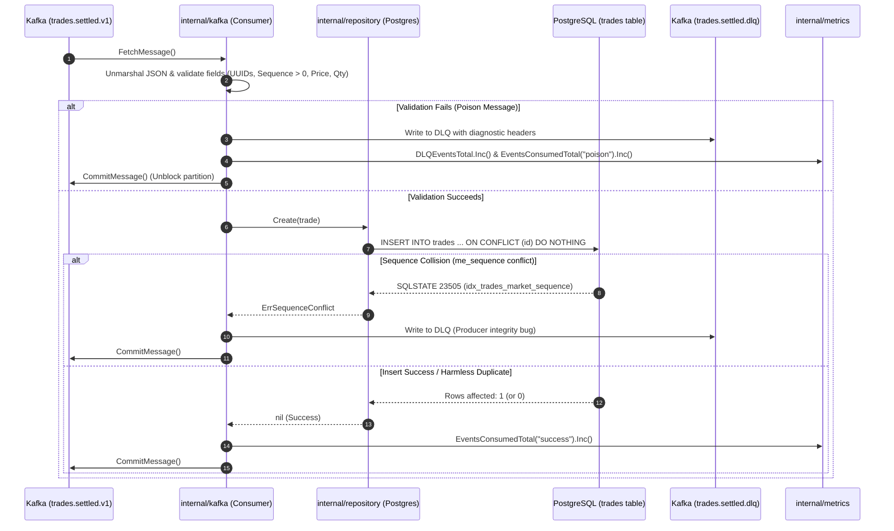
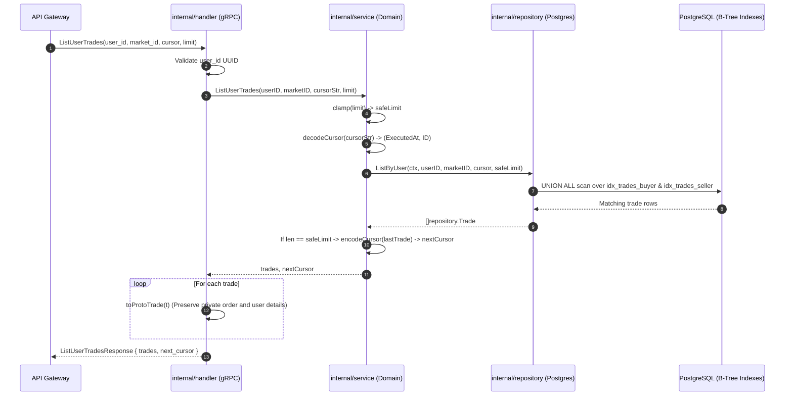

# Trade Service Internal Architecture (`services/trade/internal`)

## 1. Overview & Architectural Philosophy

The `services/trade/internal/` directory contains the complete domain, persistence, ingestion, and presentation logic for the **Trade Service** in TradeDrift.

By adhering to Go's `internal/` package semantics, the packages here cannot be imported by external services or modules, enforcing strict modular boundary encapsulation. The architecture follows the **Ports & Adapters (Hexagonal / Clean Architecture)** design pattern:

```
                  ┌──────────────────────────────────────────────┐
                  │                 API Gateway                  │
                  └──────────────────────┬───────────────────────┘
                                         │ gRPC (:50057)
                                         ▼
┌──────────────────┐               ┌───────────┐               ┌────────────┐
│  Kafka Topic     │  JSON Event   │  handler  │               │   config   │
│ trades.settled.v1├──────────────►│  (gRPC)   │               │ (Env/Boot) │
└────────┬─────────┘               └─────┬─────┘               └────────────┘
         │                               │ calls
         │ async ingest                  ▼
         │                         ┌───────────┐
         ▼                         │  service  │◄──────────────┐
   ┌───────────┐                   │ (Domain)  │               │
   │   kafka   │ calls Create()    └─────┬─────┘               │
   │(Consumer) ├─────────────────────────┼──────────┐          │
   └─────┬─────┘                         │          │          │
         │ routes                        ▼          ▼          │
         │ poison pills            ┌──────────────────────┐    │
         ▼                         │      repository      │    │
   ┌───────────┐                   │(Interface & Postgres)│    │
   │   Kafka   │                   └──────────┬───────────┘    │
   │(DLQ Topic)│                              │                │
   └───────────┘                              ▼                │
                                   ┌──────────────────────┐    │
                                   │ PostgreSQL (DB Pool) │    │
                                   └──────────────────────┘    │
                                                               │
                         ┌─────────┐                           │
                         │ metrics ├───────────────────────────┘
                         │(PromQL) │ (Instrumented across all layers)
                         └─────────┘
```

---

## 2. Directory Matrix & Responsibilities

| Directory | Layer | Primary Responsibility |
|---|---|---|
| [`config/`](file:///c:/Users/AKHIL%20BABU/OneDrive/Desktop/tradedrift/services/trade/internal/config) | Infrastructure / Bootstrap | Environment variable resolution, type conversion, fail-fast validation, and broker address parsing. |
| [`handler/`](file:///c:/Users/AKHIL%20BABU/OneDrive/Desktop/tradedrift/services/trade/internal/handler) | Transport / Adapter (Primary Port) | Implements `tradev1.TradeServiceServer`, handles input validation, counterparty redaction (**TI-7**), and gRPC error mapping. |
| [`kafka/`](file:///c:/Users/AKHIL%20BABU/OneDrive/Desktop/tradedrift/services/trade/internal/kafka) | Ingestion / Adapter (Primary Port) | Consumes settled trade events, validates domain invariants, handles at-least-once commits, and routes poison messages to DLQ. |
| [`metrics/`](file:///c:/Users/AKHIL%20BABU/OneDrive/Desktop/tradedrift/services/trade/internal/metrics) | Observability / Cross-Cutting | Centralized Prometheus metrics registry for event counters, latency histograms, event freshness gauges, and DLQ tracking. |
| [`repository/`](file:///c:/Users/AKHIL%20BABU/OneDrive/Desktop/tradedrift/services/trade/internal/repository) | Persistence / Adapter (Secondary Port) | Manages PostgreSQL access via `pgxpool`, executes keyset cursor pagination, and enforces monotonic sequence uniqueness. |
| [`service/`](file:///c:/Users/AKHIL%20BABU/OneDrive/Desktop/tradedrift/services/trade/internal/service) | Core Business Logic (Domain) | Query-side domain logic, boundary clamping, counterparty authorization checks (**TI-8**), and URL-safe base64 cursor encoding/decoding. |

---

## 3. Deep-Dive by Folder

---

### A. `internal/config`

* **Purpose**: Single source of truth for runtime configurations.
* **Problems Solved**:
  - **Configuration Drift**: Eliminates hardcoded constants and scattered `os.Getenv` calls across different packages.
  - **Late Boot Crashes**: Detects missing critical environment variables (`TRADE_POSTGRES_DSN`, `KAFKA_BROKERS`) before network ports or DB connections open.
  - **Whitespace Malformations**: Sanitizes comma-delimited broker strings into clean slices.
* **Key Functions**:
  - `Load() (Config, error)`: Parses and validates environment variables; injects operational defaults.
  - `parseBrokers(raw string) []string`: Splits, trims, and filters broker strings.
* **Interactions**:
  - Consumed exclusively by `cmd/server/main.go` during initial bootstrapping.

---

### B. `internal/handler`

* **Purpose**: Implements the compiled gRPC protobuf service contract (`tradev1.TradeServiceServer`).
* **Problems Solved**:
  - **Trader Surveillance & Front-Running (TI-7)**: Strips counterparty identifiers (`buyer_id`, `seller_id`) from public market tape queries (`ListMarketTrades`).
  - **Unauthorized Access (TI-8)**: Blocks third parties from inspecting private trade records via `GetTrade`.
  - **Wire-Level Error Standardisation**: Converts internal Go errors into standardized gRPC status codes (`codes.NotFound`, `codes.PermissionDenied`, `codes.InvalidArgument`).
* **Key Functions**:
  - `GetTrade(ctx, req)`: Single trade retrieval with party verification.
  - `ListUserTrades(ctx, req)`: User-specific fill history with cursor pagination.
  - `ListMarketTrades(ctx, req)`: Public tape queries with privacy redaction.
  - `toProtoTrade(t)` / `toProtoMarketTrade(t)`: DTO mapping functions.
* **Interactions**:
  - Called by incoming gRPC requests from API Gateway.
  - Calls `internal/service` for domain operations.
  - Updates `internal/metrics` on every RPC invocation.

---

### C. `internal/kafka`

* **Purpose**: Real-time event consumer for settled trades.
* **Problems Solved**:
  - **Poison Pill Partition Stalling**: Isolates unrecoverable events (invalid UUIDs, zero sequence, self-trades) to `trades.settled.dlq` so partition processing is never blocked.
  - **Silent Data Loss**: Refuses to commit Kafka offsets if writing to the DLQ fails.
  - **Sequence Zero Bug**: Detects Go default `uint64(0)` values caused by missing JSON sequence fields and rejects them prior to DB insert.
  - **Data Leak Prevention**: Strictly sanitizes logs on unmarshal errors to protect PII and balance amounts.
* **Key Functions**:
  - `NewConsumer(...)`: Initializes reader with manual-commit mode (`CommitInterval: 0`).
  - `Start(ctx)`: Primary non-blocking consumption loop.
  - `process(ctx, event)`: Multi-point validation and persistence.
  - `sendToDLQ(ctx, original, reason)`: Preserves original payload and attaches diagnostic headers.
  - `commitMsg(ctx, msg)`: Commits Kafka offset after successful persistence or DLQ routing.
* **Interactions**:
  - Reads from Kafka topic `trades.settled.v1`.
  - Writes to Kafka topic `trades.settled.dlq`.
  - Calls `internal/repository` to persist valid trades.
  - Updates `internal/metrics` (`EventsConsumedTotal`, `DLQEventsTotal`, `ConsumerEventAgeSeconds`).

---

### D. `internal/metrics`

* **Purpose**: Exposes standardized Prometheus telemetry for real-time observability and alerting.
* **Problems Solved**:
  - **Black-Box Operation**: Provides live insights into throughput, lag, error rates, and database latencies.
  - **High Cardinality Storage Spikes**: Restricts labels to bounded, static sets (`status`, `reason`, `method`, `code`).
  - **Sub-Millisecond Profiling**: Provides fine-grained histogram buckets (0.5ms to 1s) tailored for high-speed trading engines.
* **Key Metrics**:
  - `EventsConsumedTotal`: Counter tracking consumer status (`success`, `duplicate`, `poison`, `retryable_error`).
  - `DLQEventsTotal`: Counter classifying poison causes (`invalid_uuid`, `zero_sequence`, etc.).
  - `ConsumerEventAgeSeconds`: Gauge tracking pipeline freshness per partition.
  - `DBDurationSeconds`: Histogram measuring SQL query latencies.
  - `GRPCRequestsTotal` & `GRPCDurationSeconds`: Telemetry for inbound RPC calls.
* **Interactions**:
  - Instrumented across `handler/`, `kafka/`, and `repository/postgres/`.
  - Exposed over HTTP via `:9090/metrics` mounted in `cmd/server/main.go`.

---

### E. `internal/repository`

* **Purpose**: Database abstraction interface (`repository.go`) and PostgreSQL engine (`postgres/repository.go`).
* **Problems Solved**:
  - **Slow Deep Pagination**: Replaces expensive `OFFSET` queries with Keyset Pagination on `(executed_at DESC, id DESC)`, maintaining $O(\log N)$ seeks.
  - **`OR` Clause Degradation**: Uses `UNION ALL` to independently scan `buyer_id` and `seller_id` indexes when listing user trades.
  - **Monotonic Sequence Integrity**: Enforces unique constraint on `(market_id, me_sequence)`. Translates SQLSTATE `23505` to `ErrSequenceConflict`.
  - **At-Least-Once Idempotency**: Employs `ON CONFLICT (id) DO NOTHING` to ensure duplicate redeliveries are benign.
  - **Financial Precision**: Enforces `shopspring/decimal.Decimal` over `DECIMAL(30,10)` database columns.
* **Key Functions**:
  - `Create(ctx, t)`: Idempotent trade insertion.
  - `GetByID(ctx, id)`: Primary key lookup.
  - `ListByUser(ctx, userID, marketID, after, limit)`: Dual-index `UNION ALL` query.
  - `ListByMarket(ctx, marketID, after, limit)`: Ticker tape query on compound index.
* **Interactions**:
  - Consumed by `internal/kafka` (write path) and `internal/service` (read path).
  - Uses `pgxpool.Pool` created in `cmd/server/main.go`.

---

### F. `internal/service`

* **Purpose**: Domain business rules, security verification, and pagination tokens.
* **Problems Solved**:
  - **Counterparty snooping (TI-8)**: Enforces that non-admin callers must be either the buyer or the seller to inspect a trade record.
  - **Memory Exhaustion DoS**: Mathematical clamping of client-supplied page sizes (`[1, 100]` for users, `[1, 200]` for markets).
  - **Database Leakage**: Encodes internal database keyset coordinates into opaque, URL-safe Base64 tokens.
  - **Phantom Pages**: Omits `next_cursor` when the last page of results is reached.
* **Key Functions**:
  - `GetTrade(ctx, tradeID, callerUserID, isAdmin)`: Enforces TI-8 counterparty check.
  - `ListUserTrades(ctx, ...)`: Clamps limits, decodes cursor, queries repo, and generates next cursor.
  - `ListMarketTrades(ctx, ...)`: Public market query orchestration.
  - `encodeCursor(c)` / `decodeCursor(str)`: Keyset cursor serialization.
  - `clamp(val, min, max)`: Bound enforcement.
* **Interactions**:
  - Consumed by `internal/handler` (gRPC).
  - Calls `internal/repository` to fetch data.

---

## 4. End-to-End System Flows

### Flow 1: The Asynchronous Write Path (Kafka → DB)



---

### Flow 2: The Synchronous Read Path (Gateway → gRPC → DB)


