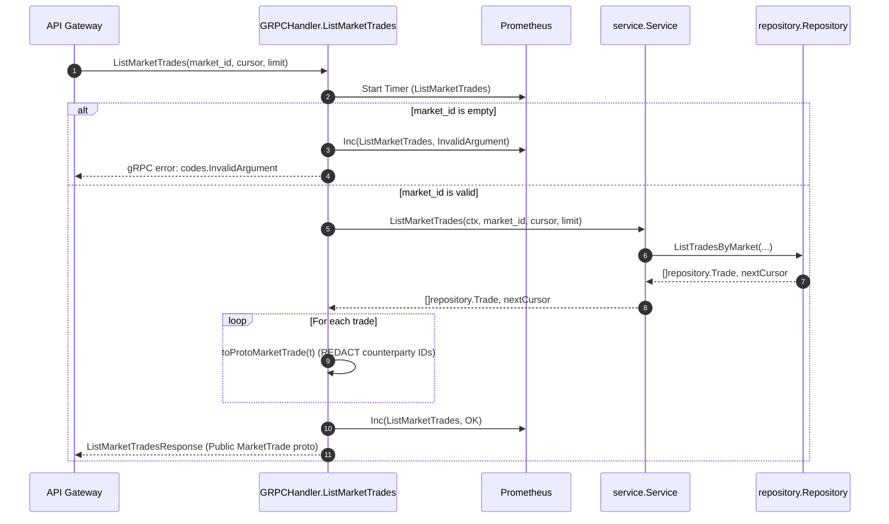
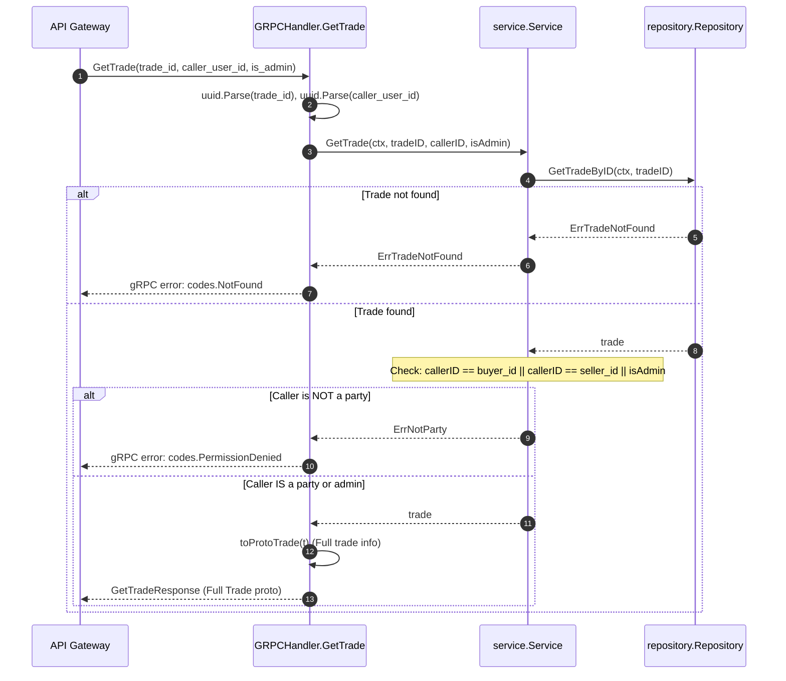
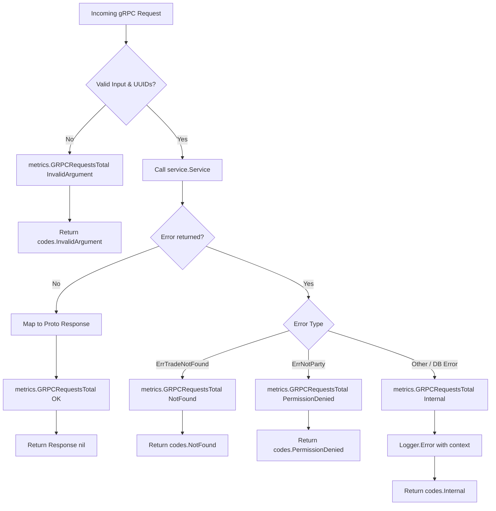

# Trade Service Transport Handler (`internal/handler/grpc.go`)

## 1. Overview & Purpose

The `services/trade/internal/handler/grpc.go` file implements the **gRPC transport adapter** (`tradev1.TradeServiceServer`) for the Trade Service.

In TradeDrift's microservices architecture, the Trade Service does not expose raw HTTP endpoints directly to external users. Instead:
1. The **API Gateway** (`services/gateway`) terminates external HTTPS client requests, validates JWT tokens, and translates HTTP routes into internal gRPC calls.
2. The **gRPC Handler** (`internal/handler/grpc.go`) serves as the strict gatekeeper:
   - Enforces transport-level parameter validation (UUID parsing, non-empty checks).
   - Implements regulatory privacy protections (**TI-7** and **TI-8**).
   - Records Prometheus metrics (request counters and latency histograms).
   - Bridges Protobuf wire objects with internal domain models.
   - Maps domain errors into standard gRPC status codes (`codes.NotFound`, `codes.PermissionDenied`, `codes.InvalidArgument`).

---

## 2. Problems This Package Solves

| Problem | How `grpc.go` Solves It |
|---|---|
| **Trader De-Anonymization & Front-Running (TI-7)** | In public order book tapes, exposing counterparty identities (`buyer_id`, `seller_id`) or order IDs enables predatory trading and surveillance. `toProtoMarketTrade()` explicitly strips all counterparty identifiers from public market tape queries (`ListMarketTrades`). |
| **Unauthorized Trade Record Inspection (TI-8)** | A private trade record contains sensitive order and execution details. `GetTrade()` validates whether the caller is the buyer, seller, or an administrator. If not, it returns `codes.PermissionDenied`. |
| **Malformed Input Injection** | Parses all ID strings (`trade_id`, `caller_user_id`, `user_id`) into typed `uuid.UUID` objects before invoking the service layer. Rejects malformed strings immediately with `codes.InvalidArgument`. |
| **Opaque Wire Errors** | Maps domain errors (`repository.ErrTradeNotFound`, `service.ErrNotParty`) to standard gRPC status codes (`codes.NotFound`, `codes.PermissionDenied`) instead of returning generic internal errors, allowing the API Gateway to return proper HTTP 404 or 403 responses. |
| **Observability Blindspots** | Every RPC method automatically records latency using `metrics.GRPCDurationSeconds` and tracks request outcomes (`OK`, `InvalidArgument`, `NotFound`, `PermissionDenied`, `Internal`) in `metrics.GRPCRequestsTotal`. |

---

## 3. Data Structures & Dependencies

### `type GRPCHandler struct`

```go
type GRPCHandler struct {
    tradev1.UnimplementedTradeServiceServer
    svc *service.Service
    log *zap.Logger
}
```

* **`UnimplementedTradeServiceServer`**: Embedded to satisfy forward-compatible gRPC server interface implementations.
* **`svc`**: Injected domain business service containing core query logic and authorization rules.
* **`log`**: Uber Zap logger for logging unexpected errors (e.g. database connectivity failures).

---

## 4. Functions & Endpoints Breakdown

### 1. `GetTrade(ctx context.Context, req *tradev1.GetTradeRequest) (*tradev1.GetTradeResponse, error)`

* **Purpose**: Fetches a single trade by UUID with strict party-verification (TI-8).
* **Problems Solved**:
  - Validates `req.TradeId` presence and format (`uuid.Parse`).
  - Validates optional `req.CallerUserId`.
  - Enforces party verification through `h.svc.GetTrade(ctx, tradeID, callerID, req.IsAdmin)`.
  - Error translation:
    - `repository.ErrTradeNotFound` → `codes.NotFound` ("trade `<id>` not found").
    - `service.ErrNotParty` → `codes.PermissionDenied` ("caller is not a party to this trade").
    - Unknown errors → Logged with stack trace and converted to `codes.Internal`.
  - Records Prometheus duration and status counters.

---

### 2. `ListUserTrades(ctx context.Context, req *tradev1.ListUserTradesRequest) (*tradev1.ListUserTradesResponse, error)`

* **Purpose**: Retrieves the authenticated user's private fill history, newest-first, with keyset cursor pagination.
* **Problems Solved**:
  - Validates `req.UserId` presence and format (`uuid.Parse`).
  - Passes `req.MarketId`, `req.Cursor`, and `req.Limit` directly to the domain service.
  - Transforms domain trade entities into full proto messages (`toProtoTrade`), including `buyer_id`, `seller_id`, and `buy_order_id`/`sell_order_id`.
  - Returns `NextCursor` for pagination without requiring slow SQL `OFFSET` operations.

---

### 3. `ListMarketTrades(ctx context.Context, req *tradev1.ListMarketTradesRequest) (*tradev1.ListMarketTradesResponse, error)`

* **Purpose**: Retrieves the public market execution tape for charts, UI tickers, and order flow feeds.
* **Problems Solved**:
  - Enforces mandatory `req.MarketId` presence.
  - Passes pagination parameters (`req.Cursor`, `req.Limit`) to the domain service.
  - **Enforces TI-7**: Maps each trade using `toProtoMarketTrade()`, which strictly redacts `buyer_id`, `seller_id`, and order IDs.
  - Ensures public endpoints cannot be abused to leak user identities.

---

### 4. `toProtoTrade(t *repository.Trade) *tradev1.Trade` (Private Mapper)

* **Purpose**: Maps a domain `repository.Trade` to the full protobuf `tradev1.Trade` message.
* **Fields Mapped**:
  - `TradeId`, `BuyerId`, `SellerId`, `BuyOrderId`, `SellOrderId`
  - `MarketId`, `BaseAsset`, `QuoteAsset`
  - `Price`, `Quantity` (represented as exact decimal strings to prevent IEEE-754 float precision loss)
  - `ExecutedAt`, `SettledAt` (formatted as RFC3339Nano UTC strings)

---

### 5. `toProtoMarketTrade(t *repository.Trade) *tradev1.MarketTrade` (Private Mapper)

* **Purpose**: Maps a domain `repository.Trade` to the public protobuf `tradev1.MarketTrade` message.
* **Security Redaction**:
  - Excludes `BuyerId`
  - Excludes `SellerId`
  - Excludes `BuyOrderId`
  - Excludes `SellOrderId`
  - Excludes `SettledAt`
  - Exposes only market public data: `TradeId`, `MarketId`, `BaseAsset`, `QuoteAsset`, `Price`, `Quantity`, `ExecutedAt`.

---

## 5. Architectural Flows

### Flow A: Public Market Tape Query (`ListMarketTrades`)



---

### Flow B: Authorized Single Trade Lookup (`GetTrade` — TI-8)



---

### Flow C: Error & Metrics Mapping Pipeline


