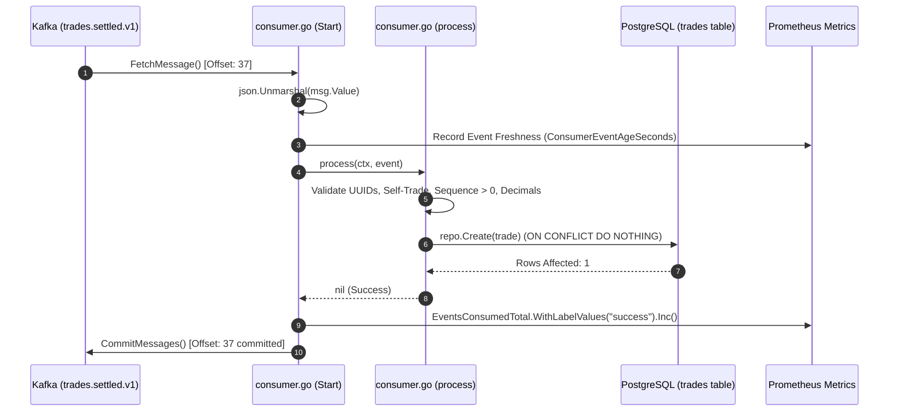
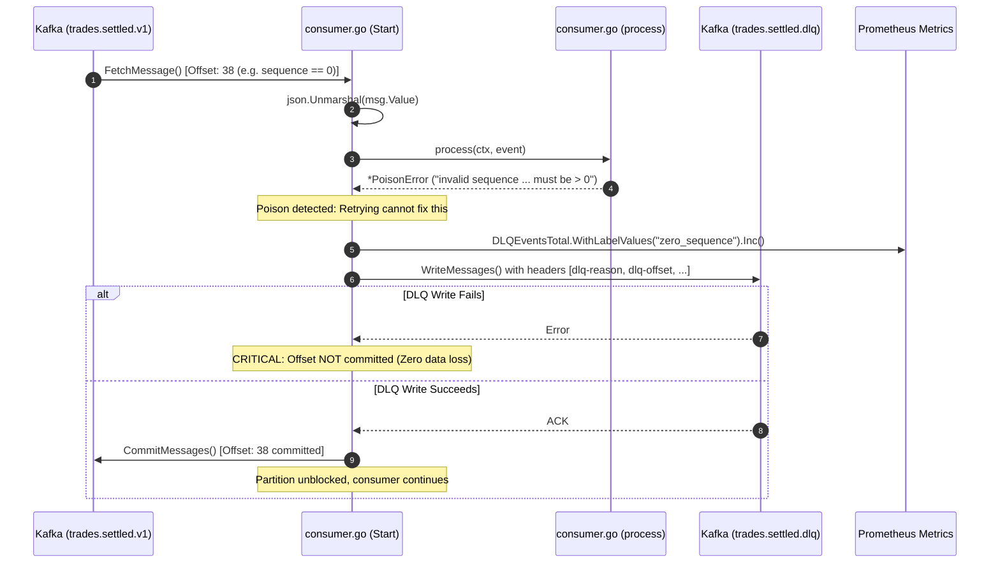
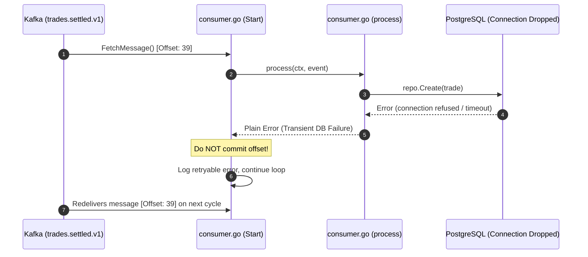

# Trade Service Kafka Ingestion & DLQ Architecture (`internal/kafka/consumer.go`)

## 1. Overview & Purpose

The `services/trade/internal/kafka/consumer.go` package is the **event-driven ingestion engine** of the Trade Service.

In TradeDrift's trading pipeline:
1. Matching Engine matches orders and publishes `trades.executed`.
2. Settlement Service executes multi-phase settlement and commands Wallet Service.
3. Wallet Service transfers funds, reserves, and writes `TradeSettled` to its PostgreSQL transactional outbox.
4. Wallet Outbox Publisher pushes `TradeSettled` events to Kafka topic **`trades.settled.v1`**.
5. **Trade Service Kafka Consumer** (`internal/kafka/consumer.go`) ingests `trades.settled.v1` messages, validates business and cryptographic invariants, persists records into PostgreSQL (`trades` table), and safely isolates malformed/poison messages to **`trades.settled.dlq`**.

---

## 2. Problems This Package Solves

| Problem | How `consumer.go` Solves It |
|---|---|
| **Poison Pill Partition Stalling** | In standard Kafka consumers, if a message has invalid JSON, bad UUIDs, or zero sequence, returning an unhandled error prevents offset commit. Kafka redelivers the same message forever, stalling all subsequent trades on that partition. `consumer.go` classifies non-retryable errors as `*PoisonError`, routes them to `trades.settled.dlq`, and commits the original offset to keep the partition moving. |
| **Silent Data Loss on DLQ Failure** | If routing to the DLQ fails (e.g., DLQ topic unavailable), `consumer.go` **refuses to commit the original offset**, logging a `CRITICAL` error and allowing Kafka to redeliver until the DLQ is reachable. |
| **PII & Financial Data Leaks in Logs** | When JSON unmarshaling fails, dumping raw message bytes (`msg.Value`) can leak sensitive trader IDs and balances into log aggregation systems. `consumer.go` strictly logs partition, offset, and sanitized error strings without logging raw payloads. |
| **Go Zero-Value Sequence Bug** | If the `sequence` field is missing from JSON, Go's `encoding/json` leaves `uint64` as `0`. A PostgreSQL `NOT NULL` constraint would accept `0` as a valid integer. `consumer.go` explicitly validates `Sequence > 0` before calling `repo.Create()`, preventing sequence corruption. |
| **Self-Trade Contamination** | Ensures `buyer_id != seller_id`. If an event violates self-trade prevention, it is flagged as poison rather than stored as a legitimate market trade. |
| **At-Least-Once Redelivery Duplication** | Uses PostgreSQL `ON CONFLICT (id) DO NOTHING` via `repo.Create()`. Replaying offsets after crashes or rebalances is completely safe and idempotent. |
| **Sequence Collision / Monotonic Drift** | The `trades` table enforces a unique constraint on `(market_id, me_sequence)`. If a message arrives with an existing sequence but a different trade ID (producer bug), the repository returns `ErrSequenceConflict`, which is safely routed to DLQ. |

---

## 3. Data Structures

### `type PoisonError struct`
```go
type PoisonError struct{ Err error }
```
* **Purpose**: An error wrapper indicating permanent message invalidity.
* **Behavior**: Signals the consume loop to forward the raw message to the DLQ and acknowledge the original Kafka offset.

---

### `type TradeSettledEvent struct`
```go
type TradeSettledEvent struct {
    TradeID      string `json:"trade_id"`
    BuyerID      string `json:"buyer_id"`
    SellerID     string `json:"seller_id"`
    BuyOrderID   string `json:"buy_order_id"`
    SellOrderID  string `json:"sell_order_id"`
    MarketID     string `json:"market_id"`
    BaseAsset    string `json:"base_asset"`
    QuoteAsset   string `json:"quote_asset"`
    Price        string `json:"price"`
    Quantity     string `json:"quantity"`
    Sequence     uint64 `json:"sequence"`
    ExecutedAt   string `json:"executed_at"` // RFC3339Nano (Matching Engine timestamp)
    SettledAt    string `json:"settled_at"`  // RFC3339Nano (Wallet settlement timestamp)
}
```
* **Format**: JSON wire payload consistent with all platform events.

---

### `type Consumer struct`
```go
type Consumer struct {
    reader    *kafkago.Reader       // Manual-commit Kafka consumer reader
    dlqWriter *kafkago.Writer       // Producer for routing poison events to DLQ
    dlqTopic  string                // DLQ topic name (trades.settled.dlq)
    repo      repository.Repository // Database access layer
    log       *zap.Logger           // Structured logger
}
```

---

## 4. Functions & Logic Breakdown

### 1. `NewConsumer(...) *Consumer`
* **Purpose**: Initializes the Kafka Reader with **manual commit mode** (`CommitInterval: 0`, `StartOffset: FirstOffset`) and sets up a dedicated Kafka Writer pointing to `dlqTopic`.
* **Problem Solved**: Automatic committing in high-throughput financial systems causes message loss if the process crashes after fetch but before DB write. Manual commit guarantees **at-least-once processing**.

---

### 2. `Start(ctx context.Context)`
* **Purpose**: Runs the main blocking consumption loop:
  1. `FetchMessage(ctx)`: Retrieves message from partition.
  2. `json.Unmarshal`: Decodes payload. On failure, routes to DLQ and commits.
  3. Records event age metric (`metrics.ConsumerEventAgeSeconds`).
  4. Calls `process(ctx, event)`:
     - If `*PoisonError`: writes to DLQ, increments `metrics.DLQEventsTotal`, and commits.
     - If retryable DB error: skips commit and logs error; Kafka will redeliver.
     - If success: calls `commitMsg(ctx, msg)` and increments `metrics.EventsConsumedTotal("success")`.
  5. Exits cleanly when `ctx` is cancelled.

---

### 3. `process(ctx context.Context, event TradeSettledEvent) error`
* **Purpose**: Performs domain validations before database insertion:
  1. **UUID Parsing**: Parses `TradeID`, `BuyerID`, `SellerID`, `BuyOrderID`, `SellOrderID`. Invalid strings return `poisonf()`.
  2. **Self-Trade Guard**: Returns `poisonf("self-trade: buyer_id == seller_id")` if IDs match.
  3. **Sequence Guard**: Returns `poisonf("invalid sequence ... must be > 0")` if `event.Sequence == 0`.
  4. **Financial Validation**: Verifies `Price > 0` and `Quantity > 0` using arbitrary-precision decimals (`shopspring/decimal`).
  5. **Timestamp Validation**: Verifies `ExecutedAt` and `SettledAt` are valid RFC3339Nano timestamps.
  6. **Idempotent Persistence**: Calls `repo.Create(ctx, trade)`. If `ErrSequenceConflict` is returned, wraps it as poison.

---

### 4. `sendToDLQ(ctx context.Context, original kafkago.Message, reason string) error`
* **Purpose**: Preserves the original message payload and adds contextual diagnostic headers:
  - `dlq-reason`: Error message describing why the event was rejected.
  - `dlq-topic`: Original source topic (`trades.settled.v1`).
  - `dlq-partition`: Source partition index.
  - `dlq-offset`: Original message offset.
* **Problem Solved**: Operations engineers can inspect DLQ events and immediately understand why they failed without guessing or correlating timestamps across logs.

---

### 5. `commitMsg(ctx context.Context, msg kafkago.Message)`
* **Purpose**: Commits the Kafka message offset to the broker group.
* **Fault Tolerance**: If the commit fails (e.g. broker rebalance), an error is logged. Because the database insertion uses `ON CONFLICT DO NOTHING`, duplicate redeliveries are completely benign.

---

### 6. `classifyReason(errStr string) string`
* **Purpose**: Normalizes dynamic error strings into bounded, low-cardinality Prometheus metric labels (`invalid_uuid`, `self_trade`, `zero_sequence`, `invalid_financials`, `sequence_conflict`, `unknown`).
* **Problem Solved**: Prevents Prometheus time-series explosion caused by embedding unique IDs or dynamic text in metric label values.

---

## 5. Architectural Flows

### Flow A: Successful Ingestion & Persistence



---

### Flow B: Poison Message Isolation (DLQ Flow)



---

### Flow C: Transient Failure & Safe Redelivery


