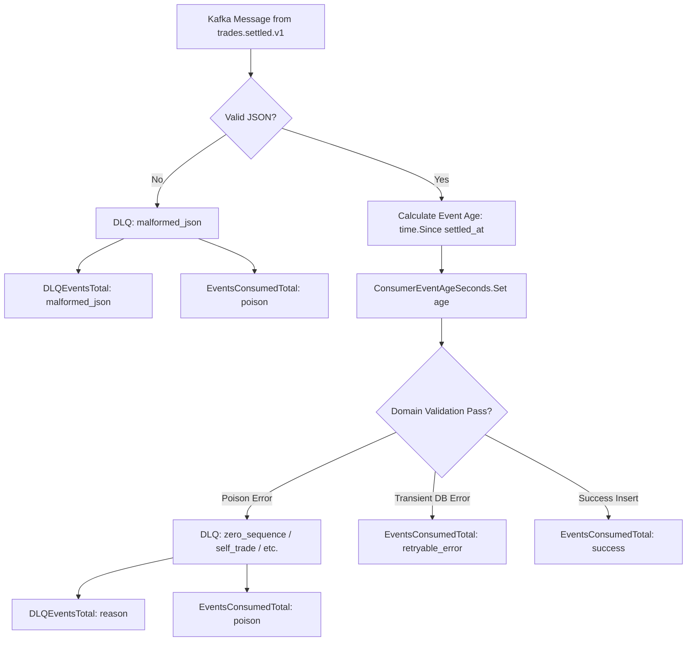
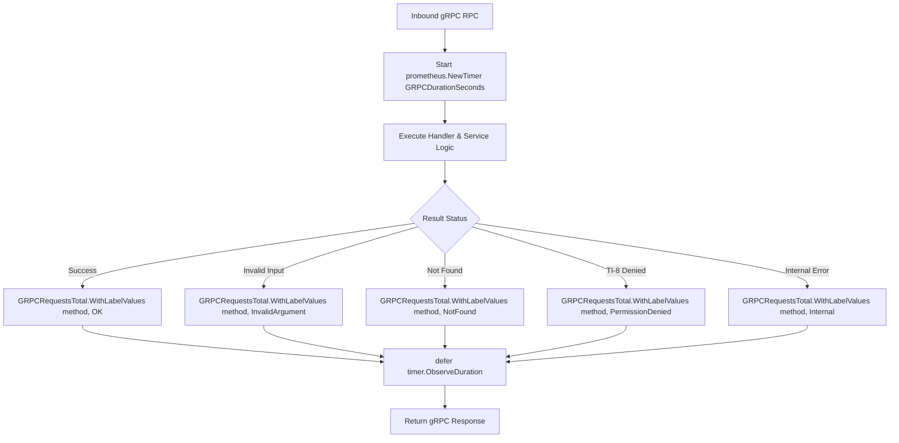

# Trade Service Prometheus Metrics (`internal/metrics/metrics.go`)

## 1. Overview & Purpose

The `services/trade/internal/metrics/metrics.go` package defines the **Prometheus instrumentation layer** for the Trade Service.

In a mission-critical cryptocurrency exchange, the Trade Service sits directly on the critical path for both:
- **Write Path**: Asynchronous persistence of settled trades from Kafka.
- **Read Path**: High-throughput historical trade tape and private user fill queries from the API Gateway.

This package provides standardized, thread-safe, auto-registered Prometheus metric collectors via `promauto` to monitor pipeline health, detect latency degradation, triage dead-letter events, and expose metrics via the `:9090/metrics` HTTP endpoint.

---

## 2. Problems This Package Solves

| Problem | How `metrics.go` Solves It |
|---|---|
| **Silent Event Ingestion Stalls** | `EventsConsumedTotal` tracks processed events partitioned by status (`success`, `poison`, `retryable_error`), immediately alerting on consumer group lag or processing blockages. |
| **End-to-End Pipeline Lag Blindness** | `ConsumerEventAgeSeconds` measures the difference between when Wallet Service settled the trade (`SettledAt`) and when Trade Service consumed it, exposing systemic backpressure across Kafka partitions. |
| **DLQ Triage Without Log Digging** | `DLQEventsTotal` classifies dead-lettered events by low-cardinality root cause (`invalid_uuid`, `zero_sequence`, `self_trade`, `invalid_financials`, `sequence_conflict`), allowing on-call engineers to identify upstream producer bugs instantly. |
| **High-Frequency Latency Profiling** | `DBDurationSeconds` and `GRPCDurationSeconds` provide sub-millisecond histogram buckets (from `0.5ms` to `1.0s`) to monitor P50, P90, and P99 latency SLOs. |
| **Cardinality Explosion in Prometheus** | Enforces strict, bounded label domains (static operation names, gRPC status codes, and error categories). Dynamic values such as `trade_id`, `user_id`, or dynamic error messages are strictly disallowed. |

---

## 3. Metrics Catalog & Schema

All metrics use the standardized namespace **`tradedrift`** and subsystem **`trade`**.

### 1. Ingestion Metrics (`Kafka Consumer`)

#### A. `tradedrift_trade_events_consumed_total`
* **Type**: CounterVector
* **Labels**:
  - `status`: `"success"`, `"duplicate"`, `"poison"`, `"retryable_error"`
* **Purpose**: Tracks every message evaluated by the Kafka consumer loop.
* **Usage**:
  ```go
  metrics.EventsConsumedTotal.WithLabelValues("success").Inc()
  metrics.EventsConsumedTotal.WithLabelValues("poison").Inc()
  ```

#### B. `tradedrift_trade_dlq_events_total`
* **Type**: CounterVector
* **Labels**:
  - `reason`: `"invalid_uuid"`, `"self_trade"`, `"zero_sequence"`, `"invalid_financials"`, `"sequence_conflict"`, `"unknown"`
* **Purpose**: Measures the rate and classification of poison messages routed to `trades.settled.dlq`.
* **Usage**:
  ```go
  metrics.DLQEventsTotal.WithLabelValues("zero_sequence").Inc()
  ```

#### C. `tradedrift_trade_consumer_event_age_seconds`
* **Type**: GaugeVector
* **Labels**:
  - `partition`: Kafka partition number (e.g. `"0"`, `"1"`, `"2"`)
* **Purpose**: Tracks event lag in seconds: `time.Since(settledAt).Seconds()`.
* **Usage**:
  ```go
  metrics.ConsumerEventAgeSeconds.WithLabelValues(partitionStr).Set(ageSeconds)
  ```

---

### 2. Database Metrics (`PostgreSQL Repository`)

#### `tradedrift_trade_db_duration_seconds`
* **Type**: HistogramVector
* **Labels**:
  - `operation`: `"create"`, `"get_by_id"`, `"list_by_user"`, `"list_by_market"`
* **Buckets**: `[0.0005, 0.001, 0.0025, 0.005, 0.01, 0.025, 0.05, 0.1, 0.25, 0.5, 1.0]` (0.5ms to 1s)
* **Purpose**: Monitors SQL query execution latency inside `internal/repository/postgres/`.
* **Usage**:
  ```go
  timer := prometheus.NewTimer(metrics.DBDurationSeconds.WithLabelValues("create"))
  defer timer.ObserveDuration()
  ```

---

### 3. Transport Metrics (`gRPC Server`)

#### A. `tradedrift_trade_grpc_requests_total`
* **Type**: CounterVector
* **Labels**:
  - `method`: `"GetTrade"`, `"ListUserTrades"`, `"ListMarketTrades"`
  - `code`: `"OK"`, `"NotFound"`, `"PermissionDenied"`, `"InvalidArgument"`, `"Internal"`
* **Purpose**: Counts inbound gRPC requests and their resulting status codes.
* **Usage**:
  ```go
  metrics.GRPCRequestsTotal.WithLabelValues("GetTrade", "OK").Inc()
  metrics.GRPCRequestsTotal.WithLabelValues("GetTrade", "PermissionDenied").Inc()
  ```

#### B. `tradedrift_trade_grpc_duration_seconds`
* **Type**: HistogramVector
* **Labels**:
  - `method`: `"GetTrade"`, `"ListUserTrades"`, `"ListMarketTrades"`
* **Buckets**: `[0.0005, 0.001, 0.0025, 0.005, 0.01, 0.025, 0.05, 0.1, 0.25, 0.5, 1.0]` (0.5ms to 1s)
* **Purpose**: Measures end-to-end execution time for each gRPC RPC method.
* **Usage**:
  ```go
  timer := prometheus.NewTimer(metrics.GRPCDurationSeconds.WithLabelValues("ListMarketTrades"))
  defer timer.ObserveDuration()
  ```

---

## 4. Observability & Telemetry Flows

### Flow A: Ingestion Freshness & DLQ Telemetry



---

### Flow B: gRPC Request Telemetry & Histogram Observation



---

## 5. Prometheus Scraping & Query Examples

The metrics are exposed on the HTTP health/metrics server port `:9090` at `/metrics`.

### Key PromQL Alerting Queries:

1. **Trade Ingestion Error Rate (% of failed events)**:
   ```promql
   sum(rate(tradedrift_trade_events_consumed_total{status!="success"}[5m]))
   /
   sum(rate(tradedrift_trade_events_consumed_total[5m])) * 100
   ```

2. **P99 gRPC Latency by Method**:
   ```promql
   histogram_quantile(0.99, sum(rate(tradedrift_trade_grpc_duration_seconds_bucket[5m])) by (le, method))
   ```

3. **P99 Database Insert Duration**:
   ```promql
   histogram_quantile(0.99, sum(rate(tradedrift_trade_db_duration_seconds_bucket{operation="create"}[5m])) by (le))
   ```

4. **Consumer Event Lag Alert (> 5 seconds)**:
   ```promql
   tradedrift_trade_consumer_event_age_seconds > 5
   ```
