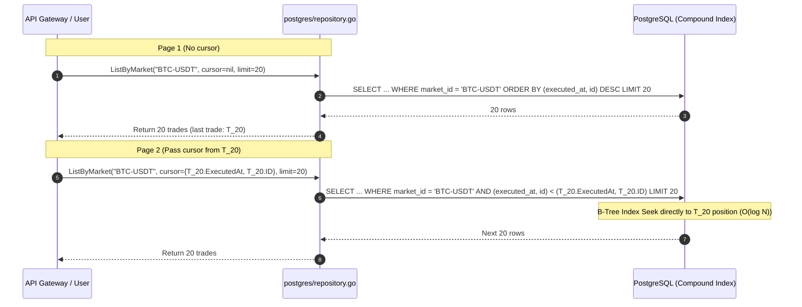
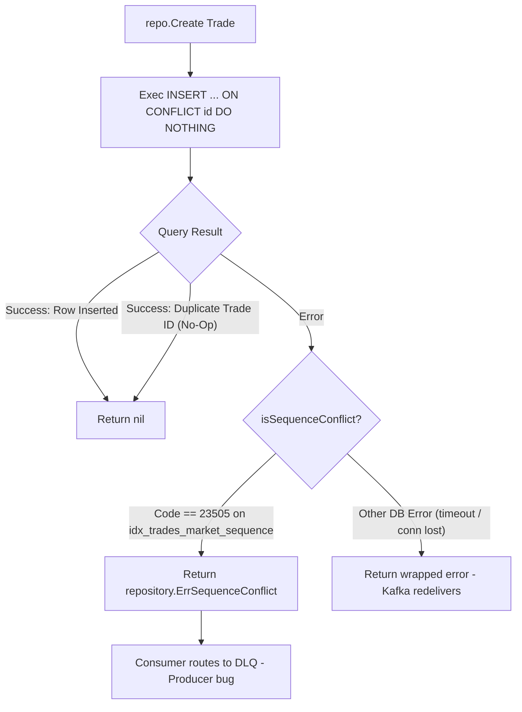

# Trade Service Repository Layer (`internal/repository`)

## 1. Overview & Purpose

The `services/trade/internal/repository` package defines the **data access abstraction and PostgreSQL persistence engine** for the Trade Service.

It consists of two components:
1. **`repository.go` (Interface & Domain Models)**: Defines the core immutable `Trade` entity, keyset `Cursor`, domain-level sentinel errors (`ErrSequenceConflict`, `ErrTradeNotFound`), and the `Repository` interface contract.
2. **`postgres/repository.go` (PostgreSQL Implementation)**: High-performance data access layer using `jackc/pgx/v5`, connection pooling (`pgxpool.Pool`), cursor-based keyset pagination, and Prometheus histogram instrumentation.

---

## 2. Problems This Package Solves

| Problem | How the Repository Solves It |
|---|---|
| **Slow Offset Pagination (`OFFSET N`) Under High Volume** | Traditional `OFFSET 50000` requires PostgreSQL to scan and discard 50,000 rows. The repository uses **Keyset / Cursor Pagination** on `(executed_at DESC, id DESC)`. The tuple comparison `(executed_at, id) < ($cursor_time, $cursor_id)` jumps directly to the exact index position in O(log N) time. |
| **PostgreSQL `OR` Clause Index Invalidation** | Writing `WHERE buyer_id = $1 OR seller_id = $1` frequently forces PostgreSQL into a full table scan. The repository rewrites this as a **`UNION ALL`** of two separate index scans (`buyer_id` index and `seller_id` index), ensuring constant-time index lookups. |
| **At-Least-Once Redelivery Duplication** | Uses `ON CONFLICT (id) DO NOTHING` in `Create()`. If Kafka redelivers an already committed trade, it executes as a clean no-op without duplicating records or throwing constraint errors. |
| **Monotonic Sequence Corruption (Producer Bug)** | Enforces a PostgreSQL unique compound index `idx_trades_market_sequence` on `(market_id, me_sequence)`. If a corrupted event re-uses an existing sequence for a *new* trade ID, `isSequenceConflict()` detects SQLSTATE `23505` and returns `ErrSequenceConflict`, routing the rogue event to DLQ. |
| **Floating-Point Rounding & Loss of Precision** | Prices and quantities are stored as `NUMERIC(36, 18)` and parsed exclusively into `shopspring/decimal.Decimal` arbitrary-precision structs, eliminating IEEE-754 binary floating-point errors. |

---

## 3. Data Structures & Entities

### `type Trade struct` (`repository.go`)
```go
type Trade struct {
    ID           uuid.UUID       // Unique trade identifier (deterministic UUIDv5)
    BuyerID      uuid.UUID       // User ID of buyer
    SellerID     uuid.UUID       // User ID of seller
    BuyOrderID   uuid.UUID       // Order ID of buy order
    SellOrderID  uuid.UUID       // Order ID of sell order
    MarketID     string          // Market symbol (e.g. BTC-USDT)
    BaseAsset    string          // Base asset (BTC)
    QuoteAsset   string          // Quote asset (USDT)
    Price        decimal.Decimal // Execution price
    Quantity     decimal.Decimal // Execution quantity
    Sequence     uint64          // Monotonic Matching Engine sequence (> 0)
    ExecutedAt   time.Time       // Timestamp when matched (ME clock)
    SettledAt    time.Time       // Timestamp when settled (Wallet clock)
}
```
* **Immutability Invariant**: Trades are write-once, append-only historical records. No `UPDATE` or `DELETE` query exists in this service.

---

### `type Cursor struct` (`repository.go`)
```go
type Cursor struct {
    ExecutedAt time.Time // executed_at of the last trade on the current page
    ID         uuid.UUID // ID of the last trade on the current page (tie-breaker)
}
```
* **Keyset Invariant**: `(executed_at DESC, id DESC)` guarantees absolute deterministic ordering even when multiple trades occur at the exact same microsecond timestamp.

---

### `type Repository interface` (`repository.go`)
```go
type Repository interface {
    Create(ctx context.Context, t *Trade) error
    GetByID(ctx context.Context, id uuid.UUID) (*Trade, error)
    ListByUser(ctx context.Context, userID uuid.UUID, marketID string, after *Cursor, limit int) ([]Trade, error)
    ListByMarket(ctx context.Context, marketID string, after *Cursor, limit int) ([]Trade, error)
}
```

---

## 4. Functions Breakdown (`postgres/repository.go`)

### 1. `Create(ctx context.Context, t *repository.Trade) error`
* **Purpose**: Inserts a new trade row into PostgreSQL.
* **SQL Query**:
  ```sql
  INSERT INTO trades (
      id, buyer_id, seller_id, buy_order_id, sell_order_id,
      market_id, base_asset, quote_asset, price, quantity,
      me_sequence, executed_at, settled_at
  ) VALUES ($1, $2, $3, $4, $5, $6, $7, $8, $9, $10, $11, $12, $13)
  ON CONFLICT (id) DO NOTHING
  ```
* **Error Classification**:
  - `nil`: Successfully inserted or harmless duplicate ID.
  - `repository.ErrSequenceConflict`: Raised when SQL error is `23505` on `idx_trades_market_sequence`. Indicates a duplicate sequence for a *different* trade ID.
  - `other error`: Wrapped for transient retry.

---

### 2. `GetByID(ctx context.Context, id uuid.UUID) (*repository.Trade, error)`
* **Purpose**: Look up a single trade by primary key `id`.
* **Behavior**:
  - If `pgx.ErrNoRows`, returns standard sentinel `repository.ErrTradeNotFound`.
  - Scans row into typed `Trade` struct with decimal parsing.

---

### 3. `ListByUser(ctx context.Context, userID uuid.UUID, marketID string, after *repository.Cursor, limit int) ([]repository.Trade, error)`
* **Purpose**: Retrieves all trades where the user was either the buyer or the seller.
* **Optimization (Index-Friendly `UNION ALL`)**:
  ```sql
  SELECT * FROM (
      SELECT * FROM trades WHERE buyer_id = $1
      UNION ALL
      SELECT * FROM trades WHERE seller_id = $1
  ) t
  WHERE ($2::timestamptz IS NULL OR (executed_at, id) < ($2, $3::uuid))
  ORDER BY executed_at DESC, id DESC
  LIMIT $4
  ```
* **Why `UNION ALL`**:
  PostgreSQL evaluates index on `idx_trades_buyer` and index on `idx_trades_seller` independently and combines the result set in memory, avoiding slow full-table scans caused by `OR` expressions.

---

### 4. `ListByMarket(ctx context.Context, marketID string, after *repository.Cursor, limit int) ([]repository.Trade, error)`
* **Purpose**: Retrieves public market tape executions filtered by `market_id`.
* **Keyset Query**:
  ```sql
  SELECT id, buyer_id, seller_id, buy_order_id, sell_order_id,
         market_id, base_asset, quote_asset, price, quantity,
         me_sequence, executed_at, settled_at
  FROM trades
  WHERE market_id = $1
    AND ($2::timestamptz IS NULL OR (executed_at, id) < ($2, $3::uuid))
  ORDER BY executed_at DESC, id DESC
  LIMIT $4
  ```
* **Index Utilized**: `idx_trades_market_executed (market_id, executed_at DESC, id DESC)`.

---

### 5. Private Helpers
* **`isSequenceConflict(err error) bool`**: Checks if a PostgreSQL driver error is `Code == "23505"` (`pgUniqueViolation`) AND `ConstraintName == "idx_trades_market_sequence"`.
* **`cursorArgs(c *repository.Cursor) (any, any)`**: Extracts `(ExecutedAt, ID)` or returns `(nil, nil)` for the initial page.
* **`scanOne(row rowScanner) (*repository.Trade, error)`**: Scans SQL row and parses strings into `decimal.Decimal`.
* **`scanMany(rows pgx.Rows) ([]repository.Trade, error)`**: Iterates query cursor and populates a slice of domain trades.

---

## 5. Architectural Flows

### Flow A: Keyset Pagination Traversal



---

### Flow B: Idempotent Insert & Sequence Conflict Detection


