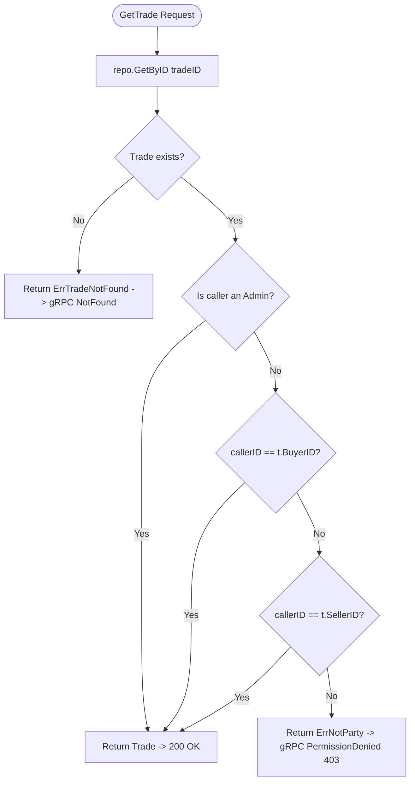
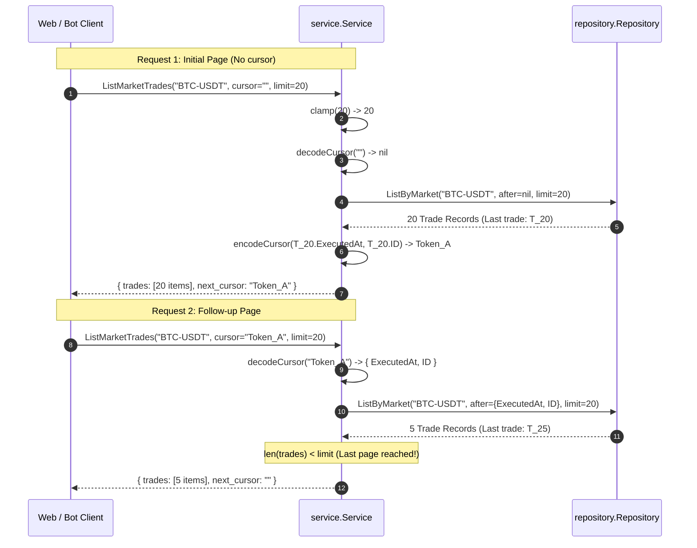

# Trade Service Domain Business Logic (`internal/service/service.go`)

## 1. Overview & Purpose

The `services/trade/internal/service/service.go` package implements the **core domain query logic, authorization rules, and pagination engine** for the Trade Service.

Sitting between the presentation layer (`internal/handler`) and the persistence layer (`internal/repository`), the service layer is responsible for:
- Enforcing counterparty authorization rules (**TI-8**).
- Defending against DoS attacks by clamping user-supplied query limits.
- Generating and parsing opaque, URL-safe base64 keyset pagination cursors.
- Decoupling business rules from database query syntax and gRPC protocol structures.

---

## 2. Problems This Package Solves

| Problem | How `service.go` Solves It |
|---|---|
| **Trade Privacy & Counterparty Protection (TI-8)** | Trading records contain proprietary execution details (account IDs, executed order IDs). `GetTrade()` checks if `callerUserID` equals `buyer_id` or `seller_id` (or if `isAdmin == true`). If an unrelated trader attempts to inspect another's trade, `ErrNotParty` is returned. |
| **Denial-of-Service via Excessive Page Sizes** | Without bounds, an attacker or runaway script could query `limit=500000`, causing out-of-memory crashes in the PostgreSQL pool. `clamp()` enforces hard bounds: User trades are clamped to `[1, 100]` (default 20); Market trades are clamped to `[1, 200]` (default 50). |
| **Leaking Database Internals via Pagination Tokens** | Exposing raw database timestamps or sequence numbers in API responses couples clients to internal DB schemas. `encodeCursor()` transforms `(ExecutedAt, ID)` into an **opaque URL-safe Base64 token** (`base64(unix_nanos + ":" + uuid)`). |
| **Phantom Next Pages** | Emits a non-empty `nextCursor` **only when** `len(trades) == limit`. If the database returned fewer rows than the requested limit, the caller has reached the end of the history, preventing redundant follow-up requests. |
| **Clock Resolution Collisions** | Uses **Unix Nanosecond precision** (`c.ExecutedAt.UnixNano()`) combined with the unique trade `UUID` as a deterministic tie-breaker, guaranteeing zero duplicate or skipped rows under concurrent high-frequency trading. |

---

## 3. Configuration Constants

```go
const (
    defaultUserLimit   = 20  // Default trades returned for user fill queries
    maxUserLimit       = 100 // Maximum trades allowed per user fill query page
    defaultMarketLimit = 50  // Default trades returned for public market tape
    maxMarketLimit     = 200 // Maximum trades allowed per public market tape page
)
```

---

## 4. Functions & Methods Breakdown

### 1. `GetTrade(ctx, tradeID, callerUserID, isAdmin) (*repository.Trade, error)`
* **Purpose**: Fetches a single trade by UUID and validates party membership.
* **Logic**:
  1. Fetches trade from `repo.GetByID(ctx, tradeID)`.
  2. If not found, bubbles up `repository.ErrTradeNotFound`.
  3. **TI-8 Check**:
     ```go
     if !isAdmin && callerUserID != t.BuyerID && callerUserID != t.SellerID {
         return nil, ErrNotParty
     }
     ```
  4. Returns the validated domain `Trade`.

---

### 2. `ListUserTrades(ctx, userID, marketID, cursorStr, limit) ([]repository.Trade, string, error)`
* **Purpose**: Returns the authenticated user's fill history, newest-first.
* **Logic**:
  1. Clamps `limit` using `clamp(int(limit), defaultUserLimit, maxUserLimit)`.
  2. Decodes `cursorStr` via `decodeCursor(cursorStr)`. If invalid, returns error.
  3. Calls `s.repo.ListByUser(ctx, userID, marketID, after, lim)`.
  4. If `len(trades) == lim`, serializes the last trade into `nextCursor` via `encodeCursor`.
  5. Returns trade slice and `nextCursor`.

---

### 3. `ListMarketTrades(ctx, marketID, cursorStr, limit) ([]repository.Trade, string, error)`
* **Purpose**: Returns public execution flow for a specific market ticker tape.
* **Logic**:
  1. Clamps `limit` using `clamp(int(limit), defaultMarketLimit, maxMarketLimit)`.
  2. Decodes `cursorStr` via `decodeCursor(cursorStr)`.
  3. Calls `s.repo.ListByMarket(ctx, marketID, after, lim)`.
  4. Encodes `nextCursor` if a full page was retrieved.
  5. Returns trades and `nextCursor`.

---

### 4. `encodeCursor(c repository.Cursor) string` (Private Helper)
* **Purpose**: Serializes a keyset cursor into an opaque URL-safe Base64 token.
* **Format**:
  ```text
  Raw String:   "<UnixNanoTimestamp>:<UUIDString>"
  Example Raw:  "1788417780453997000:9a711195-45cb-59af-967b-4fe80bf1180c"
  Base64 Token: "MTc4ODQxNzc4MDQ1Mzk5NzAwMDo5YTcxMTE5NS00NWNiLTU5YWYtOTY3Yi00ZmU4MGJmMTE4MGM"
  ```
* **Algorithm**: Uses `base64.RawURLEncoding` (no padding `=`), making it safely embeddable in HTTP URL query parameters without percent-encoding issues.

---

### 5. `decodeCursor(cursorStr string) (*repository.Cursor, error)` (Private Helper)
* **Purpose**: Deserializes and validates an opaque cursor string.
* **Logic**:
  1. If `cursorStr == ""` → returns `(nil, nil)` (represents initial page).
  2. Decodes `base64.RawURLEncoding`.
  3. Splits by colon (`:`) into timestamp nanos and UUID string.
  4. Parses nanoseconds into `time.Unix(0, nanos).UTC()`.
  5. Parses UUID string into `uuid.UUID`.
  6. Returns populated `*repository.Cursor`.

---

### 6. `clamp(limit, defaultLim, maxLim int) int` (Private Helper)
* **Purpose**: Pure mathematical boundary function:
  - If `limit <= 0` → returns `defaultLim`.
  - If `limit > maxLim` → returns `maxLim`.
  - Otherwise → returns `limit`.

---

## 5. Architectural Flows

### Flow A: TI-8 Counterparty Verification Flow



---

### Flow B: Keyset Pagination Lifecycle


