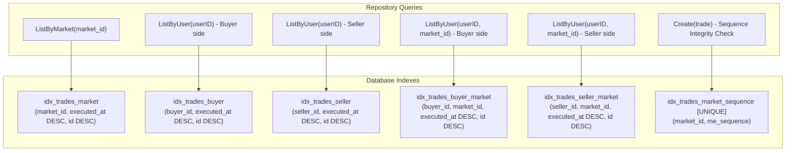
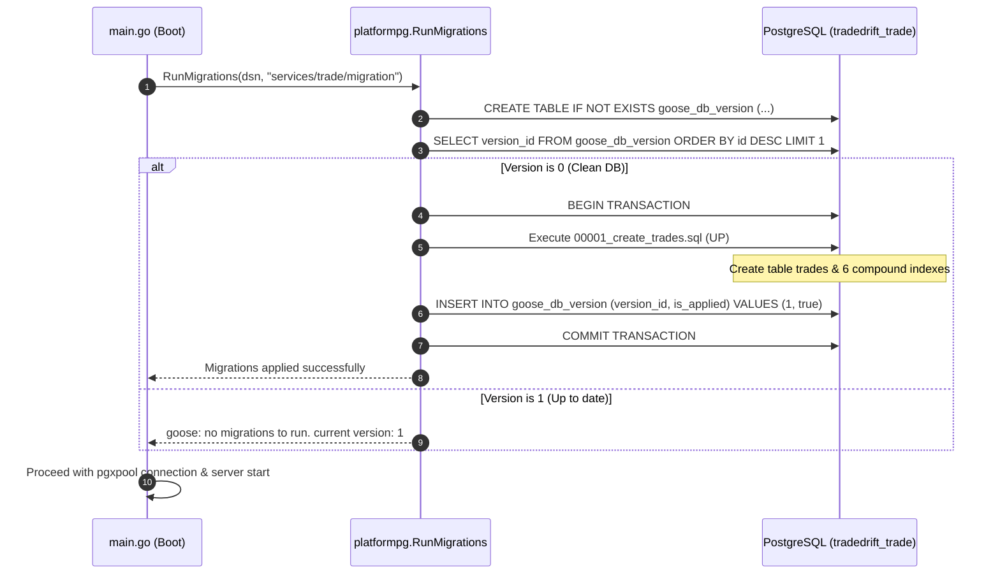

# Trade Service Database Migrations (`migration/00001_create_trades.sql`)

## 1. Overview & Purpose

The `services/trade/migration/` directory contains version-controlled database schema migrations managed by [Goose](https://github.com/pressly/goose).

The Trade Service database (`tradedrift_trade`) serves as the **immutable ledger of record** for all settled trades across all exchange markets. The migration file `00001_create_trades.sql`:
1. Constructs the primary append-only `trades` table with strict non-null and decimal constraints.
2. Creates compound B-Tree indexes optimized for keyset pagination on high-frequency trading streams.
3. Implements database-level integrity constraints (`idx_trades_market_sequence`) to catch rogue Matching Engine sequence anomalies.
4. Provides idempotent up/down migration paths for local development, testing, and production rollouts.

---

## 2. Problems This Migration Solves

| Problem | How This Migration Solves It |
|---|---|
| **Full Table Scans on High-Volume History** | Exchange trade tables quickly grow to millions of rows. Without specialized indexes, queries like `WHERE market_id = 'BTC-USDT' ORDER BY executed_at DESC` result in slow sequential scans. Compound indexes matching `(executed_at DESC, id DESC)` enable direct index seeks in $O(\log N)$ time. |
| **`OR` Clause Degradation in User Fill History** | Finding trades for a user requires checking both buyer and seller roles (`buyer_id = $1 OR seller_id = $1`). Rather than relying on slow bitmap scans, this migration provides dedicated indexes on `buyer_id` and `seller_id`, allowing the repository's `UNION ALL` query to execute two lightning-fast index seeks. |
| **Silent Monotonic Sequence Collisions** | The Matching Engine produces a strictly monotonic counter (`me_sequence`) per market. If a producer bug or corrupted event assigns an existing sequence to a new trade ID, the unique constraint `idx_trades_market_sequence` aborts the insertion at the database level with SQLSTATE `23505`. |
| **Floating-Point Precision Loss** | Financial currencies (crypto and fiat) cannot tolerate IEEE-754 binary floating-point rounding errors. Using `DECIMAL(30,10)` guarantees exact decimal arithmetic up to 10 decimal places. |
| **Audit Ambiguity (Execution vs Settlement Clock)** | Captures two distinct authoritative timestamps: `executed_at` (Matching Engine matching time) and `settled_at` (Wallet funds movement time) as timezone-aware `TIMESTAMPTZ` fields. |

---

## 3. Schema & Column Specifications

```sql
CREATE TABLE IF NOT EXISTS trades (
    id            UUID           PRIMARY KEY,
    buyer_id      UUID           NOT NULL,
    seller_id     UUID           NOT NULL,
    buy_order_id  UUID           NOT NULL,
    sell_order_id UUID           NOT NULL,
    market_id     VARCHAR(20)    NOT NULL,
    base_asset    VARCHAR(16)    NOT NULL,
    quote_asset   VARCHAR(16)    NOT NULL,
    price         DECIMAL(30,10) NOT NULL,
    quantity      DECIMAL(30,10) NOT NULL,
    me_sequence   BIGINT         NOT NULL,
    executed_at   TIMESTAMPTZ    NOT NULL,
    settled_at    TIMESTAMPTZ    NOT NULL
);
```

### Field Breakdown:

| Column | Data Type | Constraints | Description |
|---|---|---|---|
| `id` | `UUID` | `PRIMARY KEY` | Globally unique trade ID generated deterministically (UUIDv5) by Matching Engine. |
| `buyer_id` | `UUID` | `NOT NULL` | Account identifier of the buying user. |
| `seller_id` | `UUID` | `NOT NULL` | Account identifier of the selling user. |
| `buy_order_id` | `UUID` | `NOT NULL` | Order ID placed by the buyer. |
| `sell_order_id`| `UUID` | `NOT NULL` | Order ID placed by the seller. |
| `market_id` | `VARCHAR(20)` | `NOT NULL` | Standard market symbol (e.g. `BTC-USDT`, `ETH-USDT`). |
| `base_asset` | `VARCHAR(16)` | `NOT NULL` | The asset being bought/sold (e.g. `BTC`). |
| `quote_asset`| `VARCHAR(16)` | `NOT NULL` | The currency used for pricing (e.g. `USDT`). |
| `price` | `DECIMAL(30,10)`| `NOT NULL` | Exact execution price. |
| `quantity` | `DECIMAL(30,10)`| `NOT NULL` | Exact execution volume. |
| `me_sequence` | `BIGINT` | `NOT NULL` | Per-market monotonic counter from the Matching Engine ($> 0$). |
| `executed_at`| `TIMESTAMPTZ` | `NOT NULL` | Authoritative match timestamp from Matching Engine clock. |
| `settled_at` | `TIMESTAMPTZ` | `NOT NULL` | Balance settlement timestamp from Wallet Service clock. |

---

## 4. Index Architecture & Query Mapping

The migration establishes 6 specialized B-Tree indexes:



### Detailed Index Justifications:

1. **`idx_trades_market` (`market_id, executed_at DESC, id DESC`)**:
   - **Target**: Public trade tape endpoint `GET /api/v1/markets/:id/trades`.
   - **Benefit**: Enables keyset range scans `WHERE market_id = $1 AND (executed_at, id) < ($2, $3)` without requiring an in-memory sort (`Sort` step eliminated from EXPLAIN query plan).

2. **`idx_trades_buyer` & `idx_trades_seller` (`buyer_id / seller_id, executed_at DESC, id DESC`)**:
   - **Target**: All-market user trade history queries (`GET /api/v1/trades`).
   - **Benefit**: Powers the repository's `UNION ALL` scan, allowing both legs of the user query to execute index seeks simultaneously.

3. **`idx_trades_buyer_market` & `idx_trades_seller_market` (`buyer_id / seller_id, market_id, executed_at DESC, id DESC`)**:
   - **Target**: Market-filtered user trade history queries (`GET /api/v1/trades?market_id=BTC-USDT`).
   - **Benefit**: Limits index traversal exclusively to rows matching both the specific user and market symbol.

4. **`idx_trades_market_sequence` (`UNIQUE(market_id, me_sequence)`)**:
   - **Target**: Ingestion constraint during `repo.Create()`.
   - **Benefit**: Guarantees sequence uniqueness. Prevents outbox duplicates or re-ordering anomalies from violating the monotonic sequence invariant.

---

## 5. Migration Execution Flow

Goose migrations are executed programmatically at service boot inside `cmd/server/main.go` via `platformpg.RunMigrations()`:



---

## 6. Rollback Specification (`-- +goose Down`)

```sql
-- +goose Down
DROP TABLE IF EXISTS trades;
```
* **Purpose**: Completely teardowns the `trades` table and automatically cascades the removal of all dependent indexes (`idx_trades_*`), resetting the database schema to clean state for automated rollbacks and integration testing teardown.
