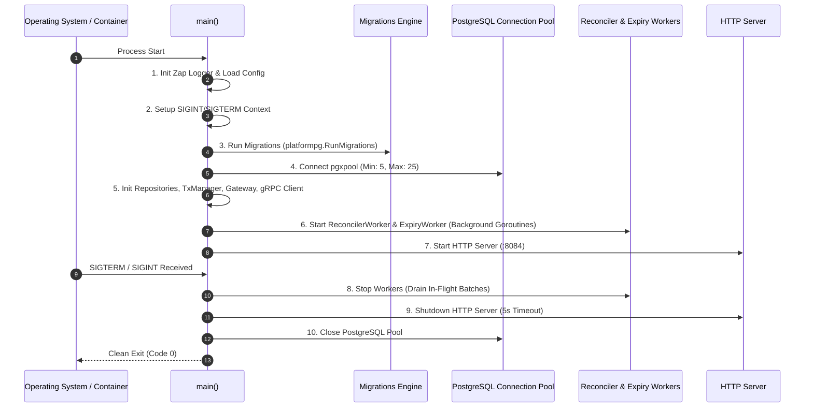

# Server Entrypoint Architecture (`cmd/server`)

The `cmd/server` package contains the binary entrypoint (`main.go`) for the **Wallet Top-Up Service**.

---

## 1. Directory Structure

```
cmd/server/
├── main.go                # Application bootstrap, dependency injection & graceful shutdown
└── README.md              # This architectural and operational documentation
```

---

## 2. Server Lifecycle & Bootstrap Sequence

`main.go` wires together the application using clean dependency injection and structured initialization.



---

## 3. Step-by-Step Initialization Pipeline

### 1. Structured Logging
Initializes Uber's `zap.NewProduction()` logger for high-throughput, structured JSON logging.

### 2. Configuration & Graceful Signal Context
Loads environment variables (`config.Load()`) and registers an interrupt listener using Go's modern signal context:
```go
ctx, stop := signal.NotifyContext(context.Background(), syscall.SIGINT, syscall.SIGTERM)
defer stop()
```

### 3. Automated Database Migrations
Locates the `migrations/` directory and applies all pending SQL schema migrations before starting server listeners.

### 4. PostgreSQL Connection Pool Tuning
Configures `pgxpool.Pool` with bounded connection parameters:
- `MaxConns = 25`: Prevents exhausting PostgreSQL database connection limits under high concurrency.
- `MinConns = 5`: Maintains warm, pre-allocated database connections for zero-latency burst requests.

### 5. Dependency Injection Wiring
- **Repositories**: `DailyLimitRepo`, `TopUpOrderRepo`, `WebhookEventRepo`.
- **Transaction Manager**: `PostgresTxManager`.
- **Payment Provider**: `MockPaymentProvider` (or production Razorpay provider) + `webhook.Verifier`.
- **Wallet gRPC Client**: Connects non-blockingly to `WalletService`. If the Core Wallet service is restarting, the top-up service starts anyway, and the reconciler will connect once available.
- **Domain Services**: `TopUpService`, `WebhookService`.

### 6. Asynchronous Background Workers
- **Reconciler Worker**: Polls `topup_orders` every 1 second, batching up to 50 orders with 60-second worker leases to credit USDT balances.
- **Expiry Worker**: Polls every 30 seconds, automatically expiring unpaid initiated orders and recovering reserved quota.

### 7. HTTP Server with Graceful Shutdown
Binds the router to port `8084` with strict 10-second `ReadTimeout` and `WriteTimeout` to prevent Slowloris attacks. When a shutdown signal is received:
1. Reconciler and Expiry workers stop accepting new batches and wait for in-flight tasks to complete (`wg.Wait()`).
2. HTTP server enters graceful draining with a 5-second deadline (`srv.Shutdown(shutdownCtx)`).
3. Database pools close cleanly.

---

## 4. Why We Need Specific Packages

| Package | Purpose & Problem Solved |
| :--- | :--- |
| `os/signal` & `syscall` | Catches POSIX signals (`SIGINT`, `SIGTERM`) from Kubernetes/Docker to initiate graceful teardown without terminating in-flight financial transactions. |
| `github.com/jackc/pgx/v5/pgxpool` | High-performance PostgreSQL connection pooling with prepared statement caching. |
| `go.uber.org/zap` | Zero-allocation structured JSON logger. |
| `tradedrift/platform/postgres` | Shared platform migration runner (`RunMigrations`). |
