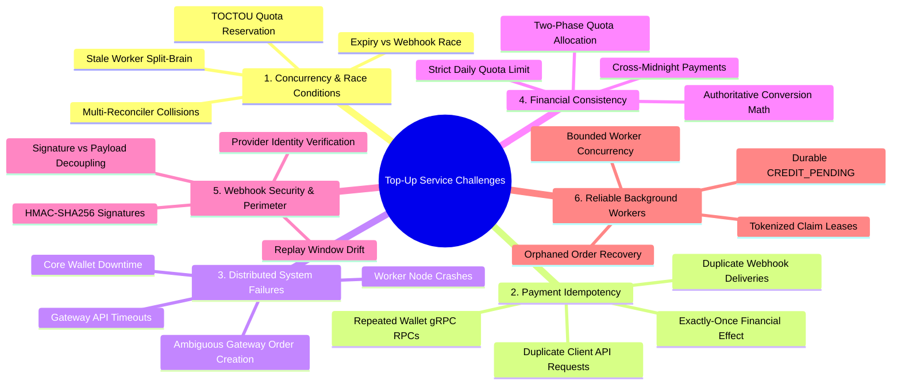

# Major Engineering Problems Faced While Building Wallet Top-Up Service

This document provides a comprehensive post-mortem and engineering breakdown of the **20 major problems, race conditions, and distributed systems edge-cases** encountered and solved while building the **Wallet Top-Up Service**, complete with code references and architectural analysis.

---

## High-Level Summary: The 6 Core Engineering Pillars



---

## Problem 1: Preventing Daily-Limit Bypass Through Concurrent Requests

### The Problem
If a user with a ₹10 limit fires three concurrent ₹10 requests simultaneously:
```text
                  CONCURRENT DAILY LIMIT RACE (TOCTOU)

         Request A (₹10)        Request B (₹10)        Request C (₹10)
                │                      │                      │
                └──────────────┬───────┴──────────────────────┘
                               │
                               ▼
               ┌───────────────────────────────┐
               │    PostgreSQL Row Lock on     │
               │   daily_topup_limits Record   │
               └───────────────┬───────────────┘
                               │
                 First Request Acquires Lock
                               │
                               ▼
               ┌───────────────────────────────┐
               │ UPDATE daily_topup_limits     │
               │ SET reserved_inr += 10        │
               │ WHERE (reserved+consumed+10)  │
               │       <= limit_inr (₹10)      │
               └───────────────┬───────────────┘
                               │
            ┌──────────────────┴──────────────────┐
            │                                     │
     First Request (Winner)            Next Requests (Losers)
            │                                     │
            ▼                                     ▼
      RowsAffected = 1                      RowsAffected = 0
     ₹10 quota reserved                    Quota exceeded!
            │                                     │
            ▼                                     ▼
      Order Created                         Tx Rolled Back
     HTTP 201 Created                      HTTP 429 Rate Limit
```
A naïve application check (`if remaining >= amount { createOrder(); reserve(); }`) causes a **Time-of-Check to Time-of-Use (TOCTOU)** race condition. All three requests read `remaining = 10` before any write occurs, allowing ₹30 to be deposited!

### How We Solved It in Code
1. **PostgreSQL Check Constraint**:
   In [migrations/00001_create_daily_quota_table.sql:L17](file:///c:/Users/AKHIL%20BABU/OneDrive/Desktop/tradedrift/services/wallet-topup/migrations/00001_create_daily_quota_table.sql#L17):
   ```sql
   CONSTRAINT chk_quota_ceiling CHECK (reserved_inr + consumed_inr <= limit_inr)
   ```
2. **Atomic Quota Reservation Query**:
   In [internal/repository/postgres/tx_manager.go:L353-L366](file:///c:/Users/AKHIL%20BABU/OneDrive/Desktop/tradedrift/services/wallet-topup/internal/repository/postgres/tx_manager.go#L353-L366):
   ```sql
   UPDATE daily_topup_limits
   SET reserved_inr = reserved_inr + $1,
       updated_at   = NOW()
   WHERE user_id    = $2
     AND usage_date = $3
     AND (reserved_inr + consumed_inr + $1) <= limit_inr;
   ```
   If `RowsAffected == 0`, `InitiateTopUpTx` returns `domain.ErrDailyLimitExceeded` before calling any external gateway.

---

## Problem 2: Idempotency for Duplicate Top-Up Requests

### The Problem
Clients retry requests due to network dropouts, API gateway retries, or users double-clicking the checkout button. Without idempotency, multiple orders and multiple credit attempts are generated.

```text
                   API CLIENT IDEMPOTENCY FLOW

                    Client POST /api/v1/topups
                    (user_id, idempotency_key = "abc-123")
                               │
                               ▼
                ┌───────────────────────────────┐
                │ Transactional Lock:           │
                │ SELECT id, inr_amount, status │
                │ FROM topup_orders             │
                │ WHERE user_id & key           │
                │ FOR UPDATE;                   │
                └──────────────┬────────────────┘
                               │
            ┌──────────────────┴──────────────────┐
            │                                     │
        Key Found                           Key Not Found
            │                                     │
     ┌──────┴──────┐                              ▼
     │             │                    Proceed to quota check
Same Amount   Diff Amount               & insert new order:
     │             │                    status = INITIATED
     ▼             ▼                              │
Return 200    Return 409 Conflict                 ▼
Existing      ErrIdempotencyConflict    UNIQUE (user_id, key)
Order                                   guarantees no duplicates
```

### How We Solved It in Code
1. **Unique Index**:
   In [migrations/00002_create_topup_orders_table.sql:L41](file:///c:/Users/AKHIL%20BABU/OneDrive/Desktop/tradedrift/services/wallet-topup/migrations/00002_create_topup_orders_table.sql#L41):
   ```sql
   CREATE UNIQUE INDEX idx_topup_user_idempotency ON topup_orders(user_id, idempotency_key);
   ```
2. **Transactional Lock & Conflict Detection**:
   In [internal/repository/postgres/tx_manager.go:L325-L339](file:///c:/Users/AKHIL%20BABU/OneDrive/Desktop/tradedrift/services/wallet-topup/internal/repository/postgres/tx_manager.go#L325-L339):
   - If key exists with the **same** amount $\to$ returns the existing order immediately without calling Razorpay.
   - If key is reused with a **different** amount $\to$ rejects with `domain.ErrIdempotencyConflict` (`HTTP 409 Conflict`).

---

## Problem 3: Webhook Duplication & Storms

### The Problem
Payment gateways retry webhooks aggressively until receiving an HTTP 200. Gateway network retries or network storms can send `payment.captured` 3 to 10 times. Processing each independently results in duplicate balance credits.

### How We Solved It in Code
1. **Partial Unique Index on Verified Events**:
   In [migrations/00003_create_webhook_events_table.sql:L20-L22](file:///c:/Users/AKHIL%20BABU/OneDrive/Desktop/tradedrift/services/wallet-topup/migrations/00003_create_webhook_events_table.sql#L20-L22):
   ```sql
   CREATE UNIQUE INDEX idx_webhook_verified_dedup 
       ON webhook_events(provider, event_id) 
       WHERE signature_valid = TRUE;
   ```
2. **In-Transaction Event Lock**:
   In [internal/repository/postgres/tx_manager.go:L48-L59](file:///c:/Users/AKHIL%20BABU/OneDrive/Desktop/tradedrift/services/wallet-topup/internal/repository/postgres/tx_manager.go#L48-L59):
   ```sql
   SELECT id, status FROM webhook_events WHERE provider = $1 AND event_id = $2 FOR UPDATE;
   ```
   If already `PROCESSED`, it immediately returns `AlreadyProcessed: true` and an HTTP 200 OK without touching quotas or wallet balances.

---

## Problem 4: Webhook Replay Attacks

### The Problem
An attacker capturing a valid, signed webhook packet could replay it days or weeks later to fraudulently trigger deposits.

```text
                   WEBHOOK PERIMETER SECURITY FLOW

                    Incoming Webhook Request
                    Header: X-Timestamp, X-Signature
                               │
                               ▼
                ┌───────────────────────────────┐
                │ Step 1: Replay Window Check   │
                │ |now - header_ts| <= 300s?    │
                └──────────────┬────────────────┘
                               │
            ┌──────────────────┴──────────────────┐
            │                                     │
          FALSE                                  TRUE
            │                                     │
            ▼                                     ▼
     HTTP 401 Unauthorized      ┌───────────────────────────────┐
     ErrWebhookReplay           │ Step 2: Signature Digest Check│
                                │ hmac.Equal(computed, header)  │
                                └──────────────┬────────────────┘
                                               │
                                ┌──────────────┴──────────────┐
                                │                             │
                              FALSE                          TRUE
                                │                             │
                                ▼                             ▼
                         HTTP 401 Unauthorized   ┌───────────────────────────────┐
                         ErrInvalidSignature     │ Step 3: Payload Coherence     │
                                                 │ |header_ts - paid_at| <= 5s?  │
                                                 └──────────────┬────────────────┘
                                                                │
                                                 ┌──────────────┴──────────────┐
                                                 │                             │
                                               FALSE                          TRUE
                                                 │                             │
                                                 ▼                             ▼
                                          HTTP 400 Bad Request         Proceed to DB Tx
```

### How We Solved It in Code
1. **Replay Window Enforcement**:
   In [internal/webhook/verifier.go:L31-L34](file:///c:/Users/AKHIL%20BABU/OneDrive/Desktop/tradedrift/services/wallet-topup/internal/webhook/verifier.go#L31-L34):
   ```go
   now := time.Now().Unix()
   if math.Abs(float64(now-timestamp)) > 300 {
       return domain.ErrWebhookReplay
   }
   ```
   Any webhook with a timestamp skewed by $> 300$ seconds (5 minutes) is rejected immediately.
2. **Header vs Payload Timestamp Cross-Check**:
   In [internal/service/webhook_service.go:L133-L140](file:///c:/Users/AKHIL%20BABU/OneDrive/Desktop/tradedrift/services/wallet-topup/internal/service/webhook_service.go#L133-L140):
   Checks that the unencrypted HTTP header timestamp matches the inner signed JSON payload timestamp ($|\Delta t| \le 5\text{s}$).

---

## Problem 5: Distinguishing Signature Validity from Payload Validity

### The Problem
A webhook may have a **valid cryptographic HMAC signature**, but contain an invalid business payload (e.g. amount mismatch, unsupported event type, or malformed JSON).
If we don't log it, we lose auditability. But if we log it as an unverified event, attackers could poison the deduplication index with fake event IDs.

### How We Solved It in Code
We decoupled cryptographic validity (`signature_valid`) from processing outcome (`status`):
In [internal/service/webhook_service.go:L244-L270](file:///c:/Users/AKHIL%20BABU/OneDrive/Desktop/tradedrift/services/wallet-topup/internal/service/webhook_service.go#L244-L270):
```go
ev := &domain.WebhookEvent{
    SignatureValid: true,
    Status:         domain.WebhookStatusFailed,
    ErrorMessage:   &errMsg,
}
```
Result: Cryptographic authenticity is preserved in audit logs, but bad payloads cannot transition order state or poison future events.

---

## Problem 6: Delayed Webhook Crossing Midnight

### The Problem
A user completes payment at 23:59:58 IST on September 10. Due to gateway queues, the webhook arrives at 00:00:15 IST on September 11.
If we use the webhook arrival time, the payment is attributed to September 11, incorrectly eating into September 11's daily quota!

### How We Solved It in Code
In [internal/service/webhook_service.go:L205-L206](file:///c:/Users/AKHIL%20BABU/OneDrive/Desktop/tradedrift/services/wallet-topup/internal/service/webhook_service.go#L205-L206):
```go
captureTimeIST := time.Unix(payload.PaidAt, 0).In(s.locIST)
paidDate := captureTimeIST.Format("2006-01-02")
```
The quota date is strictly determined by the payment gateway's authoritative capture timestamp (`paid_at`), evaluated in Indian Standard Time (`Asia/Kolkata`), never the arrival time of the webhook.

---

## Problem 7: Cross-Midnight Quota Accounting

### The Problem
When checkout spans midnight (e.g. reservation created at 23:55 on Day 1, payment captured at 00:05 on Day 2):
- The quota was reserved against Day 1.
- You cannot simply consume Day 2, or the user double-spends their quota.
- If Day 2 limit is already full, you cannot consume it.

```text
               CROSS-MIDNIGHT QUOTA ACCOUNTING FLOW

              Order Reserved: 23:55:00 IST (Day 1)
              Payment Captured: 00:02:00 IST (Day 2)
                               │
                               ▼
                ┌───────────────────────────────┐
                │ Capture Date Determination:   │
                │ paidDate = 2026-09-11 (Day 2) │
                │ reservationDate = 2026-09-10  │
                │ paidDate != reservationDate   │
                └──────────────┬────────────────┘
                               │
                               ▼
                ┌───────────────────────────────┐
                │ 1. Release Day 1 Reservation: │
                │    UPDATE Day 1 limit         │
                │    SET reserved_inr -= amount │
                └──────────────┬────────────────┘
                               │
                               ▼
                ┌───────────────────────────────┐
                │ 2. Ensure Day 2 Row Exists:   │
                │    INSERT ... ON CONFLICT     │
                └──────────────┬────────────────┘
                               │
                               ▼
                ┌───────────────────────────────┐
                │ 3. Attempt Day 2 Consumption: │
                │    UPDATE Day 2 limit         │
                │    SET consumed_inr += amount │
                │    WHERE consumed+amt <= limit│
                └──────────────┬────────────────┘
                               │
            ┌──────────────────┴──────────────────┐
            │                                     │
      RowsAffected = 1                      RowsAffected = 0
     (Day 2 has room)                     (Day 2 quota exhausted)
            │                                     │
            ▼                                     ▼
     status = CREDIT_PENDING               status = REFUND_REQUIRED
    (Proceed to wallet credit)            (Audited for payment refund)
```

### How We Solved It in Code
In [internal/repository/postgres/tx_manager.go:L172-L241](file:///c:/Users/AKHIL%20BABU/OneDrive/Desktop/tradedrift/services/wallet-topup/internal/repository/postgres/tx_manager.go#L172-L241):
1. **Release Day 1**: Decrements `reserved_inr` from Day 1.
2. **Ensure Day 2**: Creates Day 2 quota record if not present.
3. **Attempt Day 2 Consumption**:
   - If Day 2 has capacity $\to$ consumes Day 2 and sets `status = CREDIT_PENDING`.
   - If Day 2 is full $\to$ sets `status = REFUND_REQUIRED` (Day 1 quota released, Day 2 consumed is NOT incremented!).

---

## Problem 8: Payment Gateway Order Creation Ambiguity

### The Problem
When calling Razorpay `CreateOrder`:
```text
           PAYMENT GATEWAY TIMEOUT & QUOTA ROLLBACK

              Top-Up Service          Payment Gateway
                    │                        │
                    │ CreateOrder(order_id)  │
                    ├───────────────────────>│
                    │                        │ (Order created)
                    │  x Network Timeout     │
                    │< - - - - - - - - - - - ┤
                    │                        │
                    ▼                        │
          Initiate Order Error               │
                    │                        │
                    ▼                        │
         ┌─────────────────────┐             │
         │ CancelInitiatedTx   │             │
         │ status = FAILED     │             │
         │ release reserved_inr│             │
         └──────────┬──────────┘             │
                    │                        │
                    ▼                        ▼
           HTTP 502 Bad Gateway     If user ever pays, webhook
           Quota restored to user   detects FAILED -> REFUND_REQUIRED
```
Top-Up Service experiences a timeout and doesn't know if the order was created on Razorpay or not.

### How We Solved It in Code
1. **Deterministic Merchant Reference**:
   We pass our internal `orderID` (UUID) as the gateway receipt identifier.
2. **Atomic Rollback on Timeout**:
   In [internal/service/topup_service.go:L116-L126](file:///c:/Users/AKHIL%20BABU/OneDrive/Desktop/tradedrift/services/wallet-topup/internal/service/topup_service.go#L116-L126):
   If `CreateOrder` returns an error, `CancelInitiatedOrderTx` immediately transitions the order to `FAILED` and releases the user's reserved quota.

---

## Problem 9: Orphaned `INITIATED` Orders

### The Problem
If the service crashes after creating the database order in `INITIATED` state but before receiving the provider order ID, the order remains stuck in `INITIATED`, permanently locking the user's daily quota.

### How We Solved It in Code
1. **Expanded Partial Index**:
   In [migrations/00004_update_topup_expiry_index.sql:L3-L5](file:///c:/Users/AKHIL%20BABU/OneDrive/Desktop/tradedrift/services/wallet-topup/migrations/00004_update_topup_expiry_index.sql#L3-L5):
   ```sql
   CREATE INDEX idx_topup_expiry ON topup_orders(status, expires_at)
   WHERE status IN ('PAYMENT_PENDING', 'INITIATED');
   ```
2. **Unified Sweeper**:
   The background `ExpiryWorker` sweeps both `INITIATED` and `PAYMENT_PENDING` orders, safely releasing reserved quota for orphaned orders.

---

## Problem 10: Race Between Expiry and Webhook Confirmation

### The Problem
At the 15-minute mark, the user pays at the exact millisecond the expiry sweeper runs:
```text
           EXPIRY SWEEPER VS WEBHOOK RACE CONDITION

           ExpiryWorker                  Payment Webhook
       (Finds order > 15m)            (User Paid Checkout)
               │                                │
               │ SELECT FOR UPDATE              │ SELECT FOR UPDATE
               └───────────────┬────────────────┘
                               │
                     PostgreSQL Row Lock
                               │
            ┌──────────────────┴──────────────────┐
            │                                     │
    Webhook Locks First                  Expiry Locks First
            │                                     │
            ▼                                     ▼
   Order is PAYMENT_PENDING              Order is PAYMENT_PENDING
            │                                     │
   Transitions to:                       Transitions to:
   CREDIT_PENDING                        EXPIRED
            │                                     │
   Quota reserved -> consumed            Quota released to user
            │                                     │
   Tx Commits                            Tx Commits
            │                                     │
            ▼                                     ▼
   ExpiryWorker wakes up                 Webhook wakes up
            │                                     │
   Sees status=CREDIT_PENDING            Sees status=EXPIRED
   (Not in PAYMENT_PENDING)                       │
            │                            Transitions to:
   RowsAffected = 0                      REFUND_REQUIRED!
            │                                     │
   Graceful No-Op                        Safe & Audited for Refund
```
Without synchronization, quota could be released by expiry while the order is marked paid!

### How We Solved It in Code
1. **Row-Level Locking (`FOR UPDATE`)**:
   In [internal/repository/postgres/tx_manager.go:L90](file:///c:/Users/AKHIL%20BABU/OneDrive/Desktop/tradedrift/services/wallet-topup/internal/repository/postgres/tx_manager.go#L90), `ProcessPaymentConfirmationTx` locks the order row before making decisions.
2. **Terminal Status Handling**:
   If the expiry worker committed first, the webhook detects `order.Status == domain.StatusExpired` and automatically routes the order to `REFUND_REQUIRED` ([tx_manager.go:L117-L135](file:///c:/Users/AKHIL%20BABU/OneDrive/Desktop/tradedrift/services/wallet-topup/internal/repository/postgres/tx_manager.go#L117-L135)).

---

## Problem 11: Race Between Multiple Reconciler Workers

### The Problem
In Kubernetes, multiple pod replicas run the `ReconcilerWorker`. Multiple workers could query the same `CREDIT_PENDING` orders simultaneously, causing concurrent duplicate gRPC calls to the Wallet service.

### How We Solved It in Code
In [internal/repository/postgres/topup_order_repo.go:L161-L169](file:///c:/Users/AKHIL%20BABU/OneDrive/Desktop/tradedrift/services/wallet-topup/internal/repository/postgres/topup_order_repo.go#L161-L169):
```sql
SELECT id FROM topup_orders
WHERE status = 'CREDIT_PENDING'
   OR (status = 'CREDIT_PROCESSING' AND claim_until < NOW())
ORDER BY created_at ASC
LIMIT $1
FOR UPDATE SKIP LOCKED;
```
`SKIP LOCKED` instructs PostgreSQL to skip any rows already locked by another worker transaction without blocking.

---

## Problem 12: The Stale-Worker Problem & Fencing Tokens

### The Problem
Worker A claims Order 1 with a 60-second lease. Worker A experiences an 80-second GC pause.
1. Lease expires after 60s.
2. Worker B claims Order 1 and starts processing.
3. Worker A wakes up and attempts to complete Order 1. Without fencing, Worker A overwrites Worker B.

```text
           RECONCILER COLLISION PREVENTION & FENCING

       Worker A (Pod 1)                        Worker B (Pod 2)
              │                                       │
              ▼                                       ▼
  SELECT FOR UPDATE SKIP LOCKED           SELECT FOR UPDATE SKIP LOCKED
              │                                       │
  Claims Order 101                        Skips 101 (locked by A!)
  claim_token = Token_A                   Claims Order 102
  claim_until = T + 60s                   claim_token = Token_B
              │                                       │
      Tx Commits (Lease held)                 Tx Commits (Lease held)
              │                                       │
  Worker A has 90s GC pause                           │
  (Lease expires at T + 60s)                          │
              │                                       │
              │                      Worker B scans again at T + 65s
              │                      Finds Order 101 (lease expired!)
              │                      Claims Order 101
              │                      claim_token = Token_B2
              │                      claim_until = T + 125s
              │                                       │
              ▼                                       ▼
  Wakes up at T + 90s                     Worker B calls DepositFunds()
  Calls DepositFunds() (OK)               Wallet credit idempotent!
              │                                       │
  UPDATE topup_orders                     UPDATE topup_orders
  SET status = 'COMPLETED'                SET status = 'COMPLETED'
  WHERE claim_token = Token_A             WHERE claim_token = Token_B2
              │                                       │
  ┌───────────┴───────────┐               ┌───────────┴───────────┐
  │ Result: 0 ROWS        │               │ Result: 1 ROW         │
  │ Token mismatch!       │               │ Status = COMPLETED    │
  │ WORKER A FENCED OUT!  │               └───────────────────────┘
  └───────────────────────┘
```

### How We Solved It in Code
1. Worker generates a unique `workerToken` UUID ([reconciler.go:L88](file:///c:/Users/AKHIL%20BABU/OneDrive/Desktop/tradedrift/services/wallet-topup/internal/service/reconciler.go#L88)).
2. Status updates are strictly fenced by token ([topup_order_repo.go:L244](file:///c:/Users/AKHIL%20BABU/OneDrive/Desktop/tradedrift/services/wallet-topup/internal/repository/postgres/topup_order_repo.go#L244)):
   ```sql
   UPDATE topup_orders SET status = 'COMPLETED'
   WHERE id = $1 AND status = 'CREDIT_PROCESSING' AND claim_token = $2;
   ```
   If Worker B took over the order, Worker A's token matches 0 rows and Worker A is cleanly fenced out.

---

## Problem 13: Reconciler Lease Duration vs RPC Processing Time

### The Problem
Claiming a batch of 50 orders sequentially with a 10-second RPC timeout could take $50 \times 10\text{s} = 500\text{s}$. If the lease is 60 seconds, the lease expires on orders 7 through 50 before the worker even reaches them!

### How We Solved It in Code
In [internal/service/reconciler.go:L111-L181](file:///c:/Users/AKHIL%20BABU/OneDrive/Desktop/tradedrift/services/wallet-topup/internal/service/reconciler.go#L111-L181):
1. **Bounded Concurrency Pool**: Uses a counting semaphore `sem := make(chan struct{}, 5)` to process orders in parallel across 5 goroutines.
2. **Individual Context Timeouts**: Every RPC is wrapped in a 10s deadline (`context.WithTimeout(ctx, 10*time.Second)`).
Total batch completion time drops from 500s to $< 30\text{s}$, well within the 60s lease window.

---

## Problem 14: Core Wallet Service Downtime

### The Problem
Payment has been captured from the user's bank account, but the Core Wallet Service is temporarily restarting or experiencing network partition. If we tried to credit the wallet synchronously during the webhook, the webhook would fail and money could be lost.

### How We Solved It in Code
We decoupled webhook confirmation from wallet crediting:
1. Webhook moves order to durable `CREDIT_PENDING` in PostgreSQL and acknowledges HTTP 200 OK to the gateway.
2. The asynchronous `ReconcilerWorker` retries `DepositFunds` until the Wallet service recovers, ensuring zero lost deposits.

---

## Problem 15: At-Least-Once Delivery vs Exactly-Once Money

### The Problem
True "exactly-once delivery" does not exist in distributed systems due to network fallibility.

```text
              ASYNC DECOUPLING & EXACTLY-ONCE MONEY

   Incoming Webhook (payment.captured)
                 │
                 ▼
   ┌───────────────────────────┐
   │ Fast Path: Webhook Tx     │
   │ 1. Move to CREDIT_PENDING │
   │ 2. Shift daily quota      │
   │ 3. Return HTTP 200 to PGW │
   └─────────────┬─────────────┘
                 │ (Decoupled across failure domains)
                 ▼
   ┌───────────────────────────┐
   │ Core Wallet Downtime?     │
   │ Order safely persisted in │
   │ PostgreSQL CREDIT_PENDING │
   └─────────────┬─────────────┘
                 │
                 ▼
   ┌───────────────────────────┐
   │ Background Reconciler     │
   │ Retries on ticker         │
   │ DepositFunds(order_id)    │
   └─────────────┬─────────────┘
                 │
                 ▼
   ┌───────────────────────────┐
   │ Core Wallet Ledger        │
   │ UNIQUE (wallet_id,        │
   │         reference_id,     │
   │         reference_type)   │
   └─────────────┬─────────────┘
                 │
  ┌──────────────┴──────────────┐
  │                             │
First Attempt             Network Retry
  │                             │
  ▼                             ▼
New ledger row inserted   Existing transaction detected
Balance += 10,000 USDT    Returns existing receipt
                          Zero duplicate balance!
```
Downstream Core Wallet enforces `UNIQUE (wallet_id, reference_id, reference_type)` where `reference_id = orderID`. Retried RPCs simply return the existing transaction.

---

## Problem 16: Atomic Quota & Order State Transitions

### The Problem
Updating quota in `daily_topup_limits` and order state in `topup_orders` across separate database calls creates inconsistency if the server dies between the two updates (e.g. quota consumed, but order remains `PAYMENT_PENDING`).

### How We Solved It in Code
In [internal/repository/postgres/tx_manager.go:L39-L257](file:///c:/Users/AKHIL%20BABU/OneDrive/Desktop/tradedrift/services/wallet-topup/internal/repository/postgres/tx_manager.go#L39-L257), `ProcessPaymentConfirmationTx` wraps all steps in a single `tx.Begin(ctx)` ... `tx.Commit(ctx)` block.

---

## Problem 17: Provider Identity Mismatch

### The Problem
A webhook could submit a valid payment payload referencing an internal order that was created for a different provider (e.g. a Stripe webhook claiming a Razorpay order).

### How We Solved It in Code
In [internal/service/webhook_service.go:L181-L188](file:///c:/Users/AKHIL%20BABU/OneDrive/Desktop/tradedrift/services/wallet-topup/internal/service/webhook_service.go#L181-L188):
```go
if order.Provider != provider {
    return domain.ErrProviderMismatch
}
```
Rejects with `domain.ErrProviderMismatch` and audits the attempt.

---

## Problem 18: Exact Payment Amount Validation

### The Problem
A user creates a ₹5 top-up order, but manipulates the gateway client to pay ₹10. If unvalidated, the order completes with mismatched ledger records.

### How We Solved It in Code
In [internal/service/webhook_service.go:L198-L202](file:///c:/Users/AKHIL%20BABU/OneDrive/Desktop/tradedrift/services/wallet-topup/internal/service/webhook_service.go#L198-L202):
```go
if order.INRAmount != payload.INRAmount {
    return fmt.Errorf("amount mismatch: expected %d, got %d", order.INRAmount, payload.INRAmount)
}
```
The persisted database order remains the authoritative source of truth.

---

## Problem 19: Fixed INR $\to$ USDT Conversion Consistency

### The Problem
Floating point calculations or unconstrained inputs could introduce fractional rounding errors (e.g. ₹1 yielding 999.99999 USDT).

### How We Solved It in Code
1. **Database Check Constraint**:
   In [migrations/00002_create_topup_orders_table.sql:L35-L36](file:///c:/Users/AKHIL%20BABU/OneDrive/Desktop/tradedrift/services/wallet-topup/migrations/00002_create_topup_orders_table.sql#L35-L36):
   ```sql
   CONSTRAINT chk_topup_inr_amount CHECK (inr_amount BETWEEN 1 AND 10),
   CONSTRAINT chk_topup_usdt_amount CHECK (usdt_amount = inr_amount * 1000)
   ```
2. **Fixed-Point String Formatting**:
   In [internal/service/topup_service.go:L81](file:///c:/Users/AKHIL%20BABU/OneDrive/Desktop/tradedrift/services/wallet-topup/internal/service/topup_service.go#L81):
   `usdtAmount := fmt.Sprintf("%d.0000000000", inrAmount*1000)` guarantees high-precision string representations.

---

## Problem 20: Defense-in-Depth Database Invariants

### The Problem
Relying exclusively on application-level Go checks means that a bug, misconfigured service, or direct DB query could corrupt balances.

### How We Solved It in Code
We embedded the financial rules directly into the PostgreSQL schema:
- `chk_reserved_nonneg CHECK (reserved_inr >= 0)`
- `chk_consumed_nonneg CHECK (consumed_inr >= 0)`
- `chk_quota_ceiling CHECK (reserved_inr + consumed_inr <= limit_inr)`
- `uq_topup_provider_order UNIQUE (provider, provider_order_id)`
- `uq_topup_provider_payment UNIQUE (provider, payment_id)`

Any application bug attempting to break financial invariants is immediately stopped by the database engine.

---

## 🎯 Top 5 Interview Focus Areas

When discussing this service in technical interviews, focus on these 5 flagship problems:

1. **Preventing Double Credits Under Webhook Retries**: At-least-once webhook delivery coupled with ledger transaction idempotency `(wallet_id, reference_id, reference_type)`.
2. **The Race Between Expiry and Webhook Confirmation**: Pessimistic `FOR UPDATE` row locking and automated routing to `REFUND_REQUIRED` if the order was expired first.
3. **Reconciler Leases & Fencing Tokens**: Preventing stale workers from overwriting newer state using tokenized `claim_token` conditional updates.
4. **Cross-Midnight Quota Accounting**: Releasing Day 1 reservations and consuming Day 2 quotas atomically based on provider capture timestamps in IST.
5. **Zero Over-Deposit Races (TOCTOU)**: Atomic PostgreSQL update queries enforcing `reserved + consumed <= limit` at the engine level.
