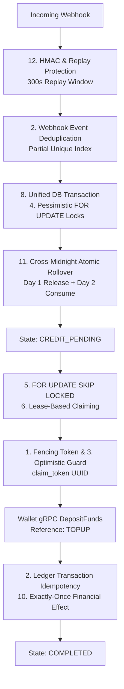

# Distributed Systems Engineering Techniques in Wallet Top-Up Service

This document provides an in-depth breakdown of the **12 distributed systems and financial correctness techniques** implemented across the `wallet-topup` microservice, with direct code references and explanations of how they protect against failure modes.

---

## Architecture Flow Overview



---

## 1. Fencing Tokens 🔐

### The Distributed Systems Problem
In distributed systems, background workers can experience unexpected delays (e.g. Stop-The-World garbage collection pauses, network partitions, slow VM hypervisor scheduling).
If Worker A claims an order, pauses for 90 seconds, and Worker B re-claims that order after Worker A's 60-second lease expires, Worker A might wake up and try to complete the order. Without fencing, Worker A could overwrite newer state or cause duplicate processing.

### How We Implemented It in Code

1. **Token Generation on Claim**:
   In [internal/service/reconciler.go](file:///c:/Users/AKHIL%20BABU/OneDrive/Desktop/tradedrift/services/wallet-topup/internal/service/reconciler.go#L88), every worker generates a cryptographically random UUID fencing token for each batch:
   ```go
   workerToken, err := platformuuid.New()
   ```

2. **Stamping the Lease Token in PostgreSQL**:
   In [internal/repository/postgres/topup_order_repo.go](file:///c:/Users/AKHIL%20BABU/OneDrive/Desktop/tradedrift/services/wallet-topup/internal/repository/postgres/topup_order_repo.go#L190-L200):
   ```sql
   UPDATE topup_orders
   SET status        = 'CREDIT_PROCESSING',
       claim_token   = $1,
       claimed_at    = NOW(),
       claim_until   = NOW() + ($2 * INTERVAL '1 millisecond'),
       attempt_count = attempt_count + 1,
       updated_at    = NOW()
   WHERE id = ANY($3);
   ```

3. **Fenced Finalization**:
   In [internal/repository/postgres/topup_order_repo.go](file:///c:/Users/AKHIL%20BABU/OneDrive/Desktop/tradedrift/services/wallet-topup/internal/repository/postgres/topup_order_repo.go#L237-L252):
   ```sql
   UPDATE topup_orders
   SET status       = 'COMPLETED',
       completed_at = NOW(),
       updated_at   = NOW()
   WHERE id          = $1
     AND status      = 'CREDIT_PROCESSING'
     AND claim_token = $2;
   ```
   If Worker A wakes up late, Worker B's token is already on the row. The `UPDATE` matches **0 rows**, and Worker A is cleanly fenced out!

---

## 2. Idempotency 🔁

### The Distributed Systems Problem
Networks are unreliable. HTTP requests, gateway webhooks, and gRPC RPCs will be lost, duplicated, or retried. Any financial operation must guarantee that executing the same operation $N$ times results in the exact same financial state as executing it once.

### Where We Implemented It in Code

We enforce idempotency across **four independent layers**:

| Layer | Code Location | Idempotency Scope | Behavior on Retry |
| :--- | :--- | :--- | :--- |
| **API Client** | [00002_create_topup_orders_table.sql:L41](file:///c:/Users/AKHIL%20BABU/OneDrive/Desktop/tradedrift/services/wallet-topup/migrations/00002_create_topup_orders_table.sql#L41) | `UNIQUE (user_id, idempotency_key)` | Returns existing order if amount matches; rejects with `409 Conflict` if amount differs ([topup_service.go:L103](file:///c:/Users/AKHIL%20BABU/OneDrive/Desktop/tradedrift/services/wallet-topup/internal/service/topup_service.go#L103)). |
| **Payment Gateway** | [00002_create_topup_orders_table.sql:L37-L38](file:///c:/Users/AKHIL%20BABU/OneDrive/Desktop/tradedrift/services/wallet-topup/migrations/00002_create_topup_orders_table.sql#L37-L38) | `UNIQUE (provider, provider_order_id)` & `UNIQUE (provider, payment_id)` | Prevents mapping a payment capture to multiple internal orders. |
| **Webhook Ingestion** | [00003_create_webhook_events_table.sql:L20-L22](file:///c:/Users/AKHIL%20BABU/OneDrive/Desktop/tradedrift/services/wallet-topup/migrations/00003_create_webhook_events_table.sql#L20-L22) | `UNIQUE (provider, event_id) WHERE signature_valid = TRUE` | Drops duplicate gateway webhook deliveries with an immediate HTTP 200 OK ([webhook_service.go:L227](file:///c:/Users/AKHIL%20BABU/OneDrive/Desktop/tradedrift/services/wallet-topup/internal/service/webhook_service.go#L227)). |
| **Wallet Ledger** | Downstream Core Wallet ([00009_allow_topup_reference_type.sql](file:///c:/Users/AKHIL%20BABU/OneDrive/Desktop/tradedrift/services/wallet/migration/00009_allow_topup_reference_type.sql)) | `UNIQUE (wallet_id, reference_id, reference_type)` | Passes `ReferenceId = order.ID` and `ReferenceType = "TOPUP"` ([wallet_client.go:L60](file:///c:/Users/AKHIL%20BABU/OneDrive/Desktop/tradedrift/services/wallet-topup/internal/client/wallet_client.go#L60)). Enabled by Wallet Migration 00009. Retried RPCs return the existing transaction. |


---

## 3. Optimistic Concurrency Control (OCC) 🛡️

### The Distributed Systems Problem
Pessimistic table locks held across network boundaries cripple performance. We want workers to execute long-running network operations (such as calling gRPC services) without holding database locks, but still guarantee that database state transitions remain safe.

### How We Implemented It in Code

We use conditional SQL `UPDATE` statements that act as **Compare-And-Swap (CAS)** primitives:

```sql
UPDATE topup_orders
SET status       = 'COMPLETED',
    completed_at = NOW(),
    updated_at   = NOW()
WHERE id          = $1
  AND status      = 'CREDIT_PROCESSING'
  AND claim_token = $2;
```

In Go ([topup_order_repo.go:L251](file:///c:/Users/AKHIL%20BABU/OneDrive/Desktop/tradedrift/services/wallet-topup/internal/repository/postgres/topup_order_repo.go#L251)):
```go
tag, err := r.db.Exec(ctx, query, orderID, workerToken)
if err != nil {
    return false, fmt.Errorf("failed to mark order completed: %w", err)
}
return tag.RowsAffected() == 1, nil
```
If `tag.RowsAffected() == 0`, the reconciler detects that the state changed under it and cleanly aborts without clobbering the database.

---

## 4. Pessimistic Locking 🔒

### The Distributed Systems Problem
When multiple transactions modify the same financial record concurrently (e.g. concurrent webhook confirmations and client queries), optimistic checks alone can lead to race conditions or deadlocks.

### How We Implemented It in Code

In [internal/repository/postgres/tx_manager.go:L85-L94](file:///c:/Users/AKHIL%20BABU/OneDrive/Desktop/tradedrift/services/wallet-topup/internal/repository/postgres/tx_manager.go#L85-L94), our payment confirmation transaction uses row-level exclusive locks:

```sql
SELECT id, user_id, idempotency_key, inr_amount, usdt_amount, reservation_date,
       provider, provider_order_id, payment_id, status
FROM topup_orders
WHERE id = $1
FOR UPDATE;
```

Additionally, in `InitiateTopUpTx` ([tx_manager.go:L325-L330](file:///c:/Users/AKHIL%20BABU/OneDrive/Desktop/tradedrift/services/wallet-topup/internal/repository/postgres/tx_manager.go#L325-L330)), idempotency checks lock the candidate order row:
```sql
SELECT id, inr_amount, status
FROM topup_orders
WHERE user_id = $1 AND idempotency_key = $2
FOR UPDATE;
```
This forces concurrent requests with the same key to queue sequentially, guaranteeing deterministic outcome.

---

## 5. `FOR UPDATE SKIP LOCKED` Worker Queues 🚀

### The Distributed Systems Problem
Traditional message brokers (Kafka/RabbitMQ) add operational complexity and partition management overhead. Using a database table as a queue usually suffers from row-lock contention: if Worker 1 locks Row 1, Worker 2 blocks until Worker 1 finishes.

### How We Implemented It in Code

In [internal/repository/postgres/topup_order_repo.go:L161-L169](file:///c:/Users/AKHIL%20BABU/OneDrive/Desktop/tradedrift/services/wallet-topup/internal/repository/postgres/topup_order_repo.go#L161-L169):

```sql
SELECT id
FROM topup_orders
WHERE status = 'CREDIT_PENDING'
   OR (status = 'CREDIT_PROCESSING' AND claim_until < NOW())
ORDER BY created_at ASC
LIMIT $1
FOR UPDATE SKIP LOCKED;
```

#### How it works across workers:
```text
                  FOR UPDATE SKIP LOCKED PIPELINE

                  ┌───────────────────────────────┐
                  │   PostgreSQL topup_orders     │
                  │   [Order 1, 2, 3, 4, 5, 6]    │
                  └───────────────┬───────────────┘
                                  │
         ┌────────────────────────┴────────────────────────┐
         │                                                 │
         ▼                                                 ▼
   Worker A (Replica 1)                              Worker B (Replica 2)
┌──────────────────────┐                          ┌──────────────────────┐
│ SELECT FOR UPDATE    │                          │ SELECT FOR UPDATE    │
│ SKIP LOCKED LIMIT 2  │                          │ SKIP LOCKED LIMIT 2  │
└──────────┬───────────┘                          └──────────┬───────────┘
           │                                                 │
           ▼                                                 ▼
Locks [Order 1, Order 2]                          Skips [Order 1, Order 2]
Stamps Lease Token A                              Locks [Order 3, Order 4]
           │                                      Stamps Lease Token B
           ▼                                                 │
Dispatches Wallet RPC                             Dispatches Wallet RPC
(Orders 1 & 2)                                    (Orders 3 & 4)
```
Zero lock contention. Maximum parallelism across multiple service replicas.

---

## 6. Lease-Based Processing ⏱️

### The Distributed Systems Problem
If a background worker claims an order and immediately crashes (OOM killed, pod rescheduled, host panic), that order must not remain locked forever in `CREDIT_PROCESSING`.

### How We Implemented It in Code

1. **Lease Timestamp**:
   Orders are claimed with a time-limited lease ([topup_order_repo.go:L195](file:///c:/Users/AKHIL%20BABU/OneDrive/Desktop/tradedrift/services/wallet-topup/internal/repository/postgres/topup_order_repo.go#L195)):
   ```sql
   claim_until = NOW() + ($2 * INTERVAL '1 millisecond')
   ```
   (Default: 60 seconds).

2. **Re-Claiming Expired Leases**:
   The claim query explicitly checks for expired leases:
   ```sql
   WHERE status = 'CREDIT_PENDING'
      OR (status = 'CREDIT_PROCESSING' AND claim_until < NOW())
   ```
   If Worker 1 dies, Worker 2 automatically re-claims the order once `claim_until` passes.

---

## 7. Finite State Machine (FSM) 🚦

### The Distributed Systems Problem
Payment workflows must disallow illegal transitions (e.g. `COMPLETED` $\to$ `PAYMENT_PENDING`, or modifying an order that has already been refunded).

### How We Implemented It in Code

1. **PostgreSQL Check Constraint**:
   Defined in [00002_create_topup_orders_table.sql:L15-L25](file:///c:/Users/AKHIL%20BABU/OneDrive/Desktop/tradedrift/services/wallet-topup/migrations/00002_create_topup_orders_table.sql#L15-L25):
   ```sql
   CHECK (status IN (
       'INITIATED',
       'PAYMENT_PENDING',
       'CREDIT_PENDING',
       'CREDIT_PROCESSING',
       'COMPLETED',
       'FAILED',
       'EXPIRED',
       'REFUND_REQUIRED'
   ))
   ```

2. **Guarded State Transitions**:
   In [topup_order_repo.go:L273-L291](file:///c:/Users/AKHIL%20BABU/OneDrive/Desktop/tradedrift/services/wallet-topup/internal/repository/postgres/topup_order_repo.go#L273-L291):
   ```sql
   UPDATE topup_orders
   SET status     = 'CREDIT_PENDING',
       payment_id = $1,
       updated_at = NOW()
   WHERE id       = $2
     AND status   = 'PAYMENT_PENDING'
     AND provider = $3;
   ```
   If the order is already `COMPLETED` or `FAILED`, `RowsAffected == 0`, and the code returns `domain.ErrOrderTerminalStatus`.

---

## 8. Transactional State Transitions ⚛️

### The Distributed Systems Problem
Webhook confirmation modifies three distinct database entities:
1. Deduplication log in `webhook_events`
2. Financial quota in `daily_topup_limits`
3. Lifecycle state in `topup_orders`

Updating them in separate queries causes split-brain state if the process crashes midway (e.g. quota consumed, but order remains `PAYMENT_PENDING`).

### How We Implemented It in Code

In [internal/repository/postgres/tx_manager.go:L28-L263](file:///c:/Users/AKHIL%20BABU/OneDrive/Desktop/tradedrift/services/wallet-topup/internal/repository/postgres/tx_manager.go#L28-L263), `ProcessPaymentConfirmationTx` executes all changes inside a **single atomic transaction**:

```text
               POSTGRESQL UNIFIED TRANSACTION BOUNDARY

                      BEGIN TRANSACTION (tx)
                                │
                                ▼
               ┌─────────────────────────────────┐
               │ 1. Lock & Dedup webhook_events  │
               │    SELECT event_id FOR UPDATE   │
               └────────────────┬────────────────┘
                                │
                                ▼
               ┌─────────────────────────────────┐
               │ 2. Lock topup_orders Row        │
               │    SELECT order_id FOR UPDATE   │
               └────────────────┬────────────────┘
                                │
                                ▼
               ┌─────────────────────────────────┐
               │ 3. Shift Daily Quota            │
               │    reserved -= amt              │
               │    consumed += amt              │
               └────────────────┬────────────────┘
                                │
                                ▼
               ┌─────────────────────────────────┐
               │ 4. Move Order State             │
               │    status = 'CREDIT_PENDING'    │
               └────────────────┬────────────────┘
                                │
                                ▼
               ┌─────────────────────────────────┐
               │ 5. Mark Webhook Processed       │
               │    status = 'PROCESSED'         │
               └────────────────┬────────────────┘
                                │
                                ▼
                      COMMIT TRANSACTION (tx)
```
If any statement fails, PostgreSQL rolls back everything. Zero balance leaks.

---

## 9. Transactional Outbox Pattern & Microservice Decoupling 📬

### The Distributed Systems Problem
A microservice cannot atomically write to a local database and publish to Kafka/gRPC in one transaction (the **Dual-Write Problem**). If the DB write succeeds and the network fails, money is lost or events are dropped.

### How We Implemented It in Code

1. **Top-Up Side**:
   The webhook service **never calls the Core Wallet directly**. It only writes `CREDIT_PENDING` to PostgreSQL inside the database transaction.
2. **Asynchronous Dispatch**:
   The `ReconcilerWorker` acts as the outbox dispatcher, reading `CREDIT_PENDING` orders and calling Wallet gRPC asynchronously.
3. **Wallet Side**:
   The Core Wallet Service uses a transactional outbox table (`outbox_events`) with its own claim tokens to publish events to Kafka, guaranteeing that ledger updates and Kafka events are 100% synchronized.

---

## 10. Exactly-Once Financial Effect 🎯

### The Distributed Systems Problem
In real-world networks, true "exactly-once delivery" is impossible due to the Two Generals' Problem. Gateways retry webhooks; workers retry RPC calls.

### How We Implemented It in Code

We achieve **exactly-once financial effect** by pairing **at-least-once delivery** with **idempotent consumption**:

```
Gateway Webhook (At-Least-Once Delivery)
       ↓
Webhook Deduplication (idempotent 200 OK)
       ↓
Reconciler gRPC Call (At-Least-Once Delivery)
       ↓
Wallet DepositFunds (Idempotent Ledger Deposit via unique key)
       ↓
Result: Exactly-Once Balance Increment (+10,000 USDT)
```

Even if the gateway sends 5 duplicate webhooks and the reconciler retries the RPC 3 times, the user's wallet is credited exactly once.

---

## 11. Cross-Midnight Atomic Rollover 🌙

### The Distributed Systems Problem
A user reserves quota at 23:59:50 on Monday (Day 1). The payment gateway captures the payment at 00:00:15 on Tuesday (Day 2).
- You cannot simply mark Day 1 consumed because the financial capture occurred on Day 2.
- You cannot blindly consume Day 2 without releasing Day 1, or the user is charged twice against their limit.
- If Day 2's quota is already full, you cannot consume it.

### How We Implemented It in Code

In [internal/repository/postgres/tx_manager.go:L172-L241](file:///c:/Users/AKHIL%20BABU/OneDrive/Desktop/tradedrift/services/wallet-topup/internal/repository/postgres/tx_manager.go#L172-L241):

```go
if order.ReservationDate == paidDate {
    // Same-day: shift reserved -> consumed atomically
} else {
    // Cross-midnight:
    // 1. Release Day 1 reserved quota:
    //    UPDATE daily_topup_limits SET reserved_inr = reserved_inr - $1 WHERE usage_date = Day1
    
    // 2. Ensure Day 2 record exists:
    //    INSERT INTO daily_topup_limits (user_id, usage_date, limit_inr, ...) ON CONFLICT DO NOTHING
    
    // 3. Attempt Day 2 consumption:
    //    UPDATE daily_topup_limits SET consumed_inr = consumed_inr + $1 WHERE (reserved + consumed + $1) <= limit
    
    if tag.RowsAffected() == 1 {
        // Day 2 has capacity -> Move to CREDIT_PENDING
    } else {
        // Day 2 is full -> Move to REFUND_REQUIRED (Day 1 quota released, Day 2 consumed NOT incremented!)
    }
}
```

---

## 12. Replay Protection 🛡️

### The Distributed Systems Problem
If an attacker intercepts a legitimate, cryptographically signed webhook payload from months ago, they could resend it to trick the server into minting money.

### How We Implemented It in Code

We implement **three complementary defenses**:

1. **Replay Drift Window (300 Seconds)**:
   In [internal/webhook/verifier.go:L31-L34](file:///c:/Users/AKHIL%20BABU/OneDrive/Desktop/tradedrift/services/wallet-topup/internal/webhook/verifier.go#L31-L34):
   ```go
   now := time.Now().Unix()
   if math.Abs(float64(now-timestamp)) > 300 {
       return domain.ErrWebhookReplay
   }
   ```
2. **Header vs Payload Skew Defense**:
   In [internal/service/webhook_service.go:L133-L141](file:///c:/Users/AKHIL%20BABU/OneDrive/Desktop/tradedrift/services/wallet-topup/internal/service/webhook_service.go#L133-L141):
   Checks that the HTTP header timestamp matches the timestamp inside the signed JSON payload ($|\Delta t| \le 5\text{s}$), defeating header-tampering attacks.
3. **Deduplication Audit Log**:
   Once verified, the event is saved to `webhook_events` with unique constraint `(provider, event_id) WHERE signature_valid = TRUE`. Future replays are immediately rejected.
