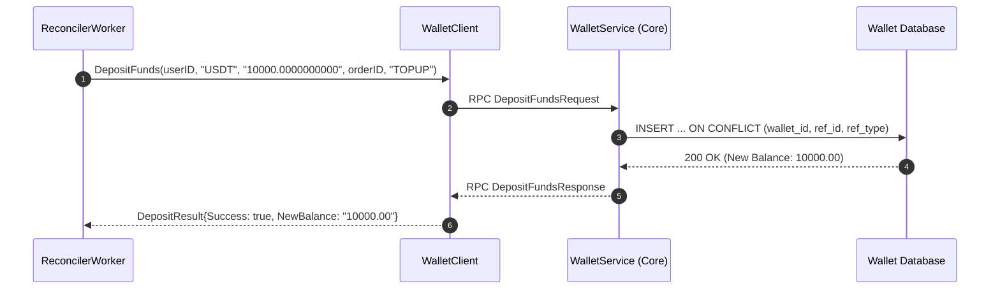

# Client Layer Architecture (`internal/client`)

The `internal/client` package manages outbound RPC communication from the **Wallet Top-Up Service** to other microservices in the TradeDrift platform.

---

## 1. Directory Structure

```
internal/client/
├── wallet_client.go       # gRPC client adapter for WalletService
└── README.md              # This architectural and technical documentation
```

---

## 2. File Purpose & Problem Breakdown

### File: `wallet_client.go`

#### What Problems Does This File Solve?
1. **Decouples Core Ledger from Top-Up Service**:
   The top-up service never touches the `wallets` or `wallet_transactions` tables directly. Instead, all ledger increments happen via the strongly-typed, auditable `WalletService.DepositFunds` gRPC interface.
2. **Double-Credit Immunity**:
   When `DepositFunds` is called, it passes:
   - `ReferenceID`: The top-up `orderID`
   - `ReferenceType`: `"TOPUP"`
   
   The Core Wallet Service enforces a database unique constraint on `(wallet_id, reference_id, reference_type)`. If a network glitch causes the reconciler to retry an already-completed RPC call, the Core Wallet returns the existing transaction without double-crediting the balance.
3. **Flexible Dependency Injection for Tests**:
   Provides constructors that accept either a network address (`NewWalletClient`), a pre-configured connection (`NewWalletClientWithConn`), or a mock gRPC interface (`NewWalletClientWithServiceClient`). This allows unit tests to run in-memory without launching external gRPC servers.

---

## 3. Struct & Function Breakdown

### Structs

```go
type WalletClient struct {
	client walletv1.WalletServiceClient
	conn   *grpc.ClientConn
}

type DepositResult struct {
	Success       bool
	TransactionID string
	NewBalance    string
}
```

---

### Functions

| Function | Purpose | Implementation Detail |
| :--- | :--- | :--- |
| `NewWalletClient(grpcAddr string)` | Connects to the Wallet gRPC server at `grpcAddr`. | Uses `grpc.Dial` with `insecure.NewCredentials()` for internal service mesh communication. |
| `NewWalletClientWithConn(conn)` | Injects an existing `*grpc.ClientConn`. | Used in integration test suites that share a single in-process connection. |
| `NewWalletClientWithServiceClient(c)` | Injects a mock client interface. | Used in unit tests where no network connection exists. |
| `Close()` | Safely closes the underlying gRPC connection pool. | Called during server graceful shutdown. |
| `DepositFunds(ctx, userID, asset, amount, refID, refType)` | Calls the remote `DepositFunds` RPC on Core Wallet Service. | Formats request protobuf, invokes RPC, checks for nil response, and returns normalized `DepositResult`. |

---

## 4. Why We Need Specific Packages

| Package | Purpose & Problem Solved |
| :--- | :--- |
| `google.golang.org/grpc` | Industry-standard RPC framework providing HTTP/2 multiplexing, keep-alives, connection pooling, and automatic reconnections. |
| `google.golang.org/grpc/credentials/insecure` | Disables TLS verification for fast, internal service-to-service communication inside Kubernetes or Docker private networks. |
| `tradedrift/platform/api/gen/wallet/v1` | Protobuf-generated client interfaces guaranteeing binary compatibility with the Wallet microservice. |
| `context` | Propagates request deadlines (e.g. 10-second timeout) so slow ledger calls do not hang reconciler workers indefinitely. |

---

## 5. Upstream Wallet Service Integration & Migration 00009

To support top-up crediting without compromising financial consistency, the following changes were implemented in the Core **Wallet Service** (`services/wallet`):

1. **Migration `00009_allow_topup_reference_type.sql`**:
   The Core Wallet's `wallet_transactions_reference_type_check` table constraint was extended to include `'TOPUP'`:
   ```sql
   ALTER TABLE wallet_transactions DROP CONSTRAINT IF EXISTS wallet_transactions_reference_type_check;
   ALTER TABLE wallet_transactions ADD CONSTRAINT wallet_transactions_reference_type_check
       CHECK (reference_type IN (
           'INITIAL_ALLOCATION', 'RESERVATION', 'RELEASE',
           'SETTLEMENT', 'DEPOSIT', 'TOPUP', 'WITHDRAWAL'
       ));
   ```
2. **Repository Constant `RefTopUp`**:
   In `services/wallet/internal/repository/constants.go`:
   ```go
   RefTopUp = "TOPUP" // Wallet Top-Up deposit
   ```
3. **Database-Enforced Idempotency Anchor**:
   Core Wallet enforces `UNIQUE (wallet_id, reference_id, reference_type)` on `wallet_transactions`. When `wallet-topup` passes `reference_id = topup_id` and `reference_type = "TOPUP"`, the wallet database engine guarantees that a given top-up order is credited **at most once**, even under aggressive reconciler worker retries.

---

## 6. Interaction Flow & RPC Lifecycle

```text
               RECONCILER TO WALLET SERVICE RPC PIPELINE

       Wallet-Topup Reconciler                  Core Wallet Service
                 │                                       │
                 │ 1. DepositFunds()                     │
                 │    userID, "USDT", amount             │
                 │    ref_id = topup_order_id            │
                 │    ref_type = "TOPUP"                 │
                 ├──────────────────────────────────────>│
                 │                                       ▼
                 │                       ┌───────────────────────────────┐
                 │                       │ Step A: Validate "USDT" Asset │
                 │                       │ Decimal Scale Check (<= 10)   │
                 │                       └───────────────┬───────────────┘
                 │                                       │
                 │                                       ▼
                 │                       ┌───────────────────────────────┐
                 │                       │ Step B: Check Existing Txn    │
                 │                       │ SELECT FROM wallet_txns       │
                 │                       │ WHERE wallet & ref_id & "TOPUP│
                 │                       └───────────────┬───────────────┘
                 │                                       │
                 │                        ┌──────────────┴──────────────┐
                 │                        │                             │
                 │                    Key Exists                    Key Is New
                 │                        │                             │
                 │                        ▼                             ▼
                 │                 Return Existing            ┌───────────────────┐
                 │                 Receipt & Balance          │ Begin DB Tx       │
                 │                        │                   │ Lock Wallet Row   │
                 │                        │                   │ Increment Balance │
                 │                        │                   │ Insert Txn Row    │
                 │                        │                   │ Commit DB Tx      │
                 │                        │                   └─────────┬─────────┘
                 │                        │                             │
                 │<───────────────────────┴─────────────────────────────┘
                 │ 2. DepositResult { Success: true, NewBalance: "..." }
                 ▼
     Mark Order COMPLETED
     WHERE claim_token = workerToken
```


