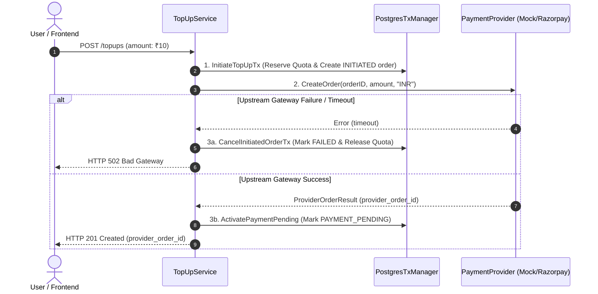

# Payment Layer Architecture (`internal/payment`)

The `internal/payment` package abstracts external fiat payment gateways (such as Razorpay, Stripe, or Cashfree) and provides a mock implementation for automated testing.

---

## 1. Directory Structure

```
internal/payment/
├── provider.go            # PaymentProvider interface and data transfer objects
├── README.md              # This architectural and technical documentation
└── mock/
    └── mock_provider.go   # Thread-safe mock implementation for unit & concurrency testing
```

---

## 2. File-by-File Purpose & Problem Breakdown

### File 1: `provider.go`

#### What Problem Does This File Solve?
1. **Prevents Gateway Vendor Lock-In**: Direct coupling with vendor SDKs (e.g. Razorpay Go SDK) leaks gateway-specific structs, error types, and naming conventions into domain services. If the business switches from Razorpay to Stripe or adds Cashfree, zero lines of business logic should change.
2. **Standardizes Order Creation Contracts**: Unifies how payment orders are initiated upstream regardless of whether the gateway calls them `order_id`, `payment_intent`, or `checkout_session`.
3. **Encapsulates Cryptographic Verification**: Different gateways sign payloads differently (some sign just the raw payload, others prefix with a Unix timestamp). The `PaymentProvider` interface abstracts this detail.

#### Struct & Interface Details

##### 1. `ProviderOrderResult`
```go
type ProviderOrderResult struct {
	ProviderOrderID string // External identifier returned by the gateway (e.g. "order_EKZ98Z")
	AmountINR       int64  // Confirmed amount in fiat paise
	Currency        string // E.g., "INR"
}
```

##### 2. `PaymentProvider` Interface
```go
type PaymentProvider interface {
	ProviderName() string
	CreateOrder(ctx context.Context, orderID string, amountINR int64, currency string) (*ProviderOrderResult, error)
	VerifySignature(payload []byte, signature string, timestamp int64) bool
}
```

- `ProviderName() string`: Returns the gateway identifier (e.g., `"MOCK"`, `"RAZORPAY"`). Used by the webhook verifier and routing tables.
- `CreateOrder(...)`: Initiates a checkout order with the external gateway so a checkout link or SDK token can be rendered on the client UI.
- `VerifySignature(...)`: Validates that an incoming webhook genuinely originated from this payment provider.

---

### File 2: `mock/mock_provider.go`

#### What Problem Does This File Solve?
1. **Isolated, Deterministic Testing**: Running unit and integration tests against real third-party sandbox APIs introduces network flakes, rate limits, latency, and required secret configurations in CI/CD pipelines. The mock provider enables instantaneous, 100% deterministic test execution.
2. **Fault Injection & Chaos Testing**: To test what happens when Razorpay drops a connection or times out, `mock_provider.go` provides `FailNextCreateOrder`. This allows tests to verify that our `CancelInitiatedOrderTx` transaction properly rolls back the order to `FAILED` and releases the user's reserved daily quota.
3. **Cryptographic Test Harness**: It implements real HMAC-SHA256 signature generation so integration tests can send actual HTTP webhook requests and test signature verification end-to-end.

#### Struct & Function Breakdown

```go
type MockPaymentProvider struct {
	name                string
	secret              string
	mu                  sync.Mutex
	FailNextCreateOrder bool
}
```

| Function | Purpose | Implementation Mechanism |
| :--- | :--- | :--- |
| `NewMockPaymentProvider(secret)` | Constructs a default mock provider with name `"MOCK"`. | Initializes struct with shared secret. |
| `NewNamedMockPaymentProvider(name, secret)` | Constructs a mock provider with a custom name (e.g. `"RAZORPAY"`). | Used to test multi-provider routing and provider-mismatch errors. |
| `ProviderName()` | Returns the provider name. | Returns `"MOCK"` or custom name. |
| `SetFailNextCreateOrder(fail bool)` | Injects a simulated upstream timeout on the next call. | Thread-safe with `mu.Lock()`. |
| `CreateOrder(...)` | Returns a mock external order ID formatted as `mock_order_<orderID>`. | If `FailNextCreateOrder` is true, resets the flag and returns an upstream timeout error. |
| `GenerateSignature(payload, timestamp)` | Generates a valid HMAC-SHA256 signature for test payloads. | Creates HMAC with `secret`, hashes `timestamp.payload`, and encodes as hex. |
| `VerifySignature(payload, signature, timestamp)` | Checks if the given signature matches the expected HMAC digest. | Uses `crypto/hmac.Equal` for constant-time comparison. |

---

## 3. Why We Need Specific Packages

| Package | Purpose & Problem Solved |
| :--- | :--- |
| `crypto/hmac` | **Prevents Timing Attacks**: In cryptographic verification, using standard string comparison (`sigA == sigB`) terminates on the first mismatched byte. An attacker can measure nanosecond response variations to guess signatures character by character. `hmac.Equal()` compares bytes in **constant time**, defeating timing attacks. |
| `crypto/sha256` | Provides the SHA-256 cryptographic hashing primitive specified by standard payment gateways. |
| `encoding/hex` | Decodes/encodes raw binary hash digests into readable hexadecimal ASCII strings (e.g. `4f5a...`). |
| `sync.Mutex` | **Race Condition Safety**: Parallel unit test routines may execute `SetFailNextCreateOrder()` concurrently with `CreateOrder()`. The mutex guarantees thread safety under `go test -race`. |
| `context.Context` | Allows upstream cancellations and HTTP request deadlines to be propagated to external API calls. |

---

## 4. Architectural Interaction Flow


