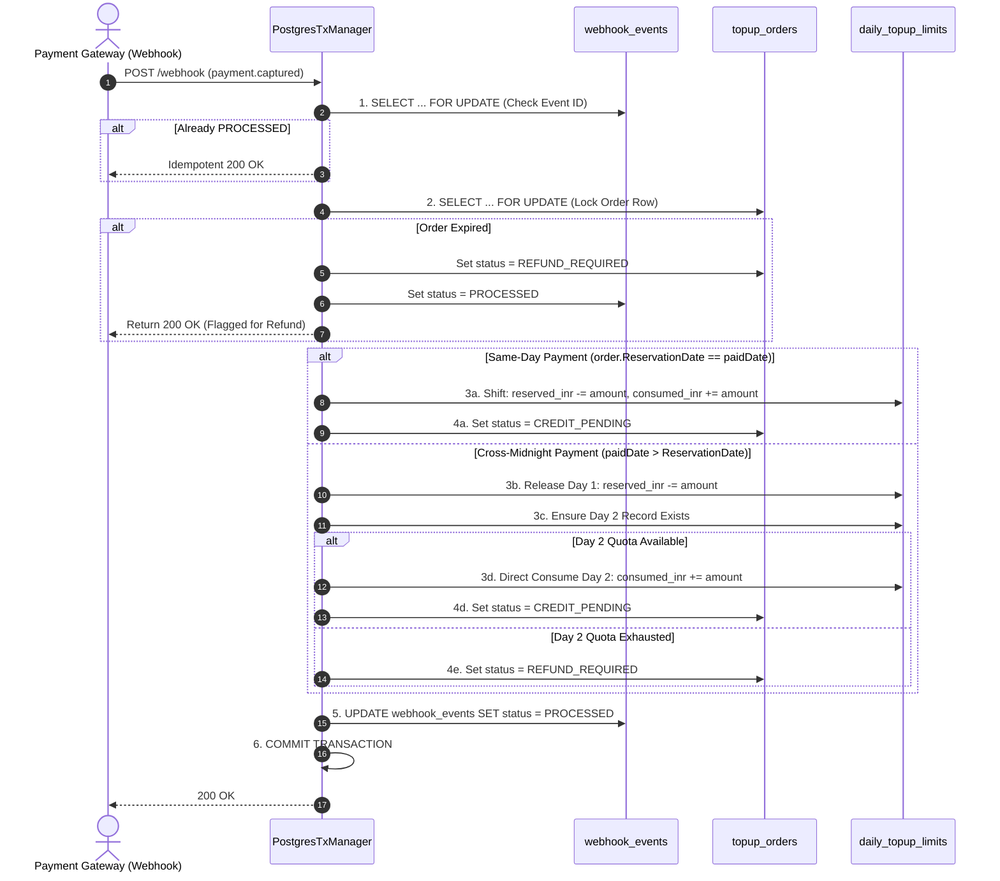

# Repository Layer Architecture (`internal/repository`)

The `internal/repository` package implements the **Persistence & Concurrency Control Layer** of the Wallet Top-Up microservice. It is divided into:
1. **Repository Interfaces (`interfaces.go`)**: Abstract contracts enabling clean dependency inversion and unit testing with mock implementations.
2. **PostgreSQL Implementations (`postgres/`)**: Production drivers using `pgxpool.Pool`, enforcing atomic transactions, distributed worker lease fencing, and PostgreSQL-level constraints.

---

## 1. Directory Structure

```
internal/repository/
├── interfaces.go                     # Data access contracts & transaction manager interfaces
├── README.md                         # This architecture and function guide
└── postgres/
    ├── daily_limit_repo.go           # Quota reservation, consumption & daily resets
    ├── topup_order_repo.go           # Order lifecycle, state queries & batch worker leasing
    ├── tx_manager.go                 # Atomic multi-entity transactions with FOR UPDATE locks
    └── webhook_event_repo.go         # Immutable webhook audit logging & replay deduplication
```

---

## 2. Core File Breakdown

### File 1: `interfaces.go`

#### What problem does it solve?
In complex financial services, directly coupling business logic to concrete database connections makes code untestable and brittle. `interfaces.go` solves this by applying the **Dependency Inversion Principle (DIP)**:
- Core services (`TopUpService`, `WebhookService`, `Reconciler`) depend exclusively on these interfaces.
- Test suites can substitute real database calls with in-memory mocks without launching PostgreSQL containers for unit tests.

#### Key Interfaces Defined:
- `DBTX`: Unifies `*pgxpool.Pool` and `pgx.Tx` so shared query logic can run standalone or inside an active transaction.
- `DailyLimitRepository`: Manages daily fiat limits and two-phase quota lifecycle.
- `TopUpOrderRepository`: Manages `topup_orders` CRUD, idempotency checks, and batch claim leases.
- `WebhookEventRepository`: Manages audit trail and deduplication of webhook events.
- `TransactionManager`: Manages multi-table atomic operations that cannot be split into isolated repo calls without risking data corruption.

---

### File 2: `postgres/daily_limit_repo.go`

#### What problem does it solve?
Prevents **quota overselling** and **race conditions** when a user attempts concurrent top-ups. It enforces two-phase quota management (`reserved_inr` $\to$ `consumed_inr`).

#### Function Breakdown:

| Function | Purpose & Problem Solved | SQL / Invariant Mechanism |
| :--- | :--- | :--- |
| `EnsureDailyLimit(ctx, userID, date, limit)` | Guarantees a record exists for `(userID, date)` with default values (`reserved=0, consumed=0`). Prevents `NOT FOUND` errors on first daily use. | `INSERT ... ON CONFLICT (user_id, usage_date) DO NOTHING` |
| `ReserveQuota(ctx, userID, date, amount, limit)` | Atomically reserves quota when an order is initiated. Rejects if remaining capacity is insufficient. | `UPDATE daily_topup_limits SET reserved_inr = reserved_inr + $1 WHERE (reserved + consumed + $1) <= limit_inr` |
| `ReleaseReservedQuota(ctx, userID, date, amount)` | Returns reserved quota back to the user if an order expires, is canceled, or payment fails. | `UPDATE daily_topup_limits SET reserved_inr = reserved_inr - $1 WHERE reserved_inr >= $1`. Fails if invariant violated. |
| `ConsumeReservedQuota(ctx, userID, date, amount)` | Converts reserved quota into permanent consumed quota upon successful payment on the **same day**. | Atomically: `reserved_inr = reserved_inr - $1, consumed_inr = consumed_inr + $1 WHERE reserved_inr >= $1`. |
| `AttemptDirectConsumption(ctx, userID, date, amount, limit)` | Used during **cross-midnight captures**: Consumes Day 2 quota directly without prior Day 2 reservation. | `UPDATE daily_topup_limits SET consumed_inr = consumed_inr + $1 WHERE (reserved + consumed + $1) <= limit_inr`. |
| `GetDailyUsage(ctx, userID, date, limit)` | Retrieves current usage stats for `GET /api/v1/topups/daily-usage`. | `SELECT ... WHERE user_id = $1 AND usage_date = $2`. Falls back to empty zeroed record if no row exists yet. |

---

### File 3: `postgres/topup_order_repo.go`

#### What problem does it solve?
1. **Idempotent Order Creation**: Protects against duplicate orders using client idempotency keys.
2. **Distributed Worker Coordination**: Enables parallel background reconciler workers to claim and credit orders without stepping on each other.
3. **Fencing Stale Workers**: Protects against split-brain workers that took too long by requiring matching `claim_token` on status updates.

#### Function Breakdown:

| Function | Purpose & Problem Solved | Concurrency / SQL Invariant |
| :--- | :--- | :--- |
| `Create(ctx, order)` | Inserts a new order. Catches Postgres error code `23505` (unique constraint) and maps it to `domain.ErrIdempotencyConflict`. | `INSERT INTO topup_orders ...` |
| `GetByID(ctx, id)` | Looks up order by internal UUID. | Standard indexed scan. |
| `GetByProviderOrderID(ctx, provider, providerOrderID)` | Crucial for webhooks! Maps the gateway order ID (e.g. `order_M123`) back to our internal order. | Fast indexed lookup on `uq_topup_provider_order`. |
| `GetByIdempotencyKey(ctx, userID, key)` | Checks if client already created an order with this key. | Fast indexed scan on `idx_topup_user_idempotency`. |
| `GetPendingExpired(ctx, now, limit)` | Finds unpaid orders whose `expires_at < now` for cleanup. | Uses partial index `idx_topup_expiry` (`WHERE status IN ('PAYMENT_PENDING', 'INITIATED')`). |
| `ExpireOrder(ctx, orderID)` | Moves order status from `PAYMENT_PENDING` to `EXPIRED`. | Fails with `ErrOrderTerminalStatus` if already completed/failed. |
| `ClaimBatchForCredit(ctx, workerToken, batchSize, leaseDuration)` | **Distributed Queue Engine**: Parallel workers pick up `CREDIT_PENDING` orders without colliding. | Uses `FOR UPDATE SKIP LOCKED` inside a short transaction. Stamps order with `claim_token = workerToken` and `claim_until = NOW() + leaseDuration`. |
| `CompleteOrder(ctx, orderID, workerToken)` | Finalizes order as `COMPLETED` after Wallet ledger credit succeeds. | **Fenced**: `WHERE id = $1 AND claim_token = $2`. If worker's lease expired and another worker stole the order, this update affects 0 rows and returns `false`. |
| `RecordClaimFailure(ctx, orderID, workerToken, errMsg)` | Increments attempt count, records diagnostic error, and releases the lease (`claim_until = NOW()`) so it can be retried immediately. | Fenced with `claim_token`. |
| `TransitionToCreditPending(ctx, orderID, provider, paymentID)` | Moves order from `PAYMENT_PENDING` to `CREDIT_PENDING` once payment is confirmed. | Conditional update: `WHERE status = 'PAYMENT_PENDING'`. |
| `TransitionToRefundRequired(ctx, orderID, provider, paymentID, reason)` | Marks order for manual refund if cross-midnight Day 2 quota is exhausted. | Sets `status = 'REFUND_REQUIRED'`. |

---

### File 4: `postgres/webhook_event_repo.go`

#### What problem does it solve?
1. **Tamper-Proof Audit**: Every raw webhook payload received from payment gateways is preserved for regulatory audits.
2. **Replay Attack Defense**: Gateways retry webhooks until an HTTP 200 is returned. This repository blocks re-execution of already processed events.
3. **Cache Poisoning Defense**: Ensures unverified/forged events do not block subsequent valid events.

#### Function Breakdown:

| Function | Purpose & Problem Solved | Implementation Detail |
| :--- | :--- | :--- |
| `RecordVerifiedEvent(ctx, event)` | Records an event where HMAC signature was valid. Returns `alreadyProcessed = true` if Postgres error `23505` occurs on `(provider, event_id)`. | Utilizes partial unique index `idx_webhook_verified_dedup WHERE signature_valid = TRUE`. |
| `RecordFailedSignatureEvent(ctx, event)` | Logs spoofed or corrupted webhooks with `signature_valid = FALSE` and `status = 'FAILED'`. | Does NOT hit the unique index, preventing attackers from blocking real events. |
| `RecordEvent(ctx, event)` | General insert helper for raw webhook auditing. | Standard insert. |
| `UpdateEventStatus(ctx, eventID, status, errMsg)` | Updates webhook processing lifecycle (`RECEIVED` $\to$ `PROCESSED`, `IGNORED`, or `FAILED`). | `UPDATE webhook_events SET status = $1, processed_at = NOW() WHERE id = $2`. |

---

### File 5: `postgres/tx_manager.go`

#### What problem does it solve?
This is the **heart of transactional integrity**. Multiple tables must be updated simultaneously. If any step fails, the entire transaction rolls back cleanly, leaving zero balance or quota leaks.

#### The 5 Atomic Transactions:

#### 1. `InitiateTopUpTx(ctx, order, dailyLimitINR)`
- **Problem Solved**: Atomically holds idempotency key, verifies daily quota, reserves quota in `daily_topup_limits`, and creates order in `INITIATED` status.
- **Locking**: Queries existing order `FOR UPDATE`. If key exists with same amount, returns existing order (safe retry). If amount differs, returns `ErrIdempotencyConflict`.
- **Result**: Either order is created with quota reserved, or transaction cleanly aborts.

#### 2. `ActivatePaymentPending(ctx, orderID, providerOrderID)`
- **Problem Solved**: Moves order from `INITIATED` $\to$ `PAYMENT_PENDING` once the payment provider (Razorpay) responds with an external order ID.
- **Invariant**: Only updates rows with `status = 'INITIATED'`.

#### 3. `CancelInitiatedOrderTx(ctx, orderID, userID, usageDate, amount, errMsg)`
- **Problem Solved**: If the external gateway fails (e.g. Razorpay timeout/outage), this transaction marks the order `FAILED` and **immediately releases the reserved quota** so the user isn't penalized.
- **Invariant**: Checks that order was `INITIATED` and verifies that `reserved_inr >= amount` before committing.

#### 4. `ProcessPaymentConfirmationTx(...)`
- **Problem Solved**: Executes the complete webhook receipt, signature audit, quota transition, and order state change in **one single atomic transaction**.



#### 5. `ExpireOrderAndReleaseQuotaTx(ctx, orderID, userID, usageDate, amount)`
- **Problem Solved**: Periodically executed by the background expiry worker. Atomically marks abandoned checkout orders as `EXPIRED` and decrements `reserved_inr` from `daily_topup_limits`.
