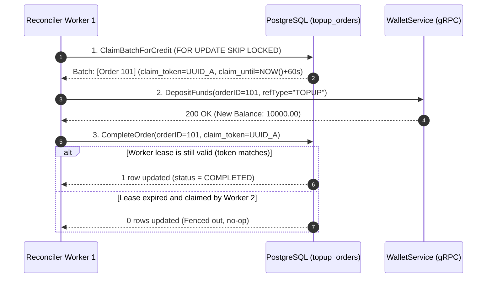

# Service Layer Architecture (`internal/service`)

The `internal/service` package is the **orchestration engine** of the Wallet Top-Up microservice. It coordinates domain invariants, repositories, external payment gateways, background reconciliation workers, and gRPC clients.

---

## 1. Directory Structure

```
internal/service/
├── topup_service.go       # Core user-facing top-up order creation & inquiry
├── webhook_service.go     # Inbound gateway webhook processing & atomic confirmation
├── reconciler.go          # Distributed background worker crediting Core Wallet
├── expiry_worker.go       # Background worker sweeping abandoned checkout orders
└── README.md              # This architectural and technical documentation
```

---

## 2. File-by-File Purpose & Problem Breakdown

### File 1: `topup_service.go`

#### What Problems Does This File Solve?
1. **Time-of-Check to Time-of-Use (TOCTOU) Quota Protection**:
   Naive implementations check if a user has quota, then create an order. Under concurrent requests, both checks pass and the user deposits twice their limit. `TopUpService` delegates to `InitiateTopUpTx`, which locks the row and reserves quota in a single atomic database statement before calling any external APIs.
2. **Deterministic Idempotency**:
   If a client double-taps "Submit", both requests carry the same `X-Idempotency-Key`. The service checks the key under lock:
   - Same key + same amount $\to$ returns the existing order immediately without double-calling Razorpay.
   - Same key + different amount $\to$ rejects with `ErrIdempotencyConflict` (HTTP 409).
3. **Zero Quota Leakage on Gateway Outages**:
   If Razorpay's API times out or returns a 5xx error, `TopUpService` immediately executes `CancelInitiatedOrderTx`, transitioning the internal order to `FAILED` and releasing the reserved quota back to the user.
4. **Indian Standard Time (IST) Calendar Alignment**:
   Daily limits must reset at midnight IST (UTC+05:30), not UTC. The service calculates dates using `time.LoadLocation("Asia/Kolkata")` with fallback to `time.FixedZone("IST", 5*3600+30*60)`.

#### Function Breakdown:
- `NewTopUpService(...)`: Initializes service with IST location, default limits, and injected dependencies.
- `CreateTopUp(ctx, userID, idempotencyKey, inrAmount)`: Full creation pipeline (validation $\to$ atomic reservation $\to$ provider order creation $\to$ activation to `PAYMENT_PENDING`).
- `GetDailyUsage(ctx, userID)`: Fetches current consumption and computes `ResetsAt` (next day 00:00 IST).
- `GetTopUpByID(ctx, userID, orderID)`: Retrieves order details with strict tenant isolation (`order.UserID == userID`).

---

### File 2: `webhook_service.go`

#### What Problems Does This File Solve?
1. **Cryptographic Gateway Verification**:
   Validates HMAC-SHA256 signatures and rejects forged webhooks.
2. **Replay & Timestamp Skew Protection**:
   Enforces a 300-second replay window and cross-validates the HTTP header timestamp against the JSON payload timestamp ($|\Delta t| \le 5\text{s}$).
3. **Decoupled Security Auditing**:
   If signature verification fails, it logs `SignatureValid: false, Status: FAILED` in `webhook_events`. If signature is valid but payload JSON is malformed, it logs `SignatureValid: true, Status: FAILED`. This prevents cache-poisoning denial of service.
4. **Strict Capture Filtering**:
   Only processes `"payment.captured"`. Non-capturing events (e.g. `payment.failed`, `order.paid`) are marked `IGNORED` and return HTTP 200 without modifying balance.
5. **Cross-Midnight Capture Attribution**:
   Uses `payload.PaidAt` (gateway capture epoch) converted to IST to attribute the payment date. If the user reserved at 23:59 on Monday and paid at 00:01 on Tuesday, it releases Day 1 quota and consumes Day 2 quota atomically.

#### Function Breakdown:
- `NewWebhookService(...)`: Constructor with IST timezone support.
- `ProcessWebhook(ctx, provider, rawPayload, signature, timestamp)`: Comprehensive 8-step verification and single-transaction execution pipeline.
- `recordFailedValidationEvent(...)`: Helper logging malformed payloads as `SignatureValid: true` for auditability.

---

### File 3: `reconciler.go`

#### What Problems Does This File Solve?
1. **Decoupled, Reliable Balance Crediting**:
   Webhooks must return HTTP 200 within 2-3 seconds or gateways retry aggressively. Webhooks only move orders to `CREDIT_PENDING`. Crediting the Core Wallet happens asynchronously via `ReconcilerWorker`.
2. **Distributed Worker Coordination (`FOR UPDATE SKIP LOCKED`)**:
   In Kubernetes with multiple replicas of `wallet-topup`, multiple reconcilers run concurrently. `ClaimBatchForCredit` allows workers to claim batches of orders without lock contention.
3. **Lease Token Fencing (`claim_token` & `claim_until`)**:
   If Worker A claims an order for 60 seconds, but experiences a 90-second Stop-The-World GC pause, its lease expires. Worker B claims the order. When Worker A wakes up and calls `CompleteOrder`, the database query `WHERE claim_token = $2` fails because Worker B's token is now on the row. Worker A is **fenced out**, preventing double crediting.
4. **Bounded Concurrency & RPC Timeout Protection**:
   Uses a semaphore `chan struct{}` bounded to 5 concurrent deposit RPCs and wraps each call in a 10-second context timeout.
5. **Error Precedence Ordering**:
   Prioritizes `err != nil` over `res == nil` over `!res.Success` so timeout and network errors are captured accurately.

#### Function Breakdown:
- `NewReconcilerWorker(...)`: Configures intervals, batch sizes, and lease durations.
- `Start(ctx)`: Launches background goroutine ticking every interval (default 1s).
- `Stop()`: Gracefully halts workers and waits for in-flight batches to finish (`wg.Wait()`).
- `processBatch(ctx)`: Claims batch $\to$ dispatches 5 concurrent worker goroutines $\to$ calls `WalletClient.DepositFunds` $\to$ completes order with lease token protection.

---

### File 4: `expiry_worker.go`

#### What Problems Does This File Solve?
1. **Quota Recovery for Abandoned Checkouts**:
   If a user initiates a top-up but closes their browser, their daily limit remains locked in `reserved_inr`. `ExpiryWorker` scans for orders past their 15-minute expiration and releases the quota.
2. **Zero Full-Table Scans**:
   Queries `WHERE status IN ('PAYMENT_PENDING', 'INITIATED') AND expires_at < NOW()`, leveraging the partial index `idx_topup_expiry` for lightning-fast lookups even with millions of rows.
3. **Atomic Quota Recovery**:
   Calls `ExpireOrderAndReleaseQuotaTx`, guaranteeing that order state transition to `EXPIRED` and quota decrement from `daily_topup_limits` happen in the same database transaction.

#### Function Breakdown:
- `NewExpiryWorker(...)`: Configures polling interval (default 30s).
- `Start(ctx)`: Spawns the background cleaner goroutine.
- `Stop()`: Gracefully stops the worker.
- `sweepExpired(ctx)`: Fetches up to 100 expired orders and atomically releases their quotas.

---

## 3. Why We Need Specific Packages

| Package | Purpose & Problem Solved |
| :--- | :--- |
| `go.uber.org/zap` | High-performance, zero-allocation structured logger. Essential for financial services where every order state change, lease claim, and error must be logged with indexed key-value fields. |
| `tradedrift/platform/uuid` | Generates cryptographically secure, standard v4 UUIDs for orders, worker claim tokens, and webhook audit entries. |
| `math` | Provides `math.Abs()` for timestamp drift and clock-skew calculations. |
| `sync` | Provides `sync.WaitGroup` for graceful shutdowns and worker lifecycle management, plus channels used as counting semaphores. |
| `time` | Crucial for `Asia/Kolkata` IST timezone loading, lease duration timeouts, and ticker intervals. |

---

## 4. Reconciler Distributed Leased Queue Flow


