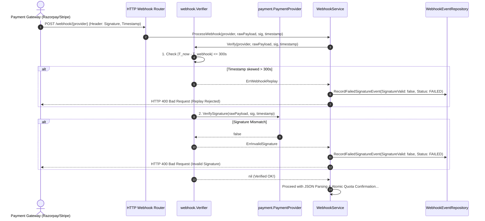

# Webhook Security Layer Architecture (`internal/webhook`)

The `internal/webhook` package serves as the **cryptographic perimeter defense** for incoming payment gateway callbacks.

---

## 1. Directory Structure

```
internal/webhook/
├── verifier.go            # Cryptographic signature & replay window verifier
└── README.md              # This architectural and technical documentation
```

---

## 2. File Purpose & Problem Breakdown

### File: `verifier.go`

#### What Problems Does This File Solve?
1. **Prevents Forgery & Payload Tampering (MitM)**:
   Payment gateway webhooks travel over the public internet. Malicious actors could forge fake `payment.captured` HTTP POST requests to credit millions of dollars in USDT without paying a single rupee. `verifier.go` guarantees that every byte of the incoming payload was genuinely signed by the payment gateway's private secret.
2. **Prevents Replay Attacks**:
   If an attacker intercepts a legitimate webhook transmission, they could attempt to replay that exact request hours or days later to obtain duplicate wallet credits. `verifier.go` enforces a **300-second (5-minute) maximum time-drift window**.
3. **Multi-Gateway Routing**:
   Different payment providers (e.g. Razorpay, Stripe, Cashfree, Mock) have different secret keys and signature algorithms. The `Verifier` registers providers dynamically by name and dispatches verification to the appropriate gateway adapter.

---

## 3. Struct & Function Breakdown

### Struct: `Verifier`
```go
type Verifier struct {
	providers map[string]payment.PaymentProvider
}
```
Maintains an in-memory registry of configured payment providers indexed by their provider name (e.g. `"RAZORPAY"`, `"MOCK"`).

---

### Function 1: `NewVerifier(providers ...payment.PaymentProvider) *Verifier`
- **Purpose**: Constructor that accepts any number of payment providers (variadic).
- **Mechanism**: Iterates over each provider, queries `p.ProviderName()`, and indexes it into an internal hash map `providers[name]`.
- **Benefit**: Enables registering multiple gateways simultaneously without modifying verification logic.

---

### Function 2: `Verify(providerName string, rawPayload []byte, signature string, timestamp int64) error`
- **Purpose**: Executes the two-stage perimeter security check.

#### Step-by-Step Security Pipeline:

1. **Provider Resolution**:
   ```go
   p, ok := v.providers[providerName]
   if !ok {
       return domain.ErrInvalidSignature
   }
   ```
   Ensures the provider specified in the webhook URL path actually exists in our configuration.

2. **Replay Window Enforcement (300 Seconds)**:
   ```go
   now := time.Now().Unix()
   if math.Abs(float64(now-timestamp)) > 300 {
       return domain.ErrWebhookReplay
   }
   ```
   - Checks the difference between the gateway header timestamp and the local server time.
   - If $|T_{now} - T_{event}| > 300\text{s}$, the request is rejected with `domain.ErrWebhookReplay`.
   - Protects against captured packet replay attacks while tolerating normal network latency and minor NTP clock drift.

3. **Cryptographic HMAC Signature Check**:
   ```go
   if !p.VerifySignature(rawPayload, signature, timestamp) {
       return domain.ErrInvalidSignature
   }
   ```
   - Delegates to the provider adapter to compute the HMAC-SHA256 digest over the raw payload and timestamp.
   - Compares the expected signature against the header signature in **constant time** (`crypto/hmac.Equal`).
   - If a single bit in the JSON body, timestamp, or secret was modified, verification returns `domain.ErrInvalidSignature`.

---

## 4. Why We Need Specific Packages

| Package | Purpose & Problem Solved |
| :--- | :--- |
| `math` | Provides `math.Abs()` to compute the absolute difference between server epoch seconds and webhook timestamp. This accounts for clocks that may be slightly ahead OR slightly behind. |
| `time` | Provides `time.Now().Unix()` to obtain current epoch seconds for replay window calculation. |
| `internal/domain` | Imports typed sentinel errors (`domain.ErrInvalidSignature`, `domain.ErrWebhookReplay`) so calling services and HTTP handlers can return the correct HTTP status codes (e.g. 400 Bad Request). |
| `internal/payment` | References the `payment.PaymentProvider` interface, allowing `Verifier` to remain completely decoupled from specific payment SDK implementations. |

---

## 5. End-to-End Webhook Security Flow


