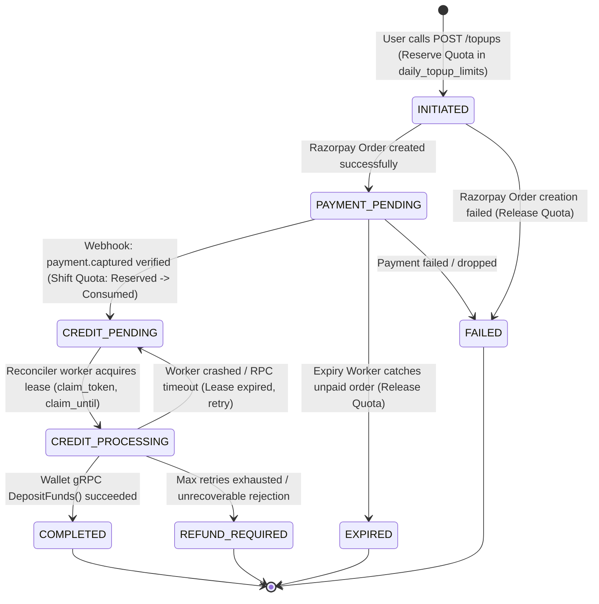

# Wallet Top-Up Database Architecture & Migrations

This directory contains the database schema migrations for the **Wallet Top-Up Service**.

The design guarantees **strict financial correctness**, **double-spend immunity**, **distributed worker fencing**, and **tamper-proof webhook auditing** without relying solely on application-level checks.

---

## 1. High-Level Lifecycle Flow



---

## 2. Table Breakdowns & Invariants

### Table 1: `daily_topup_limits` (`00001_create_daily_quota_table.sql`)

#### Why do we need this table?
Every user has a daily regulatory and risk ceiling for fiat deposits (e.g. ₹10 in dev / ₹50,000 in prod). If a user fires 10 concurrent requests at the same microsecond, application-level checks like `if total + amount > limit` suffer from **time-of-check to time-of-use (TOCTOU) race conditions**, causing accidental quota over-allocations.

#### What problems does it solve?
1. **Zero Over-Deposit Races**: Solved by the PostgreSQL constraint:
   ```sql
   CONSTRAINT chk_quota_ceiling CHECK (reserved_inr + consumed_inr <= limit_inr)
   ```
   If two parallel transactions try to reserve amounts that sum to more than `limit_inr`, the database engine will reject the losing transaction with a constraint violation.
2. **Two-Phase Quota Allocation**:
   - **Phase 1 (Reservation)**: When the order is initiated, `reserved_inr += amount`. Quota is immediately held so subsequent requests cannot take it.
   - **Phase 2 (Consumption or Release)**:
     - When payment succeeds: `reserved_inr -= amount`, `consumed_inr += amount`.
     - If payment fails or expires: `reserved_inr -= amount`. Quota returns to the user.
3. **Daily Calendar Partitioning**: The primary key is `(user_id, usage_date)`. Every day at 00:00 UTC/IST, a new record is created on-demand, giving the user a fresh daily quota without requiring expensive cleanup cron jobs.

---

### Table 2: `topup_orders` (`00002_create_topup_orders_table.sql` & `00004_update_topup_expiry_index.sql`)

#### Why do we need this table?
This is the core financial ledger and state machine tracking each deposit request from user initiation through gateway interaction, webhook confirmation, and wallet ledger deposit.

#### What problems does it solve?
1. **Client Request Idempotency**:
   ```sql
   CREATE UNIQUE INDEX idx_topup_user_idempotency ON topup_orders(user_id, idempotency_key);
   ```
   Ensures that network retries or double-clicks from the client cannot create duplicate orders or double-charge a user.
2. **Provider Entity Deduplication**:
   ```sql
   CONSTRAINT uq_topup_provider_order UNIQUE (provider, provider_order_id),
   CONSTRAINT uq_topup_provider_payment UNIQUE (provider, payment_id)
   ```
   Guarantees that a payment ID or provider order ID cannot be mapped to multiple internal orders.
3. **Tokenized Distributed Reconciler Leases**:
   Crediting the user's wallet must be reliable even if background workers crash.
   Instead of using fragile distributed locks, `topup_orders` contains:
   - `claim_token UUID`: Random token generated by the worker claiming the record.
   - `claim_until TIMESTAMPTZ`: Lease expiration time (e.g., `NOW() + 2 minutes`).
   
   A worker claims batches using:
   ```sql
   SELECT id FROM topup_orders
   WHERE status IN ('CREDIT_PENDING', 'CREDIT_PROCESSING')
     AND (claim_until IS NULL OR claim_until < NOW())
   ORDER BY created_at ASC
   LIMIT 10
   FOR UPDATE SKIP LOCKED;
   ```
   If a worker dies while calling the Wallet gRPC service, its lease expires, and another worker safely picks it up.
4. **Fast Expiry Scanning (Partial Index)**:
   ```sql
   CREATE INDEX idx_topup_expiry ON topup_orders(status, expires_at)
   WHERE status IN ('PAYMENT_PENDING', 'INITIATED');
   ```
   Orders abandoned during checkout expire after 15 minutes. The partial index allows the expiry worker to scan only pending/initiated orders without doing a full table scan over millions of completed orders.

---

### Table 3: `webhook_events` (`00003_create_webhook_events_table.sql`)

#### Why do we need this table?
Webhooks from payment gateways (Razorpay, Stripe, Cashfree) are asynchronous, delivered over public internet, and can be retried multiple times, delivered out-of-order, or spoofed by attackers.

#### What problems does it solve?
1. **Immutable Audit Trail**:
   Every incoming webhook is logged with its raw JSON `payload`, HTTP headers, cryptographic `signature_valid` result, and lifecycle `status` (`RECEIVED`, `PROCESSED`, `IGNORED`, `FAILED`).
2. **Replay Attack Immunity**:
   Gateways retry webhooks until an HTTP 200 is returned. If an attacker replays a captured webhook payload, the deduplication index prevents double-processing:
   ```sql
   CREATE UNIQUE INDEX idx_webhook_verified_dedup 
       ON webhook_events(provider, event_id) 
       WHERE signature_valid = TRUE;
   ```
3. **Cache Poisoning Prevention**:
   Notice the `WHERE signature_valid = TRUE` condition!
   If an attacker sends a fake webhook with a forged `event_id`, we log it as `signature_valid = FALSE`. Because of the partial index, the fake event does **not** block the legitimate webhook from the real provider that might arrive later with the same `event_id`.

---

## 3. Summary of Core Transactional Guarantees

| Invariant | Enforced At | Mechanism |
| :--- | :--- | :--- |
| **No Daily Over-Limit** | PostgreSQL | `CHECK (reserved_inr + consumed_inr <= limit_inr)` |
| **No Duplicate Client Orders** | PostgreSQL | `UNIQUE (user_id, idempotency_key)` |
| **No Duplicate Webhooks** | PostgreSQL | Partial `UNIQUE (provider, event_id) WHERE signature_valid = TRUE` |
| **No Concurrent Crediting** | PostgreSQL | `FOR UPDATE SKIP LOCKED` + `claim_token` fencing |
| **Zero Leaked Quota on Failures** | Application Tx | Atomic release of `reserved_inr` on cancel/expiry |
