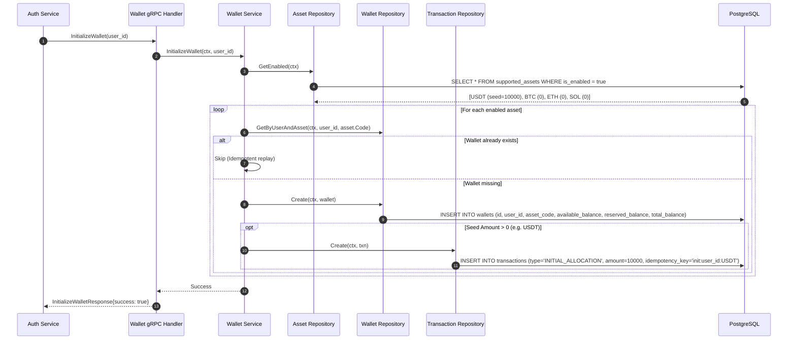
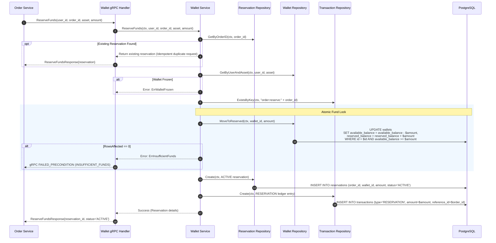
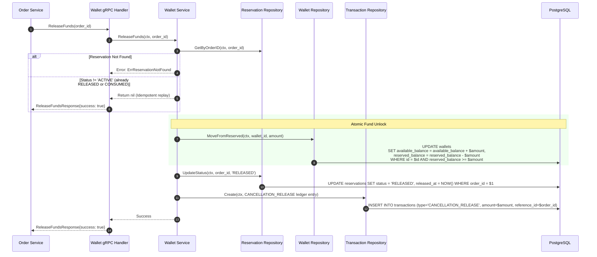
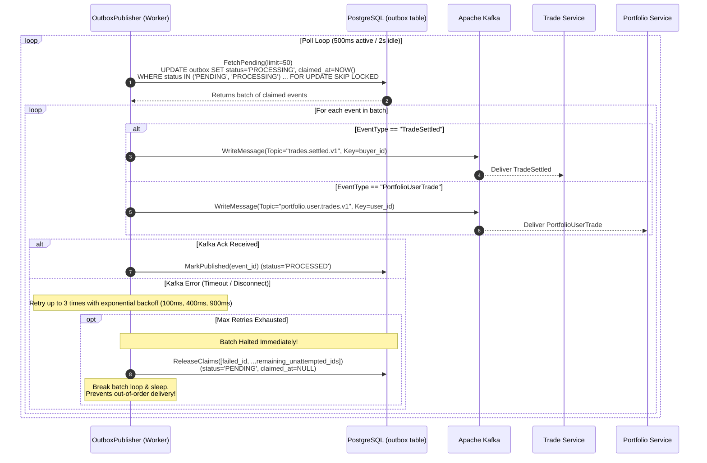
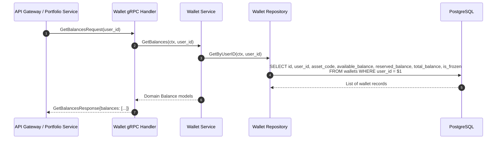
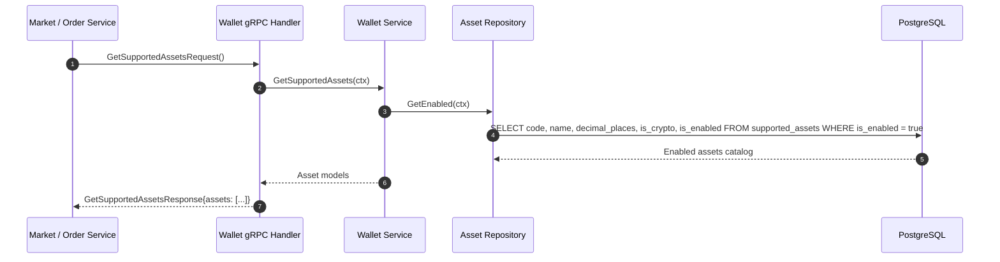

# TradeDrift Wallet Service — End-to-End Architectural Master Guide (`ENTIRE_FLOW.md`)

**Service:** TradeDrift Wallet & Ledger Service (`services/wallet`)  
**Scope:** Complete Financial Architecture, Double-Entry Invariants, Transaction Boundaries, Outbox Streaming, and End-to-End Flows  
**Last Updated:** September 2026  

---

## 1. Executive Summary & Design Philosophy

The **Wallet Service** is the authoritative financial core of the TradeDrift cryptocurrency exchange. It is the sole custodian of user funds, account balances, reservations, and immutable double-entry ledger transactions.

Every financial operation in the platform—user registration, order placement, order cancellation, and trade settlement—must pass through the Wallet Service to maintain strict balance invariants and prevent money creation or destruction.

### Core Financial Axioms

1. **Balance Invariant Equation**:
   For any wallet at all points in time:
   $$\text{total\_balance} = \text{available\_balance} + \text{reserved\_balance}$$
   $$\text{available\_balance} \ge 0 \quad \text{and} \quad \text{reserved\_balance} \ge 0$$
   Enforced at the PostgreSQL storage layer via check constraints `chk_wallet_total_balance`, `chk_wallets_available_nonneg`, and `chk_wallets_reserved_nonneg`.

2. **Strict Double-Entry Bookkeeping**:
   Balances are never updated in isolation. Every balance modification must be accompanied by an immutable audit record in the `transactions` ledger table specifying the debit/credit nature, operation type, reference IDs, and before/after balance snapshots.

3. **Single Database Transaction Boundaries**:
   Financial state changes and their downstream notifications are never split across multiple independent transactions. The balance debit/credit, ledger insertions, reservation updates, and Kafka outbox staging execute inside **one single atomic PostgreSQL transaction** (`BEGIN ... COMMIT`).

4. **Zero Dual-Write Anomaly (Transactional Outbox)**:
   The Wallet Service never publishes directly to Apache Kafka inside a database transaction. Events (`TradeSettled` and `PortfolioUserTrade`) are staged to the `outbox` table in the same transaction as the balance mutations, and are drained asynchronously with strict per-user FIFO partition ordering.

5. **Deterministic Deadlock-Free Concurrency**:
   During multi-party settlement, up to four wallet rows (buyer quote, buyer base, seller quote, seller base) must be locked simultaneously. The service sorts all affected wallet IDs lexicographically prior to row acquisition (`LockByIDs`), mathematically eliminating PostgreSQL `40P01` deadlocks.

---

## 2. Directory Layout & Responsibility Map

```
services/wallet/
├── cmd/
│   └── server/
│       ├── main.go                     # Composition root: wires DB pool, migrations, gRPC server, outbox publisher
│       └── README.md                   # Server startup and lifecycle guide
│
├── internal/
│   ├── handler/                        # Transport Layer (gRPC Server)
│   │   ├── handler.go                  # Implements WalletServiceServer (ReserveFunds, ReleaseFunds, SettleTrade, etc.)
│   │   ├── mapper.go                   # Protobuf <-> Domain model conversions
│   │   └── README.md                   # Handler documentation
│   │
│   ├── service/                        # Domain Business Logic Layer
│   │   ├── service.go                  # Service struct wiring repository interfaces
│   │   ├── initialize_wallet.go        # InitializeWallet: creates wallets and seeds starting USDT
│   │   ├── reserve_funds.go            # ReserveFunds: locks funds for pending orders
│   │   ├── release_funds.go            # ReleaseFunds: unlocks funds upon order cancellation
│   │   ├── settle_trade.go             # SettleTrade: atomic trade settlement, row locks, double-entry, outbox
│   │   ├── settle_trade_validate.go    # Precision truncation (8 decimals), MM checks, slippage cap
│   │   ├── get_balance.go              # GetBalance, GetBalances: user balance queries
│   │   ├── get_assets.go               # GetSupportedAssets: enabled cryptocurrency assets query
│   │   └── 01README.md                 # Service layer guide
│   │
│   ├── repository/                     # Data Access Layer Interfaces
│   │   ├── repository.go               # Interface definitions (WalletRepo, ReservRepo, TxnRepo, OutboxRepo, etc.)
│   │   ├── 01README.md                 # Repository interfaces guide
│   │   └── postgres/                   # PostgreSQL Implementations (pgx/v5)
│   │       ├── wallet.go               # LockByIDs, MoveToReserved, MoveFromReserved, UpdateBalances
│   │       ├── reservation.go          # Create, GetByOrderID, UpdateStatus
│   │       ├── transaction.go          # Create, ExistsByKey (ledger insertions)
│   │       ├── asset.go                # GetEnabled, ListAll
│   │       ├── outbox.go               # Insert, FetchPending, MarkPublished, ReleaseClaims, MarkFailed
│   │       └── settled_trade.go        # Insert, GetByTradeID, ExistsByMarketAndSequence
│   │
│   └── publisher/                      # Asynchronous Kafka Outbox Worker
│       ├── publisher.go                # OutboxPublisher: polling loop, FIFO batch preservation, Kafka writer
│       ├── publisher_test.go           # Unit & integration tests for outbox resilience
│       └── README.md                   # Outbox publisher architectural guide
│
├── migration/                          # Goose SQL Database Migrations
│   ├── 00001_create_wallets.sql        # Wallets table + balance check constraints
│   ├── 00002_create_transactions.sql   # Double-entry ledger transactions
│   ├── 00003_create_reservations.sql   # Order fund reservations
│   ├── 00004_create_supported_assets.sql# Asset registry (USDT, BTC, ETH, SOL)
│   ├── 00005_create_outbox.sql         # Transactional outbox table
│   ├── 00006_create_settled_trades.sql # Trade settlement idempotency log
│   ├── 00007_add_uq_settled_trades_market_seq.sql # Per-market sequence uniqueness
│   ├── 00008_add_chk_wallet_total_balance.sql     # Total balance invariant check
│   └── README.md                       # Migrations documentation
│
├── Dockerfile                          # Production multi-stage container build
├── go.mod                              # Go module definition
└── ENTIRE_FLOW.md                      # This master architectural document
```

---

## 3. Database Schema & State Machines

```
                    ┌─────────────────────────┐
                    │    supported_assets     │
                    │─────────────────────────│
                    │ code (PK)               │
                    │ name, decimal_places    │
                    │ is_enabled, is_crypto   │
                    └────────────┬────────────┘
                                 │ 1:N
                                 ▼
                    ┌─────────────────────────┐
                    │         wallets         │
                    │─────────────────────────│
                    │ id (PK, UUIDv7)         │
                    │ user_id                 │
                    │ asset_code (FK)         │
                    │ available_balance       │
                    │ reserved_balance        │
                    │ total_balance (CHECK)   │
                    │ is_frozen               │
                    └──────┬────────────┬─────┘
                           │            │
                      1:N  │            │  1:N
                           ▼            ▼
        ┌────────────────────────┐  ┌────────────────────────┐
        │      transactions      │  │      reservations      │
        │────────────────────────│  │────────────────────────│
        │ id (PK, UUIDv7)        │  │ id (PK, UUIDv7)        │
        │ wallet_id (FK)         │  │ wallet_id (FK)         │
        │ transaction_type       │  │ order_id (UNIQUE)      │
        │ amount, balance_after  │  │ amount                 │
        │ reference_id           │  │ status (ACTIVE/...)    │
        │ idempotency_key (UQ)   │  │ created_at             │
        └────────────────────────┘  └────────────────────────┘
```

### 3.1 Reservation Lifecycle State Machine

```
              Order Submission
                     │
                     ▼
             ┌───────────────┐
             │    ACTIVE     │  (Funds moved available -> reserved)
             └───────┬───────┘
                     │
         ┌───────────┴───────────┐
         │ Order Cancelled       │ Trade Settled
         ▼                       ▼
 ┌───────────────┐       ┌───────────────┐
 │   RELEASED    │       │   CONSUMED    │
 │ (Funds moved  │       │ (Reserved     │
 │ reserved ->   │       │ balances      │
 │  available)   │       │ transferred)  │
 └───────────────┘       └───────────────┘
```

---

## 4. End-to-End System Flows

The Wallet Service handles **seven core operational flows**:

```
 ┌────────────────────────────────────────────────────────────────────────┐
 │                      WALLET SERVICE INBOUND FLOWS                      │
 ├────────────────────────────────┬───────────────────────────────────────┤
 │ 1. InitializeWallet (gRPC)     │ Auth Service -> Initial wallet & seed  │
 │ 2. ReserveFunds (gRPC)         │ Order Service -> Pre-flight fund lock │
 │ 3. ReleaseFunds (gRPC)         │ Order Service -> Unlock on cancel     │
 │ 4. SettleTrade (gRPC)          │ Settlement Service -> Asset transfer  │
 │ 5. Outbox Publishing (Worker)  │ Asynchronous Kafka streaming          │
 │ 6. GetBalance / GetBalances    │ API Gateway / Portfolio inquiries     │
 │ 7. GetSupportedAssets          │ Market / Order Service metadata query │
 └────────────────────────────────┴───────────────────────────────────────┘
```

---

### FLOW 1: User Registration & Wallet Initialization (`InitializeWallet`)

When a user signs up and verifies their email, the **Auth Service** synchronously invokes `WalletService.InitializeWallet` over gRPC.



#### Invariants & Guarantees:
- **Idempotency:** Re-invoking with the same `user_id` skips already created wallets. The `idempotency_key` on the transaction table (`init:<user_id>:<asset>`) prevents duplicate seed credits.
- **Synchronous Execution:** Must complete before Auth marks the user verified so that the user cannot place an order before their wallet exists.

---

### FLOW 2: Order Fund Reservation (`ReserveFunds`)

When a user submits a BUY or SELL order, the **Order Service** calls `WalletService.ReserveFunds` to guarantee that the user has sufficient available assets before the order is dispatched to the Matching Engine.



#### Invariants & Guarantees:
- **No Overdrafts:** The atomic `WHERE available_balance >= amount` prevents two concurrent orders from double-spending available funds.
- **Total Balance Preserved:** Available decreases by `amount`, reserved increases by `amount`. Total balance remains unchanged:
  $$\Delta \text{total\_balance} = (-amount) + (+amount) = 0$$

---

### FLOW 3: Order Cancellation & Fund Release (`ReleaseFunds`)

When an order is cancelled by the user, expired, or rejected by the Matching Engine, the **Order Service** instructs the Wallet Service to release the reserved funds back to available balance.



---

### FLOW 4: Trade Settlement Orchestration (`SettleTrade`)

When the Matching Engine matches two orders, the **Settlement Service** consumes the execution event and invokes `WalletService.SettleTrade` via gRPC. This is the central financial operation of the exchange.

```mermaid
sequenceDiagram
    autonumber
    participant Settlement as Settlement Service
    participant Handler as Wallet gRPC Handler
    participant Svc as Wallet Service
    participant Validator as Validation & Precision
    participant DB as PostgreSQL (Single ACID Transaction)
    participant Outbox as Outbox Table

    Settlement->>Handler: SettleTradeRequest(trade_id, buyer_id, seller_id, market_id, price, quantity, sequence, ...)
    Handler->>Svc: SettleTrade(ctx, req)

    rect rgb(255, 250, 240)
        Note over Svc,DB: Phase 1: Pre-Transaction Idempotency Check
        Svc->>DB: SELECT * FROM settled_trades WHERE trade_id = $trade_id
        opt Trade Already Settled
            alt Metadata Matches (buyer, seller, price, qty, sequence)
                Svc-->>Handler: Idempotent Success (return existing record)
                Handler-->>Settlement: SettleTradeResponse{status: "SETTLED"}
            else Metadata Conflict
                Svc-->>Handler: Error: ErrSettlementConflict
            end
        end
    end

    rect rgb(240, 248, 255)
        Note over Svc,Validator: Phase 2: Domain Validation & Truncation
        Svc->>Validator: Truncate to asset precision (QuoteAmount)
        Svc->>Validator: Validate Positive Non-Zero
        Svc->>Validator: Slippage Cap: Clamp quote_amount to buyer reservation remaining (MM absorbs deficit)
        Svc->>Validator: Evaluate Market Maker Flag (IsMM bypasses reservations)
    end

    rect rgb(255, 245, 245)
        Note over Svc,DB: Phase 3: ACID Transaction & Deadlock-Free Locking
        Svc->>DB: BEGIN TRANSACTION
        
        Note over Svc,DB: Sort Wallet IDs lexicographically (A -> Z)
        Svc->>DB: SELECT * FROM wallets WHERE id IN (w1, w2, w3, w4) ORDER BY id FOR UPDATE
        
        Note over Svc,DB: Transfer 1: Buyer Quote (USDT)<br/>reserved_balance -= cost; excess returned to available
        Svc->>DB: UPDATE wallets (Buyer USDT)
        Svc->>DB: INSERT INTO transactions (Buyer USDT, DEBIT)
        
        Note over Svc,DB: Transfer 2: Buyer Base (BTC)<br/>available_balance += quantity
        Svc->>DB: UPDATE wallets (Buyer BTC)
        Svc->>DB: INSERT INTO transactions (Buyer BTC, CREDIT)
        
        Note over Svc,DB: Transfer 3: Seller Base (BTC)<br/>reserved_balance -= quantity
        Svc->>DB: UPDATE wallets (Seller BTC)
        Svc->>DB: INSERT INTO transactions (Seller BTC, DEBIT)
        
        Note over Svc,DB: Transfer 4: Seller Quote (USDT)<br/>available_balance += cost
        Svc->>DB: UPDATE wallets (Seller USDT)
        Svc->>DB: INSERT INTO transactions (Seller USDT, CREDIT)

        Note over Svc,DB: Phase 4: Commit Settlement & Stage Outbox
        Svc->>DB: INSERT INTO settled_trades (trade_id, market_id, sequence, price, quantity, ...)
        
        Svc->>Outbox: INSERT INTO outbox (EventType='TradeSettled', Topic='trades.settled.v1', Key=buyer_user_id, EventID=uuid)
        Svc->>Outbox: INSERT INTO outbox (EventType='PortfolioUserTrade', Topic='portfolio.user.trades.v1', Key=buyer_id, Role='BUY')
        Svc->>Outbox: INSERT INTO outbox (EventType='PortfolioUserTrade', Topic='portfolio.user.trades.v1', Key=seller_id, Role='SELL')
        
        Svc->>DB: COMMIT TRANSACTION
    end

    Svc-->>Handler: Settlement Complete
    Handler-->>Settlement: SettleTradeResponse{status: "SETTLED"}
```

#### Invariants Enforced in `SettleTrade`:
1. **Mathematical Conservation of Money**:
   $$\Delta \text{USDT}_{\text{buyer}} + \Delta \text{USDT}_{\text{seller}} = (-cost) + (+cost) = 0$$
   $$\Delta \text{BTC}_{\text{seller}} + \Delta \text{BTC}_{\text{buyer}} = (-qty) + (+qty) = 0$$
   Total platform balances for both USDT and BTC remain unchanged.
2. **Lexicographical Row Ordering (`LockByIDs`)**:
   If Alice buys BTC from Bob while Bob buys BTC from Alice simultaneously, two concurrent goroutines lock the same 4 wallets. By sorting the UUID strings before issuing `SELECT ... FOR UPDATE`, both transactions acquire locks in identical order ($w_1 \rightarrow w_2 \rightarrow w_3 \rightarrow w_4$), completely eliminating PostgreSQL `40P01` deadlocks.
3. **Liquidity Provider / Market Maker Bypass**:
   Orders submitted by the automated Liquidity Engine (`IsMM == true` or `MM_` prefix) bypass fund reservation checks during settlement. Their available balances are debited/credited directly.
4. **Slippage Cap**:
   If the executed match price exceeds the buyer's reserved price by more than 5%, the settlement aborts with `ErrSlippageExceeded`.

---

### FLOW 5: Asynchronous Outbox Event Publication (`OutboxPublisher`)

The `OutboxPublisher` background loop continuously drains events staged in the `outbox` table and delivers them to Kafka.



#### Fault Tolerance & Recovery Guarantees:
- **FIFO Batch Halting:** If event #3 in a batch of 50 fails Kafka delivery, the publisher does **not** proceed to event #4. It halts immediately and unclaims events #3 through #50 back to `PENDING`. On the next poll, event #3 is reclaimed first (`ORDER BY created_at ASC, id ASC`), ensuring downstream consumers never receive events out of order.
- **Zombie Claim Recovery:** If a node crashes mid-batch, claims left in `PROCESSING` past 1 minute are reclaimed by the next active publisher run.
- **Partition Pinning:** All events for a user are published with `Key = user_id`, guaranteeing Kafka partition ordering.

---

### FLOW 6: Balance Inquiries (`GetBalance` & `GetBalances`)

Used by the **API Gateway** (for user dashboard displays) and the **Portfolio Service** (for cash balance revaluation).



---

### FLOW 7: Asset Catalog Inquiries (`GetSupportedAssets`)

Used by the **Market Service**, **Order Service**, and **Gateway** to discover valid assets, decimal rules, and enabled states.



---

## 5. Summary of Architecture Invariants

| Invariant ID | Name | Mechanism | Purpose |
|---|---|---|---|
| **INV-W1** | **Total Balance Conservation** | PostgreSQL check constraint `chk_wallet_total_balance` | `total == available + reserved` is physically enforced by the database engine. |
| **INV-W2** | **Double-Entry Balance Match** | Atomic transaction boundary | Every balance delta has a corresponding immutable `transactions` table row. |
| **INV-W3** | **Zero Deadlocks on Multi-Lock** | Lexicographical ID ordering (`LockByIDs`) | Concurrent counter-trades always lock wallets in identical order, preventing cycle waits. |
| **INV-W4** | **Trade Settlement Idempotency** | `settled_trades` unique index + pre-check | Replayed `SettleTrade` RPCs return success without altering balances twice. |
| **INV-W5** | **Zero Dual-Write Anomaly** | Transactional Outbox pattern | Kafka publication failure cannot leave balances desynchronized from downstream services. |
| **INV-W6** | **Strict FIFO Preservation** | Batch-halting claim release (`ReleaseClaims`) | Outbox transient failures reset uncompleted events to `PENDING` rather than skipping ahead. |
| **INV-W7** | **Per-User Partition Affinity** | Kafka key = `user_id` | All events for a user land in the same Kafka partition, guaranteeing causal order in Portfolio. |
