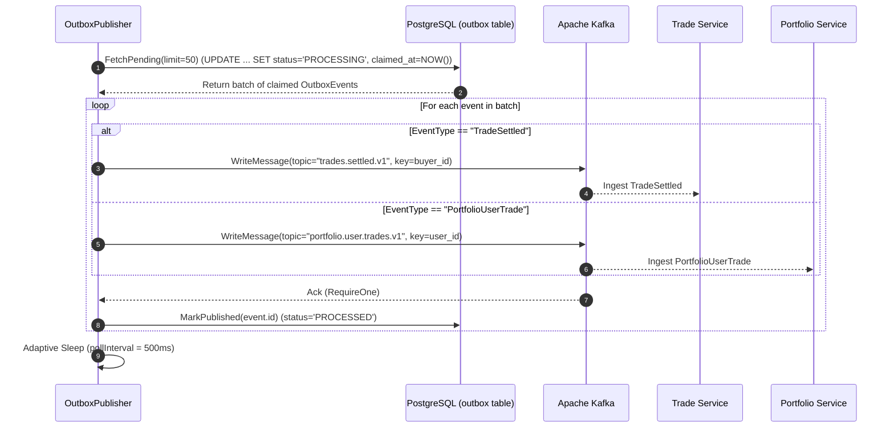
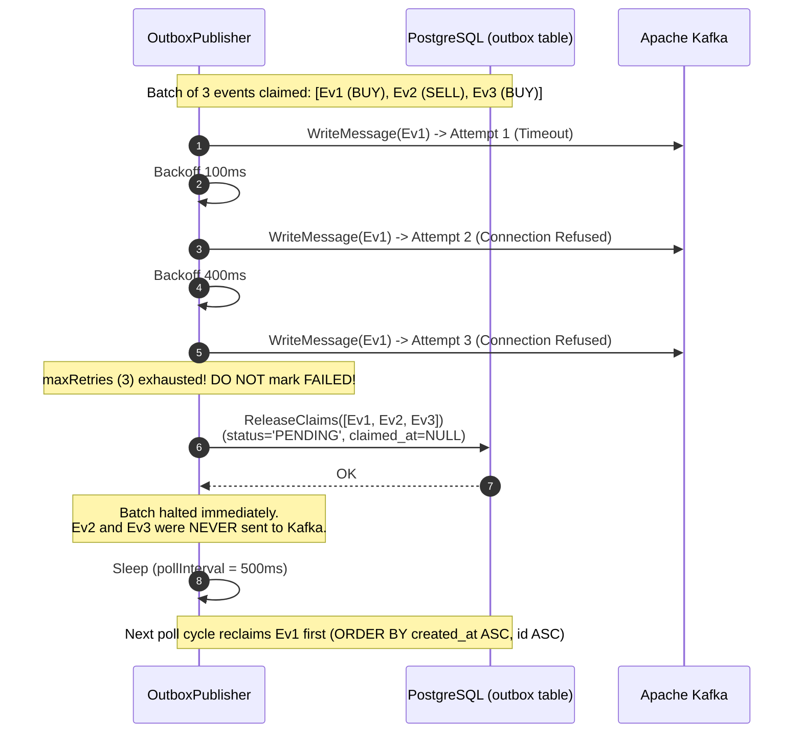
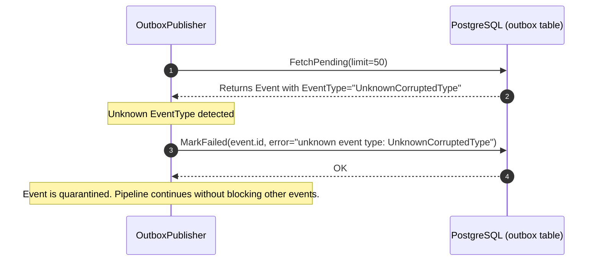

# Wallet Service — Outbox Publisher Guide (`internal/publisher`)

> **Location:** `services/wallet/internal/publisher/`  
> **Source Files:** `publisher.go`, `publisher_test.go`  
> **Package:** `publisher`

---

## 1. Overview & Core Purpose

The `OutboxPublisher` is an asynchronous background worker in the **Wallet Service** responsible for reliably streaming committed financial domain events from PostgreSQL to Apache Kafka.

In TradeDrift's distributed exchange architecture, the Wallet Service is the authoritative source of truth for balances and double-entry ledger entries. When a trade settles (`SettleTrade`), balances are updated and ledger entries are inserted inside an ACID PostgreSQL transaction. 

Directly publishing to Kafka *inside* that database transaction is an anti-pattern known as the **dual-write problem**:
- If the database commits but the network drops the Kafka message, downstream services (Trade Service, Portfolio Service) never learn of the settlement.
- If the Kafka publish succeeds but the database transaction rolls back, downstream services record phantom trades for balances that never moved.

To guarantee **at-least-once delivery with zero dual-write anomalies**, the Wallet Service writes outbound domain events directly to an `outbox` table within the **same atomic database transaction** as the financial balance mutations.

The `OutboxPublisher` continuously monitors this outbox table, claims pending events, writes them to their designated Kafka topics partitioned strictly by `user_id`, and acknowledges them as `PROCESSED`.

---

## 2. Problems Solved by This Package

| Problem | How `publisher.go` Solves It |
|---|---|
| **Dual-Write Vulnerability** | Decouples database commit from Kafka transport. Balance updates and outbox events are written in the same atomic SQL transaction. The publisher asynchronously drains the outbox table. |
| **Out-of-Order Delivery on Kafka Failures** | If an event fails to publish to Kafka (e.g. broker blip or leader re-election), continuing with the rest of the batch would cause later events (e.g. a SELL) to reach Kafka before earlier events (e.g. a BUY). `publishBatch()` **immediately halts batch iteration** and calls `outbox.ReleaseClaims()` on the failed event and all unattempted events, resetting them to `PENDING`. On the next poll, the failed event is reclaimed first (`ORDER BY created_at ASC, id ASC`). |
| **Premature Event Poisoning (False Positives)** | Transient Kafka network failures must **not** mark events as `FAILED`. Marking an event `FAILED` drops a real financial transaction. Transient write errors retry up to `maxRetries` (3 times with exponential backoff) and, upon exhaustion, release the claim back to `PENDING`. Only structurally invalid events (such as unknown `event_type`) are marked `FAILED`. |
| **Causal Ordering Inversion (User Portfolios)** | Financial portfolio calculations require strict chronological ordering per user. By explicitly setting Kafka `Message.Key = event.PartitionKey` (`user_id`), Kafka guarantees all accounting events for a given user land on the same physical partition in strict order. |
| **Resource Contention & Idle CPU Waste** | Implements adaptive polling: polls aggressively (`pollInterval = 500ms`) when events are actively streaming, and backs off (`idleInterval = 2s`) when the queue is drained. |
| **Zombie Claims after Worker Crashes** | Events are claimed via atomic CTE with `status = 'PROCESSING'` and `claimed_at = NOW()`. If a worker dies mid-batch, subsequent polls reclaim abandoned rows where `claimed_at < NOW() - INTERVAL '1 minute'`. |
| **Graceful Shutdown & Data Integrity** | Hooks into `context.Context`. When `SIGTERM`/`SIGINT` is received, ongoing writes finish or release claims cleanly, and `Close()` flushes underlying Kafka socket buffers. |

---

## 3. Routed Kafka Topics & Event Topology

The Wallet Service outbox publisher routes events based on their `EventType`:

```
                           ┌──────────────────────────┐
                           │   Wallet outbox table    │
                           └────────────┬─────────────┘
                                        │
                         Polls & Claims via CTE (50/batch)
                                        │
                                        ▼
                           ┌──────────────────────────┐
                           │     OutboxPublisher      │
                           └──────┬────────────┬──────┘
                                  │            │
          EventType == "TradeSettled"        EventType == "PortfolioUserTrade"
                                  │            │
                                  ▼            ▼
                   ┌───────────────────┐  ┌──────────────────────────┐
                   │ trades.settled.v1 │  │ portfolio.user.trades.v1 │
                   └─────────┬─────────┘  └────────────┬─────────────┘
                             │                         │
                             ▼                         ▼
                      Trade Service            Portfolio Service
                   (Read-Side Ledger)        (User Positions & PnL)
```

1. **`TradeSettled`** $\rightarrow$ **`trades.settled.v1`**:
   - **Target Topic:** `trades.settled.v1`
   - **Kafka Partition Key:** `event.PartitionKey` (`buyer_id`)
   - **Consumer:** Trade Service (stores immutable public & user trade history).
2. **`PortfolioUserTrade`** $\rightarrow$ **`portfolio.user.trades.v1`**:
   - **Target Topic:** `portfolio.user.trades.v1`
   - **Kafka Partition Key:** `event.PartitionKey` (`buyer_id` for BUY leg, `seller_id` for SELL leg)
   - **Consumer:** Portfolio Service (computes weighted-average entry prices, realized PnL, and holdings).

---

## 4. Key Constants & Configuration

```go
const (
    pollInterval = 500 * time.Millisecond // Polling cadence when outbox has active events
    idleInterval = 2 * time.Second        // Cadence when outbox is empty (saves DB CPU)
    batchSize    = 50                     // Maximum events claimed per poll cycle
    maxRetries   = 3                      // Local Kafka write attempts per event before halting batch
)
```

- **`pollInterval` (500ms):** Fast enough to provide near-real-time event streaming (< 1 second latency).
- **`idleInterval` (2s):** Reduces database load and connection contention when the exchange is quiet.
- **`batchSize` (50):** Bounded chunk size that balances network throughput against recovery overhead.
- **`maxRetries` (3):** Protects against transient broker blips before yielding the claim.

---

## 5. Function-by-Function Breakdown

### 5.1 `NewOutboxPublisher`

```go
func NewOutboxPublisher(
    outbox repository.OutboxRepository,
    brokers []string,
    topicTradeSettled string,
    topicPortfolioUserTrades string,
    log *zap.Logger,
) *OutboxPublisher
```

* **Purpose:** Constructs and configures the `OutboxPublisher` instance with repository access, Kafka producer client, and topic routing settings.
* **Problems Solved:**
  - Configures `segmentio/kafka-go.Writer` with `Balancer: &kafkago.Hash{}` to guarantee consistent hashing of message keys (`user_id`).
  - Sets `RequiredAcks: kafkago.RequireOne` for high-throughput persistence on the broker leader.
  - Sets `MaxAttempts: 1` on the underlying writer, ensuring the publisher manages retries and backoff explicitly rather than letting Kafka-go retry silently behind the scenes.

---

### 5.2 `Run`

```go
func (p *OutboxPublisher) Run(ctx context.Context)
```

* **Purpose:** The long-running orchestration loop that polls the database and sleeps adaptively until context cancellation.
* **Problems Solved:**
  - **Adaptive Polling:** If `publishBatch()` published $\ge 1$ events, it waits `pollInterval` (500ms). If 0 events were found, it backs off to `idleInterval` (2s).
  - **Error Containment:** Catches poll errors and logs them with structured fields without crashing the background worker.
  - **Clean Context Exit:** Listens on `<-ctx.Done()` to exit immediately when the Wallet Service shuts down.

---

### 5.3 `publishBatch`

```go
func (p *OutboxPublisher) publishBatch(ctx context.Context) (int, error)
```

* **Purpose:** Fetches and processes up to `batchSize` (50) `PENDING` events from PostgreSQL.
* **Problems Solved:**
  - **Strict FIFO Preservation on Failure:** Iterates through claimed events sequentially. If `publishOne()` returns an error on event index `i`:
    1. Collects all remaining event IDs from `events[i:]` (the failed event + all unattempted ones in the batch).
    2. Calls `p.outbox.ReleaseClaims(ctx, remainingIDs)` to reset their status to `PENDING` and clear `claimed_at = NULL`.
    3. Halts execution and returns the error immediately.
  - **Prevents Causal Inversion:** By halting the batch and unclaiming remaining items, later events are never published before earlier failed events. On the next cycle, the failed event is picked up first because queries use `ORDER BY created_at ASC, id ASC`.

---

### 5.4 `publishOne`

```go
func (p *OutboxPublisher) publishOne(ctx context.Context, event *repository.OutboxEvent) error
```

* **Purpose:** Validates, transforms, routes, and publishes a single outbox event to Kafka with local exponential backoff retries.
* **Problems Solved:**
  - **Topic Routing & Poison Message Quarantine:** Matches `event.EventType`. If an unrecognized event type enters the table, it calls `p.outbox.MarkFailed(ctx, event.ID, ...)` and returns `nil`. This isolates poison messages without stalling the entire outbox pipeline.
  - **Partition Ordering:** Sets Kafka message key to `event.PartitionKey` (`user_id`), ensuring all events for a user land in the same Kafka partition.
  - **Exponential Backoff Retries:** Retries failed writes up to `maxRetries` (3 times) with quadratic backoff:
    $$\text{backoff} = \text{attempt}^2 \times 100\text{ms} \quad (100\text{ms}, 400\text{ms}, 900\text{ms})$$
  - **Safe Re-Delivery Acknowledgement:** On Kafka write success, calls `p.outbox.MarkPublished(ctx, event.ID)`. If `MarkPublished` fails due to a DB network issue, the event will safely redeliver on the next recovery poll (handled idempotently downstream).
  - **Temporary Failure Signal:** If all 3 attempts fail due to broker unavailability, it logs an error and returns `lastErr` to trigger the batch claim release in `publishBatch()`.

---

### 5.5 `Close`

```go
func (p *OutboxPublisher) Close() error
```

* **Purpose:** Flushes pending in-flight socket buffers and closes the underlying Kafka transport connection.
* **Problems Solved:** Prevents TCP socket leaks and ensures no messages are dropped in transit during process termination.

---

## 6. Detailed Execution Flows

### 6.1 Standard Publishing Cycle (Happy Path)



---

### 6.2 Transient Failure & FIFO Ordering Protection (Unhappy Path)



---

### 6.3 Poison Message Quarantine Flow



---

## 7. Testing & Verification

The publisher behavior is verified in `publisher_test.go`:

1. **`TestPublisher_TransientKafkaErrorReleasesClaim`**:
   - Seeds an outbox event.
   - Points the publisher to an unreachable broker (`127.0.0.1:59999`).
   - Runs the publisher.
   - Asserts that the event is **never marked `FAILED`**, but instead released back to `status = 'PENDING'` with `claimed_at = nil`.
2. **`TestPublisher_StopsAfterTransientFailure`**:
   - Seeds two sequential events (`Ev1` created at $T$, `Ev2` created at $T + 100\text{ms}$) for the same user.
   - Points the publisher to an unreachable broker.
   - Asserts that when `Ev1` fails, `Ev2` is **never published** and both events are cleanly released back to `PENDING` to guarantee strict per-user FIFO order.
